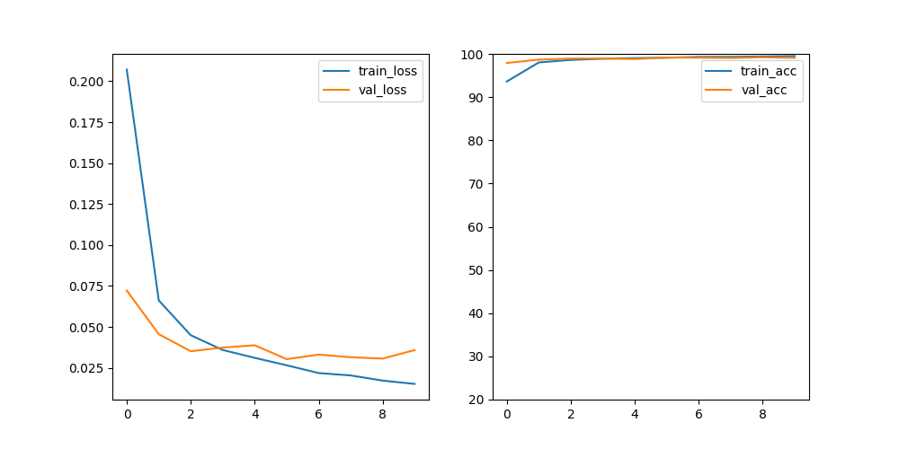

# Homework 02 MNIST-Recognition

  北京大学 2024 春季人工智能基础第一次课程作业

---

  Arthals 2110306206
   
  <pre>zhuozhiyongde@126.com</pre>
  2024.03

---

## NumPy version

### 1. MLP with SGD

epoch: 10, val_loss: 0.1605, val_acc: 0.9543

### 2. MLP with SGD and Momentum

epoch: 10, val_loss: 0.0923, val_acc: 0.9723

## PyTorch version

### MLP with Adam and Dropout

-   Training Epoch:10
-   Loss: 0.004142
-   Val acc: 97.94%

### CNN

-   Training Epoch:10
-   Loss: 0.001387
-   Val acc: 99.08%

