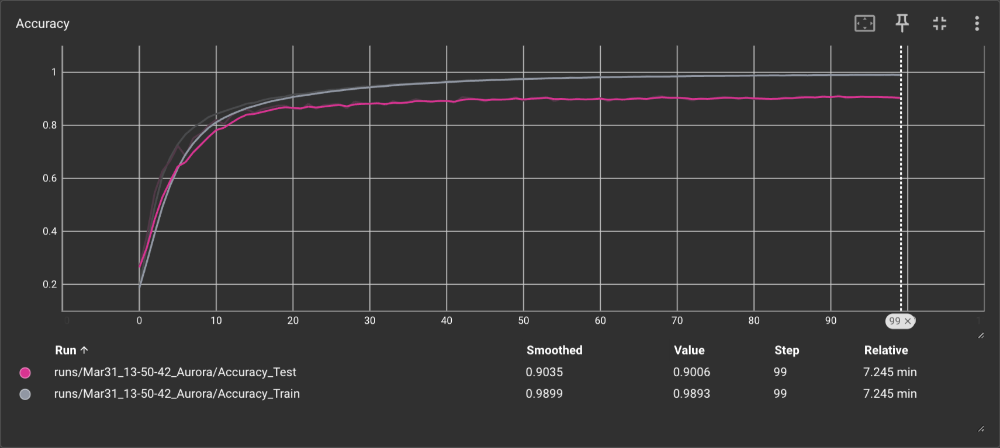
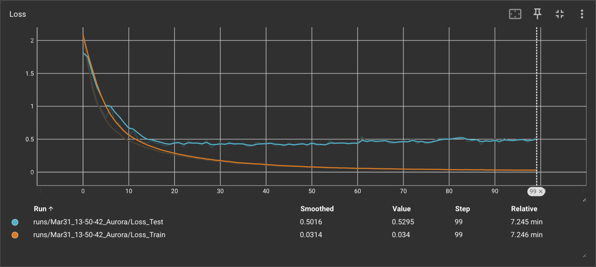

# Homework 03 CIFAR-Recognition

<center>
  北京大学 2024 春季人工智能基础第三次课程作业
</center>

---

<center>
  Arthals 2110306206
  <br/>
  <pre>zhuozhiyongde@126.com</pre>
  2024.03
</center>

---

## 网络结构与参数调整

### 网络结构

网络结构主要参照 VGG16 [^1] 的设计，使用 `nn.Module` 基类，分为两个部分：

1. features 特征提取部分：完全类似于 VGG16 的对应部分，通过不断的卷积和池化操作，使得 $3\times 32\times 32$ 的图像最终变为 $512\times 1\times 1$ 的特征图。具体的细节包括逐层卷积，并在每个卷积核使用适当的 padding 保证图像尺寸不变，同时使用 ReLU 激活函数激活。在每个小的层的最后，使用 MaxPool2d 池化层进行下采样。
2. classifier 分类部分：将特征图展平，得到一个长度为 $512\times 1\times 1= 512$ 的向量，然后通过全连接层进行分类。这里使用了两个全连接层，第一个全连接层的输出维度为 $4096$，第二个全连接层的输出维度为 $10$，最后取最大者作为预测结果。因为图像尺寸不同于 VGG 原文，这里做了一些修改，减少了一个全连接层。

### 参数调整

由于硬件性能足够（RTX 4090），我设置了比较大的 `batch_size` ，为 $256$。学习率 `learning rate` 设置为了 $0.001$，采用 `Adam` 优化器。

除此之外，我还对于 `DataLoader` 做了一个小的修改，设置 `num_workers` 为设备支持的最大值 $24$，加速了数据的加载，提高了硬件资源利用率。

## 数据增强

参见代码：

```python
transform_train = transforms.Compose(
    [
        transforms.RandomCrop(32, padding=4),
        transforms.RandomHorizontalFlip(),
        transforms.ToTensor(),
        transforms.Normalize((0.5, 0.5, 0.5), (0.5, 0.5, 0.5)),
    ]
)

transform_test = transforms.Compose(
    [
        transforms.ToTensor(),
        transforms.Normalize((0.5, 0.5, 0.5), (0.5, 0.5, 0.5)),
    ]
)
```

-   对于训练集，使用了随机裁剪和水平翻转，以增加数据的多样性。
-   对于测试集，只进行了归一化操作。

## 挑战

最开始直接将 features 的 512 维向量全连接到了 10 个输出，发现效果并不好，准确率只有 10% 左右，接近于盲猜。后来发现这样的全连接层并不能很好地提取特征，于是在全连接层之前加入了一个 `nn.Linear(512, 4096)` 的全连接隐藏层，效果有了很大的提升。

## 训练与评估

### 训练结果

#### 最终结果

Epoch [100/100]

-   Train Loss: 0.034, Train Accuracy: 98.93%
-   Test Loss: 0.5295, Test Accuracy: 90.06%

#### 训练过程





根据 Loss 曲线，可以发现在 30 个 epoch 后，已经发生了轻微的过拟合。

[^1]: [Very Deep Convolutional Networks for Large-Scale Image Recognition](https://arxiv.org/abs/1409.1556)
