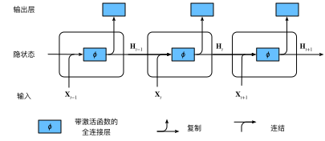
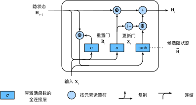
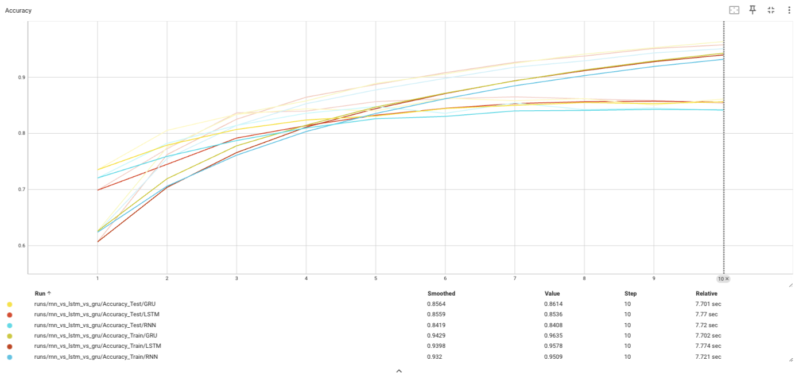
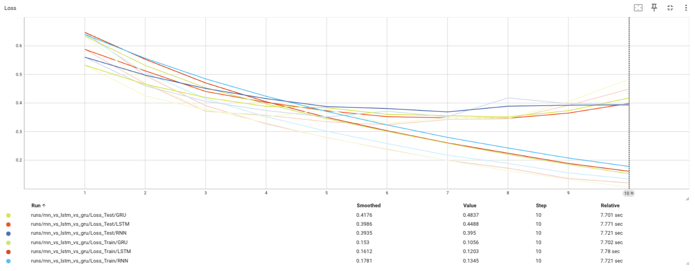

# Homework 04 IMDB-Emotion-Recognition

<center>
  北京大学 2024 春季人工智能基础第四次课程作业
</center>

---

<center>
  Arthals 2110306206
  <br/>
  <pre>zhuozhiyongde@126.com</pre>
  2024.03
</center>

---

## RNN、LSTM、GRU

这三者都是用于处理序列数据的神经网络模型，其中 RNN 是最基础的，LSTM 和 GRU 是对 RNN 的改进。

### RNN

RNN 是一种专为处理序列数据设计的神经网络，它的每个时间步都会接收一个输入和上一步输出的隐状态，输出一个新的隐状态。

RNN 在时间序列的每一个时间点上，都会有一个隐藏状态向量 $h_t$，它包含了到当前时间点为止的序列信息。

通过添加隐状态，我们得以将信息传递到未来。



$$
\begin{array}{l}{{h_{t}=\tanh\left(W_{h}x_{t}+U_{h}h_{t-1}+b_{h}\right)}}\\{{y_{t}=\sigma_{y}(W_{y}h_{t}+b_{y})}}\end{array}
$$

其中：

-   $h_t$ 是时间步 $t$ 的隐状态
-   $x_t$ 是时间步 $t$ 的输入
-   $y_t$ 是时间步 $t$ 的输出
-   $W_h$、$U_h$、$b_h$ 是隐状态的参数
-   $W_y$、$b_y$ 是输出的参数
-   $\sigma_y$ 是输出的激活函数，$\sigma_h$ 就是 $\tanh$

局限性：隐状态的信息会随着时间步的增加而衰减（随着时间步的增加，$h_{t-1}$ 中包含的早期信息会逐渐被新的输入 $x_t$​ 所稀释），这意味着 RNN 只能处理短序列，长序列的信息会被遗忘。也即很难维持较为长期的信息。

### LSTM

LSTM 是一种特殊的 RNN，它通过添加门控机制来控制信息的流动，从而解决了 RNN 的长期依赖问题。

门控向量是 LSTM 中用来控制信息流动的机制，通过门控单元可以决定什么信息被保留、遗忘或更新。门控向量中的值控制着信息流的多少：

-   值接近 0 的时候，信息流被 “关闭”，即信息不会通过；
-   值接近 1 的时候，信息流被 “打开”，即信息可以自由通过。

通过 **逐元素（element-wise）相乘**，也即将输入向量的每一个元素与门控向量的对应元素相乘，这样可以根据门控向量的值来筛选信息，只让部分信息通过。

LSTM 除了 RNN 引入的隐藏状态向量 $h_t$，还引入了细胞向量（也叫做细胞状态 $c_t$），这个向量专门设计来解决长期依赖问题，它能够在网络中保持长期的状态。


#### LSTM 运算过程

##### 计算遗忘门（Forget Gate）

遗忘门的作用是 **决定我们要从细胞状态中丢弃什么信息**。它通过下面的公式进行计算：

$$
f_t = sigmoid([h_{t-1}, x_t] W_f + b_f)
$$

其中：

-   $f_t$: 遗忘门（forget gate）的值
-   $sigmoid$: sigmoid 激活函数，用来将值压缩到 0 和 1 之间
-   $[h_{t-1},x_t]$: 前一时刻的隐藏状态与当前时刻的输入数据 **拼接**
-   $W_f,b_f$: 遗忘门的权重矩阵、偏置项

随后，遗忘门的输出值 $f_t$ 会与前一时刻的细胞状态相乘，从而决定丢弃哪些信息：

$$
\boldsymbol{C_{t-1}'} = \boldsymbol{f_t} \odot \boldsymbol{C_{t-1}}
$$

其中：

-   $\odot$: 点乘，即元素对应相乘

##### 计算输入门（Input Gate）

输入门分为两部分：

-   一个输出向量，决定我们要把 **候选向量的哪些部分** 添加到细胞状态中
-   一个候选（信息）向量，决定我们要在细胞状态中存储那些新信息。

##### 计算输入门的输出向量

在长短期记忆网络（LSTM）中，**输入门的作用是控制当前输入和过去记忆的结合程度**，而候选记忆（信息向量）则提供了可能添加到细胞状态的新信息。如果我们直接把输入门的输出加到记忆里，那么所有的输入都会不加选择地影响记忆状态，这样会使得网络缺乏选择性地忘记或保留信息的能力。

因而我们需要一个输出向量决定我们要往细胞状态中存储候选向量的那些部分。其通过如下公式计算：

$$
i_t = sigmoid([h_{t-1}, x_t] \boldsymbol{W_i} + b_i)
$$

其中：

-   $i_t$: 输入门（input gate）的输出值
-   $\boldsymbol{W_i},b_i$: 输入门的权重矩阵、偏置项

##### 计算输入门的信息向量（Information Vector）

信息向量包含了候选信息，这些信息可能（注意这里说的是可能，也就是后面要经过输出向量的点乘作用）会被添加到细胞状态中。它的计算方式为：

$$
\tilde{\boldsymbol{C_t}} = \tanh([h_{t-1}, x_t] \boldsymbol{W_C} + b_C)
$$

其中：

-   $\tilde{\boldsymbol{C_t}}$: 当前时刻的信息向量（information vector）
-   $\boldsymbol{W_C},b_C$: 信息向量的权重矩阵、偏置项

##### 计算新的细胞状态

新的细胞状态是通过结合遗忘门的结果（决定丢弃哪些信息）和输入门的结果（决定添加哪些新信息）来更新的：

$$
\boldsymbol{C_t} = \boldsymbol{f_t} \odot \boldsymbol{C_{t-1}'} + \boldsymbol{i_t} \odot \tilde{\boldsymbol{C_t}}
$$

##### 计算输出门（Output Gate）和新的隐藏状态

输出门决定了 **下一时刻的隐藏状态**，隐藏状态包含了过去信息，并通过输出门过滤：

$$
o_t = sigmoid([h_{t-1}, x_t] \boldsymbol{W}_o + b_o)
$$

新的隐藏状态由 **输出门和新的细胞状态** 决定：

$$
h_t = o_t \odot \tanh(\boldsymbol{C_t})
$$

其中：

-   $o_t$: 输出门（output gate）的值
-   $\boldsymbol{W}_o,b_o$: 输出门的权重矩阵、偏置项
-   $h_t$: 当前时刻的隐藏状态

### GRU

GRU（Gated Recurrent Unit）是 LSTM 的一个变种，它的结构更为简化，通常也被认为在某些情况下能够提供与 LSTM 相当的性能，但 **参数更少，计算效率更高**。

GRU 把 LSTM 中的遗忘门和输入门合并为一个单一的 “更新门”，同时合并了细胞状态和隐藏状态，简化了 LSTM 的模型结构。这样的设计旨在简化学习过程，并减少计算负担。



#### GRU 的运算过程

##### 更新门（Update Gate）

更新门决定了从过去的隐藏状态 $h_{t-1}$ 到当前隐藏状态 $h_t$ 有多少信息需要被保留或更新。

$$
z_t = \sigma(W_z \cdot [h_{t-1}, x_t] + b_z)
$$

其中：

-   $z_t$：当前时刻的更新门值
-   $W_z, b_z$：更新门的权重和偏置

##### 重置门（Reset Gate）

重置门决定了有多少过去的信息需要被忘记，它可以使网络有选择地忘记之前的信息。

$$
r_t = \sigma(W_r \cdot [h_{t-1}, x_t] + b_r)
$$

其中：

-   $r_t$：当前时刻的重置门值
-   $W_r, b_r$：重置门的权重和偏置

##### 候选隐藏状态（Candidate Hidden State）

候选隐藏状态是基于重置门的结果，结合过去的隐藏状态和当前的输入来计算的，这个状态包含了潜在的新信息。

$$
\tilde{h}_t = \tanh(W \cdot [r_t \odot h_{t-1}, x_t] + b)
$$

其中：

-   $\tilde{h}_t$：当前时刻的候选隐藏状态
-   $W, b$：此步的权重和偏置
-   $\odot$：元素对应相乘

##### 最终隐藏状态（Final Hidden State）

最终隐藏状态是根据更新门来决定保留多少之前的隐藏状态与加入多少新的候选状态。

$$
h_t = z_t \odot h_{t-1} + (1 - z_t) \odot \tilde{h}_t
$$

其中：

-   $h_t$：当前时刻的最终隐藏状态

## 训练对比结果





可以看到，三种循环神经网络几乎没有什么显著的差别，但是仍然可以看出 GRU、LSTM 略优于原始的 RNN，三者都出现了一定的过拟合，但前两者都稍微高过了 85% 的要求线，而 RNN 则略低于 85%。

### LSTM

10 个 epoch 后，测试集准确率：0.8600

```
vocab_size:  20001
ImdbNetLSTM(
  (embedding): Embedding(20001, 64)
  (lstm): LSTM(64, 64)
  (linear1): Linear(in_features=64, out_features=64, bias=True)
  (dropout): Dropout(p=0.5, inplace=False)
  (linear2): Linear(in_features=64, out_features=2, bias=True)
)
Train Epoch: 1 Loss: 0.641414    Acc: 0.621705
Test set: Average loss: 0.5995, Accuracy: 0.6624
Train Epoch: 2 Loss: 0.493585    Acc: 0.765425
Test set: Average loss: 0.4701, Accuracy: 0.7690
Train Epoch: 3 Loss: 0.396242    Acc: 0.825080
Test set: Average loss: 0.3727, Accuracy: 0.8354
Train Epoch: 4 Loss: 0.334699    Acc: 0.860174
Test set: Average loss: 0.3421, Accuracy: 0.8515
Train Epoch: 5 Loss: 0.283227    Acc: 0.887031
Test set: Average loss: 0.3312, Accuracy: 0.8556
Train Epoch: 6 Loss: 0.237864    Acc: 0.910144
Test set: Average loss: 0.3623, Accuracy: 0.8540
Train Epoch: 7 Loss: 0.198337    Acc: 0.924671
Test set: Average loss: 0.3679, Accuracy: 0.8519
Train Epoch: 8 Loss: 0.171180    Acc: 0.937051
Test set: Average loss: 0.3616, Accuracy: 0.8653
Train Epoch: 9 Loss: 0.133860    Acc: 0.952975
Test set: Average loss: 0.3774, Accuracy: 0.8612
Train Epoch: 10 Loss: 0.108904   Acc: 0.962610
Test set: Average loss: 0.4147, Accuracy: 0.8600
```

### RNN

10 个 epoch 后，测试集准确率：0.8461

```
vocab_size:  20001
ImdbNetRNN(
  (embedding): Embedding(20001, 64)
  (rnn): RNN(64, 64)
  (linear1): Linear(in_features=64, out_features=64, bias=True)
  (dropout): Dropout(p=0.5, inplace=False)
  (linear2): Linear(in_features=64, out_features=2, bias=True)
)
Train Epoch: 1 Loss: 0.656581    Acc: 0.594000
Test set: Average loss: 0.5684, Accuracy: 0.7114
Train Epoch: 2 Loss: 0.521531    Acc: 0.748103
Test set: Average loss: 0.4625, Accuracy: 0.7807
Train Epoch: 3 Loss: 0.427898    Acc: 0.811252
Test set: Average loss: 0.4026, Accuracy: 0.8194
Train Epoch: 4 Loss: 0.359800    Acc: 0.849191
Test set: Average loss: 0.3849, Accuracy: 0.8366
Train Epoch: 5 Loss: 0.315361    Acc: 0.873103
Test set: Average loss: 0.3662, Accuracy: 0.8424
Train Epoch: 6 Loss: 0.270387    Acc: 0.896166
Test set: Average loss: 0.3533, Accuracy: 0.8477
Train Epoch: 7 Loss: 0.233275    Acc: 0.911542
Test set: Average loss: 0.3597, Accuracy: 0.8449
Train Epoch: 8 Loss: 0.191495    Acc: 0.930911
Test set: Average loss: 0.3915, Accuracy: 0.8511
Train Epoch: 9 Loss: 0.165388    Acc: 0.940795
Test set: Average loss: 0.4025, Accuracy: 0.8501
Train Epoch: 10 Loss: 0.143007   Acc: 0.950329
Test set: Average loss: 0.4818, Accuracy: 0.8461
```

### GRU

10 个 epoch 后，测试集准确率：0.8598

```
vocab_size:  20001
ImdbNetGRU(
  (embedding): Embedding(20001, 64)
  (gru): GRU(64, 64)
  (linear1): Linear(in_features=64, out_features=64, bias=True)
  (dropout): Dropout(p=0.5, inplace=False)
  (linear2): Linear(in_features=64, out_features=2, bias=True)
)
Train Epoch: 1 Loss: 0.630705    Acc: 0.627945
Test set: Average loss: 0.5293, Accuracy: 0.7375
Train Epoch: 2 Loss: 0.467016    Acc: 0.781350
Test set: Average loss: 0.4285, Accuracy: 0.7959
Train Epoch: 3 Loss: 0.391430    Acc: 0.827077
Test set: Average loss: 0.3858, Accuracy: 0.8242
Train Epoch: 4 Loss: 0.334801    Acc: 0.860224
Test set: Average loss: 0.3581, Accuracy: 0.8459
Train Epoch: 5 Loss: 0.287187    Acc: 0.884834
Test set: Average loss: 0.3355, Accuracy: 0.8548
Train Epoch: 6 Loss: 0.248329    Acc: 0.904004
Test set: Average loss: 0.3446, Accuracy: 0.8554
Train Epoch: 7 Loss: 0.209050    Acc: 0.923772
Test set: Average loss: 0.3412, Accuracy: 0.8659
Train Epoch: 8 Loss: 0.175315    Acc: 0.935903
Test set: Average loss: 0.3253, Accuracy: 0.8647
Train Epoch: 9 Loss: 0.140557    Acc: 0.951627
Test set: Average loss: 0.3652, Accuracy: 0.8675
Train Epoch: 10 Loss: 0.119769   Acc: 0.958716
Test set: Average loss: 0.4698, Accuracy: 0.8598
```

## 自行实现 LSTM

10 个 epoch 后，测试集准确率：0.8525

```
vocab_size:  20001
Net(
  (embedding): Embedding(20001, 64)
  (lstm): LSTM()
  (fc1): Linear(in_features=64, out_features=64, bias=True)
  (fc2): Linear(in_features=64, out_features=2, bias=True)
)

Train Epoch: 1 Loss: 0.580274    Acc: 0.670927
Test set: Average loss: 0.4568, Accuracy: 0.7868

Train Epoch: 2 Loss: 0.381990    Acc: 0.828375
Test set: Average loss: 0.3782, Accuracy: 0.8315

Train Epoch: 3 Loss: 0.293691    Acc: 0.877895
Test set: Average loss: 0.3443, Accuracy: 0.8475

Train Epoch: 4 Loss: 0.232489    Acc: 0.909195
Test set: Average loss: 0.3369, Accuracy: 0.8550

Train Epoch: 5 Loss: 0.180587    Acc: 0.933456
Test set: Average loss: 0.3939, Accuracy: 0.8521

Train Epoch: 6 Loss: 0.136441    Acc: 0.952676
Test set: Average loss: 0.3933, Accuracy: 0.8617

Train Epoch: 7 Loss: 0.094847    Acc: 0.968900
Test set: Average loss: 0.4475, Accuracy: 0.8483

Train Epoch: 8 Loss: 0.062322    Acc: 0.981280
Test set: Average loss: 0.5550, Accuracy: 0.8550

Train Epoch: 9 Loss: 0.041898    Acc: 0.985972
Test set: Average loss: 0.6712, Accuracy: 0.8519

Train Epoch: 10 Loss: 0.024410   Acc: 0.992612
Test set: Average loss: 0.7335, Accuracy: 0.8525
```

## 调整网络结构

### 调整隐藏层维度

调整隐藏层维度，由 64 修改至 128

10 个 epoch 后，测试集准确率：0.8523

结论：没有显著影响

```
vocab_size:  20001
Net(
  (embedding): Embedding(20001, 64)
  (lstm): LSTM()
  (fc1): Linear(in_features=128, out_features=128, bias=True)
  (fc2): Linear(in_features=128, out_features=2, bias=True)
)

Train Epoch: 1 Loss: 0.566573    Acc: 0.696086
Test set: Average loss: 0.4453, Accuracy: 0.7903

Train Epoch: 2 Loss: 0.379887    Acc: 0.831120
Test set: Average loss: 0.3712, Accuracy: 0.8348

Train Epoch: 3 Loss: 0.293196    Acc: 0.877246
Test set: Average loss: 0.3587, Accuracy: 0.8436

Train Epoch: 4 Loss: 0.226349    Acc: 0.910194
Test set: Average loss: 0.3479, Accuracy: 0.8542

Train Epoch: 5 Loss: 0.171792    Acc: 0.936502
Test set: Average loss: 0.3549, Accuracy: 0.8612

Train Epoch: 6 Loss: 0.123869    Acc: 0.957468
Test set: Average loss: 0.4146, Accuracy: 0.8625

Train Epoch: 7 Loss: 0.085733    Acc: 0.971745
Test set: Average loss: 0.4914, Accuracy: 0.8608

Train Epoch: 8 Loss: 0.049730    Acc: 0.984375
Test set: Average loss: 0.6330, Accuracy: 0.8511

Train Epoch: 9 Loss: 0.029358    Acc: 0.990915
Test set: Average loss: 0.6306, Accuracy: 0.8548

Train Epoch: 10 Loss: 0.028739   Acc: 0.989567
Test set: Average loss: 0.7651, Accuracy: 0.8523
```

### 修改损失函数

修改损失函数，由交叉熵损失函数修改至 NLL 负对数似然损失函数

10 个 epoch 后，测试集准确率：0.5061

结论：如果仅仅修改损失函数，会导致网络完全没有得到训练：

```
vocab_size:  20001
Net(
  (embedding): Embedding(20001, 64)
  (lstm): LSTM()
  (fc1): Linear(in_features=64, out_features=64, bias=True)
  (fc2): Linear(in_features=64, out_features=2, bias=True)
)

Train Epoch: 1 Loss: -190.202194         Acc: 0.495008
Test set: Average loss: -586.6449, Accuracy: 0.5061

Train Epoch: 2 Loss: -1374.004895        Acc: 0.496955
Test set: Average loss: -2354.6403, Accuracy: 0.5061

Train Epoch: 3 Loss: -3682.350363        Acc: 0.497454
Test set: Average loss: -5186.6990, Accuracy: 0.5061

Train Epoch: 4 Loss: -6998.732612        Acc: 0.496805
Test set: Average loss: -8974.4605, Accuracy: 0.5061

Train Epoch: 5 Loss: -11224.996293       Acc: 0.496156
Test set: Average loss: -13628.2996, Accuracy: 0.5061

Train Epoch: 6 Loss: -16279.844664       Acc: 0.496406
Test set: Average loss: -19076.0244, Accuracy: 0.5061

Train Epoch: 7 Loss: -22098.344867       Acc: 0.498353
Test set: Average loss: -25259.2471, Accuracy: 0.5061

Train Epoch: 8 Loss: -28628.531188       Acc: 0.494908
Test set: Average loss: -32131.3652, Accuracy: 0.5061

Train Epoch: 9 Loss: -35827.369197       Acc: 0.498203
Test set: Average loss: -39653.6349, Accuracy: 0.5061

Train Epoch: 10 Loss: -43661.357203      Acc: 0.497005
Test set: Average loss: -47796.7920, Accuracy: 0.5061
```

不过，可以通过添加在网络的最后添加一个 `log_softmax` 层以解决此问题，但这样恰好在数学上等价于交叉熵损失。

### 调整 batch_size

修改 batch_size，由 64 修改至 128

10 个 epoch 后，测试集准确率：0.8498

结论：没有显著影响

```
vocab_size:  20001
Net(
  (embedding): Embedding(20001, 64)
  (lstm): LSTM()
  (fc1): Linear(in_features=64, out_features=64, bias=True)
  (fc2): Linear(in_features=64, out_features=2, bias=True)
)

Train Epoch: 1 Loss: 0.630180    Acc: 0.637291
Test set: Average loss: 0.5229, Accuracy: 0.7416

Train Epoch: 2 Loss: 0.461529    Acc: 0.784086
Test set: Average loss: 0.4295, Accuracy: 0.8016

Train Epoch: 3 Loss: 0.360272    Acc: 0.842207
Test set: Average loss: 0.3852, Accuracy: 0.8268

Train Epoch: 4 Loss: 0.296209    Acc: 0.880125
Test set: Average loss: 0.3737, Accuracy: 0.8365

Train Epoch: 5 Loss: 0.246677    Acc: 0.904807
Test set: Average loss: 0.3496, Accuracy: 0.8457

Train Epoch: 6 Loss: 0.200391    Acc: 0.925955
Test set: Average loss: 0.3745, Accuracy: 0.8521

Train Epoch: 7 Loss: 0.164706    Acc: 0.942327
Test set: Average loss: 0.3793, Accuracy: 0.8531

Train Epoch: 8 Loss: 0.133986    Acc: 0.954867
Test set: Average loss: 0.4349, Accuracy: 0.8488

Train Epoch: 9 Loss: 0.098025    Acc: 0.969546
Test set: Average loss: 0.4637, Accuracy: 0.8543

Train Epoch: 10 Loss: 0.072282   Acc: 0.978553
Test set: Average loss: 0.5563, Accuracy: 0.8498
```
