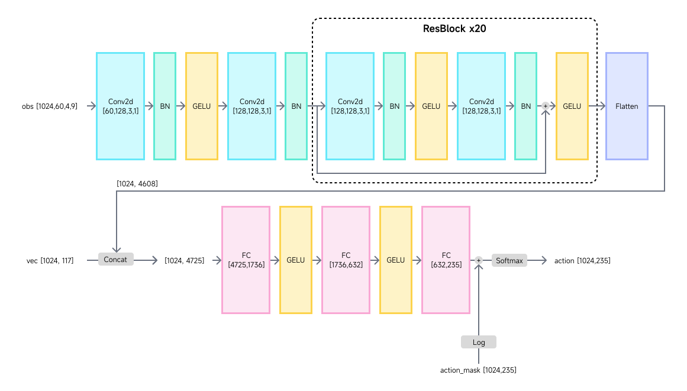
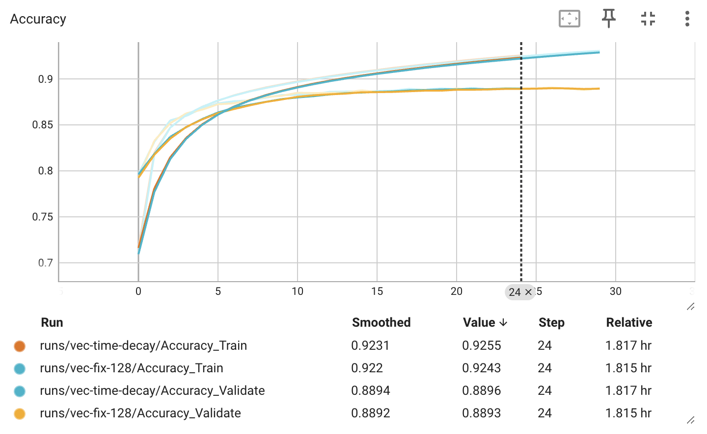
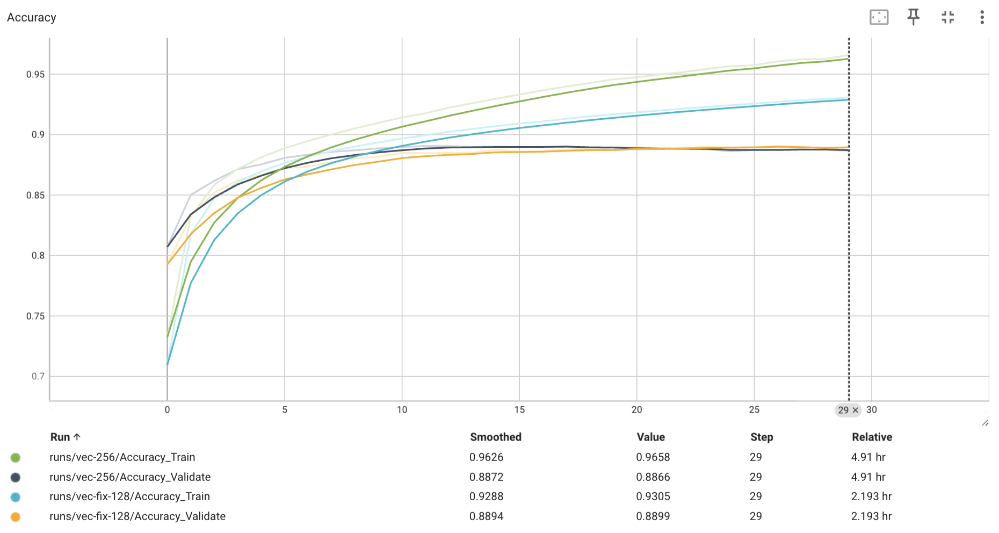
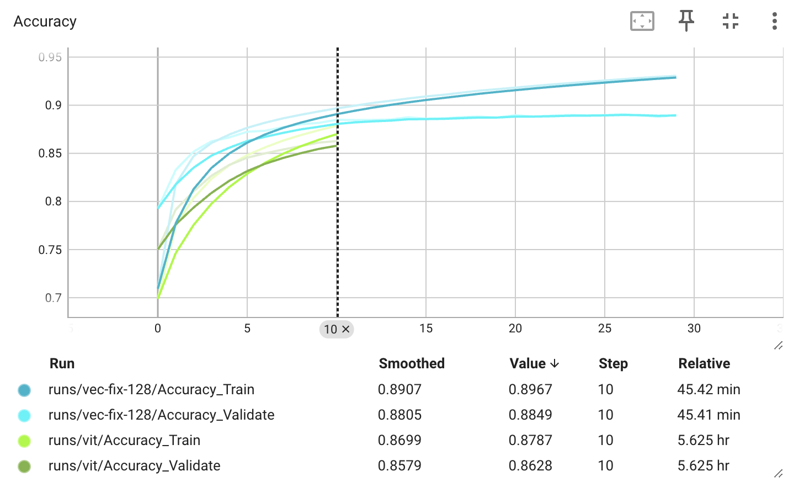
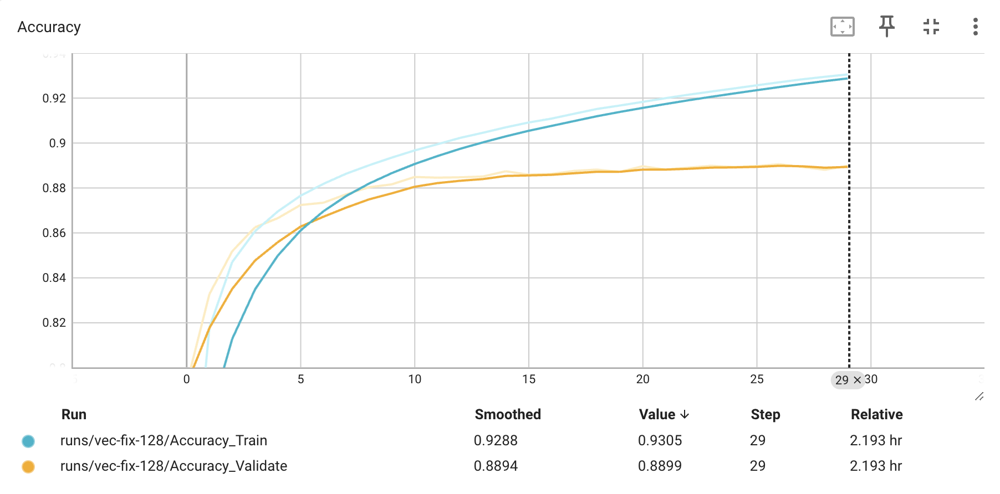
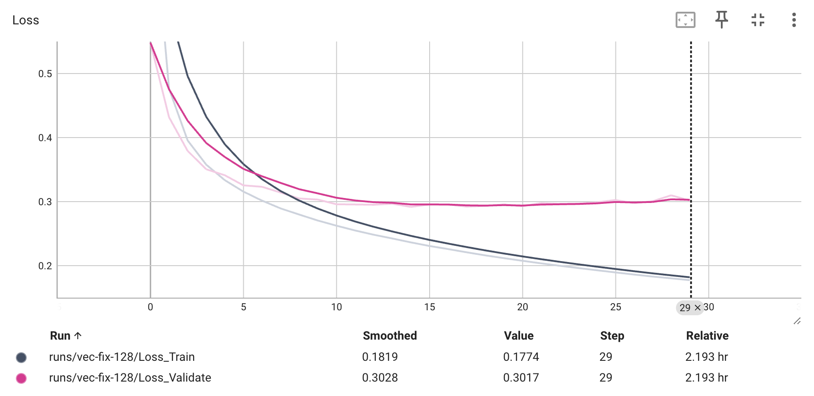
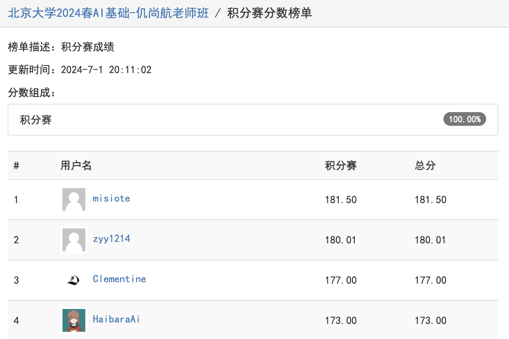
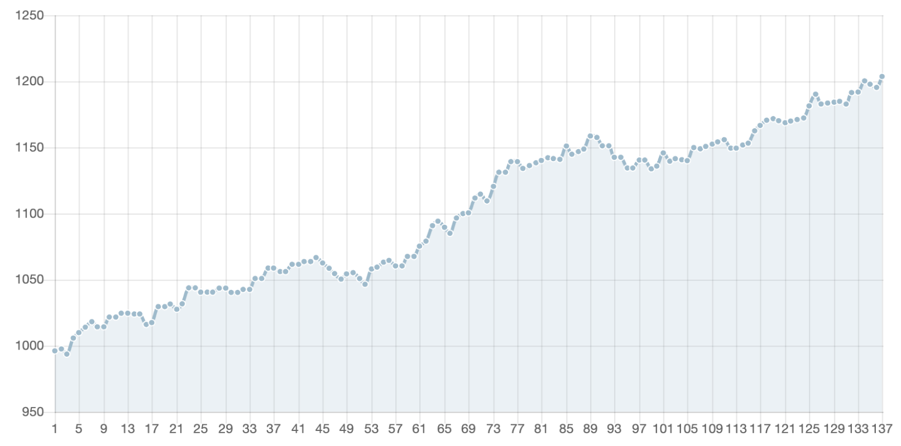
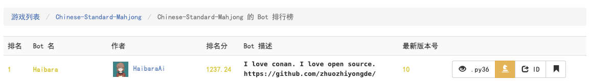

# Homework 10 Mahjong

<center>
  北京大学 2024 春季人工智能基础第十次课程作业
</center>

---

<center>
  Arthals 2110306206
  <br/>
  <pre>zhuozhiyongde@126.com</pre>
  2024.06
</center>

---

## 数据处理方式

原理同示例代码，通过 `preprocess.py` 来模拟对局过程，从而获得各个时间切片的训练数据集与动作以供后续监督学习。

不同的是，我额外撰写了一个多进程并行处理的脚本 `parallel.py`，并对应修改了 `preprocess.py` 使之支持分片处理，从而得以充分利用多核 CPU 的计算能力，加速数据处理过程，以及解决官方库上听数计算功能的内存泄漏问题。

## 特征表示方式

```python
class OFFSET_OBS:
    KE = 0  # +4, 玩家副露信息-刻子，4 玩家
    SHUN = 4  # +4, 玩家副露信息-顺子, 4 玩家
    GANG = 8  # +4, 玩家副露信息-杠子, 4 玩家
    ANGANG = 12  # +4, 玩家副露信息-暗杠, 4 玩家
    PLAY = 16  # +4, 玩家出牌信息, 4 玩家
    LAST = 20  # +1, 最后一张牌信息
    UNKNOWN = 21  # +1, 未知牌信息
    HAND = 22  # +1, 玩家手牌信息
    PREVALENT_WIND = 23  # +1, 场风信息
    SEAT_WIND = 24  # +1, 座风信息
    SHANTEN_PASS = 25  # +1, PASS 之后的上听/胡牌所需要的牌
    SHANTEN_PLAY = 26  # +34, PLAY 之后的上听/胡牌所需要的牌

OBS_SIZE = 60

class OFFSET_VEC:
    PLAYERS_HAND = 0  # +4, 玩家手牌数量, 4 玩家
    UNKNOWN = 4  # +1, 未知牌数量
    PREVALENT_WIND = 5  # +1, 场风信息
    SEAT_WIND = 6  # +1, 座风信息
    REST = 7  # +4, 牌墙剩余数量, 4 玩家
    STEP = 11  # +1, 当前步数
    HU_PROB_PASS = 12  # +1, 已经听牌后，PASS 之后的胡牌概率
    HU_PROB_PLAY = 13  # +34, 已经听牌后，PLAY 之后的胡牌概率
    # 以下操作中，若操作不合法则为 10
    # 发生于手牌数 13 时
    SHAN_EXP_PASS = 47  # +1, PASS 后，来下一张牌后的上听数期望
    # 发生于手牌数 14 时
    SHAN_EXP_PLAY = 48  # +34, PLAY 后，来下一张牌后的上听数期望
    # 发生于手牌数 13 时
    SHAN_DIS_PASS = 82  # +1, PASS 后，当前牌型的最小上听距离
    # 发生于手牌数14时
    SHAN_DIS_PLAY = 83  # +34, PLAY 后，当前牌型的最小上听距离

VEC_SIZE = 117
```

模型的输入（特征的表示）包括如下两个部分：

1. 观察信息（`OBS`）：主要存储与牌面直接相关的信息，包括玩家副露信息、玩家出牌信息、最后一张牌信息、未知牌信息、玩家手牌信息、场风信息、座风信息、PASS 之后的上听/胡牌所需要的牌、PLAY 之后的上听/胡牌所需要的牌。具体的通道与信息对应关系详见上述代码。

    `OBS` 被组织为 $(60\times4\times9)$ 的三维张量格式，后两维组织如下：

    <table style="border-spacing: 40px!important;">
      <tr>
        <td style="padding:0 10px;">W1</td>
        <td style="padding:0 10px;">W2</td>
        <td style="padding:0 10px;">W3</td>
        <td style="padding:0 10px;">W4</td>
        <td style="padding:0 10px;">W5</td>
        <td style="padding:0 10px;">W6</td>
        <td style="padding:0 10px;">W7</td>
        <td style="padding:0 10px;">W8</td>
        <td style="padding:0 10px;">W9</td>
      </tr>
      <tr>
        <td style="padding:0 10px;">T1</td>
        <td style="padding:0 10px;">T2</td>
        <td style="padding:0 10px;">T3</td>
        <td style="padding:0 10px;">T4</td>
        <td style="padding:0 10px;">T5</td>
        <td style="padding:0 10px;">T6</td>
        <td style="padding:0 10px;">T7</td>
        <td style="padding:0 10px;">T8</td>
        <td style="padding:0 10px;">T9</td>
      </tr>
      <tr>
        <td style="padding:0 10px;">B1</td>
        <td style="padding:0 10px;">B2</td>
        <td style="padding:0 10px;">B3</td>
        <td style="padding:0 10px;">B4</td>
        <td style="padding:0 10px;">B5</td>
        <td style="padding:0 10px;">B6</td>
        <td style="padding:0 10px;">B7</td>
        <td style="padding:0 10px;">B8</td>
        <td style="padding:0 10px;">B9</td>
      </tr>
      <tr>
        <td style="padding:0 10px;">F1</td>
        <td style="padding:0 10px;">F2</td>
        <td style="padding:0 10px;">F3</td>
        <td style="padding:0 10px;">F4</td>
        <td style="padding:0 10px;">J1</td>
        <td style="padding:0 10px;">J2</td>
        <td style="padding:0 10px;">J3</td>
        <td style="padding:0 10px;">--</td>
        <td style="padding:0 10px;">--</td>
      </tr>
    </table>

    玩家出牌信息以 $0.9$ 为因子，随时间指数衰减记录，从而保证模型更关注玩家的近期出牌信息：

    ```python
    # 时序衰减
    self.obs[self.OFFSET_OBS.PLAY + p, :] *= 0.9
    self.obs[self.OFFSET_OBS.PLAY + p, self.OFFSET_TILE[self.curTile]] += 1
    ```

2. 向量信息（`VEC`）：主要存储非牌面直接相关的数值信息，包括玩家手牌数量、未知牌数量、场风信息、座风信息、牌墙剩余数量、当前步数、已经听牌后，PASS 之后的胡牌概率、已经听牌后，PLAY 之后的胡牌概率、PASS 后，来下一张牌后的上听数期望、PLAY 后，来下一张牌后的上听数期望、PASS 后，当前牌型的最小上听距离、PLAY 后，当前牌型的最小上听距离（若操作不合法，则设为默认值 10）。具体的通道与信息对应关系详见上述代码。

    `VEC` 被组织为 $(117)$ 的一维张量格式。

其中，胡牌的概率计算方式如下：

$$
\text{胡牌概率} = \frac{1}{4} \text{自摸胡牌概率} + \frac{3}{4} \text{点炮（他家打出）胡牌概率}
$$

自摸胡牌概率与点炮胡牌概率均只在上听后计算，计算方式为：

$$
\text{自摸/点炮胡牌概率} = \frac{\text{未知牌中可以用于自摸/点炮胡牌的牌的总数}}{\text{未知牌总牌数}}
$$

## 动作空间表示方式

```python
class OFFSET_ACT:
    Pass = 0  # 过
    Hu = 1  # 胡
    Play = 2  # 打牌
    Gang = 36  # 明杠
    AnGang = 70  # 暗杠
    BuGang = 104  # 补杠
    Peng = 138  # 碰
    Chi = 172  # 吃

ACT_SIZE = 235
```

235 = 过 1 + 胡 1 + 弃牌 34 + 明杠 34 + 暗杠 34 + 补杠 34 + 碰牌 34 + 吃牌 63

其中吃牌 63 = 花色万条饼 3 \* 中心牌二到八 7 \* 吃三张中的第几张 3

## 神经网络结构



总参数量：15576443，模型量级：~60MB。

```python
SelfVecModel(
  (_input_layer): Sequential(
    (0): Conv2d(60, 128, kernel_size=(3, 3), stride=(1, 1), padding=(1, 1), bias=False)
    (1): BatchNorm2d(128, eps=1e-05, momentum=0.1, affine=True, track_running_stats=True)
    (2): GELU(approximate='none')
    (3): Conv2d(128, 128, kernel_size=(3, 3), stride=(1, 1), padding=(1, 1), bias=False)
    (4): BatchNorm2d(128, eps=1e-05, momentum=0.1, affine=True, track_running_stats=True)
    (5): GELU(approximate='none')
  )
  (_hidden_layers): ModuleList(
    (0-19): 20 x Sequential(
      (0): Conv2d(128, 128, kernel_size=(3, 3), stride=(1, 1), padding=(1, 1), bias=False)
      (1): BatchNorm2d(128, eps=1e-05, momentum=0.1, affine=True, track_running_stats=True)
      (2): GELU(approximate='none')
      (3): Conv2d(128, 128, kernel_size=(3, 3), stride=(1, 1), padding=(1, 1), bias=False)
      (4): BatchNorm2d(128, eps=1e-05, momentum=0.1, affine=True, track_running_stats=True)
    )
  )
  (_output_layer): Sequential(
    (0): Linear(in_features=4725, out_features=1736, bias=True)
    (1): GELU(approximate='none')
    (2): Linear(in_features=1736, out_features=632, bias=True)
    (3): GELU(approximate='none')
    (4): Linear(in_features=632, out_features=235, bias=True)
  )
)
```

## 训练超参数配置

```python
splitRatio = 0.9 # 90% 的数据用作训练集，10% 的数据用作验证集
batchSize = 1024 # 批量大小
optimizer = torch.optim.AdamW(model.parameters(), lr=5e-4) # AdamW 优化器，学习率为 5e-4
num_epoch = 30 # 训练轮数
```

## 训练技巧

### 数据增强

利用麻将的对称特性，可以对三种花色万、条、饼进行轮换，从而增加数据的多样性。

```python
# 在 MahjongDataset 的 __getitem__ 方法中，增加如下代码
if self.augment and match_id not in self.cannot_enhance_matches:
    perm = np.random.permutation(3)
    a = np.array([0, 1])
    b = np.concatenate(
        [np.arange(0, 27).reshape(3, -1)[perm].flatten(), np.arange(27, 34)]
    )
    enhanced_vec_index = np.concatenate(
        [np.arange(0, 13), b + 13, [47], b + 48, [82], b + 83]
    )
    b = np.tile(b, (5, 1))
    c = (np.arange(0, 5) * 34 + 2).reshape(-1, 1)
    b += c
    b = b.flatten()
    e = np.arange(172, 235).reshape(3, -1)[perm].flatten()
    enhanced_mask_index = np.concatenate([a, b, e])
    enhanced_act = np.where(enhanced_mask_index == act)[0][0]

    return (
        obs[:, [*perm, -1]],
        mask[enhanced_mask_index],
        vec[enhanced_vec_index],
        enhanced_act,
    )
```

其中，`cannot_enhance_matches` 为绿一色、推不倒这两个胡牌番型出现的对局，这两个番型不具有前文所述对称性，无法用以数据增强。

我撰写了一个脚本 `valid.py` 来获取此列表。

```python
import re
import json

match_id = -1
cannot_enhance_matches = []
with open("data/data.txt", "r") as f:
    for line in f:
        if re.match("Match", line):
            match_id += 1
        if re.search("绿一色|推不倒", line):
            cannot_enhance_matches.append(match_id)

print("[Detected] ", len(cannot_enhance_matches))
with open("data/cannot_enhance_matches.json", "w") as f:
    json.dump(cannot_enhance_matches, f)
```

如果想要进一步的数据增强，亦可以利用风牌、箭牌的互换，以及万条筒的 1~9 颠倒互换。

### 接续训练

在每个 Epoch 的开始，对上轮的模型进行存储。

```python
for e in range(30):
    print(f"[Epoch {e}]")
    # 存储模型
    torch.save(model.state_dict(), logdir + "%d.pkl" % e)
```

## 是否结合其他算法

无

## 训练中发现的现象以及可能的解释

### 更多的特征输入与更复杂的模型可以显著提高准确率

在示例代码的基础上，简单地修改 `feature.py` 以获取更多的特征就可以让准确率从 70% 提升到 80%+。

若进一步修改模型，引入 ResNet 结构，准确率可以进一步提升到 85%+。

可能解释：更多的特征输入可以让模型获得更多的信息（特征）以决策，更复杂的模型可以更好地拟合数据，从而提升准确率。

### 复杂的特征处理的边界收益并不大

在完善了基础的可见信息特征处理后，我尝试了为特征 `OBS` 添加上听数、胡牌概率等特征，也尝试考虑了时序衰减的出牌信息，但是其并不能带来显著的准确率提升。例如，对出牌信息进行时序衰减后可能只能提升 0.1% 的准确度，很难说是误差还是由于时序衰减带来的提升。



可以看到，他们几乎是完全重叠的。

### 并不是模型参数量越大越好

在使用 CNN 的版本中，我分别尝试了设置残差块隐藏层维度为 $128$ 和 $256$ 两个版本，可以很明显的看到，两个版本在训练集上准确率差距较大，但是在验证集上没有太大的差别。



可能解释：$128$ 的隐藏层维度已经足够表达麻将的特征，增加隐藏层维度并不能明显提升模型的表达能力，反而会大幅增加过拟合的风险。进一步观察 Loss 的变化也可以发现，$256$ 的版本也确实出现了验证集上损失先降低后上升的情况。

### ResNet 结构拟合存在上限

经过多次尝试以及和同学讨论，我们发现 ResNet 结构在各种特征输入情况与 ResBlock 数量下，验证集准确率都存在一个上限，约为 90% 左右，无法进一步提升。

这可能并不是 ResNet 本身导致的问题，而是监督学习本身导致的问题。因为 ResNet 足以在训练集上拟合到 90% 以上，同时，同学间不同的特征工程也一定程度上排除了特征处理导致此问题的可能。

一个可能的解释是，由于给定的强 AI 数据是基于强化学习的，所以监督学习可能并不能达到其同等水平。

### 验证集准确度并不能直接反映模型的好坏

实际对战中，我的模型达到了 89% 的验证集准确度，但是得分表现并不如一些验证集准确度低于我的模型。

由于我们的模型是监督学习，而 Ground Truth 的数据来自于强 AI 的决策，所以我们实际上是在拟合这个强 AI 的策略。但是，强 AI 的策略并不一定是最优策略，所以验证集准确度并不能直接反映模型的好坏。因而，我们可能需要本地对战机制来获取真实胜率，从而确定最优的模型。

同时，我还观察到，最终的积分赛排名受其他参赛选手影响较大，ELO 天梯分显著更高并不保证最终排名更高，这可能和算法的克制关系有关。

### Transformer 效果不佳

`OBS` 特征图的设计天然适用于 Vision Transformer（ViT），于是我也尝试了 ViT 作为模型结构，原先预期 Attention 机制的引入可以让模型像既往视觉分类任务一样获得更优的表现，但是实际测试后发现其效果并不如 ResNet 结构。

即使尝试了增加嵌入维度、增加 Transformer 层数等操作，也依旧无法与 ResNet 结构相提并论。

这可能是由于当前思路下，特征图的每个点其实都很重要，因为他们都实际参与了时间点的状态描述，从而不像传统的视觉分类任务一样具有局部冗余性，因而传统的卷积神经网络表现更好。

不过，也有可能是当前的 ViT 实现相对比较简陋，如当前直接以原始特征图的 $4\times9$ 作为 patch，而不是进一步划分为多个 $1 \times 3$ 或者 $2 \times 3$ 的更小尺度的 patch，受限于时间，未有进一步尝试。



## 训练中发现的问题

### 数据增强的位置问题

数据增强有两种思路，一种是直接对原始文本数据进行字符串替换，然后再进行预处理，得到增强后的数据；另一种是在预处理后的数据上进行增强。

我最初采用的是第一种，然而这种方法存在许多问题：

-   处理时间大大增加，因为模拟对局、存储 npz 文件等操作都需要额外的时间
-   内存占用大大增加，内存使用量是原始数据的 N 倍，一定会需要更多内存或者延迟加载。
-   处理效果不好，不好规避一些特殊情况，例如绿一色、推不倒等番型。也不太好对应修改 `dataset.py`。

最终我选择了第二种方法，即在预处理后的数据上进行增强，实现上则是在 `MahjongDataset` 类的 `__getitem__` 方法内对特征图、动作、动作掩码进行对应转换，这样可以避免上述问题。

不同于第一种方法来源于数据集的直接增广的的泛化能力，第二种方法的泛化能力提升来源于随机增广，鲁棒性更强而且训练速度也更快（与不增强时训练量等同）。

不过，我还发现了一个有趣的现象，在我实现了延迟加载后，发现延迟加载并不会使训练速度下降很多，这与预期是相悖的，一个可能的推测是局部性以及交换机制发挥了作用。

### 官方库内存泄露问题

我在预处理的时候发现随着时间的增加会导致内存溢出，遂进行了排查，发现是上听函数的计算导致的。已经向官方库作者邮件反馈。

具体问题描述可以参见 [PyMahjongGB / [Bug] 内存泄露](https://github.com/ailab-pku/PyMahjongGB/issues/2) 。

## 训练效果展示





## 对战效果展示

### 小组赛排名

小组赛排名：4/65（6.1%）



### 天梯排名

天梯得分：1182.9

天梯排名：30/672（4.5%）





## 启示与收获

1. **特征工程的重要性**：更多的特征输入可以显著提高模型准确率。
2. **模型复杂度的平衡**：更复杂的模型不一定更好，适度的模型复杂度可以避免过拟合。
3. **实际对战表现的重要性**：验证集准确度并不能完全反映模型的好坏，实际对战表现更为重要。
4. **数据增强可以提高泛化能力**：利用游戏本身的对称特性进行数据增强可以有效提高模型的泛化能力。
