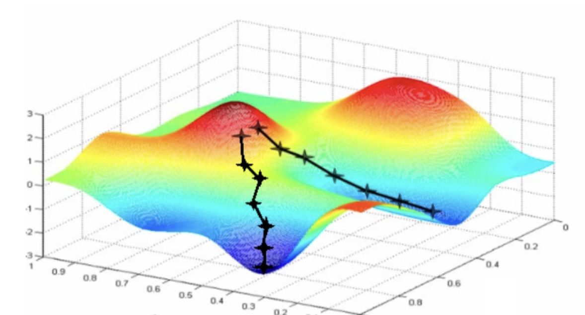
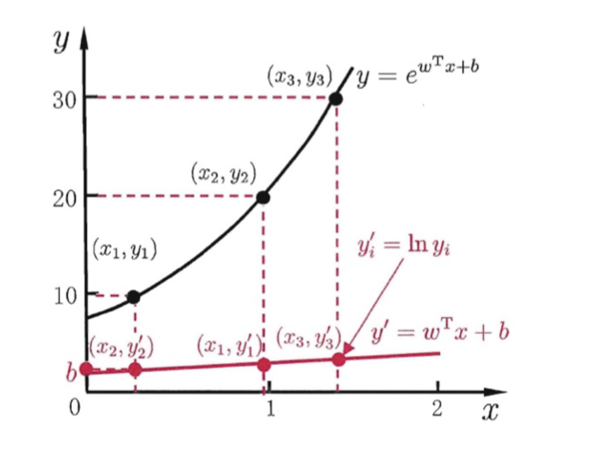

# 机器学习介绍与线性模型

  by <a href="https://github.com/zhuozhiyongde">Arthals</a> / GPT4 / Claude 3 Opus
   
  blog: <a href="https://arthals.ink">Arthals' ink</a>

## 线性模型

线性模型：线性模型就是要学习特征 $X$ 的一种线性组合来进行预测，进行运算 $y = wX + b$，其中 $w$ 是 $X$ 的权重，$b$ 是偏置，$y$ 是预测值。我们希望通过学习得到最优的 $w$ 和 $b$，使得预测值 $y$ 与真实值 $y_{GT}$ 的误差最小。

其中，$X$ 具有 $n$ 个特征，$X = (x_1, x_2, ..., x_n)$，其每个分量都代表一个特征，$y = w_1x_1 + w_2x_2 + ... + w_nx_n + b$，是 $X$ 各个特征的线性组合。

线性回归：给定数据 $D = \{(x_1, y_1), (x_2, y_2), \ldots, (x_n, y_n)\}$, 用一个线性模型估计最接近真实 (y) (ground truth) 的连续标量: $f(x_i)=w^T \cdot x_i + b$， 也就是要 $f(x_i) \approx y_i$

$(w, b)$ 是要学习的模型参数.

也就是要：

$$
f^{*} = arg \min_f \mathbb{E} [ ( f ( X )-Y )^{2} ]
$$

由于我们不能无限地获得数据，所以我们只能通过有限的数据来估计这个期望，也就是：

$$
f^{*}= arg \min_f \frac{1}{N} \sum_{i=1}^{N} ( f ( x_i )-y_i )^{2}
$$

这也被称为 Empirical mean（经验均值）。

其中，$n$ 是数据的数量，$x_i$ 是第 i 个数据的全部特征，$y_i$ 是第 i 个数据的真实值，$f(x_i)$ 是第 i 个数据的预测值。

根据大数定理，当数据量足够大时，经验均值会趋近于期望，也就是：

$$
\frac{1} {n} \sum_{i=1}^{n} loss ( x_{i}, y_{i} ) \overset{n \to\infty} {\longrightarrow} \mathbb{E}_{X, Y} [ loss ( X, Y ) ]
$$

我们可以通过最小二乘法来获取最优的 $w$ 和 $b$。

我们选择以线性代数来表示这个问题，也就是 Least Squares Estimator（最小二乘估计）：

$$
\begin{array} {r c l} {{( w^{*}, b^{*} ) \! \!}} & {{\!=\! \!}} & {{\! \! \! \arg \min \sum_{i=1}^{n} \, ( f ( x_{i} )-y_{i} )^{2}}} \\ {{\! \!}} & {{\!=\! \!}} & {{\! \! \! \! \arg \min \sum_{i=1}^{n} \, ( y_{i}-w x_{i}-b )^{2}}} \end{array}
$$

我们将之转为矩阵形式：

$$
\mathbf{A}=\left[\begin{matrix}{X_{1}}\\{\vdots}\\{X_{n}}\\\end{matrix}\right]=\left[\begin{matrix}{X_{1}^{(1)}}&{\dots}&{X_{1}^{(p)}}\\{\vdots}&{\ddots}&{\vdots}\\{X_{n}^{(1)}}&{\dots}&{X_{n}^{(p)}}\\\end{matrix}\right],\quad Y=\left[\begin{array}{c}{y_{1}}\\{\vdots}\\{y_{n}}\end{array}\right],\quad \beta=\left[\begin{array}{c}{w_{1}}\\{\vdots}\\{w_{p}}\end{array}\right]
$$

注意这一步的 $\mathbf{A}$ 的每一行代表一个数据 $X_i$，每一行除了最后一列，都是 $X_i$ 的特征，最后一列是 $1$，这是一个小的 trick，因为这样做的话，我们就可以把 $b$ 合并到 $\beta$ 中，也就是：

$$
\mathbf{A}=\left[\begin{matrix}{X_{1}^{(1)}}&{\dots}&{X_{1}^{(p-1)}}&{1}\\{\vdots}&{\ddots}&{\vdots}&{\vdots}\\{X_{n}^{(1)}}&{\dots}&{X_{n}^{(p-1)}}&{1}\\\end{matrix}\right],\quad \beta=\left[\begin{array}{c}{w_{1}}\\{\vdots}\\{w_{p-1}}\\{b}\end{array}\right]
$$

我们可以得到：

$$
\begin{aligned}
\hat{\beta} &= \mathop{arg}\min_{\beta} \frac{1} {n} \sum_{i=1}^{n} \; ( X_{i} \beta-Y_{i} )^{2} \\
&= \mathop{arg}\min_{\beta} \frac{1} {n} ( \mathbf{A} \beta-\mathbf{Y} )^{\mathrm{T}} ( \mathbf{A} \beta-\mathbf{Y} )
\end{aligned}
$$

其中，$\hat{\beta}$ 是最优的 $w$，也就是我们要求的结果。

简化这个式子，去掉和优化无关的 $\frac{1}{n}$ ，我们可以得到：

$$
\begin{aligned}
J(\beta) &= ( \mathbf{A} \beta-\mathbf{Y} )^{\mathrm{T}} ( \mathbf{A} \beta-\mathbf{Y} ) \\
&= \beta^{\mathrm{T}} \mathbf{A}^{\mathrm{T}} \mathbf{A} \beta-2 \beta^{\mathrm{T}} \mathbf{A}^{\mathrm{T}} \mathbf{Y}+\mathbf{Y}^{\mathrm{T}} \mathbf{Y}\\
\quad \frac{\partial J(\beta)}{\partial \beta} &= 2 \mathbf{A}^{\mathrm{T}} \mathbf{A} \beta-2 \mathbf{A}^{\mathrm{T}} \mathbf{Y} = 0 \\
\end{aligned}
$$

如果 $\mathbf{A}$ 可逆，那自然可以根据上式求出 $\beta$ 的解：

$$
\hat{\beta}=( \mathbf{A}^{\mathrm{T}} \mathbf{A} )^{-1} \mathbf{A}^{\mathrm{T}} \mathbf{Y}
$$

但是，很多情况下，$\mathbf{A}$ 并不可逆，比如 $n < p$ 时，我们可以证明它一定不可逆。而且即使 $\mathbf{A}$ 可逆，当它的维度很大时，计算也是很昂贵的。

所以，我们可以通过梯度下降法来求解最优的 $\beta$。

梯度下降法的思想是：从随机选取的 $\beta$ 开始，每次沿着梯度的反方向走一步（走的多长由学习率 Learning Rate 决定），直到收敛。只要这个损失函数是凸函数，我们总能优化到最优点。

## 贝叶斯统计

$$
\begin{aligned}&\max_{\beta}p(D|\beta)p(\beta)=\max_{\beta}\log p(D|\beta)+\log p(\beta)\\\\
&\hat{\beta}_{\mathrm{MAP}}=arg\max_{\beta}\underbrace{\log p\left(\{(X_i,Y_i)\}_{i=1}^n\mid\beta,\sigma^2\right)}_{\log\text{likelihood}} + \underbrace { l o g p \left ( \beta \right )}_{\log\text{prior}} \end{aligned}
$$

第一行的含义是，我们要最大化数据的似然函数和参数的先验概率的乘积。

-   似然函数表示数据（$D$）在给定参数 $\beta$ 的情况下出现的概率
-   先验概率表示我们在看到数据之前对参数的信念。

最大化这个乘积等价于最大化它们的对数，因为对数是单调递增的函数。

第二行的第一个项代表的含义是，在给定参数 $\beta$ 和方差 $\sigma^2$ 的情况下，数据出现的概率。

> 在统计模型中：
>
> -   $\beta$ 通常代表模型的系数
> -   $\sigma^2$ 代表模型中的噪声或误差的方差。即使我们有了 $\beta$，我们还需要知道数据中的变异性（或不确定性）有多大，这就是为什么 $\sigma^2$ 是重要的。
>
> 在某些模型，比如线性回归中，我们假设数据 $Y$ 是由自变量 $X$ 的线性组合（由 $\beta$ 确定）加上一些随机噪声（由 $\sigma^2$ 描述）生成的。这个噪声代表了除了 $X$ 影响 $Y$ 之外的其它因素。所以，$\sigma^2$ 帮助我们了解除了主要效应（由 $\beta$​ 描述）之外，数据中还有多少随机波动。

我们采取高斯先验，也即假设参数遵循高斯分布（也称为正态分布）。那么也就有 $\beta \sim N(0, \tau^2I)$。

这表示：

-   参数 $\beta$ 是一个 N 维向量，其中 N 是特征的数量
-   其遵循均值为 0，方差为 $\tau^2$ 的多元高斯分布
-   $\tau^2I$ 是指协方差矩阵为 $\tau^2$ 的对角矩阵，这代表 $\beta$ 的每个元素都是相互独立的，且每个元素的方差都是 $\tau^2$。
-   也就是说，各个维度独立同分布（iid）。

$\beta$ 的概率密度分布函数按照矩阵表示，则是：

$$
p(\beta) = \frac{1}{(2\pi)^{n/2}|\Sigma|^{1/2}} e^{-\frac{1}{2}(\beta - \mu)^T \Sigma^{-1} (\beta - \mu)}
$$

> 可以比较一维版本来理解~
>
> 其中的 $| \Sigma |$ 是协方差矩阵的行列式，它的作用是保证概率密度函数的总面积为 1。而当它为对角矩阵时，还能额外保证各个维度彼此独立。

所以，我们有 $p(\beta) \propto e^{-\beta^T\beta/2\tau^2}$​。

这不包括归一化常数。$\propto$ 表示成比例，意味着这是未归一化的概率密度，它的形状随着 $\beta$ 的变化而变化，但是总面积（概率总和）是固定的。$\beta^T\beta$ 是 $\beta$ 的二次项，表示参数向量的长度的平方。

关于这一部分，可以阅读 [钱默吟/多元高斯分布完全解析](https://zhuanlan.zhihu.com/p/58987388)，讲的很详细。

这个式子的一个直观理解，就是假设 $\beta$ 是一个二维的，那么我们可以可视化这个分布：

那么在这个图中，任意一个点都代表一个高斯分布，而 $f(x_1,x_2)$ 就是这个点的概率密度。我们可以看到，这个分布是关于原点对称的，这也是 $p(\beta)$ 中的 $\beta^T\beta$ 的作用，这代表了我们对于变量的顺序是没有偏好的。

带入进行复杂的数学推导 [^1] 后，我们就可以得到：

$$
\hat{\beta}_{\mathbf{MAP}}=arg\min\sum_{i=1}^n(Y_i-X_i\beta)^2+\lambda\parallel\beta\parallel_2^2
$$

为什么刚才是 $arg \max$，现在又变成了 $arg \min$？简单说明就是，刚才我们要最大化从已知的 $\beta$ 中得到数据真实分布的概率，这就等价于最小化使用我们的模型，从 $X$ 中得到的数据的误差（也即最大似然估计）。

而 $\lambda$ 是一个超参数，它的作用是控制我们对于参数的偏好，也就是我们对于模型的复杂度的偏好。在后续的学习中，我们会知道 $\lambda\parallel\beta\parallel_2^2$ 其实是一个正则项，它的作用是防止过拟合。

当我们对于 $\beta$ 的先验假设不一样时，这个惩罚项（正则项）也会不一样。但大致原理不变，于是我们对这个形式加以推广，得到了类似如下的公式：

$$
min_\beta(\mathbf{A}\beta-\mathbf{Y})^T(\mathbf{A}\beta-\mathbf{Y})+\lambda\mathrm{pen}(\beta)=minJ(\beta)+\lambda\mathrm{pen}(\beta)
$$

其中，$J(\beta)$ 是我们的损失函数，$\mathrm{pen}(\beta)$ 是惩罚项。

对于惩罚项，我们一般有两个选择：

-   L1 正则（1-范数）：$\mathrm{pen}(\beta)=\parallel\beta\parallel_1=\sum_{i=1}^n|\beta_i|$
-   L2 正则（2-范数）：$\mathrm{pen}(\beta)=\parallel\beta\parallel_2^2=\sum_{i=1}^n\beta_i^2$​

这两个惩罚项的解，具有如下特征：

-   **L1 岭回归的正则化项**：$ \lambda \sum\_{j=1}^{p} \beta_j^2 $，这是一个L2范数，它对大的系数施加更大的惩罚，导致系数平滑地趋近于零。有些$w$更小。
-   **L2 套索回归的正则化项**：$ \lambda \sum\_{j=1}^{p} |\beta_j| $，这是一个L1范数，它对所有系数施加相同的惩罚，这会导致一些系数直接为零，从而产生一个稀疏解。非零$w$更少。

最终，我们得到广义的线性模型，我们可以考虑任意一种单调可微的函数 $g(.)$：

$$
y=g^{-1}(w^Tx+b)
$$

其中，$g(.)$ 是激活函数，它的作用是将线性模型的输出转换为我们想要的输出，也即将线性模型的输出转换为一个非线性的预测值。比如，当 $g(.)$ 是恒等函数时，我们就得到了线性回归；当 $g(.)$​ 是 sigmoid 函数时，我们就得到了逻辑回归。

在这个图中，$g$ 就是 $log$ 函数，而对应的 $g^{-1}$ 就是 $e^x$ 指数函数。通过这个变换，我们将一个线性的 $y'= (w^Tx+b)$ 变换得到了非线性的 $y$。

## Reference

[^1]: [L1，L2 正则化的理解](https://hellojialee.github.io/2020/01/28/L1%E5%92%8CL2%E6%AD%A3%E5%88%99%E5%8C%96%E7%9A%84%E7%90%86%E8%A7%A3/)

关于最大化高斯分布的后验概率等价于最小化二阶范数的具体推导，还有一个由 GPT4 生成的推导过程：

> 在高斯分布下，假设权重 $w$ 遵循均值为0，方差为 $\sigma^2$ 的正态分布，即 $w \sim \mathcal{N}(0, \sigma^2)$。那么权重的概率密度函数（PDF）为：
>
> $$
> P(w) = \frac{1}{\sqrt{2\pi\sigma^2}}\exp\left(-\frac{w^2}{2\sigma^2}\right)
> $$
>
> 取对数得到：
>
> $$
> \log P(w) = \log\left(\frac{1}{\sqrt{2\pi\sigma^2}}\right) - \frac{w^2}{2\sigma^2}
> $$
>
> 因为第一项 $\log\left(\frac{1}{\sqrt{2\pi\sigma^2}}\right)$ 是常数，对于优化问题，我们只考虑影响模型参数 $w$ 的项，所以可以忽略它。因此，我们只关注第二项：
>
> $$
> -\frac{w^2}{2\sigma^2}
> $$
>
> 在机器学习中，我们通常使用代价函数（或损失函数）来训练模型。假设我们的代价函数为 $J(w)$，为了使 $w$ 接近于高斯分布，我们可以在代价函数中增加对数先验 $\log P(w)$，即：
>
> $$
> J'(w) = J(w) - \lambda \log P(w)
> $$
>
> 其中 $\lambda$ 是正则化参数。将 $\log P(w)$ 代入上式得到：
>
> $$
> J'(w) = J(w) + \lambda \frac{w^2}{2\sigma^2}
> $$
>
> 我们可以看到这里的 $\lambda \frac{1}{2\sigma^2}$ 起到了正则化系数的作用。这个正则化项是 $w$ 的平方，即 $L2$ 正则项。通常我们将 $L2$ 正则化系数表示为 $\alpha = \lambda \frac{1}{2\sigma^2}$，所以代价函数可以写为：
>
> $$
> J'(w) = J(w) + \alpha w^2
> $$
>
> 这显示了在高斯分布下 $\log P(w)$ 的效果等价于在代价函数中增加 $L2$ 正则项。这种正则化有时也被称为权重衰减，它鼓励模型学习更小的权重，从而可以提高模型的泛化能力，防止过拟合。
