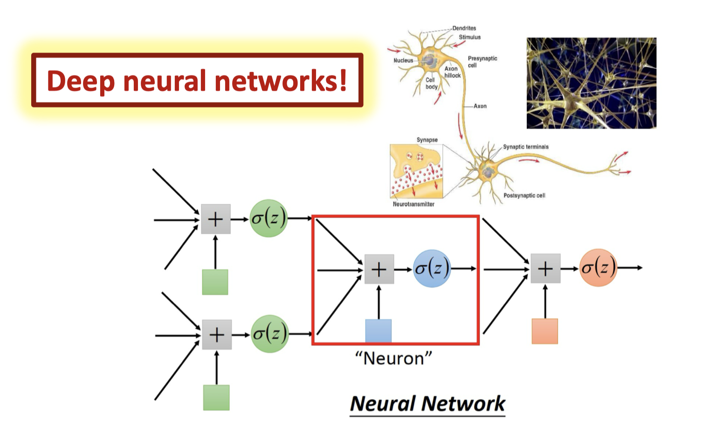

# 机器学习中的线性回归与分类问题

  by <a href="https://github.com/zhuozhiyongde">Arthals</a> / GPT4 / Claude 3 Opus
   
  blog: <a href="https://arthals.ink">Arthals' ink</a>

## 机器学习

机器学习：指通过算法的设计与分析使得我们能够 **基于经验** 提升模型在某些任务上的表现

三要素：任务、经验、表现

-   线性回归（Linear Regression）：连续预测
-   线性分类（Linear Classification）：离散预测，线性决策边界

## 逻辑回归（Logistic Regression）

用于分类而非回归。输出 “属于一个分类” 的概率。

1. Unit-step function（单位阶跃函数）：这是一个简单的分法，当 $z<0$ 时，$y=0$；当 $z=0$ 时，$y=0.5$；当 $z>0$ 时，$y=1$。
2. Logistic function（逻辑函数或 Sigmoid 函数）：它是单位阶跃函数的平滑版本，用来代替单位阶跃函数。逻辑函数的公式是 $y = \frac{1}{1 + e^{-z}}$，其中 $e$ 是自然对数的底数，$z$ 通常是特征与权重的线性组合。这个函数将 $z$ 映射到一个（0,1）区间内的值，表示概率。

Sigmoid 函数通常定义为：

$$
\sigma(x) = \frac{1}{1 + e^{-x}}
$$

为了推导它的导数，我们首先对其进行变形。

$$
\begin{aligned}
(1 + e^{-x})*\sigma(x) &= 1\\
e^{-x}*(-1)*\sigma(x) + \sigma'(x)*(1 + e^{-x}) &=0\\
\sigma'(x)*(1 + e^{-x}) &= e^{-x}*\sigma(x)\\
\sigma'(x)&=(1-\sigma(x))*\sigma(x)
\end{aligned}
$$

最终，我们得到了 Sigmoid 函数的导数：

$$
\sigma'(x) = (1-\sigma(x))\sigma(x)
$$

在这个式子中，唯一的变量是 $x$，而对于神经网络，我们可以将指数改写为输入的权重和特征的线性组合。

$$
\begin{aligned}y=\frac{1}{1+e^{-(w^Tx+b)}}\end{aligned}
$$

这里得到的 $y$ 是一个概率值，表示输入 $x$ 属于正类的概率。我们可以将这个概率值与阈值进行比较，以决定输入 $x$ 属于哪一类。

进一步，我们可以得到 $x$ 是正类的相对概率：

$$
\frac{y}{1-y}
$$

让我们把这个线性组合加上 Sigmoid 函数组合起来，得到逻辑回归的表达式，其可以用来估计，在给定的模型参数 $w$ 和 $b$ 下，给定输入为 $x$ 时，网络输出 $C_1$ （即将之归类为 $C_1$）的后验概率：

$$
\begin{aligned}P_{w,b}(C_1|x)=\frac{1}{1+e^{-(w^Tx+b)}}\end{aligned}
$$

接下来，考虑伯努利分布（二分类）的特殊情况。

对于伯努利分布，我们有：

| 事件     | 概率  |
| -------- | ----- |
| $P(Y=1)$ | $p$   |
| $P(Y=0)$ | $1-p$ |

所以，对于给定的真实分布 $P(Y|X)$，我们可以得到似然函数：

$$
\begin{aligned}P(Y|X)=p^y(1-p)^{1-y}\end{aligned}
$$

将其中的 $p$ 替换为逻辑回归的输出 $f_{w,b}(x)$，我们得到了逻辑回归的似然函数：

$$
\begin{aligned}P(Y|X)=L(w,b)=\prod_{i=1}^Nf_{w,b}(x^i)^{y^i}(1-f_{w,b}(x^i))^{1-y^i}\end{aligned}
$$

其中，$N$ 是样本的数量，$x^i$ 是第 $i$ 个样本的输入，$y^i$ 是第 $i$ 个样本的真实类别，$f_{w,b}(x^i)$ 是逻辑回归的输出。

> 这里巧妙的运用了当幂指数为 0 时，结果为 1 的性质。我们之所以写成上标，是因为后文下标我们要用于表示某个样本的某个特征。

我们可以对之进行取负对数的操作，得到负对数似然函数（损失函数）：

$$
\begin{aligned}-lnL(w,b)=-\sum_{i=1}^N(y^i\log f_{w,b}(x^i)+(1-y^i)\log(1-f_{w,b}(x^i)))\end{aligned}
$$

这个函数就是逻辑回归的损失函数，我们可以通过最小化这个函数来得到最优的模型参数 $w$ 和 $b$。

接下来，定义一个非常重要的概念：**熵 (Entropy)**。

熵：服从某⼀特定概率分布事件的理论最⼩平均编码长度。

已知一个离散变量 $i$ 的概率分布$P(i)$，我们有熵的公式：

$$
Entropy =-\sum_{n=1}^nP(i)log_2P(i)
$$

而对于连续变量，我们有：

$$
Entropy =-\int P(x)log_2P(x)dx
$$

我们可以将之统一为：

$$
H(P)=Entropy=\mathbb{E}_{x\sim P}[-\log P(x)]
$$

为什么说熵是理论最⼩平均编码长度呢？观察上述式子，我们可以发现，如果我们想让他最小，那么当 $P(i)$ 越大，$-\log_2P(i)$ 就要越小，也就是说，当某个事件发生的概率越大，我们对其编码的长度越短。这就是熵的含义。

举个生活中的例子，就是一个发生概率越大的事件，他往往没有什么有效的信息，如“太阳东升西落”，所以我们对其编码的长度越短，而发生概率越小的事件，他往往包含了更多的信息，如“明天会下雨”，所以我们对其编码的长度就会越长。

接下来，我们定义**交叉熵 (Cross Entropy)**。

交叉熵：用来衡量两个概率分布之间的差异的。

假设现在有一个样本集中两个概率分布 $p,q$，其中 $p$ 为真实分布。真实分布的熵为：

$$
H(p) = \sum_i p(i) \cdot \log\left(\frac{1}{p(i)}\right)
$$

如果采用错误的分布 $q$ 来表示来自真实分布 $p$ 的样本，则平均编码长度应该是：

$$
H(p,q) = \sum_i p(i) \cdot \log\left(\frac{1}{q(i)}\right)
$$

可以证明，$H(p,q) \geq H(p)$，当且仅当 $p=q$ 时，等号成立。

关于交叉熵，有几个重要的性质：

-   交叉熵是非负的
-   交叉熵等于真实分布的熵加上 KL 散度
-   交叉熵是不对称的

其中，KL 散度也是用来衡量两个概率分布之间的差异的，它的定义如下：

$$
D_{KL}(p||q) = \sum_i p(i) \cdot \log\left(\frac{p(i)}{q(i)}\right)
$$

将之前提到的，伯努利分布的似然函数带入交叉熵的定义，我们可以立即注意到，逻辑回归的损失函数就是交叉熵。

接下来，我们就要考虑优化逻辑回归的损失函数了。

在之前的学习中，我们知道我们需要通过梯度下降法来优化损失函数。而计算梯度的过程，我们可以使用链式法则来进行，需要算出损失函数对于模型参数的偏导数。

在此做推导如下：

$$
\begin{align*}
-\frac{\partial \ln L(w,b)}{\partial w_i} &= \sum_n -\left[ y^n \frac{\partial \ln f_{w,b}(x^n)}{\partial w_i} + (1 - y^n) \frac{\partial \ln (1 - f_{w,b}(x^n))}{\partial w_i} \right] \\
&= \sum_n -\left[ y^n (1 - f_{w,b}(x^n)) x_i^n - (1 - y^n) f_{w,b}(x^n) x_i^n \right] \\
&= \sum_n -\left[ y^n - f_{w,b}(x^n) \right] x_i^n \\
&= \sum_n -(y^n - f_{w,b}(x^n)) x_i^n
\end{align*}
$$

其中的推导细节包括：

$$
\begin{align*}
\frac{\partial \ln f_{w,b}(x^n)}{\partial w_i}
&= \frac{1}{f_{w,b}(x^n)} \frac{\partial f_{w,b}(x^n)}{\partial w_i} \\
&= \frac{1}{f_{w,b}(x^n)} f_{w,b}(x^n) (1 - f_{w,b}(x^n)) x_i^n \\
&= (1 - f_{w,b}(x^n)) x_i^n
\end{align*}
$$

对于第二项，类似可推。

观察这个最终的式子：

$$
\begin{aligned}
-\frac{\partial \ln L(w,b)}{\partial w_i} = \sum_n -(y^n - f_{w,b}(x^n)) x_i^n
\end{aligned}
$$

我们可以发现，当模型预测值 $f_{w,b}(x^n)$ 与真实值 $y^n$ 相差越大时，梯度的绝对值就越大，也就是说，我们对于预测错误的样本，我们会对模型参数进行更大的调整。

继续，下一步通过梯度下降法来优化损失函数，对于模型参数 $w_i$ 的更新公式为：

$$
\begin{aligned}
w_i = w_i - \eta \frac{\partial \ln L(w,b)}{\partial w_i} = w_i - \eta \sum_n -(y^n - f_{w,b}(x^n)) x_i^n
\end{aligned}
$$

其中，$\eta$ 是学习率，用来控制每次更新的步长，通常取一个较小的值。

### 逻辑回归的局限性

逻辑回归是一个线性分类器，它的决策边界是线性的（当 $w^Tx+b=0$ 时，$f_{w,b}(x)=0.5$，也就是说，$w^Tx+b=0$ 就是决策边界）。这意味着，如果数据的真实分布不是线性可分的（如异或 XOR），那么逻辑回归就无法很好的拟合这个数据。

### 级联的逻辑回归 DNN (Deep Neural Network)

