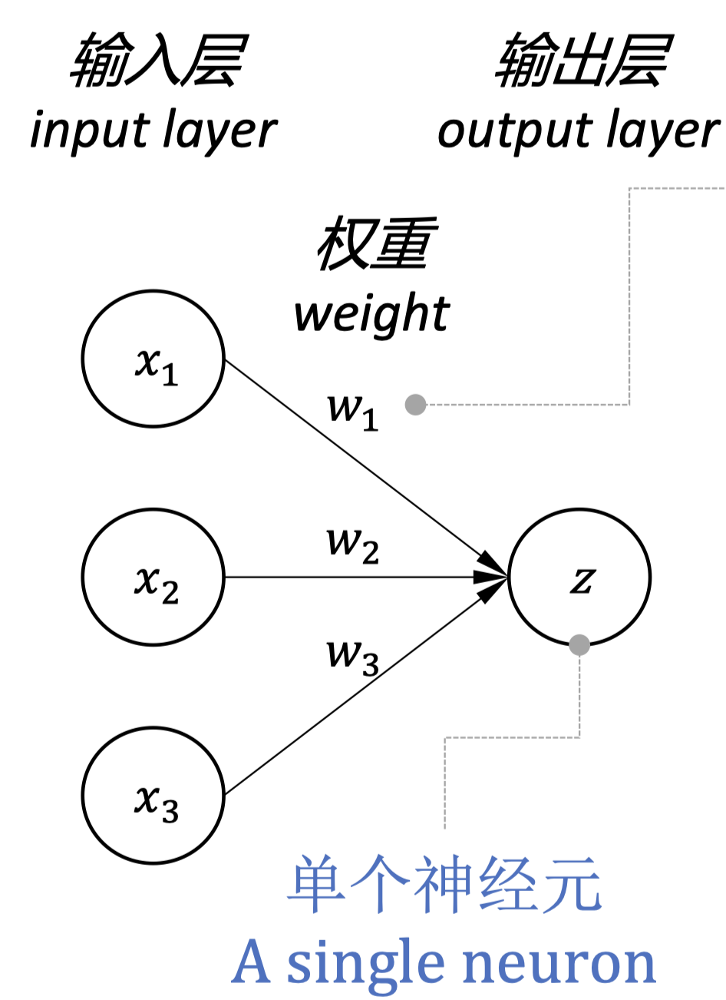
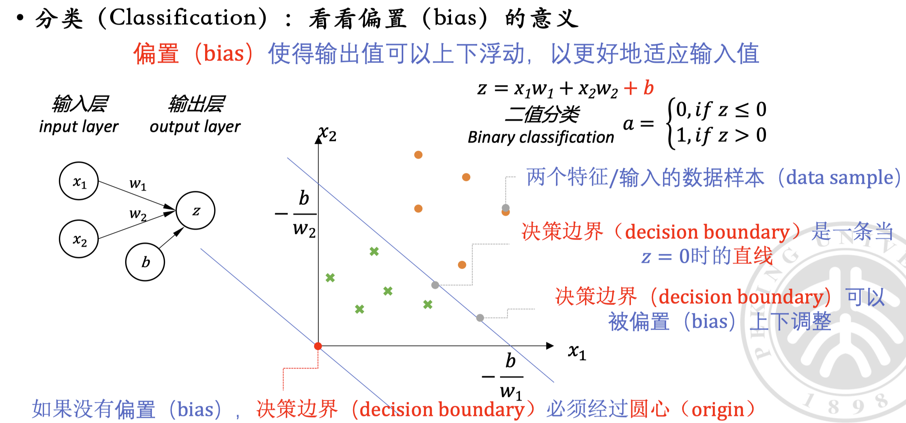
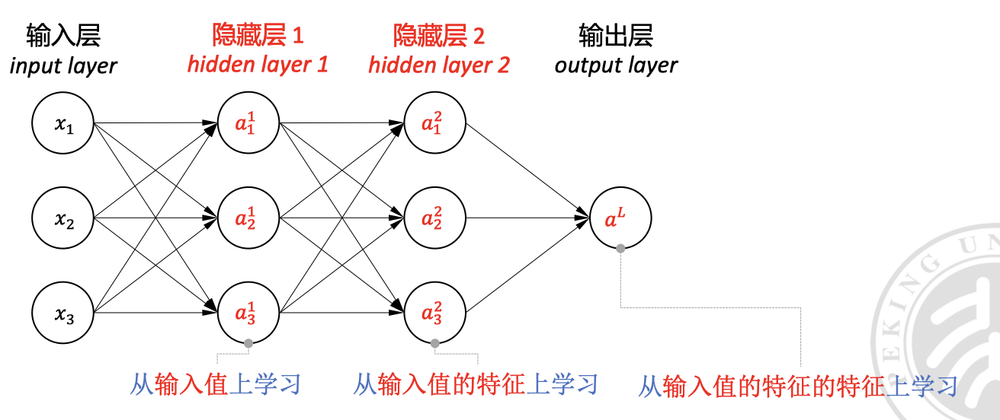
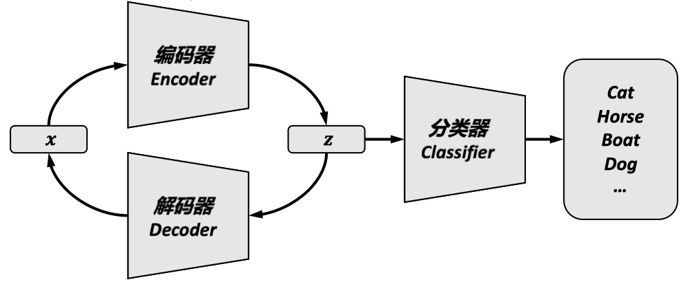
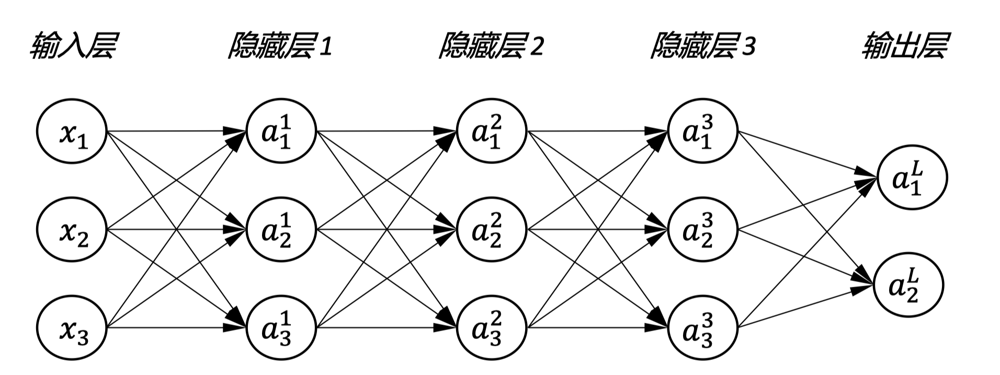
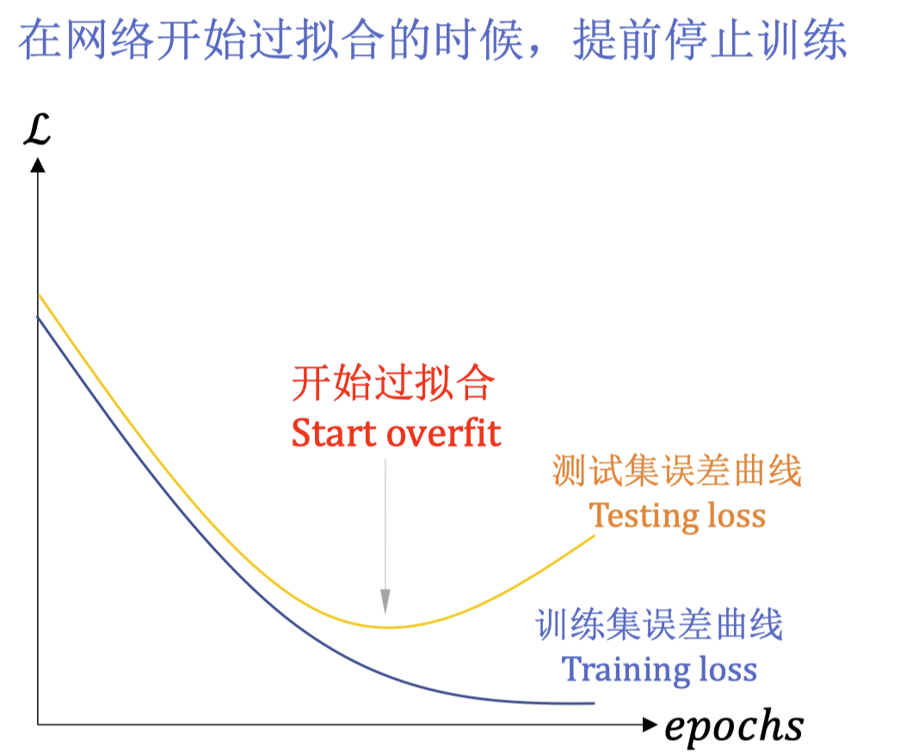
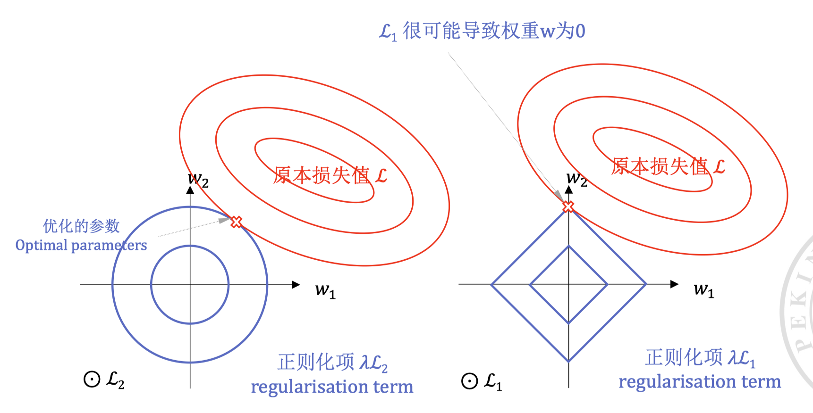
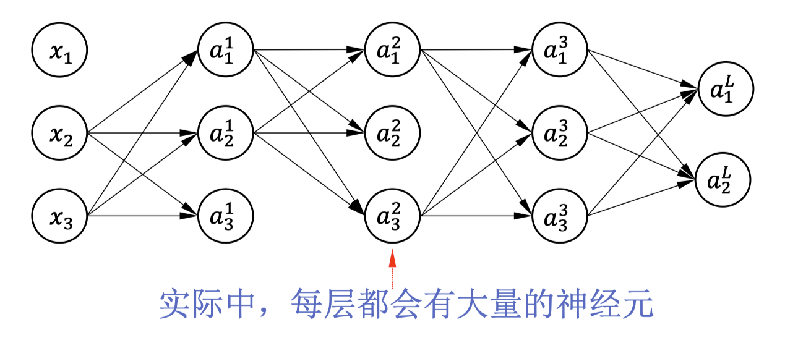

# 神经网络基础

  by <a href="https://github.com/zhuozhiyongde">Arthals</a>
   
  blog: <a href="https://arthals.ink">Arthals' ink</a>

## 神经元模型

神经元模型是神经网络的基本单元，它接收输入信号，对输入信号进行 **加权求和** ，权重 / 参数（weight/parameter）的绝对值越大，则代表对应的输入 $x$ 对输出影响越大，然后通过激活函数处理，最后输出结果。

基于向量相乘的实现，分为列格式和行格式。

### 列格式

$$
\begin{aligned}
{x} &= \begin{bmatrix}{x}_1 \\ {x}_2 \\ {x}_3\end{bmatrix} \quad {w} = \begin{bmatrix}{w}_1 \\ {w}_2 \\ {w}_3\end{bmatrix} \\
\\
z &= {w}^T{x} \\
&= \begin{bmatrix}{w}_1 \  {w}_2 \ {w}_3\end{bmatrix}\begin{bmatrix}{x}_1 \\ {x}_2 \\ {x}_3\end{bmatrix}
\end{aligned}
$$

在这种格式下，$x$ 的每个分量都是一个特征，$w$ 的每个分量都是对应特征的权重。$z$ 是一个标量。

### 行格式

$$
\begin{aligned}
{x} &= \begin{bmatrix}{x}_1 \ {x}_2 \ {x}_3\end{bmatrix} \quad w=\begin{bmatrix}w_1\\w_2\\w_3\end{bmatrix} \\
\\
z &= {x}{w} \\
&= \begin{bmatrix}{x}_1 \ {x}_2 \ {x}_3\end{bmatrix}\begin{bmatrix}{w}_1 \\ {w}_2 \\ {w}_3\end{bmatrix}
\end{aligned}
$$

同列格式一样，这里 $x$ 的每个分量也都是一个特征，$w$ 的每个分量也都是对应特征的权重。$z$ 是一个标量。

不同点在于，这种格式在代码中更为常用，这是因为我们经常多个样本一起处理（mini-batch），通过将第一个维度（第 0 维）留给样本数，可以更方便的处理多个样本。

当然，我们也可以再加上偏置（bias） $b$，来增加模型的表达能力（改变原先必然过圆心的决策边界）：

## 激活函数

激活函数（activation function）：对神经元的输出进行非线性变换，提供⾮线性性（non-linearity），增加神经网络的表达能力。

常用的激活函数及对应的公式、映射关系如下：

-   Sigmoid 函数
    -   公式：$f(x)=\frac{1}{1+e^{-x}}$
    -   映射关系：$(-\infty,+\infty) \rightarrow (0,1)$，输出值在 0 到 1 之间，用以 **表示概率**
-   Tanh 函数
    -   公式：$f(x)=\frac{e^x-e^{-x}}{e^x+e^{-x}}=\frac{2}{1+e^{-2x}}$
    -   映射关系：$(-\infty,+\infty) \rightarrow (-1,1)$，输出值在 -1 到 1 之间，常用于 **回归任务**
-   ReLU 函数
    -   公式：$f(x)=\max(0,x)$
    -   映射关系：$(-\infty,+\infty) \rightarrow (0,+\infty)$，最常用的分类函数，可以用于特征提取、 **简化网络优化** （缓解梯度消失问题、偏导数好计算）
-   Leaky ReLU 函数
    -   公式：$f(x)=\max(\alpha x,x)$
    -   映射关系：$(-\infty,+\infty) \rightarrow (-\infty,+\infty)$，解决 ReLU 函数中负数部分输出为 0 的问题，其中的 $\alpha$ 是一个小的常数，如 0.01，在 Parametric ReLU 中，这个 $\alpha$ 是一个可学习的参数
-   Softmax 函数
    -   公式：$f(x_i)=\frac{e^{x_i}}{\sum_{j=1}^n e^{x_j}}$
    -   映射关系：$(-\infty,+\infty) \rightarrow (0,1)$，输出值在 0 到 1 之间，用以 **表示概率**，使得所有激活值之和为 1

## 多层感知器（Multi-Layer Perceptron, MLP）

多层感知器是一种 **前馈神经网络**，它由 **输入层** 、 **隐藏层** 和 **输出层** 组成。

相较于单层感知器的线性决策边界，多层感知器通过将多个单层感知器叠加，后一个层将原有层的输出值当做特征值来学习，也就是 “在原有特征的基础上，再次进行特征提取（变换）”，从而具有更好的表达能力。这能更好的解决现实中更复杂的问题。

**注意，$a$ 代表的是激活函数的输出，之前的 $z$ 代表的是加权求和的结果。$a = f(z)$**

$$
a_k^l
$$

-   $l$ 代表层索引，$l=1,2,\cdots,L$，直接以输入值作为输入层可以写为 $x=a^0$
-   $k$ 代表神经元索引，$k=1,2,\cdots,K$

多层感知器可以进一步抽象成 Encoder-Decoder 模型，其中 Encoder 用于提取特征，Decoder 用于还原数据。

这个模型后续会在 RNN 和 Seq2Seq 中有所体现。现今大火的 Diffusion Model 也正是基于这个思想来设计的。在当前学习的全连接 MLP 中，我们可以简单的认为除输出层外的所有层都是 Encoder，输出层是 Decoder。

## 损失函数

损失函数（loss function）：用来量化网络 **预测的输出（predicted output）** 和 **给定训练数据输出（ground truth）** 之间的 **误差 (error，也称 loss value)** 。

损失函数用来设定优化神经网络参数（如权重、偏置）的目标。

优化神经网络的过程，就是通过更新其参数来使得误差尽可能小。

**梯度下降（gradient descent）是最常用的优化方法。**

损失函数的选择：

首先，我们回忆一下之前我们是如何定义交叉熵的：

$$
\begin{aligned}
L_i&=-\log P(Y=y_i|X=x_i)
\end{aligned}
$$

这里的 $P(Y=y_i|X=x_i)$ 是指在给定输入 $x_i$ 的情况下，输出 $y_i$ 的概率。这个概率是由神经网络给出的，也就是 $P(Y=y_i|X=x_i)=f(x_i)$，其中 $f$ 是神经网络的输出函数。

### 分类问题：交叉熵损失函数（cross-entropy loss function）

公式是：

$$
\begin{aligned}
\mathcal{L}&=-\sum_{k=1}^K y_k\log(a_k)\\
\mathcal{L}&=-\frac{1}{M}\sum_{m=1}^M\sum_{k=1}^K y_k^m\log(a_k^m)
\end{aligned}
$$

这里：

-   $K$ 是类别的总数
-   $y_k$ 是一个独热编码向量，其中只有对应真实类别的那一项为 1，其余为 0
-   $a_k$ 是神经网络输出的概率预测，对应于类别 $k$
-   上标 $m$ 表示第 $m$ 个样本。

第一个式子为单个样本的损失函数，第二个式子为多个样本的损失函数。

#### 逻辑回归问题的损失函数

$$
\mathcal{L} = y\log(a) + (1 - y)\log(1 - a)\\
\mathcal{L} = \sum_{m=1}^{M} (y^m\log(a^m) + (1 - y^m)\log(1 - a^m))
$$

这是在二分类条件下的交叉熵损失函数。

这里：

-   $a$ 是神经网络的输出，也就是模型预测的分类概率。
-   $y$ 是真实值，也即标签
-   上标 $m$ 代表第 $m$ 个样本，而不是幂次。

由于 $y$ 是标签，所以 $y$ 和 $1-y$ 有一个取值为 0 另一个为 1，这被用于选择正确的损失项，当真实标签 $y^m=1$ 时，$y^m\log(a^m)$ 项用于计算损失；当 $y^m=0$ 时，$(1 - y^m)\log(1 - a^m)$ 项用于计算损失。

第一个式子为单个样本的损失函数，第二个式子为多个样本的损失函数。

> 使用 GPT4 生成的从头推导（符号可能有些不一样）
>
> 逻辑回归的损失函数是从最大似然估计（Maximum Likelihood Estimation, MLE）推导而来的。
>
> 给定一组数据，MLE 的目标是找到模型参数（在逻辑回归中是权重 $w$ 和偏差 $b$），使得观察到的数据出现的概率（似然）最大。
>
> 对于逻辑回归，似然函数可以写为：
>
> $$
> L(\theta) = \prod_{i=1}^{m} P(y^{(i)} | x^{(i)}; \theta) = \prod_{i=1}^{m} a^{y^{(i)}}(1-a)^{1-y^{(i)}}
> $$
>
> 其中：
>
> -   $m$ 是样本数量，
> -   $y^{(i)}$ 是第 $i$ 个样本的真实类别，
> -   $x^{(i)}$ 是第 $i$ 个样本的特征，
> -   $a$ 是模型关于参数 $\theta$ （即权重和偏差）预测的概率，
> -   $\theta$ 是模型参数。
>
> 取对数似然，我们得到对数似然函数：
>
> $$
> \log L(\theta) = \sum_{i=1}^{m} y^{(i)} \log(a) + (1-y^{(i)}) \log(1-a)
> $$
>
> 在优化问题中，通常最小化负的对数似然，因此损失函数变为：
>
> $$
> J(\theta) = -\frac{1}{m}\sum_{i=1}^{m} [y^{(i)} \log(a) + (1-y^{(i)}) \log(1-a)]
> $$
>
> 这就是逻辑回归中常用的损失函数，也称为对数损失（Log Loss）或交叉熵损失（Cross-Entropy Loss）。

### 回归问题：均方误差损失函数（mean squared error loss function，MSE）

MSE 是 $L_{2}$ 范数，往往用来衡量网络输出值 $a$ 和训练数据输出值 $y$ 的差别。

$$
\text{loss}(Y, f(X)) = (Y - f(X))^2
$$

#### L 范数

$$
||x||_L = \left( \sum_{i=1}^n |x_i|^L \right)^{\frac{1}{L}}
$$

-   $L=1$ 时，称为 L1 范数，MAE（Mean Absolute Error，平均绝对误差）。用于衡量两个向量之前差别的大小
-   $L=2$ 时，称为 L2 范数，MSE（Mean Squared Error，均方误差）。用来衡量网络输出值 $a$ 和训练数据输出值 $y$ 的差别（MAE 也可以，区别在于 L2 范数对异常值更敏感）

## 优化

目的：给定网络 $f(x;\theta)$ 和损失函数 $\mathcal{L}$ ，以获得好的参数 $\theta$，最小化损失函数 $\mathcal{L}$。

最常用的优化方法是梯度下降（gradient descent）。梯度下降的思想是通过不断迭代来更新参数，使得损失函数最小化。

### 梯度下降

$$
w_j:=w_j-\alpha\frac{\partial\mathcal{L}}{\partial w_j}\quad w=[w_1,w_2,...]
$$

-   $\alpha$ 称为学习率（learning rate）
-   $\frac{\partial\mathcal{L}}{\partial w_j}$ 称为梯度（gradient），代表损失函数 $\mathcal{L}$ 对权重 $\partial w_j$ 的偏导数
-   $w_j$ 称为权重（weight），$j$ 代表权重的索引
-   $w$ 称为权重向量（weight vector）

在更高的维度，可能无法很好的可视化这个过程，但是其思想是一样的。

无论有多少参数，我们只需要计算出梯度 $\frac{\partial\mathcal{L}}{\partial\theta}$ 即可优化每一个参数。

$$
\boldsymbol{\theta}:=\boldsymbol{\theta}-\alpha\frac{\partial\mathcal{L}}{\partial\boldsymbol{\theta}}
$$

### 误差反向传播

误差反向传播（Backpropagation，BP）是一种用于训练神经网络的方法，其就是梯度下降的思想的具体实现。

误差反向传播，也就是利用链式法则来计算损失函数对参数的梯度的方法。为了计算对于每个参数的偏导数，我们首先计算每个神经元的中间结果 $\delta$，也就是损失函数 $L$ 对于神经网络中某一层的激活值 $z$ 的偏导数 $\delta=\frac{\partial L}{\partial z}$。

利用这个中间结果 $\delta$ ，我们可以计算损失函数对于每个参数 $\theta$ 的偏导数 $\frac{\partial L}{\partial \theta}$，即最终我们需要的梯度。进而通过这个梯度，我们可以调整参数 $\theta$ 来减少整个网络的损失。

图中展示了一个简化的神经网络结构，包含输入层、多个隐藏层和输出层。每一层都有多个神经元（用 $a$ 表示），它们之间通过权重（即参数 $\theta$）相连。在训练过程中，我们首先正向传播输入信号，然后根据输出和实际值计算损失，最后通过反向传播算法来更新权重，以此循环直至模型训练完成。

### 梯度消失（Gradient Vanish）/ 梯度爆炸（Gradient Explode） 问题

在深度神经网络中，梯度消失和梯度爆炸是一个常见的问题。这是因为在反向传播过程中，梯度会随着层数的增加而指数级的减小或增大。

举个例子，考虑 Sigmoid 函数的导数：

$$
\begin{aligned}
\sigma(x)&=\frac{1}{1+e^{-x}}\\
\sigma'(x)&=\sigma(x)(1-\sigma(x))
\end{aligned}
$$

在 Sigmoid 函数的导数中，当 $x$ 趋近于正无穷或负无穷时，$\sigma'(x)$ 趋近于 0。这就是梯度消失的原因。**当梯度消失时，网络的训练将变得非常困难**，因为梯度会在反向传播的过程中经过这些层时变得非常小，导致网络无法学习到有效的参数。

为了解决这个问题，我们可以使用 ReLU 函数，它的导数在 $x>0$ 时为 1，这样可以避免梯度消失的问题。

### 随机梯度下降（Stochastic Gradient Descent, SGD）

到现在为止，我们所说的梯度下降（GD）都是基于整个数据集的。然而，当数据集非常大时，计算整个数据集的梯度是非常耗时的（非常昂贵的）。

在梯度下降的基础上，后来提出的随机梯度下降是一种更高效的优化方法。它不是在整个数据集上计算梯度，而是在每次迭代中 **随机选择一批数据（mini-batch）来计算梯度** 。

为什么可以这么做？原因如下：

$$
\mathbb{E}[\nabla l_{t_i}(x)] = \mathbb{E}[\nabla f(x)] = \frac{1}{n} \sum_{i} \nabla l_i(x)
$$

这里：

-   $l_i(x)$ 是第 $i$ 个数据点的损失函数
-   $f(x)$ 是整个数据集上的目标函数
-   $\nabla l_i(x)$ 是第 $i$ 个数据点的梯度
-   $\nabla f(x)$ 是整个数据集上目标函数的真实梯度
-   $n$ 是数据集的大小
-   $t_i$ 是随机选择的数据点

这个公式说明，对于随机选择的数据点 $t_i$ 的梯度 $\nabla l_{t_i}(x)$ 的期望（即平均情况下的值）与整个数据集上目标函数 $f(x)$ 的真实梯度 $\nabla f(x)$ 的期望是相等的。但是基于无偏估计（下降方向是对真实梯度方向的无偏估计）的假设，我们可以用它来近似真实梯度。

进一步的，为了充分利用硬件资源、减少单样本采样导致的抖动，我们选取通过一批数据计算均值，再以此均值作为（估计的）梯度下降的方向，这一方法称为小批量随机梯度下降，这同样是一个无偏的近似，还降低了方差（减少了抖动）。

$$
\begin{aligned}
\mathbf{x}_t=\mathbf{x}_{t-1}-\frac{\eta_t}{b}\sum_{i\in I_t}\nabla\ell_i(\mathbf{x}_{t-1})\\
\mathbb{E}[\frac1b\sum_{i\in I_t}\nabla\ell_i(\mathbf{x})]=\nabla f(\mathbf{x})
\end{aligned}
$$

这里：

-   $\mathbf{x}_t$ 是第 $t$ 次迭代的参数
-   $\mathbf{x}_{t-1}$ 是第 $t-1$ 次迭代的参数
-   $\eta_t$ 是学习率
-   $b$ 是批大小，等于 $|I_t|$
-   $I_t$ 是第 $t$ 次迭代的数据索引集合，是在时间 $t$ 时随机选择的的一个子集。

这一批数据的大小称为批大小（batch size），通常是 32、64 或 128。这样，我们可以在每次迭代中更快地计算梯度，从而加速训练过程（相较于喂入整个数据集，也即一次完整的跑一个 epoch）。

通过多次更新参数，mini-batch 可以覆盖整个训练数据集，一个 **epoch** 则被称为覆盖一次整个训练数据集。

> 后续还会学到，我们可以在此基础上做 batch normalization 来加速训练、减少对初始化的依赖。
>
> 当然，SGD 也有它的缺点，比如可能会陷入局部最优解等等，我们会在后文中介绍其他的 SGD 变种，如 RMSprop、Adam 等。

### 学习率调度

学习率是梯度下降算法中的一个重要超参数，它决定了参数更新的速度。

-   学习率太大会导致参数更新过快，从而错过最优解
-   学习率太小会导致参数更新过慢，从而训练时间过长

为了解决这个问题，我们可以使用学习率调度（learning rate schedule）来动态调整学习率。学习率调度可以根据训练过程中的不同阶段来调整学习率，例如每隔一定的 epoch 或当损失函数不再下降时。

学习率调度的常见方法有：

#### Adagrad（Adaptive Gradient）

Adagrad 是一种自适应学习率调整方法，它可以针对每个参数调整学习率，特别适合处理稀疏数据。Adagrad 的更新规则如下：

$$
G_{t} = G_{t-1} + \nabla_{\theta}J(\theta)^2
$$

$$
\theta_{t+1} = \theta_t - \frac{\eta}{\sqrt{G_t + \epsilon}} \cdot \nabla_{\theta}J(\theta)
$$

其中：

-   $G_t$ 是到目前为止所有梯度平方的累加
-   $\epsilon$ 是一个小的平滑项，防止分母为零
-   $\eta$ 是初始学习率

Adagrad 的关键优点是不需要手动调整学习率，由于 $G_t$ 不断累加，它能先快后慢地自动进行调整学习率。然而，它也存在一个缺点，随着训练的进行，$G_t$ 会不断累加，导致学习率趋于零，使得训练在后期几乎不再更新参数。

#### RMSprop

RMSprop 是一种改进自 Adagrad 的自适应学习率方法。公式如下：

$$
v_{t} = \beta v_{t-1} + (1 - \beta)\nabla_{\theta}J(\theta)^2
$$

其中：

-   $v_t$ 是梯度平方的指数移动平均
-   $\beta$ 是衰减率，用于控制历史信息保留的多少
-   $\nabla_{\theta}J(\theta)$ 是当前梯度
-   $J(\theta)$ 是损失函数。

RMSprop 通过除以 $v_t$ 来调整每一步的学习率，使得学习率逐渐减小。

在获得 $v_t$ 后，我们以如下式子对参数进行更新：

$$
\theta_{t+1} = \theta_t - \frac{\eta}{\sqrt{v_t + \epsilon}} \cdot \nabla_{\theta}J(\theta)
$$

与 Adagrad 不同，RMSprop 通过指数移动平均的方式来调整学习率，以丢弃遥远的梯度历史信息（让距离当前越远的梯度的缩减学习率的权重越小），从而使得学习率不会过早降低，从而更好地适应训练数据。

#### Adam（Adaptive Moment Estimation）

为了克服 Adagrad 在训练后期学习率过小的问题，Adam 算法被提出。Adam 同时考虑了梯度的一阶矩（即梯度本身）和二阶矩（即梯度的平方）的指数移动平均，其更新规则如下：

$$
m_t = \beta_1 m_{t-1} + (1 - \beta_1)\nabla_{\theta}J(\theta)
$$

$$
v_t = \beta_2 v_{t-1} + (1 - \beta_2)\nabla_{\theta}J(\theta)^2
$$

$$
\hat{m}_t = \frac{m_t}{1 - \beta_1^t}
$$

$$
\hat{v}_t = \frac{v_t}{1 - \beta_2^t}
$$

$$
\theta_{t+1} = \theta_t - \frac{\eta}{\sqrt{\hat{v}_t + \epsilon}} \cdot \hat{m}_t
$$

其中：

-   $m_t$ 和 $v_t$ 分别是梯度的一阶矩和二阶矩的指数移动平均
-   $\beta_1$ 和 $\beta_2$ 是衰减率，通常接近 1
-   $\hat{m}_t$ 和 $\hat{v}_t$ 是对 $m_t$ 和 $v_t$ 的偏差校正，以便在训练初期得到更准确的估计
-   $\eta$ 是学习率

Adam 结合了 RMSprop 和 Momentum 的优点，不仅自适应调整每个参数的学习率，还能利用梯度的一阶矩信息加速训练，在实际应用中表现良好。

如果你对动量 Momentum 不熟悉，可以参考 [这篇文章](https://distill.pub/2017/momentum/)。

### 超参数优化

超参数选择（Hyper-Parameter Selection）的主要目的是找到一个合适的模型 $f(x; \theta)$，使其 **在训练数据集上不过拟合（overfit），同时在测试数据集上能很好地泛化（generalize）。**

**超参数** 包括网络层数、神经元数、激活函数、批大小、训练 epoch 数等，对模型性能有重要影响。

三个数据集的区别：

-   训练数据集（Training Data）用于训练模型
-   验证数据集（Validation Data）用于评估和比较不同超参数组合对应的模型性能，并选择性能最佳的超参数
-   测试数据集（Test Data）用于最终评估选定的模型性能。**不能用测试集来验证超参数性能，这是作弊。** 因为其会导致模型过拟合测试数据。

交叉验证（Cross Validation）是一种常用的超参数选择方法。它将数据分成多个子集，每次用其中一个子集作为验证集，其余作为训练集，遍历所有子集组合，从而避免了使用单一的验证集可能带来的偏差。

## 正则化

Motivation：解决过拟合（Overfitting）。

过拟合指的是模型在训练数据上表现很好，但在测试数据上表现很差。其原因是模型过于复杂，导致模型在训练数据上学习到了噪声，而不是真正的模式。也即，当我们的模型参数过多，超过样本数量时，模型就会过拟合。

为了解决过拟合问题，我们可以使用正则化（Regularization）方法。其思想是，我们对于损失函数添加一个惩罚项，从而限制模型的复杂度，使其更容易泛化到未见过的数据。

### 提前停止法（Early Stopping）

在训练过程中，我们不断地监控验证集的损失，当验证集的损失不再下降时，我们停止训练，从而避免模型过拟合。

### 权重衰减（Weight Decay）

权重衰减是一种常用的正则化方法，其思想是通过在损失函数中添加损失项来限制权重的大小，从而减少模型的复杂度。

$$
\mathcal{L}_{total} = \mathcal{L} + \lambda ||{W}||
$$

权重衰减只用于权重 weight，不用于偏置 bias。

#### L1 vs L2 正则化

L1 对小的数值产生的惩罚比 L2 要大，因此（参数小于 1 时，其梯度更大）L1 正则化会使得模型更加稀疏，此称之为 **稀疏特性**，即更多的参数为 0。L2 正则化则会使得模型的参数更加平滑。

与之相反的，L2 不会产生稀疏解，所有参数都会被缩小但不会变成零。

### Dropout

Dropout 是一种随机正则化方法，其思想是，因为包含大量神经元的神经网络使其很容易过拟合，所以可以在训练过程中随机丢弃一部分神经元（对隐藏输出置 0），从而减少模型的复杂度，防止过拟合。

具体来说，Dropout 会以概率 $p$ 随机丢弃一部分神经元，其余神经元的输出乘以 $\frac{1}{1-p}$，从而保持其期望值不变。

测试 / 正常使用的时候，不再随机置 0 的原因：确保模型的输出稳定且充分利用训练时学到的所有信息。
