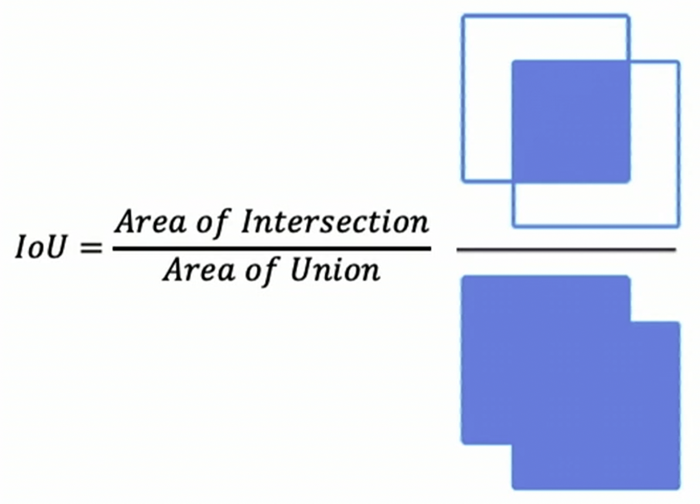
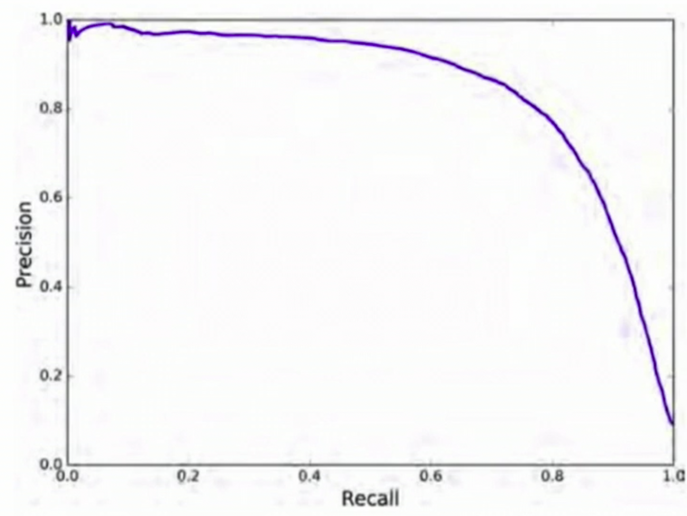
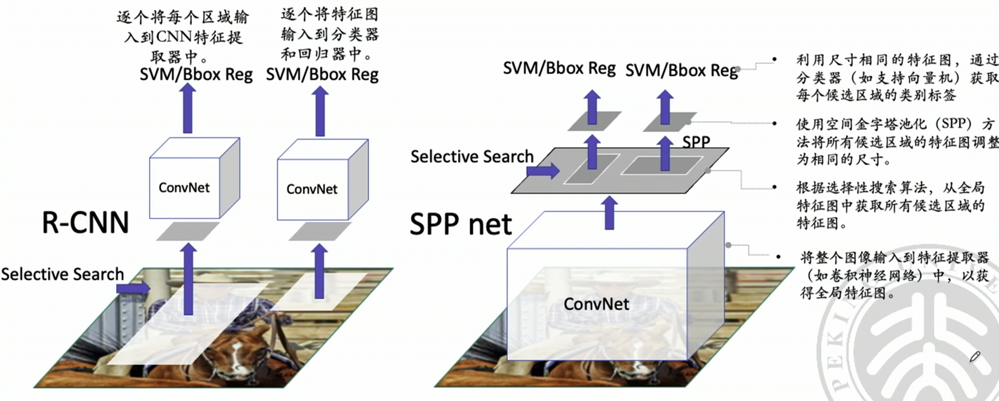
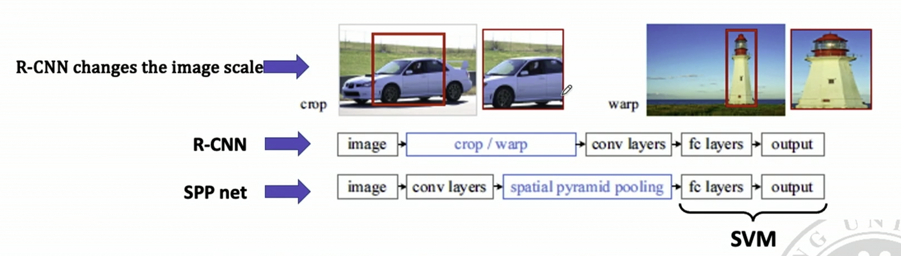
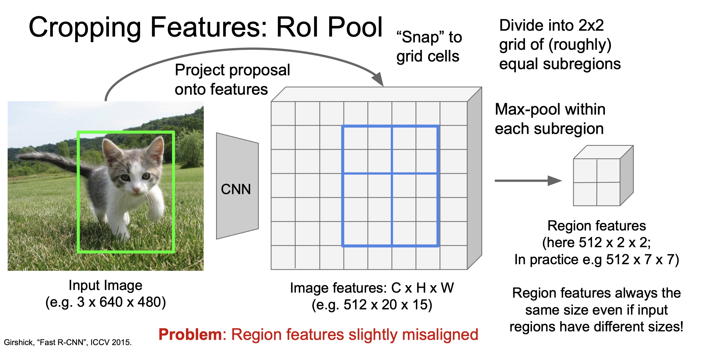
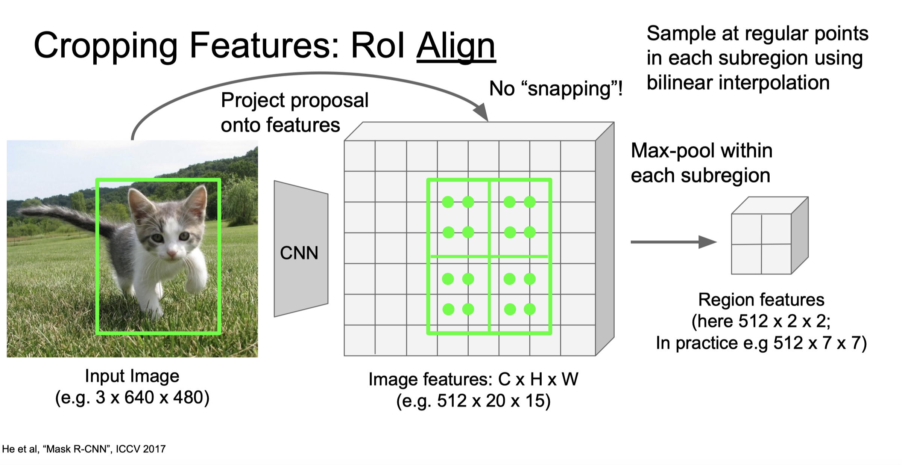
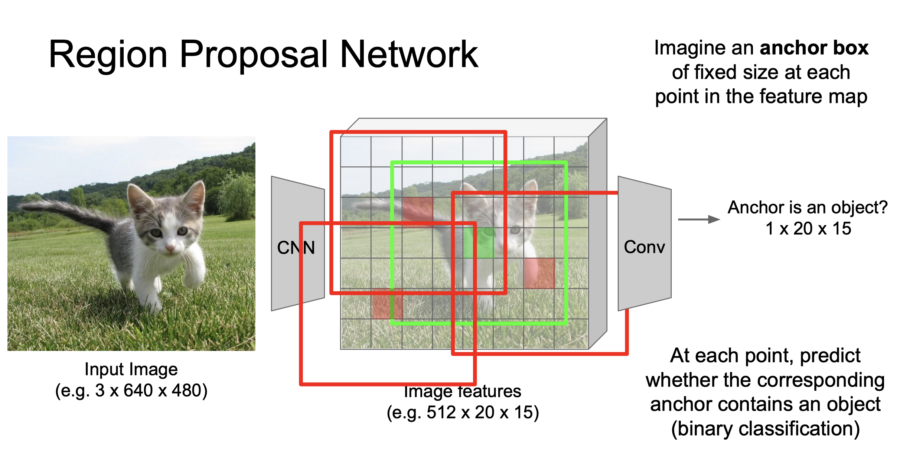
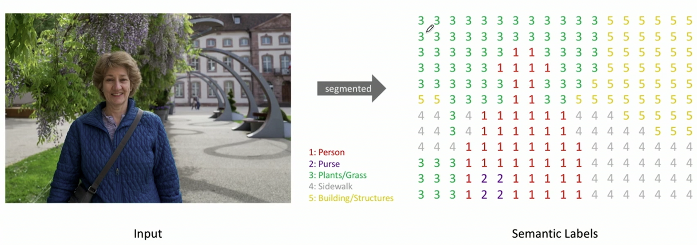
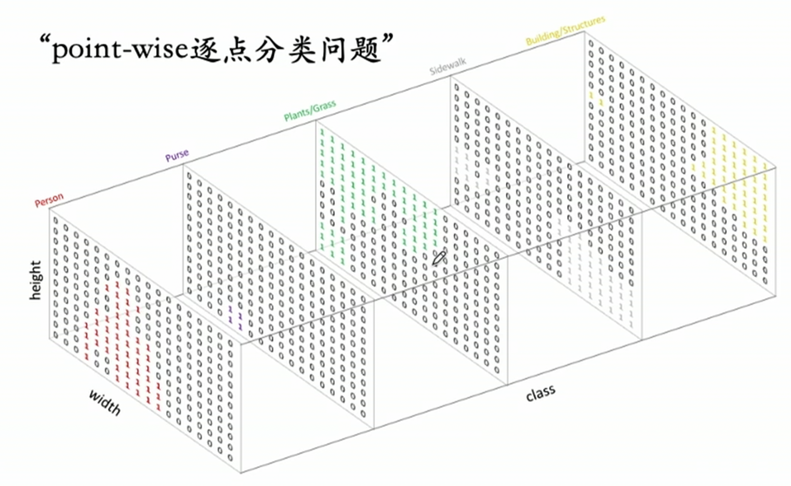

# 卷积神经网络应用

  by <a href="https://github.com/zhuozhiyongde">Arthals</a> / GPT4 / Claude 3 Opus
   
  blog: <a href="https://arthals.ink">Arthals' ink</a>

## 总览

在 AI 领域，任务大致分为两类： **判别式任务** 和 **生成式任务** 。

### 判别式任务

判别式任务关注于从给定的数据中识别或分类信息。常见的应用包括：

#### 二维（2D）任务

-   **分类（Classification）** ：识别给定图像的类别。
-   **检测（Detection）** ：识别图像中的对象及其位置。
-   **识别（Recognition）** ：比如，人脸识别。
-   **分割（Segmentation）** ：将图像分成多个部分或对象。
-   **检索（Retrieval）** ：根据特定特征搜索相似图像。
-   **语言处理（Language）** ：例如，文本分类或情感分析。

#### 三维（3D）任务

-   **3D 建模（3D Modeling）** ：从 2D 图像生成 3D 模型。
-   **增强现实（Augmented Reality）** ：在真实世界的视图中叠加计算机生成图像。
-   **双目视觉（Binocular Vision）** ：利用两个相机从不同角度捕捉图像，以模拟人的双眼视觉。

### 生成式任务

生成式任务旨在基于已有的数据或模式生成新的数据实例。例如，根据一组图像生成新的图像（如图片修补、遮瑕），或根据一段文本生成相关的文本。

## 目标检测（Object Detection）

目标检测：识别图像中的物体，并确定它们的位置和类别。这个过程通常包括两个步骤：首先是定位物体，通常通过绘制边界框（Bounding Box）来实现；其次是识别这些物体的类别，即打上相应的标签。

### 效果评估

在目标检测中，我们通过以下几个指标来评估模型的性能：

#### 交并比 (Intersection over Union, IoU)

$$
IoU=\frac{\text{预测的边界框与真实边界框的交集面积}}{\text{预测的边界框与真实边界框的并集面积}}
$$

IoU 量化边界框预测的准确性。

当 IoU 等于 1 时，意味着预测边界框与真实边界框完全重合， 预测结果是完美的。

当 IoU 等于 0 时，表示预测边界框与真实边界框完全没有重叠， 预测结果完全不匹配。

当 IoU 大于某个阈值（如 0.5）时，我们通常认为物体被成功检测到。在实际应用中，可以根据任务需求调整 IoU 阈值， 以权衡检测的精确度和召回率。

### 平均精确度 (Average Precision, AP)

综合考虑精确率和召回率的性能指标。AP 是 P-R 曲线（精确率 - 召回率曲线）下方的面积。

精确率和召回率的计算公式分别为 **（这些划了重点，要记住）** ：

-   **精确率 (Precision)** ：$Precision = \frac{TP}{TP+FP}$，其中 TP 是真阳性（正确预测的正类样本数），FP 是假阳性（错误预测为正类的样本数）。也即分母是 **预测为正类** 的样本数。
-   **召回率 (Recall)** ：$Recall = \frac{TP}{TP+FN}$，其中 TP 是真阳性（正确预测的正类样本数）， FN 是假阴性（错误预测为负类的正类样本数）。也即分母是 **实际是正类** 的样本数。

尽管问题是多分类问题，但是这里的正类、负类是一个二分类的意思，也即 “是猫” 和 “不是猫”。

注：

-   **真阳性 (True Positive, TP)** ：预测为正类且实际上是正类的样本。
-   **假阳性 (False Positive, FP)** ：预测为正类但实际上是负类的样本。
-   **真阴性 (True Negative, TN)** ：预测为负类且实际上是负类的样本。
-   **假阴性 (False Negative, FN)** ：预测为负类但实际上是正类的样本。

AP 是 P-R 曲线下方的面积，用于评估模型在不同阈值下的性能。AP 越高，模型的性能越好。

正如我们刚才所说的，问题本身是个多分类问题，只不过我们根据每个类，又划分为了二分类问题 “是或不是”。

因此，我们可以计算每个类别的 AP，然后取平均值，得到 **mAP（mean Average Precision）** 。

### AP@IoU

还记得目标检测的定义吗？我们要先定位物体，然后识别物体的类别。在衡量模型的准确性时，我们通常会分别计算定位的准确性（IoU），然后选择一个 IoU 阈值，计算 IoU 大于该值时的 AP，即 **AP@IoU** ，如 AP@0.5。

### R-CNN(Region-based Convolutional Neural Networks)

R-CNN 是一种经典的目标检测算法，其基本思想是：

1.  **提取候选区域** ：首先，使用选择性搜索（Selective Search）等方法从图像中提取候选区域， **将所有候选区域调整为给定的固定大小** （因为 CNN 需要固定大小的输入）。
2.  **特征提取** ：然后，对每个候选区域使用 CNN （如 VGG）进行特征提取，得到固定大小的特征向量。
3.  **分类** ：最后，使用支持向量机（SVM）等分类器对每个候选区域进行分类。
4.  **回归** ：同时，使用线性回归模型对每个候选区域的边界框进行微调，以提高定位的准确性。

NMS（Non-Maximum Suppression）：在 R-CNN 中，为了避免多个候选区域重复检测同一个物体，我们通常会使用 NMS 算法对检测结果进行筛选。

### SPP Net (Spatial Pyramid Pooling Network)

R-CNN 在目标检测领域取得了显著成就，但它存在一些局限性。SPP Net（空间金字塔池化网络）针对这些问题提出了改进方案。

#### R-CNN 的局限性

1.  **选择性搜索速度慢** ：在图像中寻找潜在的对象框架耗时太长。
2.  **调整候选区域尺寸问题** ：候选区域尺寸调整可能导致宽高比例变化，影响分类准确性。
3.  **处理效率低** ：将每个区域单独输入到 CNN（如 VGG 网络）中处理非常耗时。
4.  **非端到端训练** ：模型训练不是一个连贯的过程，影响训练效率和效果。

> Q: 什么是端到端训练？
>
> A: 端到端训练是指将整个模型作为一个整体进行训练，而不是将模型分为多个部分分别训练。端到端训练的优势在于可以更好地优化整个模型，提高模型的性能。

对于这些问题，SPP Net 主要针对 R-CNN 的第二和第三个问题提出了解决方案，通过使用空间金字塔池化（Spatial Pyramid Pooling, SPP）层，实现了 **对不同尺寸输入的统一处理** ，从而提高了处理效率，并保持了图像的宽高比例，避免了分类准确性的损失。

#### 空间金字塔池化（SPP）

空间金字塔池化层的核心思想是将不同大小的输入通过 **多层 maxpool 池化操作** 转换为固定大小的输出。不同于一般的池化层，空间金字塔池化层会使用滑窗 **自适应** 地对输入进行划分，从而保持了输入的宽高比例。

"自适应" 意味着池化层可以根据输入图像的尺寸自动调整池化窗口（滑窗）的大小和步长，以确保输出的尺寸是固定的。这一点通过以下公式实现：

$$
\text{win} = \lceil \frac{a}{n} \rceil, \quad \text{str} = \lfloor \frac{a}{n} \rfloor
$$

其中：

-   $\text{win}$ 表示池化窗口的大小
-   $\text{str}$ 表示池化操作的步长
-   $a$ 表示输入图像的宽度或高度（对于宽度和高度，该过程是独立进行的）
-   $n$ 表示希望得到的输出尺寸（例如，如果希望输出是一个 $n \times n$ 的特征图，则对宽度和高度都应用这个过程）

通过这种方式，SPP 层能够处理任意尺寸的输入图像，并将其转换为固定大小的输出，这对于构建输入尺寸不固定的神经网络模型（如不同尺寸的图像输入）非常有用。而且这同时保持了输入图像的宽高比例，从而能够保留图像的原始几何和结构信息。

回忆一下之前讲过的金字塔池化，这里还有一个改进就是会 **在不同尺度上执行池化，以捕获多尺度信息** 。

#### SPP 具体操作

1.  **全局特征提取** ：首先，将整张图像输入到 CNN 中，获得全局特征图。即，将原先的卷积层前置到 Selective Search 之前，从而先完成了一个全局的特征提取。
2.  **候选区域选择** ：在特征图上而非原始图像上选择候选区域，这样做更加高效且泛化能力更强。
3.  **空间金字塔池化** ：对每个候选区域应用 SPP 层，无论输入的尺寸如何，都能输出固定大小的特征向量。

通过这种方式，SPP Net 不仅提高了处理效率，还保持了输入图像的宽高比例，避免了因尺度调整带来的准确性损失。

#### SPP Net 与 R-CNN 的对比

### Fast R-CNN

Fast R-CNN 是一种用于目标检测的深度学习模型，它对前身模型 SPP Net 和 R-CNN 的一些局限性做出了改进。

#### SPP Net 的局限性

-   **使用选择性搜索** ：这一步骤用于在图片中识别出可能包含目标的区域，但它的速度非常慢，成为模型效率的瓶颈。
-   **非端到端训练** ：SPP Net 在训练时，需要分开训练分类器、边界框回归器和 CNN 特征提取器，这增加了训练的复杂度。

#### Fast R-CNN 的贡献

Fast R-CNN 对这些问题进行了改进，其主要贡献包括：

-   **感兴趣区域 (Region of Interest, ROI) 池化层** ：这是一种 **简化的空间金字塔池化技术** ，它只使用一个固定的池化尺寸来从各个感兴趣区域中提取特征，从而加快了模型的运行速度。
-   **端到端训练 （近似）** ：Fast R-CNN 可以将分类器、边界框回归器和 CNN 特征提取器一起进行训练，通过这种方式，模型能够更好地学习到从原始图片到最终目标检测结果之间的映射关系。

#### ROI Pooling

与 SPP 相比，ROI 池化专注于处理不同尺寸和形状的感兴趣区域，将它们转换成固定尺寸的特征图。对于每个 ROI，不论其原始尺寸如何，ROI 池化都会将其划分成固定数量的网格（例如，$7\times7$），并在每个网格内进行最大池化。这意味着，不同尺寸的 ROI 经过池化后，都会被转换成相同尺寸的特征图，便于后续的处理。

一个更进一步的改进是 **RoI Align** ，它通过 **双线性插值** 来更精确地对齐特征图和 ROI 区域，从而提高了检测的准确性。

### Faster R-CNN

#### Fast R-CNN 的局限性

仍然使用选择性搜索，速度非常慢。

#### Faster R-CNN 的贡献

-   使用区域提议网络（Region Proposal Network， RPN）替换选择性搜索， 使神经网络能够搜索候选区域，速度更快。
-   实现真端到端训练（全是网络，没有 Selective Search），准确性提高。

#### RPN（Region Proposal Network）

在每个特征图的像素点上，预测相应的锚点（anchor，可以理解为候选区域）是否包含物体（二分类）。

对于正类样本框，还要预测从锚点到真实边界框的修正值（每个像素回归 4 个数字）。

-   对于每个特征图的像素点，我们可以选择多个可能的锚点
-   按照它们的 “物体性” 得分对所有样本框进行排序，取前 N 个（如 300 个）作为我们的提议。

### YOLO

传统的目标检测方法往往需要先生成大量的候选区域（区域提议），然后对这些区域进行分类和位置调整。与这些方法不同， **YOLO（You Only Look Once）** 采用了一种全新的思路。

YOLO 不需要区域提议，它通过一个 **完全卷积网络（Fully Convolutional Neural Network, FCN）** 直接对图像进行处理，一步到位地输出目标的类别标签和位置信息。这种设计使得 YOLO 在速度上有了巨大的优势，特别适合实时应用场景。

在 YOLO 中，图像被划分为多个格子，每个格子称为一个 **patch** （可以理解为图片的一小块区域）。YOLO 在每个 patch 上进行回归分析，即直接预测 **目标的边界框和类别概率** 。这种方法与 **RPN（Region Proposal Network）** 的本质区别在于，RPN 先生成候选区域，再对这些区域进行分类和回归，而 YOLO 跳过了生成候选区域这一步，直接在整个图像上进行预测。

这直接使得原先的 **目标检测问题变为了一个回归问题** 。

有关更多细节，建议阅读 [Frank Tian/写给小白的 YOLO 介绍](https://zhuanlan.zhihu.com/p/94986199)。

### YOLO v2~v8

讲不了了，速度已经起飞了 🛫！哭了！

## 图像分割（Image Segmentation）

包括：

-   **语义分割（Semantic Segmentation）** ：将图像分成多个区域，并为每个区域分配一个类别标签。
-   **实例分割（Instance Segmentation）** ：在语义分割的基础上，进一步区分同一类别中的不同实例。

图像分割实质上是一个像素级别的分类问题。这意味着，图像中的每一个像素点都需要被赋予一个类别标签。在技术实现上，这通常通过输出多个通道（Channels）的特征图（Feature Maps）来实现，每个通道对应一种类别。这个过程被称为 “point-wise 逐点分类”，即对图像中的每一个点逐一进行分类。

## Credit

部分讲稿截图来自 [Stanford CS231n - 2023 Spring](https://cs231n.stanford.edu/schedule.html)，不过他们官网也正在同步授课，去年的版本被下架了，所以无法提供直接的 Slide 引用链接。

[Frank Tian / 写给小白的 YOLO 介绍](https://zhuanlan.zhihu.com/p/94986199)

[叶子 / RCNN、SPPnet、FastRCNN 原理概述](https://zhuanlan.zhihu.com/p/141957184)
