# 卷积神经网络应用

  by <a href="https://github.com/zhuozhiyongde">Arthals</a> / GPT4 / Claude 3 Opus
   
  blog: <a href="https://arthals.ink">Arthals' ink</a>

## 总览

在 AI 领域，任务大致分为两类： **判别式任务** 和 **生成式任务** 。

### 判别式任务

判别式任务关注于从给定的数据中识别或分类信息。常见的应用包括：

#### 二维（2D）任务

-   **分类（Classification）** ：识别给定图像的类别。
-   **检测（Detection）** ：识别图像中的对象及其位置。
-   **识别（Recognition）** ：比如，人脸识别。
-   **分割（Segmentation）** ：将图像分成多个部分或对象。
-   **检索（Retrieval）** ：根据特定特征搜索相似图像。
-   **语言处理（Language）** ：例如，文本分类或情感分析。

#### 三维（3D）任务

-   **3D 建模（3D Modeling）** ：从 2D 图像生成 3D 模型。
-   **增强现实（Augmented Reality）** ：在真实世界的视图中叠加计算机生成图像。
-   **双目视觉（Binocular Vision）** ：利用两个相机从不同角度捕捉图像，以模拟人的双眼视觉。

### 生成式任务

生成式任务旨在基于已有的数据或模式生成新的数据实例。例如，根据一组图像生成新的图像（如图片修补、遮瑕），或根据一段文本生成相关的文本。

## 目标检测（Object Detection）

目标检测：识别图像中的物体，并确定它们的位置和类别。这个过程通常包括两个步骤：首先是定位物体，通常通过绘制边界框（Bounding Box）来实现；其次是识别这些物体的类别，即打上相应的标签。

### 效果评估

在目标检测中，我们通过以下几个指标来评估模型的性能：

#### 交并比 (Intersection over Union, IoU)

$$
IoU=\frac{\text{预测的边界框与真实边界框的交集面积}}{\text{预测的边界框与真实边界框的并集面积}}
$$

IoU 量化边界框预测的准确性。

当 IoU 等于 1 时，意味着预测边界框与真实边界框完全重合， 预测结果是完美的。

当 IoU 等于 0 时，表示预测边界框与真实边界框完全没有重叠， 预测结果完全不匹配。

当 IoU 大于某个阈值（如 0.5）时，我们通常认为物体被成功检测到。在实际应用中，可以根据任务需求调整 IoU 阈值， 以权衡检测的精确度和召回率。

### 平均精确度 (Average Precision, AP)

综合考虑精确率和召回率的性能指标。AP 是 P-R 曲线（精确率 - 召回率曲线）下方的面积。

精确率和召回率的计算公式分别为 **（这些划了重点，要记住）** ：

-   **精确率 (Precision)**：$Precision = \frac{TP}{TP+FP}$，其中 TP 是真阳性（正确预测的正类样本数），FP 是假阳性（错误预测为正类的样本数）。也即分母是 **预测为正类** 的样本数。
-   **召回率 (Recall)**：$Recall = \frac{TP}{TP+FN}$，其中 TP 是真阳性（正确预测的正类样本数）， FN 是假阴性（错误预测为负类的正类样本数）。也即分母是 **实际是正类** 的样本数。

尽管问题是多分类问题，但是这里的正类、负类是一个二分类的意思，也即 “是猫” 和 “不是猫”。

注：

-   **真阳性 (True Positive, TP)** ：预测为正类且实际上是正类的样本。
-   **假阳性 (False Positive, FP)** ：预测为正类但实际上是负类的样本。
-   **真阴性 (True Negative, TN)** ：预测为负类且实际上是负类的样本。
-   **假阴性 (False Negative, FN)** ：预测为负类但实际上是正类的样本。

AP 是 P-R 曲线下方的面积，用于评估模型在不同阈值下的性能。AP 越高，模型的性能越好。

正如我们刚才所说的，问题本身是个多分类问题，只不过我们根据每个类，又划分为了二分类问题 “是或不是”。

因此，我们可以计算每个类别的 AP，然后取平均值，得到 **mAP（mean Average Precision）** 。

### AP@IoU

还记得目标检测的定义吗？我们要先定位物体，然后识别物体的类别。在衡量模型的准确性时，我们通常会分别计算定位的准确性（IoU），然后选择一个 IoU 阈值，计算 IoU 大于该值时的 AP，即 **AP@IoU** ，如 AP@0.5。

### R-CNN(Region-based Convolutional Neural Networks)

R-CNN 是一种经典的目标检测算法，其基本思想是：

1.  **提取候选区域**：首先，使用选择性搜索（Selective Search）等方法从图像中提取候选区域，**将所有候选区域调整为给定的固定大小** （因为 CNN 需要固定大小的输入）。
2.  **特征提取** ：然后，对每个候选区域使用 CNN （如 VGG）进行特征提取，得到固定大小的特征向量。
3.  **分类** ：最后，使用支持向量机（SVM）等分类器对每个候选区域进行分类。
4.  **回归** ：同时，使用线性回归模型对每个候选区域的边界框进行微调，以提高定位的准确性。

NMS（Non-Maximum Suppression）：在 R-CNN 中，为了避免多个候选区域重复检测同一个物体，我们通常会使用 NMS 算法对检测结果进行筛选。

### SPP Net (Spatial Pyramid Pooling Network)

R-CNN 在目标检测领域取得了显著成就，但它存在一些局限性。SPP Net（空间金字塔池化网络）针对这些问题提出了改进方案。

#### R-CNN 的局限性

1.  **选择性搜索速度慢** ：在图像中寻找潜在的对象框架耗时太长。
2.  **调整候选区域尺寸问题** ：候选区域尺寸调整可能导致宽高比例变化，影响分类准确性。
3.  **处理效率低** ：将每个区域单独输入到 CNN（如 VGG 网络）中处理非常耗时。
4.  **非端到端训练** ：模型训练不是一个连贯的过程，影响训练效率和效果。

> Q: 什么是端到端训练？
>
> A: 端到端训练是指将整个模型作为一个整体进行训练，而不是将模型分为多个部分分别训练。端到端训练的优势在于可以更好地优化整个模型，提高模型的性能。

对于这些问题，SPP Net 主要针对 R-CNN 的第二和第三个问题提出了解决方案，通过使用空间金字塔池化（Spatial Pyramid Pooling, SPP）层，实现了 **对不同尺寸输入的统一处理** ，从而提高了处理效率，并保持了图像的宽高比例，避免了分类准确性的损失。

#### 空间金字塔池化（SPP）

空间金字塔池化层的核心思想是将不同大小的输入通过 **多层 maxpool 池化操作** 转换为固定大小的输出。不同于一般的池化层，空间金字塔池化层会使用滑窗 **自适应** 地对输入进行划分，从而保持了输入的宽高比例。

"自适应" 意味着池化层可以根据输入图像的尺寸自动调整池化窗口（滑窗）的大小和步长，以确保输出的尺寸是固定的。这一点通过以下公式实现：

$$
\text{win} = \lceil \frac{a}{n} \rceil, \quad \text{str} = \lfloor \frac{a}{n} \rfloor
$$

其中：

-   $\text{win}$ 表示池化窗口的大小
-   $\text{str}$ 表示池化操作的步长
-   $a$ 表示输入图像的宽度或高度（对于宽度和高度，该过程是独立进行的）
-   $n$ 表示希望得到的输出尺寸（例如，如果希望输出是一个 $n \times n$ 的特征图，则对宽度和高度都应用这个过程）

通过这种方式，SPP 层能够处理任意尺寸的输入图像，并将其转换为固定大小的输出，这对于构建输入尺寸不固定的神经网络模型（如不同尺寸的图像输入）非常有用。而且这同时保持了输入图像的宽高比例，从而能够保留图像的原始几何和结构信息。

回忆一下之前讲过的金字塔池化，这里还有一个改进就是会 **在不同尺度上执行池化，以捕获多尺度信息** 。

#### SPP 具体操作

1.  **全局特征提取** ：首先，将整张图像输入到 CNN 中，获得全局特征图。即，将原先的卷积层前置到 Selective Search 之前，从而先完成了一个全局的特征提取。
2.  **候选区域选择** ：在特征图上而非原始图像上选择候选区域，这样做更加高效且泛化能力更强。
3.  **空间金字塔池化** ：对每个候选区域应用 SPP 层，无论输入的尺寸如何，都能输出固定大小的特征向量。

通过这种方式，SPP Net 不仅提高了处理效率，还保持了输入图像的宽高比例，避免了因尺度调整带来的准确性损失。

#### SPP Net 与 R-CNN 的对比

### Fast R-CNN

Fast R-CNN 是一种用于目标检测的深度学习模型，它对前身模型 SPP Net 和 R-CNN 的一些局限性做出了改进。

#### SPP Net 的局限性

-   **使用选择性搜索** ：这一步骤用于在图片中识别出可能包含目标的区域，但它的速度非常慢，成为模型效率的瓶颈。
-   **非端到端训练** ：SPP Net 在训练时，需要分开训练分类器、边界框回归器和 CNN 特征提取器，这增加了训练的复杂度。

#### Fast R-CNN 的贡献

Fast R-CNN 对这些问题进行了改进，其主要贡献包括：

-   **感兴趣区域 (Region of Interest, ROI) 池化层**：这是一种 **简化的空间金字塔池化技术** ，它只使用一个固定的池化尺寸来从各个感兴趣区域中提取特征，从而加快了模型的运行速度。
-   **端到端训练 （近似）** ：Fast R-CNN 可以将分类器、边界框回归器和 CNN 特征提取器一起进行训练，通过这种方式，模型能够更好地学习到从原始图片到最终目标检测结果之间的映射关系。

#### ROI Pooling

与 SPP 相比，ROI 池化专注于处理不同尺寸和形状的感兴趣区域，将它们转换成固定尺寸的特征图。对于每个 ROI，不论其原始尺寸如何，ROI 池化都会将其划分成固定数量的网格（例如，$7\times7$），并在每个网格内进行最大池化。这意味着，不同尺寸的 ROI 经过池化后，都会被转换成相同尺寸的特征图，便于后续的处理。

一个更进一步的改进是 **RoI Align**，它通过 **双线性插值** 来更精确地对齐特征图和 ROI 区域，从而提高了检测的准确性。

### Faster R-CNN

#### Fast R-CNN 的局限性

仍然使用选择性搜索，速度非常慢。

#### Faster R-CNN 的贡献

-   使用区域提议网络（Region Proposal Network， RPN）替换选择性搜索， 使神经网络能够搜索候选区域，速度更快。
-   实现真端到端训练（全是网络，没有 Selective Search），准确性提高。

#### RPN（Region Proposal Network）

在每个特征图的像素点上，预测相应的锚点（anchor，可以理解为候选区域）是否包含物体（二分类）。

对于正类样本框，还要预测从锚点到真实边界框的修正值（每个像素回归 4 个数字）。

-   对于每个特征图的像素点，我们可以选择多个可能的锚点
-   按照它们的 “物体性” 得分对所有样本框进行排序，取前 N 个（如 300 个）作为我们的提议。

### YOLO

传统的目标检测方法往往需要先生成大量的候选区域（区域提议），然后对这些区域进行分类和位置调整。与这些方法不同， **YOLO（You Only Look Once）** 采用了一种全新的思路。

YOLO 不需要区域提议，它通过一个 **完全卷积网络（Fully Convolutional Neural Network, FCN）** 直接对图像进行处理，一步到位地输出目标的类别标签和位置信息。这种设计使得 YOLO 在速度上有了巨大的优势，特别适合实时应用场景。

在 YOLO 中，图像被划分为多个格子，每个格子称为一个 **patch** （可以理解为图片的一小块区域）。YOLO 在每个 patch 上进行回归分析，即直接预测 **目标的边界框和类别概率**。这种方法与 **RPN（Region Proposal Network）** 的本质区别在于，RPN 先生成候选区域，再对这些区域进行分类和回归，而 YOLO 跳过了生成候选区域这一步，直接在整个图像上进行预测。

这直接使得原先的 **目标检测问题变为了一个回归问题** 。

有关更多细节，建议阅读 [Frank Tian/写给小白的 YOLO 介绍](https://zhuanlan.zhihu.com/p/94986199)。

### YOLO v2~v8

讲不了了，速度已经起飞了 🛫！哭了！

## 图像分割（Image Segmentation）

包括：

-   **语义分割（Semantic Segmentation）** ：将图像分成多个区域，并为每个区域分配一个类别标签。
-   **实例分割（Instance Segmentation）** ：在语义分割的基础上，进一步区分同一类别中的不同实例。

图像分割是指将一张图像分成多个区域或像素组，每个区域或像素组具有相似的特征或属性。其实质上是一个像素级别的分类问题。这意味着，图像中的每一个像素点都需要被赋予一个类别标签。在技术实现上，这通常通过输出多个通道（Channels）的特征图（Feature Maps）来实现，每个通道对应一种类别。这个过程被称为 “point-wise 逐点分类”，即对图像中的每一个点逐一进行分类。

图像分割输出的结果是一个与输入图像大小相同的分割图像，用于表示输入图像中每个像素所属的类别或区域。

为了实现这个目的，图像分割通常会输出多个 channels 的特征图，其中每个 channel 表示一个类别（上图中的不同 “切片”）。

在进行分割时，对于输入图像中的每个像素，会分别计算它在不同 channel 上的概率或分数，最终选择具有最高概率或分数的 channel 作为该像素的类别。也即，沿着通道维度，**对每个像素做分类（Softmax）**，这就是 Pixel-wise Softmax 激活函数。激活完之后，每个像素对应的所有 Channel 的和为 1。

### FCN（Fully Convolutional Network）全卷积神经网络

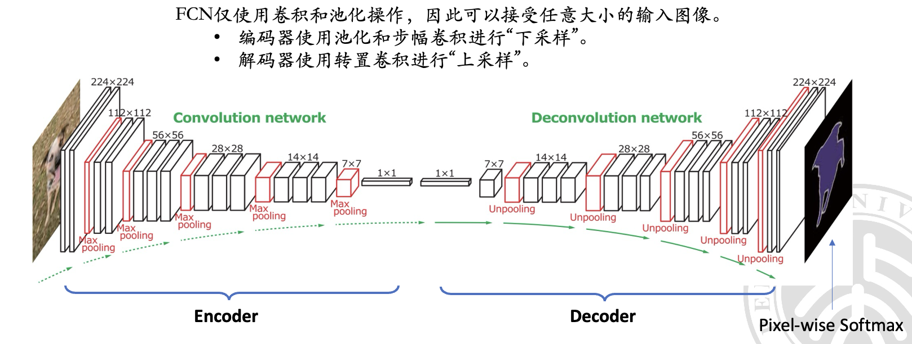

FCN 的计算步骤可以分为以下几个部分：

1. Encoder：在这一部分，输入的图像通过多次卷积和池化操作来减少特征图的大小。这一过程也称为 “下采样”，因为特征图的尺寸被不断缩小。
2. 1x1 卷积层：在 Encoder 的最后一层添加 1x1 的卷积层，它的作用是 **将原始图像的每个像素与分类标签进行关联**。这一层的输出是一个 **具有类别数量的通道数** 的特征图。注意这里说的不是最后的输出尺寸是 1x1，而是用了一个 1x1 的 point-wise 的卷积核，使得通道维度上完成了一个输入到输出类别数的转换。后续我们上采样的过程中，不会再在通道上进行数量的改变了？
3. Decoder：在这一部分，使用转置卷积将特征图的大小逐渐恢复到原始图像的大小。这一过程也称为 “上采样”，因为特征图的尺寸被逐渐增加。
4. Skip Connection（跳跃连接）：由于上采样过程会损失位置信息，因此需要将 Encoder 的一些特征图与 Decoder 进行连接，以帮助保留更多位置信息。这些连接称为跳跃连接。
5. Pixel-wise Softmax：在输出层，将每个像素的类别得分转换为概率，这可以通过 Softmax 操作来实现。输出的每个像素将被分配到概率最高的类别中。

#### 跳跃连接（Skip Connection）

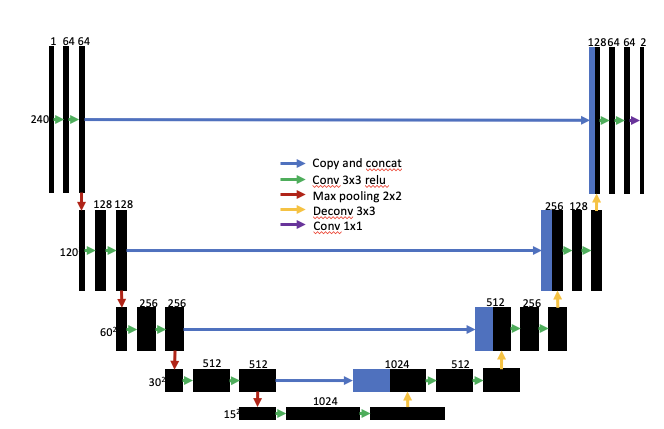

在编码过程中，随着层数的增加，我们可以得到更高级别的特征（都卷到特征图里了），但会失去低级别的特征（比如边缘信息）。

观察这个配图，你会发现，他最后都卷成一个 1024x1x1 的输出了，从这种级别的高级特征中，你怎么还原原始图像？根本就是 1024 个实数，据此来恢复原始图像，不是不可能，但是效果肯定不会很好 / 很稳定。

因而，我们设计了跳跃连接，在神经网络中，将某些层的输出连接到距其较远的层的输入处，以便更好地保留底层细节信息。可以理解为，我们把之前的特征图那拿出来，拼接到上采样得出的特征图中，辅助我们的解码器更好地恢复原始图像。

FCN 中的跳跃连接实现方式是在解码器的每一层都会将该层的特征图与其（尺寸上）对应的编码器层的特征图 **进行通道上的拼接**，以保留低层特征图中的细节信息。

跳跃连接就类似于你在一个地方看到了一个东西，然后你走了很远，但是你还记得那个东西。

简而言之：跳跃连接能够增强对细节信息的识别。

### SegNet 语义分割网络

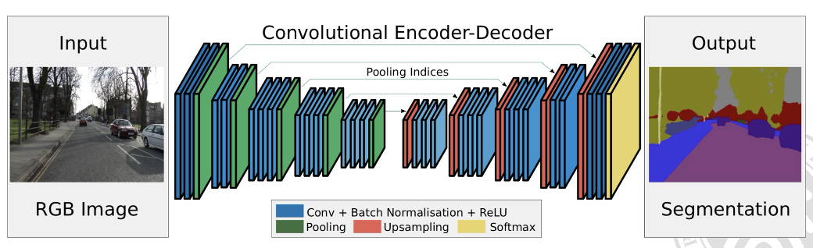

SegNet 是一种用于图像的语义分割任务的深度学习网络。与 FCN（全卷积网络）类似，SegNet 通过创新性技术提升了分割的准确性和效率。

#### 主要特点

1. **反卷积网络（Deconvolutional Network）**:

    - SegNet 使用反卷积网络进行上采样，恢复从下采样（池化操作）中失去的高分辨率特征图。
    - 反卷积有助于减少上采样过程中产生的伪影，即图像中不真实的模式或结构。

2. **跳跃连接（Skip Connection）**:
    - 类似于 FCN，SegNet 也采用了 **跳跃连接** 技术，用以保留低层次的细节特征。
    - 在 SegNet 中，这些连接 **将编码器的每个池化层的最大池化索引传递给对应的解码器层**。
    - 这使得解码器能够利用具体的最大池化位置信息进行更精确的上采样，有助于提高分割的准确性。

注意这里，FCN 和 SegNet 都使用了跳跃连接，但是：

-   FCN 中的跳跃连接是将编码器阶段的特征图直接与解码器阶段的特征图相加或拼接，以保留低级特征信息
-   SegNet 的跳跃连接则是传递编码器池化层的最大池化索引到解码器，用于在上采样过程中恢复特征图的位置信息，而非不是直接传递特征图本身。

### PSPNet (Pyramid Scene Parsing Network) 金字塔空间池化网络

PSPNet 的计算步骤可以概括为以下几个部分：

1. 特征提取：输入的图像首先通过 CNN 网络提取特征。
2. 金字塔池化层（Pyramid Pooling）：对提取的特征图进行不同区域的池化操作，提取不同尺度的特征。
3. 特征融合：将不同尺度的特征图进行合并，得到一个综合了全局信息和多尺度信息的特征图。
4. 上采样：通过反卷积操作将特征图的尺寸恢复到与输入图像相同的分辨率。
5. 预测：上采样后的特征图通过卷积层，输出最终的像素级预测结果。

#### 优势

-   利用全局上下文信息：金字塔池化层能够捕获从局部到全局的不同尺度特征，增强对图像整体语义的理解。
-   **多尺度特征融合**：PSP-Net 使用了金字塔池化来 **捕捉不同尺度的信息**，并将这些信息融合在一起。
-   参数量减少：通过金字塔池化，PSP-Net 可以将图像在不同尺度下的特征融合在一起，从而减少了需要训练的参数量。

### 图像分割的指标

像素级交叉熵（Pixel-wise cross entropy）和 Dice 系数（Dice coefficient）。

1. **像素级交叉熵**：逐像素比较预测值和实际值来计算损失，也即将每个像素看作一个单独的标签进行分类。

    缺点：**面积较大的物体对损失的权重较大**，导致对于分割小物体的性能较差。

2. **Dice 系数**：解决了像素交叉熵中不平衡的问题，可以看着是可求导的 IoU
    $$
        \text{Dice} = \frac{2|A \cap B|}{|A| + |B|}
    $$

其中，$A$ 代表模型预测出来的结果集合，而 $B$ 代表真实情况的结果集合。在图像分割的场景中，这通常指的是某个特定类别（如病变区域）的像素集合。简而言之，$A$ 是模型认为的目标区域，$B$ 是实际的目标区域。

通过比较这两个集合的交集与各自的大小，Dice 系数给出了模型预测精度的评估。$|A \cap B|$ 表示两个集合的交集大小，$|A|$ 和 $|B|$ 分别表示两个集合的大小。Dice 系数的取值范围是 0 到 1，值为 1 时表示完全相同，为 0 时表示完全不同。

在图像分割中，$A$ 和 $B$​​ 可以理解为分别是预测结果和实际标签的集合，这个系数也可以用真阳性（TP），假阳性（FP）和假阴性（FN）来表达：

> 尽管就在上文，但还是在此再次注解一下：
>
> -   **真阳性 (True Positive, TP)** ：预测为正类且实际上是正类的样本。
> -   **假阳性 (False Positive, FP)** ：预测为正类但实际上是负类的样本。
> -   **真阴性 (True Negative, TN)** ：预测为负类且实际上是负类的样本。
> -   **假阴性 (False Negative, FN)** ：预测为负类但实际上是正类的样本。

$$
    \text{Dice} = \frac{2TP}{2TP + FP + FN}
$$

特别地，当所有值都为 0 和 1 时，公式可以简化为：

$$
    \text{Dice} = \frac{2|A \cdot B|}{|A| + |B|}
$$

这里的 $\cdot$ 表示向量或矩阵的点乘操作。

## 实例分割（Instance Segmentation）

实例分割（Instance Segmentation）是一种精细的图像分割任务，旨在对图像中的每个对象实例进行分类和像素级定位。这一任务结合了对象分类（Object Classification）、对象检测（Object Detection）和语义分割（Semantic Segmentation），因为它需要同时识别图像中的每个物体、确定它们的边界并将它们从像素层面区分开来。

### Mask R-CNN

Mask R-CNN 是一个基于 Faster R-CNN 的实例分割算法，由 Kaiming He、Georgia Gkioxari、Piotr Dollar 和 Ross Girshick 在 2017 年提出。

与 Faster R-CNN 相同，Mask R-CNN 包含两个阶段：region proposal 和 ROI (Region of Interest) pooling。Mask R-CNN 的不同之处在于新增了一个分支，用于预测每个 ROI 中每个像素的类别信息，实现实例分割。

Mask R-CNN 的计算步骤如下：

1. 使用 ResNet 等网络结构提取输入图像的特征图。
2. 利用特征图进行 Region Proposal，得到可能包含目标的 ROI。
3. 对每个 ROI 进行 ROI Pooling 操作，将不同尺寸的 ROI 对齐到相同的大小。
4. 分别对每个 ROI 进行分类和位置回归。
5. 利用第 4 步得到的每个 ROI 的类别信息和位置信息，**对 ROI 内的每个像素进行语义分割**，从而得到实例分割结果。

### 图像分割的处理技巧

#### 镜像填充（Mirror Padding）

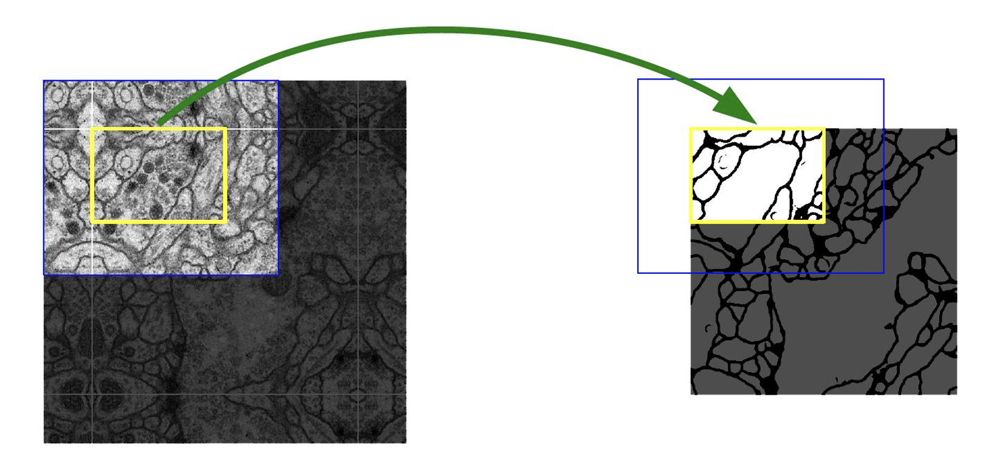

避免在边界上丢失信息，通过镜像填充可以在图像的边界上填充一圈镜像像素，从而扩大图像的尺寸，使得卷积核在边界处也能够正常工作（而不是卷了空填充的 0）。

#### 损失加权（Loss Weighting）

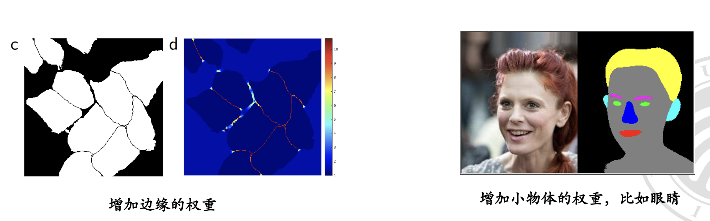

在训练过程中，可以为不同的像素分配不同的损失权重，以便更好地处理类别不平衡问题。例如，对于一些重要的像素，可以分配更高的权重，以便模型更加关注这些像素。

举个例子，如果你在做一个分类任务，其中一类数据的出现频率很低，但是这类数据非常重要，你可以给这类数据更大的损失权重，确保模型在训练时能更多地关注它们。

-   边缘加权：增加边缘的权重，使得损失对边缘更敏感。
-   平衡加权：根据小物体的大小增加其权重，以平衡大物体和小物体的权重。

## 人脸识别（Face Recognition）

人脸识别是一种通过分析人脸特征来识别个人身份的技术。它主要包括以下步骤：

1. **人脸检测**：在图像中找到人脸的位置。
2. **人脸对齐**：调整人脸的位置和角度，使得所有人脸数据保持一致的格式。
3. **人脸识别**：利用深度学习模型提取人脸特征并进行身份识别。

人脸识别任务可以分为两类：

1. **人脸识别**：确定一张图片中的人脸是数据库中的哪一个人。这通常是多分类问题，也即给定一张图像，将其与已知的人脸库进行比较，从而确定图像中人脸对应的身份标识（ID）。
2. **人脸验证**：确认两张图片是否是同一个人。通常是二分类问题，即判断两张图片是否属于同一个人。而不需要知道其身份标识。

根据数据集的不同，人脸识别可以分为：

-   **Close-set Face ID**：被识别的人脸在训练集中，类似于一般的分类问题。
-   **Open-set Face ID**：被识别的人脸不在训练集中。

最常用的方法是开放式人脸识别，也就是 Open-set Face ID：

-   模型是固定的，我们无法重新训练模型。
-   在添加新人（如果相似度检查没超过阈值）时，使用单张图像作为参考。

### Open-set Face ID 开放集人脸识别

对于 Open-set Face ID，我们通常事先训练一个图像编码器，用来从图像中提取特征向量（Discriminative Features Vector）。

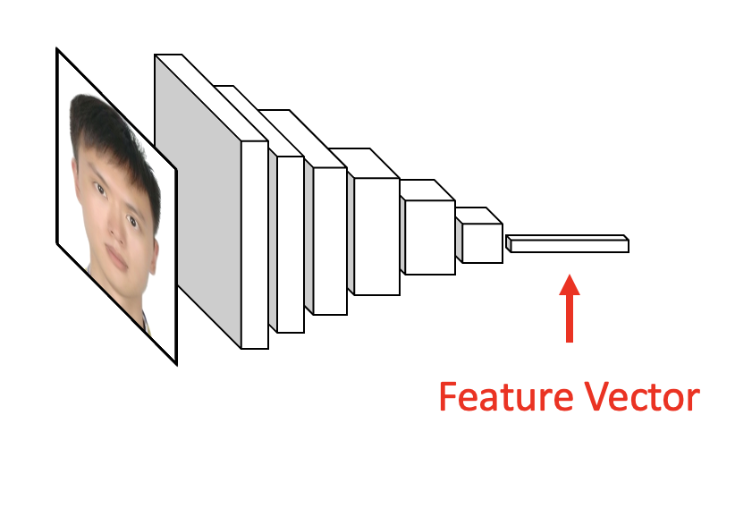

不同人的特征向量差异较大，然而，即使在不同光照下，同一个人的特征向量也很相似。

通过比较待查询特征向量与数据库中已知特征向量的距离，我们可以找到人脸的身份 ID。

### Close-set v.s. Open-set

**Close-set Face Identification** 和 **Close-set Face Verification** 是简单的分类问题，前者输出图像的类别标签，后者输出两个图像的类别标签并比较是否相同。

**Open-set Face Identification** 和 **Open-set Face Verification** 则是特征提取问题，前者在输入图像时寻找最佳匹配的特征向量 ID，后者计算两个图像的特征向量相似度。如果相似度分数高于阈值，则这两个图像是同一个人。

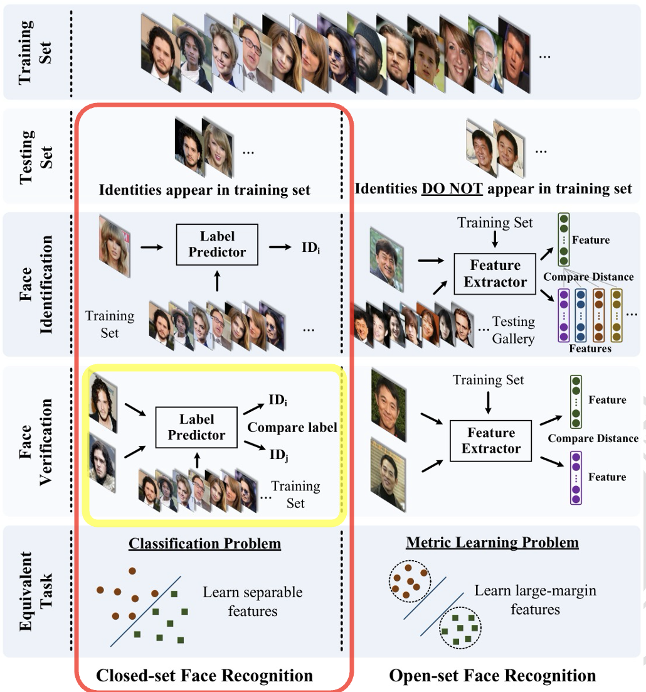

优化思路：设计新的网络架构或损失函数，并通过监督学习学习区分性强的特征空间。

**特征空间**：指的是能够代表数据特征的多维空间。例如，在人脸识别中，特征空间可能由人脸的关键点位置、颜色、纹理等组成。

注意，大图像尺寸虽然能提高准确性，但计算成本也更高。

研究者们还在努力寻找新的损失函数，如 L-Softmax、SphereFace、ArcFace 等，以更好地训练模型。

**轻量级人脸识别算法**：如 MobileFaceNet，结合了 MobileNetV2 和 ArcFace 损失函数，可以在计算资源有限的设备上快速提取特征向量，适合手机、门禁等场景。

## 姿态估计（Pose Estimation）

姿态估计是一种计算机视觉技术，用于确定人体各部位在图像或视频中的位置和方向。

### 姿态估计流程

姿态估计有两种主要流程 / 方法：自顶向下和自底向上。

#### 自顶向下方法

-   **流程**：
    1. 对图像中的每个人进行检测，得到位置和边界框。
    2. 对每个检测到的人使用姿态估计算法，从边界框中提取姿态信息。
-   **优点**：如果目标检测准确，姿态估计也会准确。
-   **缺点**：
    -   如果目标检测失败，无法估计姿态。
    -   推理时间随人数增加。
    -   复杂场景和多人姿态估计可能出错。

#### 自底向上方法

-   **流程**：首先检测所有关键点，然后将这些关键点分配给不同的人。
-   **优点**：推理时间固定。
-   **缺点**：难以将关键点正确分配给不同的人。

### 姿态估计算法：Convolutional Pose Machine (CPM)

步骤：

1. 使用目标检测找到人的边界框。
2. 将图像输入到 VGG 网络获取特征。
3. 特征输入到第 1 阶段 CNN，获取关键点热图。
4. 关键点热图和特征输入到下一阶段 CNN，获得更好的关键点估计。

> 关键点估计：确定人体的重要部位（如头、肩膀、肘部、手、膝盖等）在图像中的确切位置。

CPM 模型由多个阶段组成，每个阶段利用先前阶段的输出作为输入，**逐渐精细化预测结果**，每个阶段都会提取特征并生成热图来预测关键点的位置。它将人体关键点检测问题转化为一个 **回归问题**。

如图，在这个图中，展示了一个 Skip-link 操作，观察 (d) 中，我们发现他把上一层卷出来的关键点热图 $x$ 与另外一个卷积过程中卷出来的特征图 $x'$（设计相近，卷积出来的尺寸应该也相同）拼在了一起，然后继续卷积。

#### 多阶段方法的优势

-   **较大的感受野**：可以处理关键点之间的长距离依赖关系（图像中远距离的点之间的相互作用或关联）。
-   **精细调整关键点估计**：每个阶段都细化关键点位置，使最终估计更准确。

### OpenPose = CPM + Bottom-up

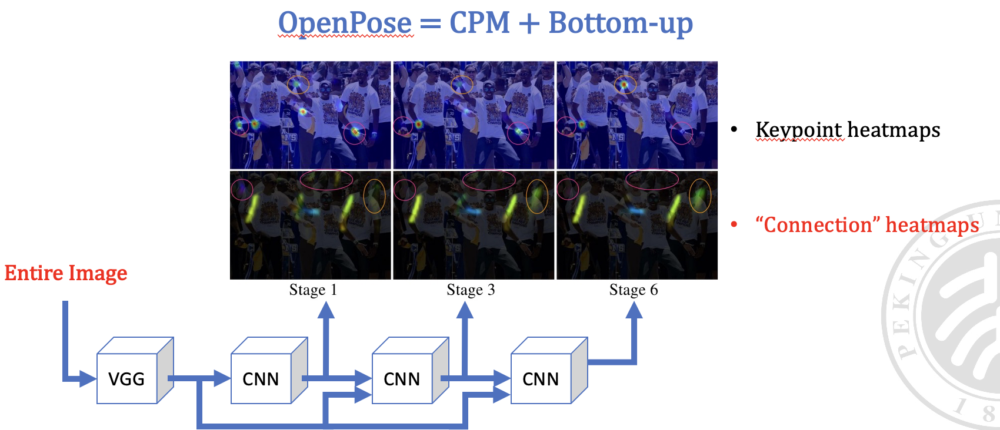

OpenPose 是一种先进的多人姿态估计算法，它通过结合两种方法 — 自下而上的检测（Bottom-up）和自上而下的验证（CPM, Convolutional Pose Machines）— 来实现对图像中多个人体姿态的准确识别。

-   **关键点热图（Keypoint Heatmaps）**: 每个像素表示与某个特定关键点的相关度，通过高斯分布在关键点的位置生成二维热图。（也即配图中的上面的三张图）

-   **连接热图（Connection Heatmaps）**: 表示两个关键点之间是否存在连接的热图。如果两个关键点是连接的，相应位置的热图值会很高。这些热图由两个方向生成，一个是从父关键点到子关键点的热图，另一个是从子关键点到父关键点的热图。（也即配图中的下面的三张图）

-   **Part Affinity Fields（PAF）**: 一组二元向量场，每个向量表示两个关键点之间的连线方向和置信度，其方向指向第二个关键点的位置，其大小表示两个关键点之间的置信度。用于检测不同关键点之间的关联关系（联想一下你学过的梯度场）。

    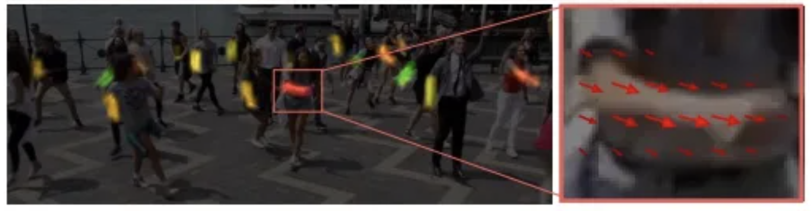

#### 算法流程

1. **自下而上检测**: OpenPose 首先使用多尺度滑动窗口来 **检测图像中的所有人体关键点**，并为每个关键点生成信任度图。然后，它利用 Part Affinity Fields 技术来检测不同关键点之间的关联关系。

2. **自上而下验证**: 对初步检测的结果进行分组，以区分不同的人体。OpenPose 使用 PAF 来建立不同身体部位之间的关联关系，并通过卷积神经网络预测生成包含身体部位连接信息的 2D 向量场。这些向量场用于创建关联图（Association Graph），每个人体部位对应图中的一个节点，节点之间的连接表示不同身体部位之间的亲和性关系，从而准确识别每个人体的姿态。

    在关联图中，每个人体部位对应于一个节点，不同节点之间的连接表示不同身体部位之间的亲和性关系。通过将关键点节点和 PAF 边缘连接，OpenPose 可以准确地识别每个人体的姿态。

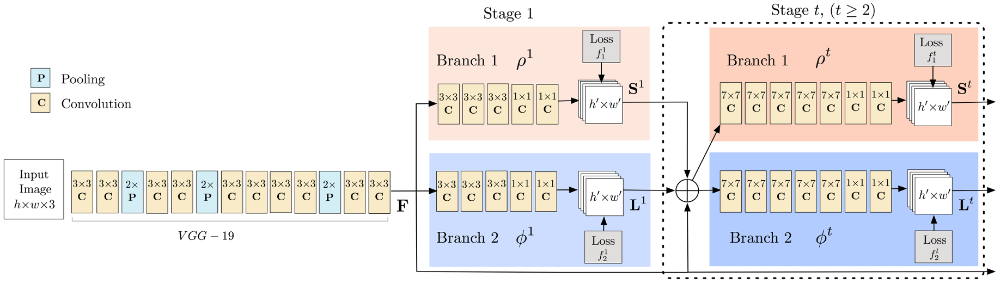

这张图的简要解释：

1. **输入**: 图像输入到网络中，大小为 $h \times w \times 3$，其中 $h$ 和 $w$ 分别是图像的高度和宽度，3 代表 RGB 三个颜色通道。

2. **VGG-19**: 这是一个预训练的卷积神经网络，用于提取图像特征。网络由多个卷积层（C）和池化层（P）组成。卷积层用于提取图像中的空间特征，池化层用于减少特征图的维度。

3. **Stage 1**: 第一阶段由两个分支组成：

    - **Branch 1** 生成关键点热图 $S^1$，用于预测图像中每个关键点的位置。
    - **Branch 2** 生成 Part Affinity Fields $L^1$，用于表示关键点之间的连接关系。

    每个分支的输出都通过损失函数（Loss）进行评估，以训练网络提高预测的准确性。

4. **Stage t**: 第 $t$ 阶段（$t \geq 2$）是网络的后续迭代，每个阶段都会细化前一个阶段的预测结果：

    - **Branch 1** 继续生成更精细的关键点热图 $S^t$。
    - **Branch 2** 继续生成更精细的 Part Affinity Fields $L^t$。

    同样，每个阶段的输出都有相应的损失函数进行评估。

5. **损失函数**: 每个阶段的输出都通过损失函数 $f_1$ 和 $f_2$ 计算与真实值之间的差异，用于指导网络训练。

由此可见，OpenPose 的网络结构是一个多阶段的迭代过程，每个阶段都在前一个阶段的基础上进一步提高关键点和连接关系预测的准确性。

通过这种结合自下而上和自上而下的方法，OpenPose 能够高效准确地在图像中识别并估计多人的姿态。

### 姿态估计算法：Pose Proposal Networks, PPN

PPN（Pose Proposal Networks）是一种基于 YOLO（You Only Look Once）和 OpenPose 的快速人体姿态估计方法。

**它将姿态估计问题看作目标检测问题，避免了 OpenPose 中逐像素分析热图的繁琐过程。**

#### 相较于 OpenPose 的改进

OpenPose 需要使用 CPU 对每个像素点进行处理来找出关键点和它们的连接，这个过程比较慢，也没有很好地利用硬件资源。PPN 通过将姿态估计当作目标检测来处理，提高了效率。

### PPN 流程

PPN 的处理流程包括两个阶段：

1. **提议生成阶段**：使用类似 Faster R-CNN 的方法生成人体可能位置的候选姿态框，但与 Faster R-CNN 不同，PPN 在生成的框中加入了姿态分支，用于估计人的姿态。

2. **姿态估计阶段**：采用堆叠沙漏网络（Stacked Hourglass Network），通过自下而上和自上而下的处理方式，逐步提高姿态估计的准确度。

可以看到，每个身体的连接是由两个关键点组成的。

-   **OpenPose** 负责估计关键点（红色点）和它们之间的连接（蓝色线）。
-   **PPN** 则是估计人体的边界框（绿色框），并使用贪婪算法将这些框连接起来，形成完整的人体姿态。

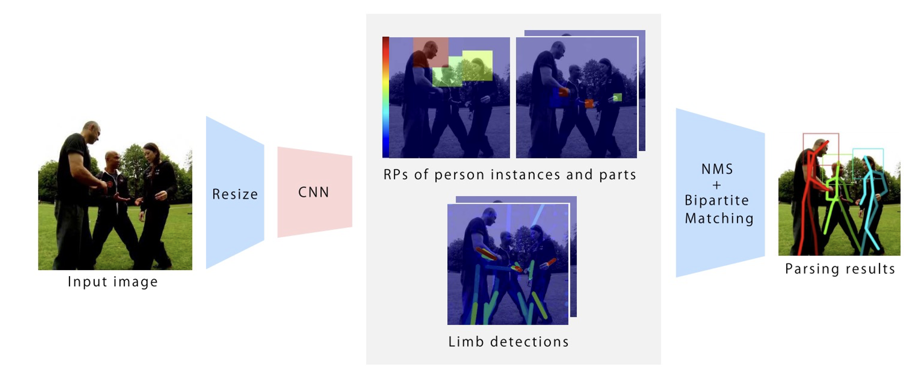

这张图展示了 PPN（Pose Proposal Networks）处理一张输入图片并估计人体姿态的流程。我们可以将这个过程分解为以下几个步骤：

1. **输入图像**: 最初，我们有一张包含一个或多个人物的图片。

2. **调整大小和 CNN 处理**: 这张图像首先被调整大小（Resize），以适应卷积神经网络（CNN）的输入要求。然后，CNN 对图像进行处理，提取特征。

3. **RP（姿态提议）生成**: CNN 处理后，我们得到了人物实例和各个部位的姿态提议（RPs of person instances and parts）。这里显示的是人体的不同部位，比如手臂或腿（Limb detections）。

4. **NMS 和双边匹配**: 最后，使用非极大值抑制（NMS）和双边匹配（Bipartite Matching）技术来去除重叠的提议，并将正确的部位连接起来，得到最终的姿态解析结果（Parsing results）。

在最终结果中，我们可以看到不同颜色的边界框代表不同的人物，而彩色的线条表示人体的各个部位。这样，PPN 就可以快速而准确地估计出图片中每个人的姿态。

#### PPN 的局限性

-   在人群密集的场景下，PPN 的表现可能不佳。
-   对于人物大小差异较大的场景，PPN 的性能也可能较差。

## 其他应用

### 人员重识别 Person Re-identification（ReID）

在不同摄像头中追踪同一人。

### 人物属性分类 Person Attribute Classification

通过对人物的外观、行为等特征进行分析和分类，从而对人物进行描述和识别的技术。通常涉及到对人物的性别、年龄、服装、发型等属性进行识别和分类，以帮助进行人物检索、面部识别、安防监控等应用。

### 深度估计 Depth Estimation

深度估计任务是指从单张 RGB 图像中估计出场景中每个像素点到相机的距离，也称为深度图预测。它是 **典型的生成式任务，而不是之前的判别式任务**。

深度估计任务的挑战在于，由于缺乏深度信息，单张 RGB 图像并不能提供完整的三维场景信息，因此需要通过学习从 RGB 图像到深度图的映射来解决这一问题。

同时，深度估计任务还需要考虑到不同场景和物体的差异性，因此需要具备一定的通用性和泛化性能。

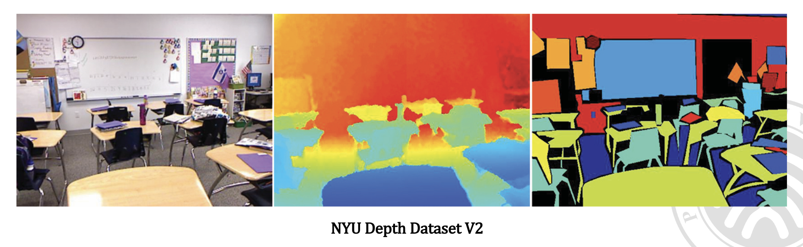

### 风格迁移 Style Transfer

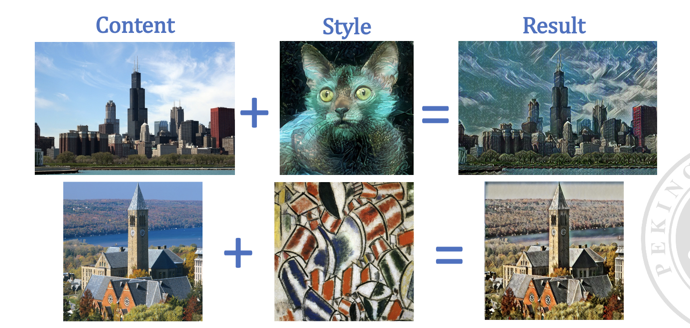

### 超分辨率 Super Resolution

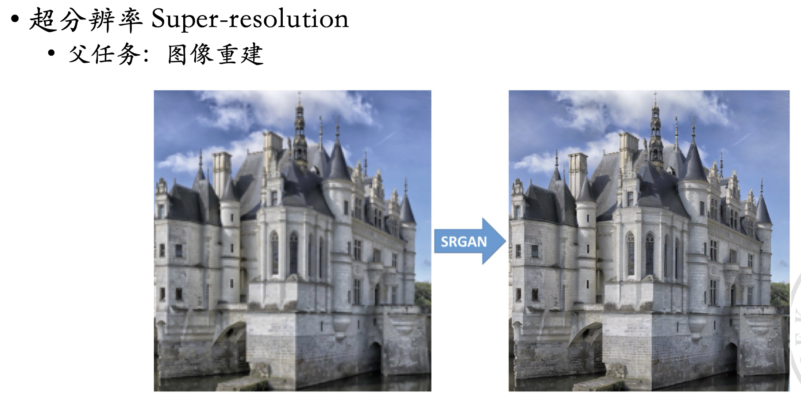

超分辨率网络接收一个低分辨率图像作为输入，并输出一个高分辨率的图像。

其中，神经网络的训练数据通常是一些低分辨率图像和对应的高分辨率图像对。

它的父任务是图像重建，除了提升分辨率还有去噪、去模糊等。

### 图像到图像的翻译 Image-to-image Translation

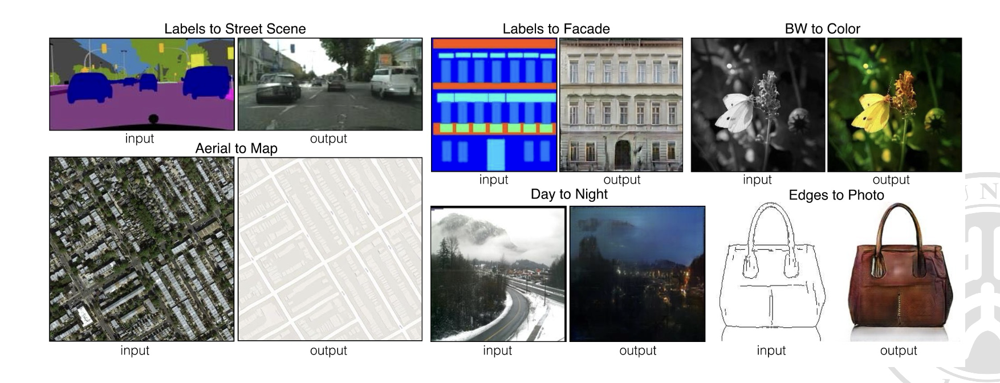

图像到图像的翻译是指将一个视觉域中的图像映射到另一个视觉域中的图像的任务，例如将素描风格的图像转换为真实世界的照片，将低分辨率的图像转换为高分辨率的图像，将夏季景色照片转换为冬季景色照片等。

目前，图像到图像的翻译技术主流算法包括基于 GAN 的方法、基于 CycleGAN 的方法、基于 Pix2Pix 的方法等。

这些方法通常使用卷积神经网络来实现图像转换，其中生成器网络负责将输入图像转换为目标图像，判别器网络则负责判别生成的图像是否与真实图像相似。

同时，采用了不同的损失函数来衡量生成的图像与真实图像之间的差异，以进一步提高翻译质量。

### 无监督 / 非对称的图像翻译

无监督 / 非对称的图像翻译（Unsupervised/Unpaired Image-to-image Translation）：不需要成对的图像数据的情况下，将一个领域的图像转换成另一个领域的图像，同时保持图像的一些属性不变。

这个任务在图像处理、计算机视觉和计算机图形学领域中有很广泛的应用，例如风格转换、图像风格化、卡通化等。

传统的图像转换方法通常需要成对的图像数据，这对数据的收集和标注都有很高的要求。

而无监督 / 非对称的图像翻译则不需要成对数据，只需要两个领域的图像集合即可。其主要挑战在于如何保证转换的结果在两个领域之间是一致的，同时又能保持每个领域的独特特征。

主要用 GAN-based 方法，比如 CycleGAN、UNIT

### 语义图像生成 Semantic Image Synthesis

语义图像生成（Semantic Image Synthesis）是指将自然语言文本描述转换为与之对应的语义图像的任务。

该任务的目标是生成与文本描述相关的图像，使得生成的图像能够表达文本描述所描述的内容和场景。

## Credit

部分讲稿截图来自 [Stanford CS231n - 2023 Spring](https://cs231n.stanford.edu/schedule.html)，不过他们官网也正在同步授课，去年的版本被下架了，所以无法提供直接的 Slide 引用链接。

[Frank Tian / 写给小白的 YOLO 介绍](https://zhuanlan.zhihu.com/p/94986199)

[叶子 / RCNN、SPPnet、FastRCNN 原理概述](https://zhuanlan.zhihu.com/p/141957184)
