# 精选对抗神经网络

  by <a href="https://github.com/zhuozhiyongde">Arthals</a>
   
  blog: <a href="https://arthals.ink">Arthals' ink</a>

本节中，将主要介绍一下几种 GAN 的变体，介绍他们相较于 Vanilla GAN 的改进。

## 条件对抗神经网络（Conditional GAN, cGAN）

条件对抗神经网络是对抗神经网络（GAN）的一种扩展，它通过 **引入额外的条件信息**，控制生成内容。这种方法能够解决多模态问题，即对于同一个条件，存在多种可能的输出。

最经典的一个生成任务就是，输入希望生成的图像类别标签，然后根据这个标签来生成图像，比如控制生成花、生成鸟、或者别的东西。

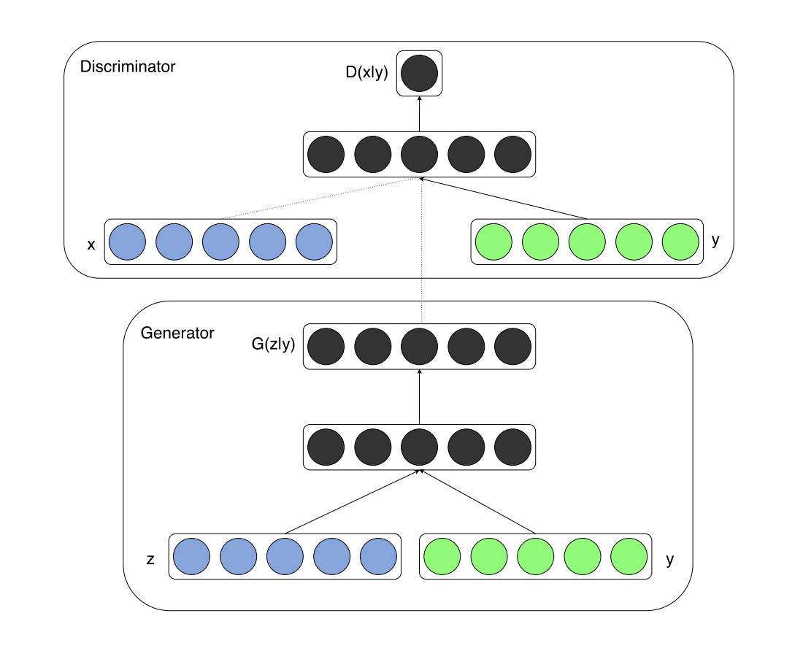

### 损失函数

cGAN 的损失函数如下。

#### 判别器损失 $\mathcal{L}_D$

$$
\begin{aligned}
\mathcal{L}_D =& -\mathbb{E}_{x \sim p_{\text{data}}}[\log D_x(x)] - \mathbb{E}_{z \sim p_z, c \sim p_c}[\log(1 - D_x(G(z, c)))] \\&- \mathbb{E}_{x \sim p_{\text{data}}}[\log D_c(x)] - \mathbb{E}_{z \sim p_z, c \sim p_c}[\log(1 - D_c(G(z, c)))]
\end{aligned}
$$

这个公式包含了两部分，第一部分是让判别器学会区分真假图像的能力，第二部分是让判别器学会正确识别图像类别的能力。

其中：

-   $p_{\text{data}}$ 是真实图像数据的分布
-   $c$ 是输入的条件标签
-   $p_z$ 是随机噪声的分布
-   $p_c$ 是条件标签的分布，指的是对于所有可能的标签 $c$，它们在数据集中出现的频率分布
-   $D_x$ 是判别器对图像真伪的判断
-   $D_c$ 是判别器对图像类别的判断
-   $G(z, c)$ 是生成器根据噪声 $z$ 和条件 $c$ 生成的图像

这里条件标签的分布理解起来可能是一个比较抽象的概念。不同于之前的 one-hot 编码，条件标签的分布 $p_c$ 是一个概率分布，用来描述条件标签的相对频率。这个分布可以是均匀的，也可以是非均匀的，取决于你想要模型学习的条件标签的多样性。

为什么要这么做？比如你想生成的是猫的图像，那么 $c$ 就是 "猫" 这个类别的标签。在实际应用中，条件标签 $c$ 确实是一个确定的值。但在训练模型时，我们会从条件标签的分布 $p_c$ 中进行采样，这是因为我们希望模型能够在多种不同的条件下都能够生成图像，而不是仅仅针对一个固定的条件。

所以，即使条件标签是离散的，我们仍然可以通过概率分布来描述在训练过程中各个标签被选中的相对频率。这就是所谓的条件标签的分布 $p_c$。

#### 生成器损失 $\mathcal{L}_G$

$$
\begin{aligned}
\mathcal{L}_G =& -\mathbb{E}_{z \sim p_z, c \sim p_c}[\log D_x(G(z, c))] \\&- \mathbb{E}_{z \sim p_z, c \sim p_c}[\log D_c(G(z, c))]
\end{aligned}
$$

这个公式也包含两部分，第一部分是鼓励生成器生成让判别器认为是真的图像，第二部分是鼓励生成器生成的图像符合指定的类别标签。这里使用的是相同的符号含义，目的是最小化生成器的损失，即最大化判别器对生成图像的错误分类。

### cGAN 的应用

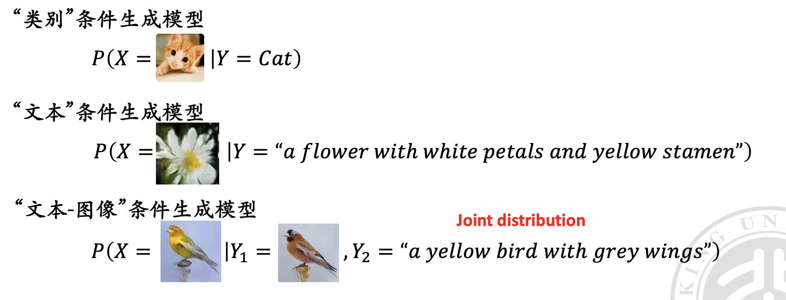

这里的 “条件” 可以是任何信息，如标签、描述、其他图片等，cGAN 利用这些信息来生成与条件相匹配的数据。

### 文本到图像的生成

在文本到图像的生成任务中，我们首先定义匹配的句子（matching text）和不匹配的句子（mismatching text）。如下图所示，每张图像都对应一些描述它的句子。

我们的目标是让 GAN 学会区分匹配和不匹配的 **文本 - 图像对**，并能够基于文本描述生成相应的图像。

这里的模型设计架构如下：

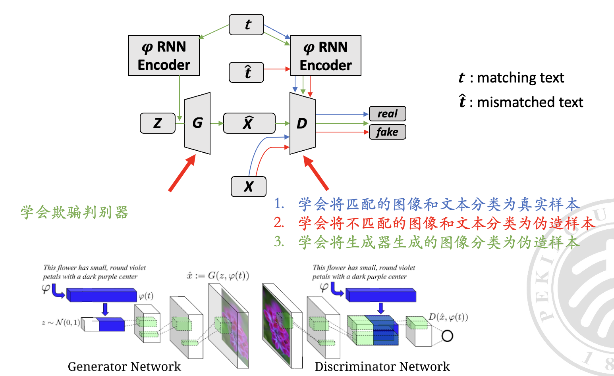

其中，不同颜色的线和注释代表不同的训练步骤。1、2 是判别器的任务，3 是生成器的任务。

## 寻找潜在表示

**寻找潜在表示 (Find Latent Representation)**：传统 GAN 只能从潜在空间 $Z$ 映射到数据空间 $X$，而没有从 $X$ 映射回 $Z$ 的能力。为了解决这个问题，我们可以通过优化方法或者学习一个编码器来找到潜在表示。

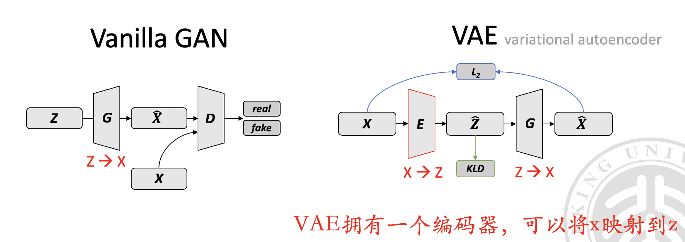

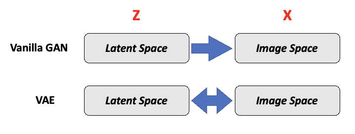

回想我们之前说的，VAE 拥有一个编码器，可以将 $X$ 映射到 $Z$，而 GAN 没有类似的能力。

为了使得 GAN 获得这样的编码器，我们可以设计如下两种方式来进行训练（但是他们都不是很好）。

### 基于优化的方法

-   利用已训练好的 GAN 生成器 $G$
-   通过优化隐空间向量 $Z$ 来生成与给定图像 $X$ 相似的图像，学习最好的 $Z$
-   优化目标：$\min_{Z} \|X - G(Z)\|_2^2$ （使用 L2 范数）

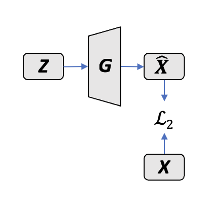

### 暴力法：真正的编码器

-   引入编码器 $E$，学习从图像 $X$ 到 $Z$ 的映射
-   生成器 $G$ 固定，通过编码器 $E$ 快速获取 $Z$
-   直接学习从图像到潜在空间

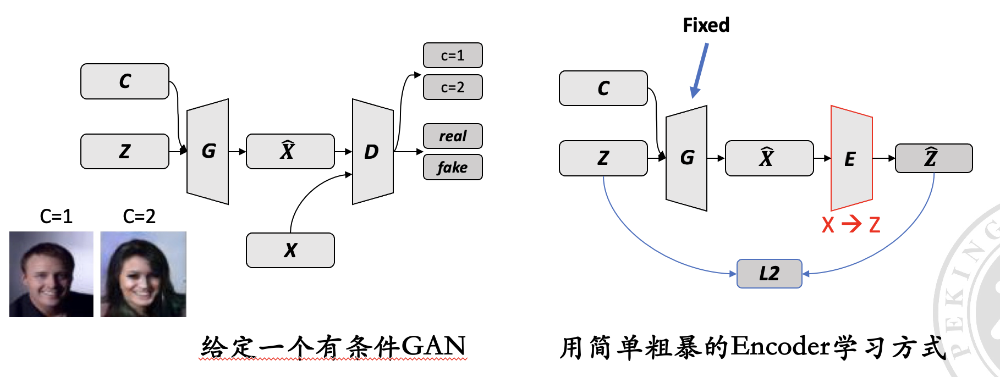

暴力法的缺点：编码器训练时没见过真图，而且生成器生成不了全部真实图像，会导致模式塌陷（Mode Collapse）。

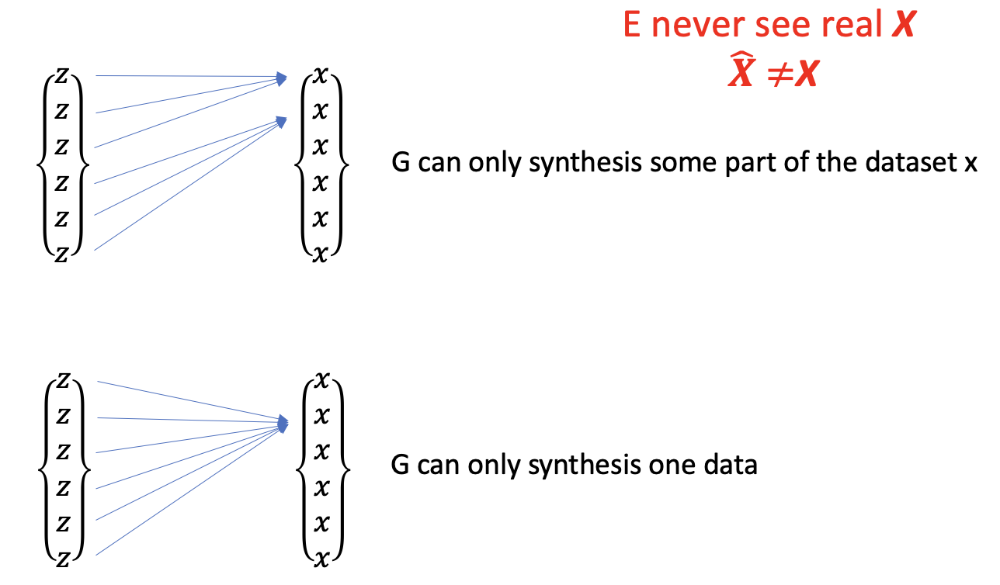

## 双向生成对抗网络（Bidirectional GAN，BiGAN）

双向生成对抗网络 BiGAN 引入了编码器，使得 GAN 不仅能从潜在空间到数据空间的映射，也能进行反向映射，即从数据空间映射回潜在空间。这使得 GAN 具备了特征编码的能力，增强了其应用范围。

### 训练过程

BiGAN 包括三个主要部分：生成器（G）、编码器（E）和判别器（D）。

-   **生成器（G）**：接收随机噪声 $Z$，输出生成的数据 $\hat{X}$。
-   **编码器（E）**：接收真实数据 $X$，输出编码表示 $\hat{Z}$。
-   **判别器（D）**：用来判断输入是来自生成器的输出还是编码器的输出。

#### 训练过程

1. **训练生成器**：输入随机噪声 $Z$ 到生成器，生成 $\hat{X}$；同时把 $Z$ 和 $\hat{X}$ 一起给判别器。
2. **训练编码器**：输入真实数据 $X$ 到编码器，生成 $\hat{Z}$；同时把 $X$ 和 $\hat{Z}$ 一起给判别器。
3. **判别器的目标**：减小生成器和编码器输出的联合分布之间的差异。

#### 数学表达

-   联合分布 $p_G(\hat{X}, Z)$ 代表生成器的输出，可分解为 $p_G(X|Z)p(Z)$。
-   联合分布 $p_E(X, \hat{Z})$ 代表编码器的输出，可分解为 $p_E(Z|X)p(X)$。
-   训练目标：**最小化生成器和编码器输出的联合分布之间的差异**。

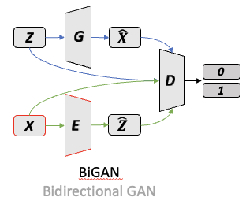

#### 最终目标

当生成器和编码器达到最优时，编码器将成为生成器的逆函数，即 $E=G^{-1}$。此时，$G(E(X))=X$ 和 $E(G(z))=Z$。

## 协同生成对抗网络（Cooperative GAN，CoGAN）

CoGAN 可以学习两个（语义相似）领域的联合分布 $p(X_A, X_B)$，并且能够同时生成两个领域的数据。两个领域的数据没有已知的映射关系。

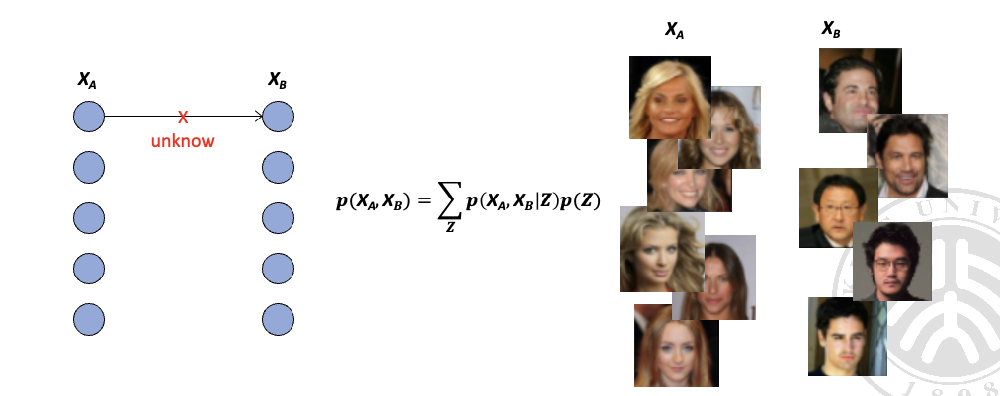

CoGAN 的目标：

-   让 $G_A$ 和 $G_B$ 生成尽可能真实的数据，以欺骗对应的判别网络 $D_A$ 和 $D_B$。
-   让 $D_A$ 和 $D_B$ 能够区分真实数据与生成的数据。
-   通过 **共享权重** 使得 $G_A$ 和 $G_B$ 生成的数据有相似的特征。

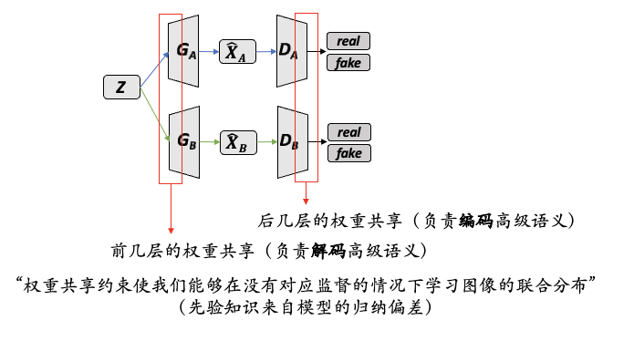

CoGAN 通过 **共享权重机制使得两个生成网络可以生成具有相似性质的数据**，而不需要为每个数据集训练独立的模型。

主要应用：Unpaired Image-to-Image Translation（无配对图像到图像的转换）。

## 循环生成对抗网络（CycleGAN）

CycleGAN 是一种能够在两个不同领域之间进行图像转换的模型，即使这两个领域的图像没有一一对应的关系（没有已知的映射关系）

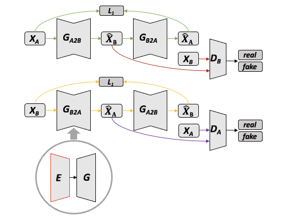

CycleGAN 的核心思想是：

-   使用两组生成网络和判别网络，分别记为 $G_{AB}$ 和 $G_{BA}$，以及 $D_A$ 和 $D_B$。
-   $G_{AB}$ 负责将领域 A 的图像转换成领域 B 的风格，而 $G_{BA}$ 则相反。
-   $D_A$ 和 $D_B$ 分别尝试区分自己领域中真实图像和生成的图像。

回顾一下，BiGAN（双向生成对抗网络）的对抗损失确实可以使得转换后的图像在新的领域中看起来真实，但是这种方法并没有直接的机制来确保转换过程中保留原图的关键信息。换句话说，虽然生成的图像可能会欺骗判别器，使其认为图像属于目标领域，但这并不保证原始图像的结构和内容在转换后依然完整。

为了保持图像内容的一致性，CycleGAN 引入了 **循环一致性损失（cycle consistency loss）**，确保图像在经过两次转换（A 到 B，再 B 则 A）后，仍能回到原始状态（能够重构出原始图像）。这样就能够确保在图像风格转换的过程中，图像的内容得到保留。

### CycleGAN 的目标

-   让 $G_{AB}$ 和 $G_{BA}$ 生成的图像足够真实，以至于可以欺骗判别网络 $D_A$ 和 $D_B$。
-   让 $D_A$ 和 $D_B$ 能够有效地区分出真实图像和生成图像。
-   通过 **循环一致性损失**，确保图像在转换过程中保持内容不变。

主要应用：风格迁移、季节转换、照片增强等无配对图像到图像的转换任务。

### Cycle 的缺陷

CycleGAN 的目标是确保图像在经过一系列转换后，仍然能够保留足够的信息，以便可以恢复到原始状态。

但是，CycleGAN 在处理一些任务时存在缺陷，比如在 **改变图像中物体的形状或纹理时**，可能会损失一些信息，导致无法完美复原。例如，如果你尝试去除人头像中的眼睛，CycleGAN 可能就无法做到既去除眼睛又不损失其他重要信息。

CycleGAN、DualGAN、DiscoGAN 和 UNIT 都是基于相似原理的模型，它们都旨在通过学习转换图像的同时保留关键信息，使得图像能够在不同域之间转换。
