# 循环神经网络

  by <a href="https://github.com/zhuozhiyongde">Arthals</a> / GPT4 / Claude 3 Opus
   
  blog: <a href="https://arthals.ink">Arthals' ink</a>

## 缘起

-   多层感知器（MLP）和卷积神经网络（CNN）都属于前馈神经网络（Forward Neural Network，FNN），它们将一个数据样本作为输入，并输出一个结果，例如将图像输入并得到类标签。

-   对于 **时间序列（time-series）数据集**，如语言、视频和生物信号，这些数据集无法适应前馈神经网络的框架。

-   循环神经网络（RNN）是一种专为处理时间序列数据设计的深度学习架构。

## 词的表示

词的表示（Word Representation）：将词转换为计算机可以理解的形式的过程。

词的表示方法有以下几种：

### One-hot 编码

-   将每个词表示为一个向量，**向量的维度等于词汇表的大小**
-   大词汇量将导致 “维数灾难”
-   所有单词表示都是独立的！太稀疏了！

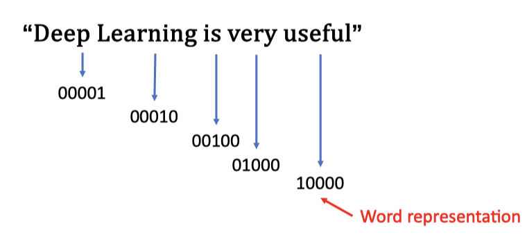

### 词袋模型（Bag of Words）

-   使用单词频率表示数据
-   大词汇量将导致 “维数灾难”
-   丢失了单词的顺序信息

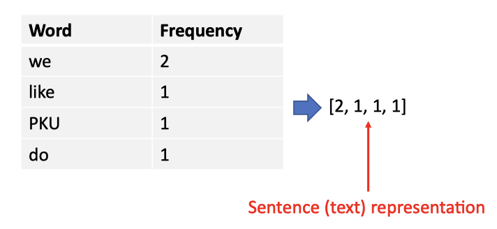

### 词嵌入（Word Embedding）

-   用一组浮点数向量来表示一个单词，也即将单词映射到一个连续的向量空间
-   词嵌入是一个 **密集的低维向量**，与 one-hot 编码的 **高维稀疏向量** 形成对比
-   词嵌入是通过训练得到的，可以学习到单词之间的语义关系

理想的词嵌入应该是：

-   语义相似的单词在向量空间中距离较近，不相似的单词距离较远
-   **特征向量维度低于词汇表大小**，可以减少维数灾难，可以理解为用高级特征表示单词
-   允许进行 **语义操作**，如向量相加和相减 `King − Man + Women = Queen`

    这代表词嵌入中的特征包含了诸如 “性别” 和 “位置” 等 **语义信息**。

#### 嵌入的直观理解

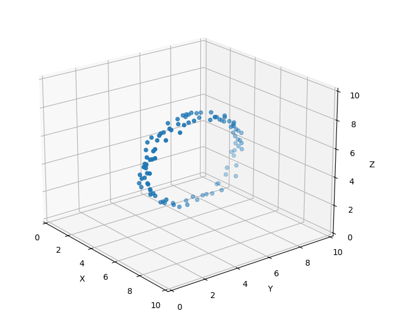

在这张我用 matplotlib 生成的三维图中，数据点的分布暗含一个特性：尽管数据点在三个维度（$x, y, z$）上都有展开，但其实它们形成了一个平面上的圆形。从图中可以观察到，$x$ 坐标的变化对数据点在空间中的位置没有影响，这表明 $x$ 维度是多余的。通过识别和移除这种多余的维度，我们能够把数据从一个三维空间转换到一个二维空间，也就是所谓的 **降维**。

在 AI 和机器学习中，这种 **从更高维度数据中提取本质特征并将其 “嵌入” 到低维空间的过程被称为 “嵌入”**。通过这个过程，我们能够发现并利用数据的内在结构，例如，在这张图片中，通过学习到数据呈圆形分布这一 **语义信息**，我们能找到一个更加简洁的表示形式，也就是一个只包含 $y$ 和 $z$ 的二维平面。

简而言之，你可以想象它是一种压缩和转换数据的方式，其不仅是嵌入数据到了在新的低维空间内，还能保留下来并抽象出数据的重要特性，而且还具有一些诸如相似者近、支持语义操作的特点。

#### 嵌入的学习

如何学习词嵌入：现有的算法通过阅读大量文本文档来学习词嵌入表，以发现其中的模式，这是一种自监督（self-supervised） 学习方法。

## Word2Vec

Word2Vec 是 Google 在 2013 年提出的一种词嵌入模型，它通过训练神经网络来学习单词的向量表示。

Word2Vec 有两种模型：Skip-gram 和 CBOW（Continuous Bag of Words）。

-   Skip-gram：通过一个词预测它周围的词（上下文），最大化正确的 **上下文词的预测概率**
-   CBOW：通过周围的词（上下文）预测一个中间的词，最大化正确的 **中间词的预测概率**

### 噪声对比估计 NCE（Noise Contrastive Estimation）

由于 Skip-Gram 有多个目标输出，所以使用 Sigmoid 函数而不是 Softmax。

词汇表中的每个单词都被分为 **正样本和负样本**，正样本是我们想要预测的单词，负样本是我们不想要预测的单词。我们希望模型能够区分正样本和负样本，并且我们独立地对每个单词进行分类。

> Softmax 函数通常用于多分类问题中，它会考虑所有可能的输出类别，并给出一个概率分布，这些概率加起来总和为 1。在词嵌入的场景下，如果使用 Softmax，你需要对词汇表中的每个词计算一个概率（也即存在依赖），**这在词汇表很大时会导致巨大的计算成本**。
>
> Sigmoid 函数则不同，它是用于二分类问题的，它会对每个输出给出一个独立的概率值，**这些概率值并不互相依赖**，也不需要加起来等于 1。在 Skip-Gram 模型中，由于我们使用负采样，每个训练样本只需要区分一个正样本和少数几个负样本，而不是词汇表中的所有词。因此，使用 Sigmoid 函数可以大大减少计算量，因为它只需要对选定的正样本和负样本进行计算。

尽管更换为 Sigmoid 函数，在大词汇表下，如果对每个词汇都计算，依旧会导致巨大的计算成本，所以我们使用负采样来加速损失函数的计算，从词汇表中随机采样 N 个负样本纳入计算。

于是我们得到了 NCE 损失函数：

$$
E=-(\sum_{i\in pos}\log(y_i)+\sum_{j\in neg}\log(-y_j))
$$

其中：

-   $y_i$ 是正样本的预测概率
-   $y_j$ 是负样本的预测概率
-   pos 是正样本的索引集合
-   neg 是负样本的索引集合，大小为随机采样的数量 N

## 序列数据

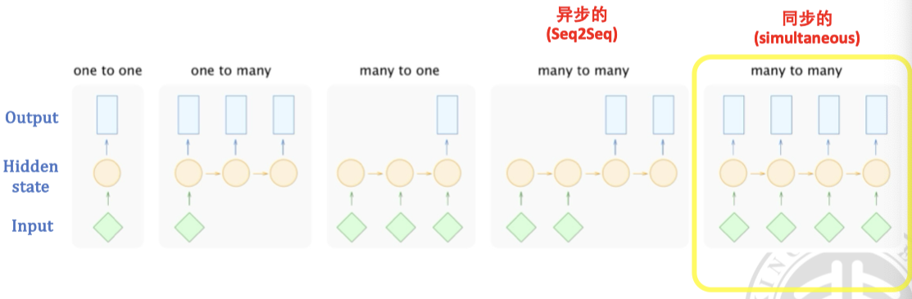

序列数据是一种特殊的数据类型，它的每个样本都是一个序列（图中的绿色菱形，横向多个代表他们的出现顺序），序列中的每个元素都有其特定的位置和顺序。这是以往的前馈神经网络无法处理的数据类型（他们只能处理 One-to-One）。

举例：

-   one-to-many：输入一张图片，输出一段描述
-   many-to-one：输入一段文本，输出一个情感标签
-   many-to-many & seq2seq/async：输入一段文本，输出翻译后的另一段文本
-   many-to-many & sync：输入一段音频，输出文本

为了处理序列数据，我们引入了循环神经网络（RNN），通过添加隐状态（hidden state）来保留、处理序列中的信息。

## 朴素循环神经网络（Vanilla Recurrent Neural Network，RNN）

RNN 是一种专为处理序列数据设计的神经网络，它的每个时间步都会接收一个输入和上一步输出的隐状态，输出一个新的隐状态。

RNN 在时间序列的每一个时间点上，都会有一个隐藏状态向量 $h_t$，它包含了到当前时间点为止的序列信息。

通过添加隐状态，我们得以将信息传递到未来。

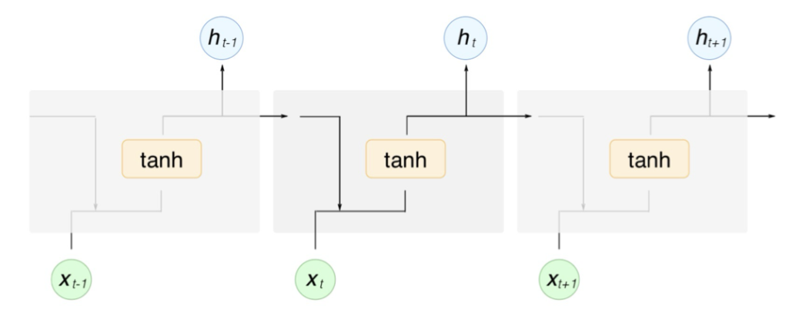

$$
\begin{array}{l}{{h_{t}=\tanh\left(W_{h}x_{t}+U_{h}h_{t-1}+b_{h}\right)}}\\{{y_{t}=\sigma_{y}(W_{y}h_{t}+b_{y})}}\end{array}
$$

其中：

-   $h_t$ 是时间步 $t$ 的隐状态
-   $x_t$ 是时间步 $t$ 的输入
-   $y_t$ 是时间步 $t$ 的输出
-   $W_h$、$U_h$、$b_h$ 是隐状态的参数
-   $W_y$、$b_y$ 是输出的参数
-   $\sigma_y$ 是输出的激活函数，$\sigma_h$ 就是 $\tanh$

局限性：隐状态的信息会随着时间步的增加而衰减（随着时间步的增加，$h_{t-1}$ 中包含的早期信息会逐渐被新的输入 $x_t$ 所稀释），这意味着 RNN 只能处理短序列，长序列的信息会被遗忘。也即很难维持较为长期的信息。

## 长短期记忆网络（Long Short-Term Memory，LSTM）

LSTM 是一种特殊的 RNN，它通过添加门控机制来控制信息的流动，从而解决了 RNN 的长期依赖问题。

门控向量是 LSTM 中用来控制信息流动的机制，通过门控单元可以决定什么信息被保留、遗忘或更新。门控向量中的值控制着信息流的多少：

-   值接近 0 的时候，信息流被 “关闭”，即信息不会通过；
-   值接近 1 的时候，信息流被 “打开”，即信息可以自由通过。

通过 **逐元素（element-wise）相乘**，也即将输入向量的每一个元素与门控向量的对应元素相乘，这样可以根据门控向量的值来筛选信息，只让部分信息通过。

LSTM 除了 RNN 引入的隐藏状态向量 $h_t$，还引入了细胞向量（也叫做细胞状态 $c_t$），这个向量专门设计来解决长期依赖问题，它能够在网络中保持长期的状态。

### LSTM 运算过程

#### 计算遗忘门（Forget Gate）

遗忘门的作用是 **决定我们要从细胞状态中丢弃什么信息**。它通过下面的公式进行计算：

$$
f_t = sigmoid([h_{t-1}, x_t] W_f + b_f)
$$

其中：

-   $f_t$: 遗忘门（forget gate）的值
-   $sigmoid$: sigmoid 激活函数，用来将值压缩到 0 和 1 之间
-   $[h_{t-1},x_t]$: 前一时刻的隐藏状态与当前时刻的输入数据 **拼接**
-   $W_f,b_f$: 遗忘门的权重矩阵、偏置项

随后，遗忘门的输出值 $f_t$ 会与前一时刻的细胞状态相乘，从而决定丢弃哪些信息：

$$
\boldsymbol{C_{t-1}'} = \boldsymbol{f_t} \odot \boldsymbol{C_{t-1}}
$$

其中：

-   $\odot$: 点乘，即元素对应相乘

#### 计算输入门（Input Gate）

输入门分为两部分：

-   一个输出向量，决定我们要把 **候选向量的哪些部分** 添加到细胞状态中
-   一个候选（信息）向量，决定我们要在细胞状态中存储那些新信息。

##### 计算输入门的输出向量

在长短期记忆网络（LSTM）中，**输入门的作用是控制当前输入和过去记忆的结合程度**，而候选记忆（信息向量）则提供了可能添加到细胞状态的新信息。如果我们直接把输入门的输出加到记忆里，那么所有的输入都会不加选择地影响记忆状态，这样会使得网络缺乏选择性地忘记或保留信息的能力。

因而我们需要一个输出向量决定我们要往细胞状态中存储候选向量的那些部分。其通过如下公式计算：

$$
i_t = sigmoid([h_{t-1}, x_t] \boldsymbol{W_i} + b_i)
$$

其中：

-   $i_t$: 输入门（input gate）的输出值
-   $\boldsymbol{W_i},b_i$: 输入门的权重矩阵、偏置项

#### 计算输入门的信息向量（Information Vector）

信息向量包含了候选信息，这些信息可能（注意这里说的是可能，也就是后面要经过输出向量的点乘作用）会被添加到细胞状态中。它的计算方式为：

$$
\tilde{\boldsymbol{C_t}} = \tanh([h_{t-1}, x_t] \boldsymbol{W_C} + b_C)
$$

其中：

-   $\tilde{\boldsymbol{C_t}}$: 当前时刻的信息向量（information vector）
-   $\boldsymbol{W_C},b_C$: 信息向量的权重矩阵、偏置项

#### 计算新的细胞状态

新的细胞状态是通过结合遗忘门的结果（决定丢弃哪些信息）和输入门的结果（决定添加哪些新信息）来更新的：

$$
\boldsymbol{C_t} = \boldsymbol{f_t} \odot \boldsymbol{C_{t-1}'} + \boldsymbol{i_t} \odot \tilde{\boldsymbol{C_t}}
$$

#### 计算输出门（Output Gate）和新的隐藏状态

输出门决定了 **下一时刻的隐藏状态**，隐藏状态包含了过去信息，并通过输出门过滤：

$$
o_t = sigmoid([h_{t-1}, x_t] \boldsymbol{W}_o + b_o)
$$

新的隐藏状态由 **输出门和新的细胞状态** 决定：

$$
h_t = o_t \odot \tanh(\boldsymbol{C_t})
$$

其中：

-   $o_t$: 输出门（output gate）的值
-   $\boldsymbol{W}_o,b_o$: 输出门的权重矩阵、偏置项
-   $h_t$: 当前时刻的隐藏状态

### 重要的相关问题

我们是否可以用 ReLU 来替换门控函数中的 Sigmoid 函数？

> 不行，因为 ReLU 函数的输出范围是 $[0, +\infty)$ ，而门控函数的输出范围是 $[0, 1]$ （更符合门控单元的定义），这样会导致信息流失。
>
> 不过也有一些变种的 LSTM 使用了 ReLU 来替换 Sigmoid 函数，如 GRU。
>
> 这里还要注意，**门控都是 Sigmoid 函数**。

当向向量输入信息时，为什么我们使用 $\tanh$ 而不是 Sigmoid？

> $\tanh$ 函数的输出范围是 $(-1, 1)$，而 Sigmoid 函数的输出范围是 $[0, 1]$，这样可以使得信息的变化范围更大，反向传播时更容易传递。

### LSTM 的变体

有人做了研究，其实各种 LSTM 变体都没有明显的改进。

门控循环单元（GRU）不具有 cell state，并减少了 LSTM 的计算成本和内存使用。

> 门控循环单元（GRU）是一种简化的 LSTM，它将遗忘门和输入门合并为一个单一的更新门，同时也合并了细胞状态和隐藏状态。

## 时间序列的应用

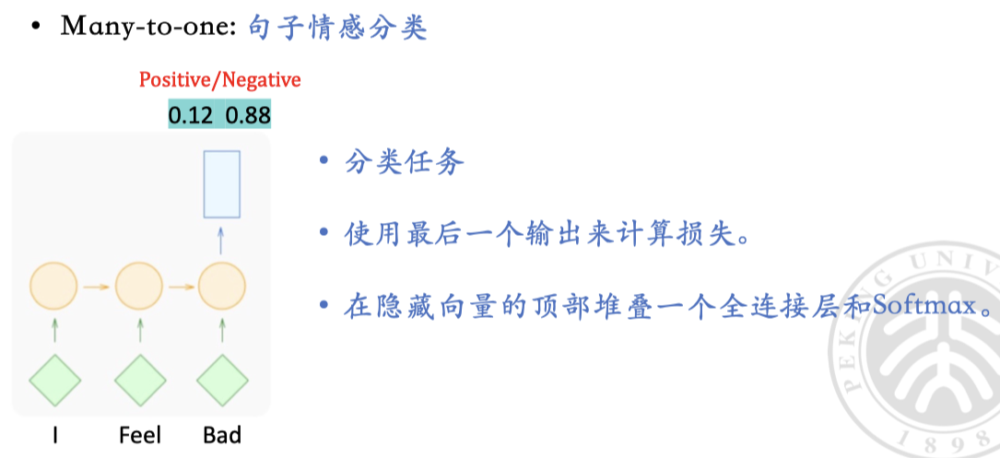

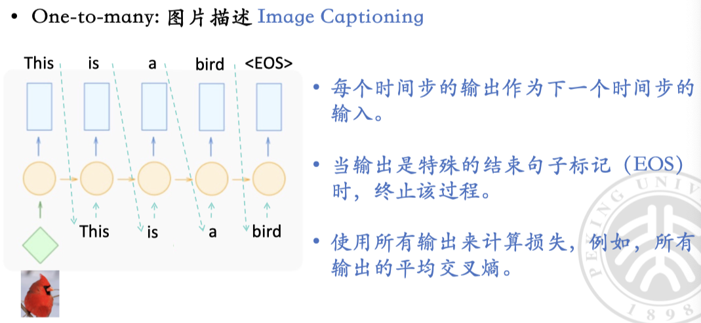

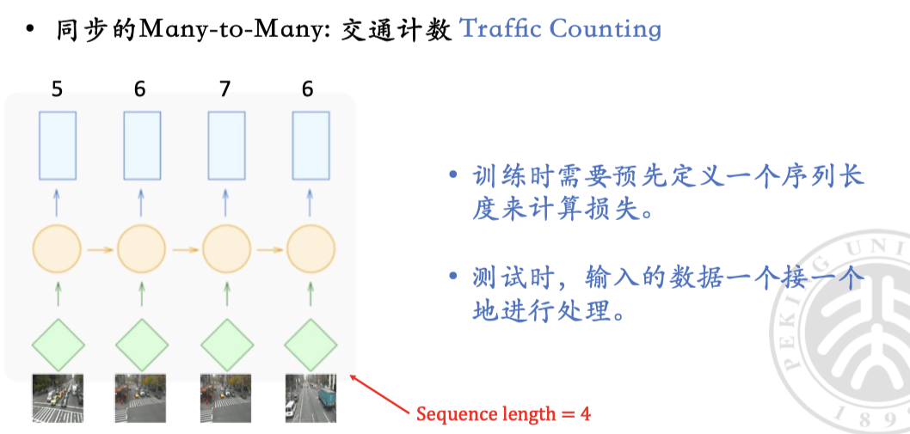

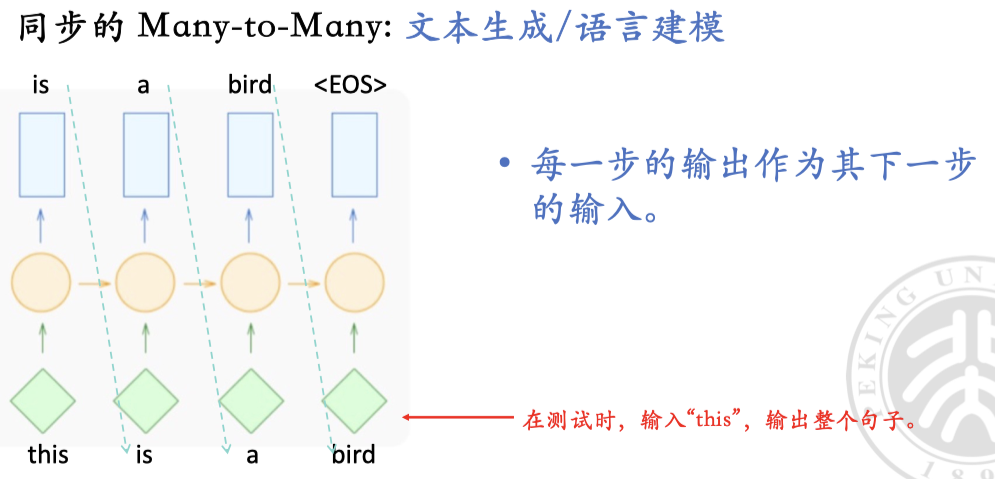

注意这里，实际循环过程中一直给的是正确的下一词，而不是预测的下一词。

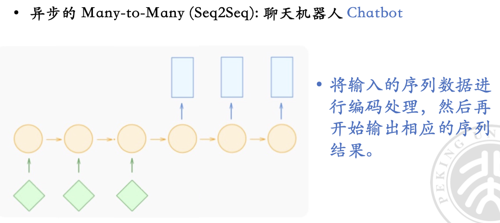

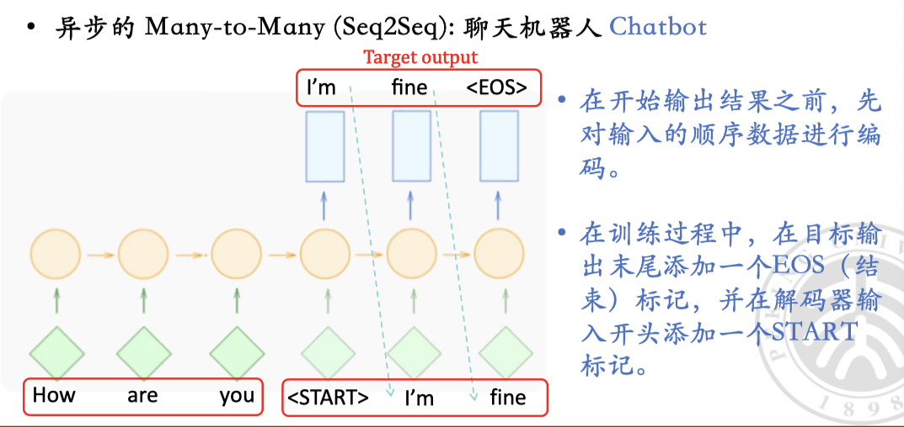

## Credit

[D2L / RNN](https://zh.d2l.ai/chapter_recurrent-neural-networks/rnn.html)

[D2L / LSTM](https://zh.d2l.ai/chapter_recurrent-modern/lstm.html)
