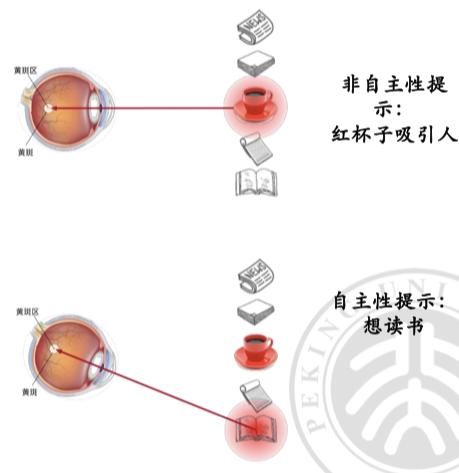
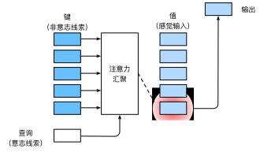
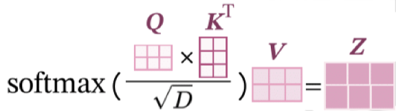
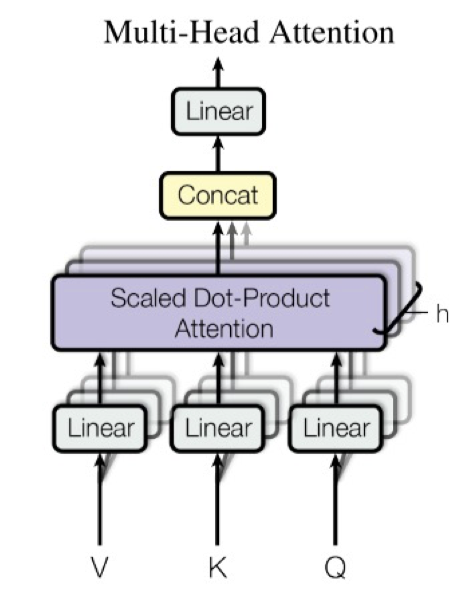
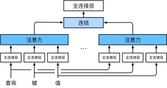
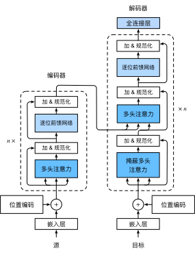
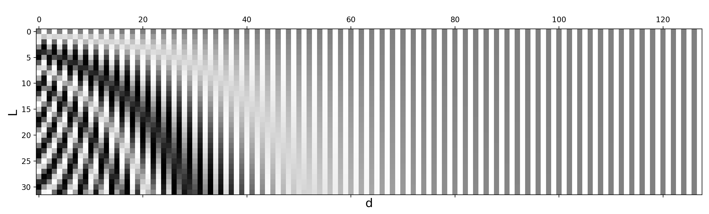
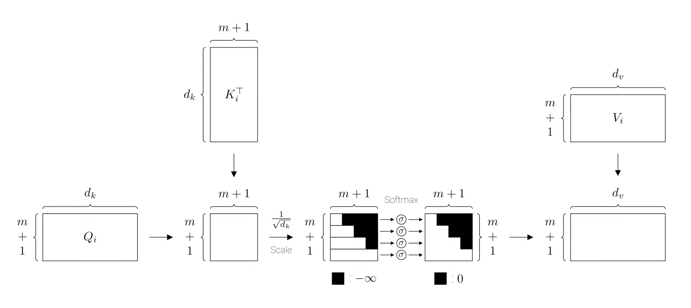

# 注意力机制与 Transformer

  by <a href="https://github.com/zhuozhiyongde">Arthals</a> / GPT4 / Claude 3 Opus
   
  blog: <a href="https://arthals.ink">Arthals' ink</a>

## 动机

早期序列建模方法具有局限性：

-   **RNN（循环神经网络）**：RNN 能够处理序列数据，但在处理长序列时存在梯度消失与梯度爆炸问题。

-   **LSTM（长短时记忆）** 与 **GRU（门控循环单元）**：为解决 RNN 的梯度问题，引入了更复杂的结构，如 LSTM 和 GRU，但计算效率相对较低。

-   **CNN（卷积神经网络）**：虽然主要用于图像处理，但也可以应用于序列数据，如文本分类。然而，CNN 的感受野有限，不能直接捕捉全局依赖关系。

为了解决这些问题，注意力机制被引入。

首先明确一点，**注意力是稀有资源**，我们只有有限的处理能⼒，所以需要忽略无关的信息。

考虑人类视觉注意力的特点：

-   非自主性提示：外部环境的刺激会引起人们的注意。如一堆书中的一本书的颜色与其他书不同，会引起人们的注意。
-   自主性提示：自主性注意力是指人们在没有外部提示的情况下，根据自己的兴趣和目标选择注意的对象。如在一堆书中，人们会选择自己感兴趣的书。

## 注意力机制

不同于过往的深度学习模型，Transformer **摒弃了过往的循环机制** （这会导致梯度消失），使用了 **自注意力机制**。

自注意力机制是一种计算序列中各个元素之间的依赖关系的方法。在自注意力机制中，每个元素都可以与序列中的其他元素相互作用，从而捕捉 **长距离依赖关系**。

注意力提示：**查询、键、值**

-   非自主性提示：键（Key）、值（Value），他们以 **成对** 的形式给出。
-   自主性提示：查询（Query）
-   注意力汇聚：打分函数，注意力权重矩阵，加权平均

注意力汇聚数学表达如下：

$$
f(x)=\sum_{i=1}^n\alpha(x,x_i)y_i
$$

其中：

-   $x$ 是查询向量（Query），可以理解为当前的单词
-   $x_i$ 是键向量（Key），可以理解为前文（数据）中的所有单词（每个 $i$ 对应一个单词）
-   $y_i$ 是值向量（Value），可以理解为前文（数据）中的所有单词的某种特征（如嵌入向量）
-   $\alpha(x,x_i)$ 是 **注意力打分函数**

可以看到，我们先将查询向量（Query）和键向量（Key）通过打分函数做了复合，得到了 **注意力权重**，然后将值向量（Value）与注意力权重做了 **加权平均** （这里还要求了一下注意力汇聚部分的输出是一个加和为 1 的概率分布，所以可以在其中接一个 Softmax），从而得到了最终的输出。

直到现在，我们谈论的还是普通的注意力机制，因为打分函数 $\alpha(x,x_i)$ 可以是一个 **固定的函数**，这是一种特殊情况。例如，采用核方法，可以将 $\alpha(x,x_i)$ 定义为高斯核函数，这样就可以得到一个固定的注意力机制。

> 这里提到的核方法可以在 [ D2L / 注意力汇聚：Nadaraya-Watson 核回归](https://zh.d2l.ai/chapter_attention-mechanisms/nadaraya-waston.html) 中找到更多信息。

## 自注意力机制（Self-Attention）

自注意力机制是注意力机制的一种特殊形式，其中 **查询、键和值都来自同一个地方**，即输入序列。

其中：

-   Q、K、V 是三个不同的空间，图中得到 Q、K、V 都是对于输入序列完成了线性变换。我们首先将输入序列转换为 **嵌入表示**， 然后，通过三个不同的线性层投影 $W_q$、 $W_k$ 和 $W_v$，分别生成 **查询矩阵（Q）、键矩阵（K）和值矩阵（V）**。这三个矩阵将用于计算注意力输出。
-   $N$ 是序列长度
-   $D_x$ 是嵌入的特征维度
-   $D_k$ 是 Q、K、V 矩阵的维度，也叫 head dim

### 打分函数：缩放点积注意力（Scaled Dot-Product Attention）

**缩放点积注意力** 是一种计算模型中不同位置之间相互关注程度的方法。这里的 “注意力” 可以理解为模型在处理数据时赋予不同部分的重要性。具体来说，它通过以下步骤实现。

#### 查询（Q）、键（K）、值（V）矩阵的生成

首先，输入数据 $X$ 经过三个不同的权重矩阵 $W_q$、$W_k$、$W_v$ 转换，得到对应的查询（Q）、键（K）、值（V）矩阵。

这里 $D_x$ 表示输入数据的特征维度，$D_k$ 表示转换后的特征维度（这里要求 Q、K、V 中都相等），$N$ 表示序列长度。

#### 计算注意力得分

然后，使用矩阵乘法计算查询（Q）和键（K）的相似度，得到一个注意力权重矩阵。

这个注意力权重矩阵可以通过以下公式计算：

$$
\text{softmax}\left(\frac{K^T Q}{\sqrt{D_k}}\right)
$$

这里通过除以 $\sqrt{D_k}$​ 进行缩放（缩放点积），防止相似度矩阵中的数值过大（累次运算的影响），使梯度保持稳定（想想 Softmax 在大数值时会导致梯度消失）。

> 这里注意，除以 $\sqrt{D_k}$ 进行缩放是对 $K^T Q$ 得到的 $N \times N$ 矩阵的所有元素各自进行的。这里每个元素都是一个 $[1,D_k] \times[D_k,1]$ 得到的值，所有他的扩大的了 $D_k$ 倍，因而需要缩放点积。后文给出证明。

这里要求了 Q、K 的维度相同，这样才能进行矩阵乘法。

> Proof by GPT4：
>
> 在统计学中，如果向量中的每个元素都是独立的随机变量，并且每个元素都有零均值（0）和单位方差（1），那么这些元素的点积的均值确实是 0。这是因为均值是期望值的线性运算，当两个独立随机变量的均值都为 0 时，它们的乘积的期望值也为 0。
>
> 具体来说，对于两个向量 $\mathbf{q}$ 和 $\mathbf{k}$，它们的点积是：
>
> $$
> \mathbf{q}^\top \mathbf{k} = \sum_{i=1}^{d} q_i k_i
> $$
>
> 由于 $q_i$ 和 $k_i$ 都是独立的随机变量，且均值为 0，所以点积的期望值（均值）是：
>
> $$
> E[\mathbf{q}^\top \mathbf{k}] = E\left[\sum_{i=1}^{d} q_i k_i\right] = \sum_{i=1}^{d} E[q_i k_i] = \sum_{i=1}^{d} E[q_i]E[k_i] = 0
> $$
>
> 现在让我们来看方差。对于两个独立随机变量 $X$ 和 $Y$，其乘积的方差是：
>
> $$ \text{Var}(XY) = E[X^2]E[Y^2] - (E[X]E[Y])^2 $$
>
> 由于 $q_i$ 和 $k_i$ 的均值为 0，上述公式简化为：
>
> $$ \text{Var}(q_i k_i) = E[q_i^2]E[k_i^2] $$
>
> 因为 $q_i$ 和 $k_i$ 的方差都是 1（单位方差），所以 $E[q_i^2] = \text{Var}(q_i) = 1$ 和 $E[k_i^2] = \text{Var}(k_i) = 1$。那么对于每一对 $q_i$ 和 $k_i$，它们乘积的方差是 1。
>
> 最后，考虑到点积是所有这些乘积的和，且这些乘积是独立的，所以点积的总方差是各个乘积方差的和：
>
> $$
> \text{Var}(\mathbf{q}^\top \mathbf{k}) = \sum_{i=1}^{d} \text{Var}(q_i k_i) = d
> $$
>
> 因此，当向量 $\mathbf{q}$ 和 $\mathbf{k}$ 的长度为 $d$，且它们的元素都有零均值和单位方差时，它们的点积的均值为 0，方差为 $d$。这就是为什么在缩放点积注意力机制中需要除以 $\sqrt{d}$ 来保持方差的一致性，不受向量长度的影响。

#### 归一化

对缩放后的相似度矩阵应用 Softmax 函数，使得 **每一列（注意不是矩阵全体）** 的值加起来等于 1，也即转换为 **概率分布**，这个概率分布表示每个键对应的注意力权重。

$$
\text{Attention}(Q, K, V) = \text{softmax}\left(\frac{K^T Q}{\sqrt{D_k}}\right) V
$$

将之前得到的注意力权重矩阵与值（$V$）矩阵相乘，得到最终的输出矩阵 $H$，它是输入序列的 **加权表示**，其中的权重由注意力得分决定。

### 加性注意力（Additive Attention）

加性注意力是另一种用于计算查询和键之间相似度的方法。它首先将查询和键分别经过线性变换（全连接层）， 然后将两者相加，并通过非线性激活函数（如 $\tanh$）计算相似度。接下来，使用可学习的权重向量计算最终的相似度分数。

Attention 机制的计算公式如下：

$$
\text{Attention}(Q, K, V) = \text{softmax}(\text{tanh}(Q * W_q + K * W_k) * V^a) * V
$$

其中：

-   $Q$: 查询向量（Query）集合。
-   $K$: 键向量（Key）集合。
-   $V$: 值向量（Value）集合。
-   $W_q$: 查询向量的线性变换矩阵。
-   $W_k$: 键向量的线性变换矩阵。
-   $V^a$: **表示可学习的权重向量**。
-   $+$: 向量或矩阵的加法。
-   $\tanh$: 表示应用 $\tanh$ **非线性激活函数**。

简而言之：先加起来（而不是乘起来）然后用了一层非线性激活函数与矩阵乘法。

## 多头注意力机制（Multi-Head Attention）

为什么要使用多头注意力机制？

**增加模型的表达能力**：多头注意力机制可以让模型同时关注不同位置的信息，从而提高模型的表达能力。

你可能会想：一个单一的注意力矩阵（头）可以有多个热点，这已经足够了啊？单个注意力矩阵确实可以关注多个信息点，但多头注意力机制允许模型在多个独立的注意力环境中并行处理信息，每个头独立学习数据的不同方面或特征。这样，每个头都能捕捉到独特的信息点，通过综合所有头的输出，模型能够得到一个综合性更强、表达能力更丰富的数据表示。

举个例子，我们现在经常使用大模型，对于同样的提示，不同的大模型可以有不同的输出（关注不同的点），我们比较这些输出，就可以得到更加准确的结果（各取所长）。

### 多头注意力机制的计算过程

对于一个输入序列，假设其长度为 $N$，嵌入维度（特征维度）为 $D$，头数为 $h$​（`num_heads`），则多头注意力计算过程如下：

#### 输入矩阵

$\mathbf{Q}=\mathbf{K}=\mathbf{V}$，形状为：$(N,D)$

对于一共 $h$ 个注意力头，其中 $i$ 表示注意力头的索引，每个注意力头独立的 QKV 权重矩阵为：

$W_{Q_i}$、$W_{K_i}$、$W_{V_i}$，形状为：$(D,\text{head\_dim})$

其中，$\text{head\_dim} = \frac{D}{h}$，这里进行如此规定的原因为了保持输入输出的维度不变。

#### 线性变换后的查询、键和值矩阵

$Q_i$、$K_i$、$V_i$，形状为：$(N,\text{head\_dim})$

#### 缩放点积注意力计算中的相似度矩阵

$Q_i \cdot K_i^T$，形状为：$(N,N)$

#### 缩放点积注意力的输出

$\text{Attention}_i(Q_i,K_i,V_i)$，形状为：$(N,\text{head\_dim})$

这里的改变来自于 $Q_i$ 的尺寸变成了 $(N,\text{head\_dim})$。

#### 多头注意力的拼接输出

$\text{Concat\_Attention}$，形状为：$(N,D)$，因为我们拼接了 $h$ 个头，每个头的维度为 $\text{head\_dim}$，总维度为 $h \cdot \text{head\_dim} = D$。

#### 线性变换后的输出矩阵

$W_o$，形状为：$(D,D)$

#### 多头注意力的输出

$\text{Multihead\_Attention}(Q,K,V)$，形状为：$(N,D)$

#### 总结

多头注意力：自注意力被划分为多个并行的子模块，每个子模块都有自己的权重矩阵，然后将这些子模块的输出拼接起来，再经过一个线性变换，得到最终的输出。多头注意力的每个头分别学习输入的不同部分的信息，通过将这些信息合并起来，可以捕捉到更多样化的特征。

## Transformer

### 位置编码

原先的注意力机制 **无法处理序列中的位置信息** （各个单词在 Self-Attention 中是各个位置都是并行处理的，而不像 RNN 是顺序处理的，后者可以通过顺序来表达位置信息），为了解决这个问题，Transformer 引入了位置编码（Positon Embedding）。

**位置编码的维数和嵌入向量的维数相同**，他们会被加到一起。

-   句子 = 词 + 位置顺序排列
-   词信息转为 **词嵌入**
-   位置信息转为 **位置嵌入**
-   表达句子的向量序列 = 词嵌入向量 + 位置嵌入向量

使用三角函数来编码位置信息，因为其具有连续性且周期性：

1. 连续性：三角函数是连续的，可以表示很小的位置变化。使用正弦和余弦函数，可以确保位置编码的输出在任何位置都是连续可导的，这对于基于梯度的优化算法来说是有益的。
2. 周期性：三角函数有周期性，可以帮助模型捕捉到句子中的模式，还可以对任意长度的序列进行编码。通过使用正弦和余弦函数的不同频率，模型还可以学习到不同尺度的位置关系。

具体来说，对于位置编码，每个维度的位置编码会交替使用 sin 和 cos 函数，其公式如下：

$$
\begin{aligned}
&PE_{(pos, 2i)} = \sin\left(\frac{pos}{10000^{2i/d_{\text{model}}}}\right)\\
&PE_{(pos, 2i+1)} = \cos\left(\frac{pos}{10000^{2i/d_{\text{model}}}}\right)
\end{aligned}
$$

其中：

-   $PE_{(pos, 2i)}$ 表示位置 $pos$ 和维度 $2i$ 的位置编码
-   $PE_{(pos, 2i+1)}$ 表示位置 $pos$ 和维度 $2i+1$​ 的位置编码
-   这张图中，横着是嵌入的维度顺序，竖着是输入向量的位置顺序。

这里的 $pos$ 是位置，$i$ 是嵌入向量的维度索引，$d_{\text{model}}$ 是嵌入向量的总维度。

通过这种方式，模型就可以根据正弦和余弦函数的值来判断单词的位置，进而理解单词的语序和句子结构。

> 这里可以看到，位置编码是硬编码的，但是在后续的发展中，此处转为了通过学习得到位置编码。

### 编码器

1. 源输入序列经过嵌入层的处理得到 **词嵌入**，并 **加上位置编码**，得到最终的输入向量。

2. 通过 **多头注意力** 的 **$h$ 组线性层** 对词嵌入表示进行变换，将其映射为三个不同的空间，得到查询矩阵 Q、键矩阵 K 和值矩阵 V。

3. 计算 **缩放点积注意力输出**。使用 Q、K、V 三个矩阵，按照缩放点积注意力的计算公式进行计算，得到输出矩阵。这个输出矩阵包含了每个词向量对于其他所有词向量的注意力权重。

4. 将输入向量和注意力输出向量相加，得到 **残差连接** 的结果（类似 ResNet）。

5. 对残差连接的结果进行 **层规范化** （Layer Normalization）

    - 将每层的输出值归一化到均值为 0、方差为 1 的范围内。
    - 层规范化将每个神经元的输出值 $x$ 减去它在这一层的均值 $p$，然后除以标准差 $\sigma$，最后乘以可学习的缩放因子 $\alpha$，再加上可学习的偏置项 $\beta$。

    $$
    \text{LayerNorm}(x)=\alpha\odot\frac{x-\mu}{\sqrt{\sigma^2+\epsilon}}+\beta
    $$

    > Layer normalization 是对每个样本的所有特征进行归一化，而 Batch Normalization 是对每个通道的所有样本进行归一化。

6. 逐位前馈网络（Feed-Forward Network， FFN）用于在自注意力机制之后进行 **非线性变换**。逐位前馈网络由两个全连接层和他们之间的一个 ReLU 激活函数组成。

    $$
    \mathrm{FFN}(x)=\max(0,xW_1+b_1)W_2+b_2
    $$

7. 如果有 n 个编码器，则可以将它们 **依次串联** 起来。其中，第一个编码器的输入是词嵌入向量加上位置编码向量。

    $$
    \mathrm{Transformer}(\mathbf{x})=\mathrm{Encoder}_n(\cdots(\mathrm{Encoder}_2(\mathrm{Encoder}_1(\mathbf{x}))))
    $$

8. **最后一个编码器的输出就是最终的编码表示**，它将用于传递给 **解码器** 进行下一步的处理（会由此得出解码器中的一部分所需的 **K、V** ）。

### 解码器

#### 目标序列嵌入和位置编码

**encoder 的输出并没直接作为 decoder 的直接输入**

-   解码器的输入被称为目标序列。初始 decoder 的 time step 为 1 时（也就是第一次接收输入）， **其输入为一个特殊的 token**，即目标序列开始的 token（如 `<BOS>`，begin of sentence），也可能是其它视任务而定的输入等等，其目标则是预测翻译后的第 1 个单词（token）是什么
-   然后 `<BOS>` 和预测出来的第 1 个单词一起，再次作为 decoder 的输入，得到第 2 个预测单词
-   后续依此类推。直到遇到特殊的结束 token （如 `<EOS>`，end of sentence）或者达到最大输出长度为止。

目标序列首先经过嵌入层处理得到词嵌入，并加上 **位置编码**，得到最终的输入向量。

#### 掩蔽多头注意力层（Masked Multihead Attention）

生成解码器自注意力矩阵，用于捕捉当前解码器状态与之前解码器状态的依赖关系。计算过程与编码器的自注意力矩阵相似。

目的：**掩码（Mask）机制屏蔽了未来的序列信息，防止未来信息泄露到当前位置上**。也即，在预测当前词时，只利用前面的词。

这里一共有多个步骤，请详细理解他们的含义：

1. **创建一个掩码矩阵**，形状为 $(N, N)$，其中 $N$ 是输入序列的长度。掩码矩阵的元素 **设置为 $-\infty$（对应不给看）或 $0$（对应给看）**。
2. 在 softmax 计算前，**掩码矩阵与注意力分数相加**，被掩盖位置的注意力分数变为负无穷，未掩盖位置不变。
3. softmax 后，被掩盖位置对应的权重变为 $0$​，不影响当前位置。未掩盖位置正常转化。

> 为什么不直接使用在 softmax 后置零的方法？想想 softmax 的归一化操作是怎么实现的！

注意看这张图中，我们掩盖了注意力权重矩阵中的一半，使当前位置看不到未来信息。然后才去和 V 进行矩阵乘法。也即，需要在预测当前词时，只利用前面的词，而不使用后面的词。

#### 编码器 - 解码器注意力层（Encoder-Decoder Attention）

目的：**将编码器输出的信息融入到当前解码器状态中**，帮助解码器更好地进行下一步预测。

在这个层中，查询向量 $Q$ 来自 **前一个解码器层** 的输出，而键向量 $K$ 和值向量 $V$ 来自 **编码器** 的输出。

#### 逐位前馈网络和 AddNorm

结构同前文编码器。

**解码器堆叠**：堆叠 $n$ 个解码器层，前一个解码器的输出和对应编码器的输出是下一个解码器的输入。

第 1 个解码器层：

$$
\begin{aligned}
Out_0&=PositionEncoding(Y)\\
Out_1&=decoder_1(Out_0,E)
\end{aligned}
$$

第 $i$ 个解码器层 ($1<i\leq n$) :

$$
Out_i=decoder_i(Out_{i-1},E)
$$

最后，我们可以对 **最后一个解码器层** 的输出施加 Softmax 函数来计算词汇表的概率分布：

$$
P_{vocab}=Softmax(W_out*Out_n+b_out)
$$

## 预训练模型（Pre-trained Models）

预训练模型是一种强大的技术，用于在 **无标签数据** 上学习 **通用语言表示**，从而提高 NLP 任务的性能。

**无标签数据**：指我们收集到的数据没有明确的标记或分类信息。

1. **预训练阶段**：在大量无标签文本数据上进行预训练，学习通用的语言表示。
2. **微调阶段**：针对特定任务进行 **微调（fine-tune）**， 使模型适应各种 NLP 任务。

### GPT（Generative Pre-Trained Transformer）

基于 Transformer 的预训练生成模型

-   预训练：在大量无标签文本数据上进行预训练，学习通用的语言表示。
-   学习 **单向** 上下文信息（仅使用左侧的上下文信息来预测当前词）。
-   使用 **多个 Transformer 的解码器** 堆叠
-   自回归训练：根据前面的文本预测下一个词的概率分布，从而学习语言模型。
-   应用：文本生成、文本分类、问答系统等。

### BERT

基于 Transformer 的双向编码器表示模型，学习 **双向** 上下文信息。

-   预训练：在大量无标签文本数据上进行预训练，学习通用的语言表示。
-   学习 **双向** 上下文信息（同时使用左侧和右侧的上下文信息预测当前词）。
-   使用 **多个 Transformer 的编码器** 堆叠
-   预训练任务：掩蔽语言模型（Masked Language Model，MLM）和下一句预测（Next Sentence Prediction，NSP）。
-   应用：文本分类、问答系统、命名实体识别等。

### 差别

> 在 Transformer 架构中，编码器和解码器的设计有不同的目的。
>
> 编码器（Encoder）的设计目的是为了 **理解输入文本的上下文关系**。它通过自注意力机制（Self-Attention）来处理输入的文本，使得模型能够考虑到每个词与文本中其他词的关系。因此，BERT 使用多个编码器堆叠来更好地理解输入文本的双向上下文，这对于理解整个句子的含义非常重要。
>
> 解码器（Decoder）则是专注于生成文本。它不仅使用自注意力机制来理解已经生成的文本，还使用编码器 - 解码器注意力（Encoder-Decoder Attention）来 **关注输入文本的哪些部分对于生成下一个词最为重要**。GPT 使用多个解码器堆叠，因为它的目标是根据前面的文本生成下一个词，所以它不需要理解整个句子的双向上下文，只需要基于之前的词生成新的词即可。
>
> 简单来说，BERT 的目标是理解，所以用编码器；GPT 的目标是生成，所以用解码器。这就是为什么它们会选择不同的 Transformer 部件来堆叠。

## 大模型进化史

参数规模提升带来能力 **“涌现 Emergent”**：大型语言模型（LLM）在训练过程中学到的一种自发性的任务完成能力。**模型基本结构和训练方式基本不变，只增大模型和数据规模**，训练出的模型 “智能” 程度明显提高。

原因如下：

1. 大量的训练数据：人类积累的所有信息，使模型有更丰富的知识基础。
2. 模型容量：模型具有足够的容量来充分学习数据。
3. 自回归和无监督训练：这种方式不需要标注海量数据，简化了训练过程。
4. 迁移学习和微调：使模型能够适应不同任务，增强了模型的应用范围。
5. 多任务学习：提高模型的泛化性，使其在多种任务上都能表现出色。

## Credit

-   [D2L / multi head attention](https://zh.d2l.ai/chapter_attention-mechanisms/multihead-attention.html)
-   [LiLianWeng / Transformer](https://lilianweng.github.io/posts/2023-01-27-the-transformer-family-v2/)
-   [Visual Understanding / Transformer masked attention](https://www.youtube.com/watch?v=L5HjQGjCzME)
-   [Chaos 万有引力 / 全网最强 ViT (Vision Transformer)原理及代码解析](https://zhuanlan.zhihu.com/p/427388113)
