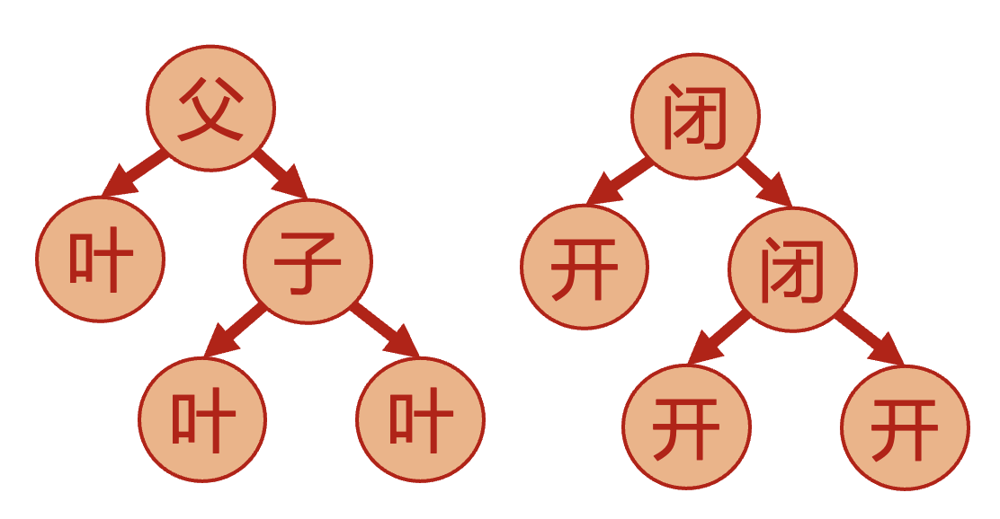
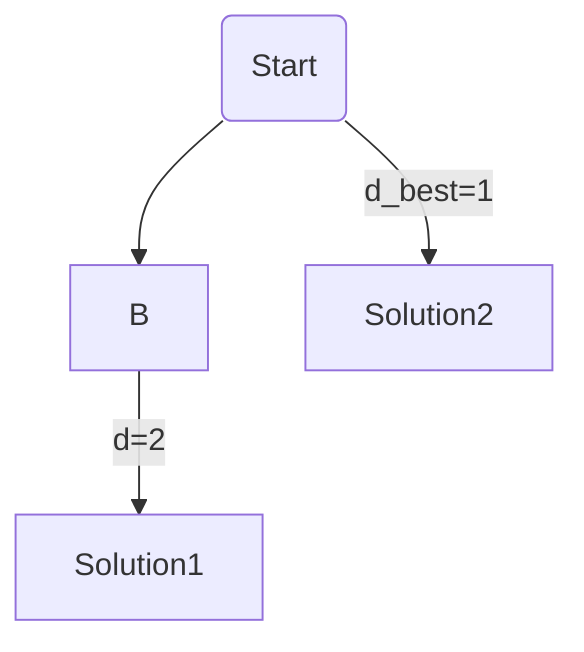
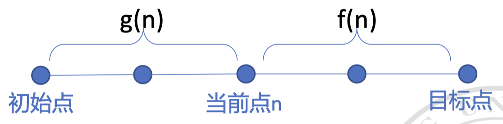
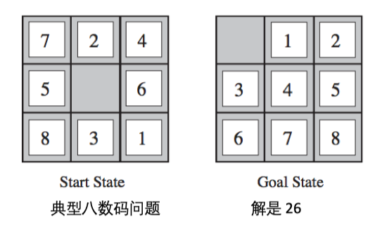
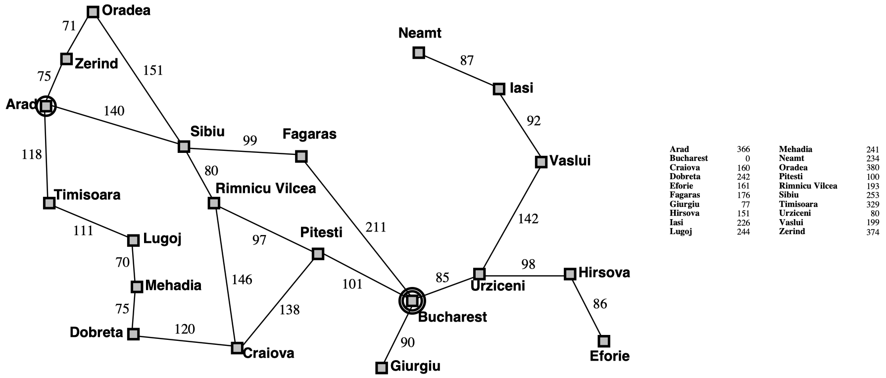

# 用搜索解决问题

<center>
  by <a href="https://github.com/zhuozhiyongde">Arthals</a> / GPT4 / Claude 3 Opus
  <br/>
  blog: <a href="https://arthals.ink">Arthals' ink</a>
</center>

## 问题的定义与解

各种搜索算法通常先把问题转化为通用的模型表示（让计算机看懂），然后进行求解。

一个问题的定义包含五个部分（他们共同组成了一个五元组）：

1. **初始状态** $S_0$

2. **可选动作** $a$

    在一个给定状态 $s$，$\text{ACTIONS}(s)$ 返回在这个状态下的一组可能的动作 $a$。

3. **状态转移模型**

    状态转移模型指定了状态之间的转移关系。

    在状态 $s$ 下执行动作 $a$ 之后所到达的状态用 $s' = \text{RESULT}(s,a)$ 表示。一个状态经过一个动作后来到的下一个状态我们称之为 **后继状态** $s'$​。

    初始状态、动作、状态转移模型构成了 **状态空间**。状态空间构成一幅 **有向图**。

    **路径** 是从一个状态出发通过一系列动作所经过的状态序列。

4. **目标状态**

    一个问题的目标状态 / 终止状态是一个或多个特定的状态，我们希望通过搜索找到这些状态。

5. **路径花费**

    每条路径可以有一个花费，用来度量解的好坏。通常来说，花费越小越好。

在上述五元组内，前四个已经足以构筑出一颗 **搜索树**。第五个可以用以辅助构建搜索树，从而使得搜索更容易到达目标状态。

**一个问题的解** 是从初始状态出发到达目标状态的一个动作序列。解的质量可以用路径的花费来度量。

**最优解**：所有解中花费最小的一个。

### 建模

建模很重要，适当的建模可以通过剪枝来减少搜索空间，通过启发式函数来加速搜索。

如八皇后问题中，有如下两种建模方式：

1. 初始状态：棋盘上没有皇后

    **可选动作**：在棋盘上的所有空位置之一放置一个皇后

    状态转移模型：放置一个皇后之后棋盘的状态

    目标：8 个皇后都在棋盘上，互相之间不能攻击

    状态空间：每个状态是一个棋盘布局

2. 初始状态：棋盘上没有皇后

    **可选动作**：是在棋盘上的最左一个空列上放置一个皇后，使她不被已有的皇后攻击。

    状态转移模型：放置一个皇后之后棋盘的状态

    目标：8 个皇后都在棋盘上，互相之间不能攻击

    状态空间：每个状态是一个棋盘布局

第二种建模方式的状态空间要小得多，搜索空间也小得多。

## 通过搜索对问题求解

### 基本概念

1. **搜索树（search tree）**

    搜索树是指通过搜索算法，用整个状态空间中的各个状态构建的一棵树。树的根节点是初始状态，树的每个节点都是状态空间中的一个状态。

    搜索树是逐步构建的，不一定会囊括状态空间中的所有状态（有时候根本无法穷举，太多了）

    从初始状态出发，在这个状态下的每个可行动作构成一条边。边的另一边是后继状态。如此持续下去就形成一棵搜索树。

2. **父节点（parent node）**

    父节点是指直接连接到一个或多个子节点的节点。一个父节点可能有多个子节点，但是每个子节点通常只会有一个父节点。在树状结构中，根节点没有父节点。

3. **子节点（child nodes）**

    子节点是从父节点直接派生的节点，通常是下一层或更深层的节点。每个子节点通常都有一个父节点，但它们可能还会有自己的子节点（也就是同时是父节点）。

4. **叶节点（leaf node）**

    叶节点是没有子节点的节点。在树状结构中，叶节点代表最底层的节点，没有进一步的扩展。

    **叶节点不一定是终止状态，终止状态意味着无法继续探索（这必然是叶节点），但是叶节点也可以只是还没继续探索（扩展）的状态**

5. **开节点集（frontier, open list）**

    开节点集是一组 **已发现但尚未被完全探索的节点**。在搜索算法中，开节点集包含那些已经被添加到待处理队列（如优先级队列）中的节点，但其相邻节点（后继状态）还没有全部检查过。其表示搜索的前沿部分。

    **算法会从这组节点中选取下一个节点来继续搜索。**

6. **闭节点集（closed list, explored set）**

    闭节点集表示 **已经被完全探索过的节点**。这意味着该节点及其所有相邻节点（后继状态）都已经被考虑过（即其已被完全展开，不存在没有展开的后继节点），并且从当前路径来看，没有进一步的探索价值。在搜索中，闭节点集有助于防止重复探索相同的路径。

7. **搜索策略（search strategy）**

    搜索策略是指如何选择节点进行扩展的一套规则。**不同的搜索策略会影响算法的效率和结果。**



### 图搜索与树搜索

#### 树搜索 Tree-Search

$$
\begin{array}{l}
\text{// \textbf{定义} 树搜索函数，接受一个问题作为输入，返回解决方案或失败} \\
\textbf{function} \ \text{TREE-SEARCH}(\text{problem}) \ \text{returns a solution, or failure} \\
\quad \text{// 初始化边界（待探索队列），使用问题的初始状态} \\
\quad \text{initialize the frontier using the initial state of } \text{problem} \\
\quad \text{// 循环开始} \\
\quad \text{loop do} \\
\quad \quad \text{// 如果边界为空，则返回失败} \\
\qquad \text{if the frontier is empty then return failure} \\
\quad \quad \text{// 选择一个叶子节点并从边界中移除} \\
\qquad \text{choose a leaf node and remove it from the frontier} \\
\quad \quad \text{// 如果节点包含目标状态，则返回对应的解决方案} \\
\qquad \text{if the node contains a goal state then return the corresponding solution} \\
\quad \quad \text{// 扩展所选节点，将结果节点添加到边界} \\
\qquad \text{expand the chosen node, adding the resulting nodes to the frontier} \\
\end{array}
$$

-   **初始化**：使用问题的初始状态来初始化边界（frontier）。
-   **循环**：通过不断循环来从边界中选择并移除叶节点，如果该节点包含目标状态，则返回对应的解决方案。
-   **扩展节点**：如果节点不包含目标状态，则扩展该节点，将结果节点添加到边界中。

#### 图搜索 Graph-Search

$$
\begin{array}{l}
\text{// \textbf{定义} 图搜索函数，接受一个问题作为输入，返回解决方案或失败} \\
\textbf{function} \ \text{GRAPH-SEARCH}(\text{problem}) \ \text{returns a solution, or failure} \\
\quad \text{// 初始化边界（待探索队列），使用问题的初始状态} \\
\quad \text{initialize the frontier using the initial state of } \text{problem} \\
\quad \text{// 初始化已探索集合为空} \\
\quad \textbf{initialize the explored set to be empty} \\
\quad \text{// 循环开始} \\
\quad \text{loop do} \\
\quad \quad \text{// 如果边界为空，则返回失败} \\
\qquad \text{if the frontier is empty then return failure} \\
\quad \quad \text{// 选择一个叶子节点并从边界中移除} \\
\qquad \text{choose a leaf node and remove it from the frontier} \\
\quad \quad \text{// 如果节点包含目标状态，则返回对应的解决方案} \\
\qquad \text{if the node contains a goal state then return the corresponding solution} \\
\quad \quad \text{// 将节点添加到已探索集合} \\
\qquad \textbf{add the node to the explored set} \\
\quad \quad \text{// 扩展所选节点，将结果节点添加到边界} \\
\qquad \text{expand the chosen node, adding the resulting nodes to the frontier} \\
\quad \quad \quad \text{// 只有当节点不在边界或已探索集合中时} \\
\qquad \quad \textbf{only if not in the frontier or explored set} \\
\end{array}
$$

-   **初始化**：与树搜索类似地初始化边界（frontier），同时初始化一个被探索集合（explored set）为空。
-   **循环**：通过不断循环来从边界中选择并移除叶节点，如果该节点包含目标状态，则返回对应的解决方案。
-   **扩展节点**：如果节点不包含目标状态，则扩展该节点，也即将结果节点添加到边界中。但是在添加节点到边界之前，会检查节点是否已在边界或被探索集合中。这一步是为了避免重复探索同一节点，防止死循环。

对比：树搜索仅考虑了没有重复状态的简单情况，而图搜索考虑了可能存在重复状态的情况，通过维护一个被探索集合来避免重复工作。

一个直观的例子是，考虑走迷宫。如果迷宫中存在一个环路，如 `A -> B -> C -> A`，那么：

-   对于树搜索，它会不断探索 `A -> B -> C`，然后返回 `A`，再探索 `A -> B -> C`，无限循环。
-   对于图搜索，它会在第一次探索 `A -> B -> C` 之后，将 `A` 加入到已探索集合中，下次再探索 `A` 时，会发现 `A` 已经被探索过，从而避免重复探索。

简而言之：树搜索是没有记忆的，图搜索有。

### 搜索算法的效率评价

-   **完备性**：如果存在解，能否在有限时间内找到解。**注意，存在解暗示了这个解的路径是有限的。**
-   **最优性**：该算法是否能够找到最优解？
-   **时间复杂度**：算法找到解需要花费多长时间？
-   **空间复杂度**：算法需要多少内存用于搜索？
    -   树搜索：`Frontier`
    -   图搜索：`Frontier` + `Explored`

### 问题难度的衡量

#### 图规模 / 图搜索算法的难度

用状态空间图的大小来衡量问题的规模： $|V| + |E|$

-   $V$ 是点数，Vertex
-   $E$ 是边数，Edge

#### 树规模 / 树搜索算法的难度

用树的宽度和深度来衡量问题的规模。

-   **宽度（breadth）** / 分支数（branching factor，$b$）：树的最大分支数，也即节点所具有的最大子节点数目
-   **深度（depth, $d$）** ：树的最大深度，也即最浅的目标状态所在

#### 复杂度

-   **时间复杂度** 经常用搜索树 **展开的节点的数目** 表示（通常展开一次对应循环迭代一次，展开越多，耗时越多）
-   **空间复杂度** 通常用需要 **存储的最大节点数目** 来估计

## 无信息搜索

无信息搜索是指在搜索过程中不使用任何启发信息的搜索方法。无信息搜索方法通常会遍历整个搜索空间，直到找到解或者确定无解。

无信息搜索可以理解为，没有任何的先验知识，就是盲目地去试（尽管盲目地试的时候也可以有些尝试时优先级策略）。

### 搜索算法的一般存储框架

$$
\begin{array}{l}
\textbf{function} \ \text{CHILD-NODE}(problem, parent, action) \ \textbf{returns} \ \text{a node} \\
\quad \textbf{return} \ \text{a node with} \\
\quad \quad \text{// 创建一个新的节点，其状态是通过在父节点状态上执行给定动作得到的} \\
\quad \quad \text{STATE} = problem.\text{RESULT}(parent.\text{STATE}, action), \\
\quad \quad \text{// 记录父节点和执行的动作} \\
\quad \quad \text{PARENT} = parent, \text{ACTION} = action, \\
\quad \quad \text{// 计算新节点的路径代价，即父节点的路径代价加上执行该动作的代价} \\
\quad \quad \text{PATH-COST} = parent.\text{PATH-COST} + problem.\text{STEP-COST}(parent.\text{STATE}, action)
\end{array}
$$

该函数接收一个问题实例 `problem`，一个父节点 `parent`，以及一个动作 `action`，然后返回一个新的节点 `node`。新节点的属性如下：

-   `STATE`: 表示节点的状态，是根据父节点的状态和所执行的动作计算得出的，计算方法是 `problem.RESULT(parent.STATE, action)`。
-   `PARENT`: 指向该节点的父节点。
-   `ACTION`: 该节点通过执行的动作。
-   `PATH-COST`: 路径成本，计算方法是累加父节点的路径成本和从父节点状态到当前动作的步骤成本，即 `parent.PATH-COST + problem.STEP-COST(parent.STATE, action)`。

### 宽度优先搜索 (Breadth First Search, BFS)

宽度优先搜索是一种无信息搜索方法，它从初始状态开始，**逐层扩展搜索树**，直到找到目标状态。

$$
\begin{array}{l}
\textbf{function} \ \text{BREADTH-FIRST-SEARCH}(problem) \ \textbf{returns} \ \text{a solution, or failure} \\
\quad \text{// 初始化节点，状态为初始状态，路径代价为0} \\
\quad \text{node} \leftarrow \text{a node with STATE} = problem.\text{INITIAL-STATE, PATH-COST} = 0 \\
\quad \text{// 检查初始节点是否为目标状态} \\
\quad \textbf{if} \ problem.\text{GOAL-TEST}(node.\text{STATE}) \ \textbf{then return} \ \text{SOLUTION}(node) \\
\quad \text{// 初始化frontier为仅包含初始节点的FIFO队列} \\
\quad \text{frontier} \leftarrow \text{a FIFO queue with node as the only element} \\
\quad \text{// 初始化explored为空集} \\
\quad \text{explored} \leftarrow \text{an empty set} \\
\quad \textbf{loop do} \\
\quad \quad \text{// 如果frontier为空，返回失败} \\
\quad \quad \textbf{if} \ \text{EMPTY}(frontier) \ \textbf{then return} \ \text{failure} \\
\quad \quad \text{// 从frontier中取出最浅的节点，这一步对应宽度优先的思想，也是各个算法最不同的地方} \\
\quad \quad \text{node} \leftarrow \text{POP}(frontier)  \\
\quad \quad \text{// 将节点状态添加到explored中} \\
\quad \quad \text{add} \ \text{node.STATE to explored} \\
\quad \quad \text{// 对每个可能的动作生成子节点} \\
\quad \quad \textbf{for each} \ \text{action in problem.}\text{ACTIONS}(node.\text{STATE}) \ \textbf{do} \\
\quad \quad \quad \text{child} \leftarrow \text{CHILD-NODE}(problem, node, action) \\
\quad \quad \quad \text{// 如果子节点状态不在explored和frontier中} \\
\quad \quad \quad \textbf{if} \ \text{child.STATE is not in explored or frontier then} \\
\quad \quad \quad \quad \text{// 如果子节点为目标状态，返回解} \\
\quad \quad \quad \quad \textbf{if} \ \text{problem.GOAL-TEST}(child.\text{STATE}) \ \textbf{then return} \ \text{SOLUTION}(child) \\
\quad \quad \quad \quad \text{// 将子节点插入frontier} \\
\quad \quad \quad \quad \text{frontier} \leftarrow \text{INSERT}(child, frontier)
\end{array}
$$

#### 时间复杂度与空间复杂度

-   **时间复杂度**：考虑到每个节点都被处理一次，而且 BFS 会一直搜索到最浅的解。在最坏情况下，目标状态在最后一个展开的节点处。因此宽度优先搜索的时间复杂度（需要展开的节点数）为

    $$
    b + b^2 + b^3 + \ldots + b^d = O(b^d)
    $$

    其中 $b$ 是分支因子（每个节点的平均分支数），$d$ 是搜索深度（最浅的目标状态所在）。

-   **空间复杂度**：宽度优先搜索的空间复杂度为 $O(b^d)$​​[^1]。

    在深度 $d$ 处，每一层最多有 $b^d$ 个节点，因而：

    1. **树搜索**：需要存储开节点集 `Frontier`，对于 BFS 来说就是当前层和下一层的所有节点，空间复杂度也是

        $$
        b^{d-1} + b^d =O(b^d)
        $$

    2. **图搜索**：除了需要存储开节点集 `Frontier`，还要存储所有访问过的节点 `Explored` 以避免重复访问，空间复杂度是

        $$
        [b^{d-1} + b^d]+[b + b^2 + b^3 + \ldots + b^d] = O(b^d)
        $$

#### 算法实现

##### 开节点集（frontier）：队列（queue）

> 回忆一下，什么是开节点集？开节点集是指已发现但尚未被处理的节点。在搜索算法中，开节点集表示搜索的前沿部分。算法通过从这组节点中选取下一个节点来继续搜索。

宽度优先搜索使用 **队列（queue）** 数据结构，遵循 **先进先出（FIFO）** 的原则（也即每次弹出最先进入队列的元素），以确保最先访问的节点的邻居（邻居指与某个节点直接相连的节点）将最先扩展。

**优点**：

1. **路径最短保证**：宽度优先搜索能够保证在无权图中找到从起点到终点的最短路径。

2. **完备性**：如果有解，BFS 保证能找到解。

    因为 BFS 是逐层搜索的，假设解的路径长度为 $d$，那么无论如何，BFS 的最大搜索空间也就是 $O(b^d)$ ，因此 BFS 一定会在第 $d$​​ 层找到解。

```python
from queue import Queue

q = Queue(maxsize = 3)

print(q.qsize()) # 0
print(q.full())
print(q.empty())
q.put('a')
q.put('b')
q.put('c')
print(q.qsize()) # 3
print(q.get()) # a
```

##### 闭节点集（explored set）：哈希表（hash table）

> 闭节点集表示已经被处理和扩展过的节点。在搜索中，闭节点集有助于防止重复探索相同的路径。

宽度优先搜索使用 **哈希表（hash table）** 数据结构来存储已经访问过的节点，以避免重复访问。

不同于使用 `for` 时间复杂度尾 $O(n)$ 的循环遍历，哈希表可以在 $O(1)$ 的时间复杂度下检查一个节点是否已经被访问过。

> 哈希表的原理：哈希表是一种数据结构，它通过 **哈希函数** 将键映射到表中的一个位置来访问记录。哈希表的查找、插入和删除操作的时间复杂度都是 $O(1)$​。
>
> 可以想到，对于一个大范围向低范围的映射，一定是非单射的，也即存在哈希冲突的问题（多个键映射到一个值），但是哈希表可以采用诸如开放地址法、链地址法等扩展这个表。在此就不再展开了。

```python
explored = set()
explored.add('a')
explored.add('b')
print('a' in explored) # True
```

##### 宽度优先搜索实现

```python
from copy import deepcopy
from queue import Queue
from interface.state import StateBase
from utils.show_path import show_reversed_path

# 定义宽度优先搜索类
class BreadthFirstSearch:
    # 初始化函数，接受一个状态对象，并验证其为StateBase的实例
    def __init__(self, state: StateBase):
        assert isinstance(state, StateBase)
        self.initial_state = deepcopy(state)  # 使用深拷贝以避免修改原始状态

    # 搜索函数，tree_search控制是否使用树搜索，require_path控制是否返回路径
    def search(self, tree_search: bool=True, require_path: bool=True) -> None:
        states_queue = Queue()  # 状态队列，用于存储待探索的状态
        explored_states = set()  # 探索过的状态集合，防止重复探索，图搜索专用
        last_state_of = dict()   # 记录每个状态的前一个状态，用于输出整体路径时路径回溯

        # 将初始状态加入队列和探索集合
        states_queue.put(self.initial_state)
        explored_states.add(self.initial_state)

        # 当队列非空时，持续处理
        while not states_queue.empty():
            state = states_queue.get()  # 从队列中获取一个状态

            # 如果状态成功，则根据是否需要路径显示不同的信息
            if state.success():
                if require_path:
                    show_reversed_path(last_state_of, state)  # 显示从初始状态到当前状态的路径
                else:
                    state.show()  # 显示当前状态
                continue

            # 如果状态失败，继续下一个循环
            if state.fail():
                continue

            # 对当前状态可采取的每个动作进行遍历，这里最外层使用 for 循环保证了广度优先（优先遍历同一层）
            for action in state.action_space():
                new_state = state.next(action)  # 生成新的状态

                # 如果使用树搜索或新状态未被探索过，进行处理
                if tree_search:
                    states_queue.put(new_state)  # 将新状态加入队列，但不会立刻遍历，因为先要从 for 循环中取出当前节点的所有动作
                    if require_path:
                        last_state_of[new_state] = state  # 记录路径

                # 如果使用图搜索，额外要求新状态未被探索过
                elif new_state not in explored_states:
                    states_queue.put(new_state)  # 将新状态加入队列
                    explored_states.add(new_state)  # 添加到已探索集合
                    if require_path:
                        last_state_of[new_state] = state  # 记录路径
```

这里的 `state.success()` 和 `state.fail()` 是 `StateBase` 类的两个方法，用于判断当前状态是否为目标状态或失败状态。

-   目标状态：代表搜索成功，找到了解。
-   失败状态：代表搜索失败，无法找到解。

可以看到，与树搜索不同，图搜索需要额外的探索集合 `explored_states` 来避免重复探索。

### 深度优先搜索 (Depth First Search, DFS)

深度优先搜索也是一种无信息搜索方法，它从初始状态开始，**沿着搜索树的深度方向** 进行搜索，直到找到目标状态或者无法继续搜索。当无法继续搜索时，回溯到上一个节点，继续搜索。

相较于 BFS 的实现，**将 FIFO 队列替换为 LIFO 栈即可实现 DFS**。此外，DFS 还可以使用递归来实现。

#### 时间复杂度与空间复杂度

-   **时间复杂度**：在最坏情况下，DFS 可能会遍历所有可能的节点直到最大搜索深度 $m$。假设每个节点平均有 $b$ 个分支，那么在深度 $m$ 时，可能会有 $b^m$ 个节点需要被访问。因此，DFS 的时间复杂度是 $O(b^m)$。

-   **空间复杂度**：DFS 使用的是递归或栈来实现。在最坏情况下，DFS 需要存储从根节点到最大搜索深度 $m$ 的路径上的所有节点，对于这条路径上的 $m$ 个节点中的每一个，需要存储 $b$ 个分支节点。因此，DFS 的空间复杂度是 $O(bm)$。

    由此可见，**DFS 的空间复杂度比 BFS 小得多**，因为它不需要存储浅于当前深度的所有节点，而只是存了从根节点到当前节点这条路径上的所有节点。所以，**如果内存受限，深度优先可以搜得更深。**

    当然，如果搜索树的深度很大，那么 DFS 的空间复杂度也会很大。

#### 算法实现

##### 开节点集（frontier）：栈（stack）

深度优先搜索使用 **栈（stack）** 数据结构，**后进先出（LIFO）** 的原则（也即每次弹出最后进入栈的元素），以确保最后访问的节点的邻居将最先扩展。

**优点**：

1. **空间效率**：深度优先搜索的空间复杂度比宽度优先搜索要小，因为它不需要存储浅于当前深度的所有节点。

2. **完备性**：**DFS 是不完备的**。

    因为在 **无限状态空间** 的情况下，即使有解，DFS 也可能会在没有解的分支中无限下探（$m = +\infin$，但是 $d_{ans}$​ 是有限数）。不过，**对于有限状态空间，DFS 是完备的** （有限状态空间下，只要用图搜索，不重复搜，应该都是完备的）

```python
from queue import LifoQueue
s = LifoQueue(maxsize = 3)
print(s.qsize()) # 0
print(s.full())
print(s.empty())
s.put('a')
s.put('b')
s.put('c')
print(s.qsize()) # 3
print(s.get()) # c
```

##### 深度优先搜索实现

```python
from copy import deepcopy
from queue import LifoQueue

from interface import StateBase
from utils.show_path import show_reversed_path

class DepthFirstSearch:
    # 初始化函数，接受一个状态对象，并验证其为StateBase的实例
    def __init__(self, state: StateBase):
        assert isinstance(state, StateBase)
        self.initial_state = deepcopy(state)

    def search(self, tree_search: bool=True, require_path: bool=True) -> None:
        states_stack = LifoQueue()
        explored_states = set()

        # 将初始状态放入栈中，并记录状态为已探索
        # 注意这里存储一个元组，而不是 BFS 的仅存储状态，因为我们要存储当前搜索路径上每个节点的所有下一步可能
        # 也即空间复杂度 O(mb) 中的 b
        states_stack.put((self.initial_state, 0))
        explored_states.add(self.initial_state)

        last_state_of = {}

        # 这里没有 BFS 内层的 for 循环，直接对整个状态栈遍历
        while not states_stack.empty():
            state, action_id = states_stack.get()

            if state.success():
                if require_path:
                    # 如果成功达到目标状态，且需要路径，展示从初始状态到当前状态的路径
                    show_reversed_path(last_state_of, state)
                else:
                    # 否则只展示当前状态
                    state.show()
                continue

            if state.fail():
                continue  # 如果状态失败，跳过当前循环

            if action_id < len(state.action_space()):
                # 即将遍历子节点，将当前状态压栈，action_id 记录对于当前状态已经充分探索过的节点个数
                # 结束对于一个节点的搜索当且仅当所有子节点都被遍历过，也即 action_id == len(state.action_space())
                states_stack.put((state, action_id + 1))

                # 探索当前状态下，允许的新状态 state.action_space()[action_id]
                new_state = state.next(state.action_space()[action_id])
                # 如果是树搜索，将新状态放入栈中
                if tree_search:
                    # 这句话结合外层的 while 循环保证了会一直尝试深度优先
                    states_stack.put((new_state, 0))
                    if require_path:
                        # 记录下一个状态的前驱状态为当前状态
                        last_state_of[new_state] = state
                # 如果是图搜索，额外要求新状态未被探索过，才能将新状态放入栈中
                elif new_state not in explored_states:
                    states_stack.put((new_state, 0))
                    explored_states.add(new_state)
                    if require_path:
                        last_state_of[new_state] = state
```

### BFS vs DFS

-   **Complete（完备性）**：指算法是否保证在有解的情况下找到解。
-   **Time（时间复杂度）**：算法执行所需时间的估计，用大 $O$ 表示法表示。
-   **Space（空间复杂度）**：算法在执行过程中所需存储空间的估计。
-   **Optimal（最优性）**：算法是否能保证找到最优解。

#### 参数

-   **$b$**：表示树的分支因子，即每个节点平均的子节点数。
-   **$d$**：表示目标节点（解）在树中的深度。
-   **$m$**：表示搜索树的最大深度。

#### 算法比较

-   **宽度优先搜索（Breadth-First）**：
    -   **完备性**：是，如果有解，宽度优先搜索总能找到。
    -   **时间复杂度**：$O(b^d)$，因为每一层的节点都要被访问。
    -   **空间复杂度**：$O(b^d)$，因为需要存储在内存中的节点数与树的宽度成正比。
    -   **最优性**：是，因为它是按层搜索，所以首次到达的解通常是最短的。
-   **深度优先搜索（Depth-First）**：
    -   **完备性**：否，可能会在没有解的分支中无限下探。
    -   **时间复杂度**：$O(b^m)$，最坏情况下需要探索到最深的叶子节点。
    -   **空间复杂度**：$O(bm)$，只需要存储单一路径上的节点加上每个节点的子节点。
    -   **最优性**：否，因为它可能首先找到的解不是最短的解，例如在下图中，因为先展开 `B`，于是找到一个 $d = 2$ 的解，尽管 $d_{best}  = 1$



总结：

-   宽度优先搜索在找到 **最短路径** 的问题上很有优势
-   深度优先搜索在 **空间效率** 上较高，但可能不会找到最优解。
-   宽度优先搜索的时间复杂度和 **最大深度** 成指数关系
-   深度优先搜索的时间复杂度和 **最长路径** 成指数关系

### 深度受限搜索

在树搜索的深度优先搜索中，由于没有存储搜索过的节点，可能会导致搜索陷入死循环（注意，树搜索是没有记忆探索过节点 `Explored` 的搜索，**而不是对树的搜索**，对树的搜索是不会陷入死循环的，因为其中没有环路，但是对图的树搜索，可以沿着一个环搜回来）。于是，深度受限搜索应运而生。

深度受限搜索（Depth-Limited Search）是一种树搜索策略，它在深度优先搜索的基础上引入了 **深度限制**，以防止陷入无限循环。

深度受限搜索通过限制搜索的最大深度 $L$，将深度为 $L$​​ 的节点视为没有后继的叶子节点，从而解决了无限循环的问题。

#### 性质

-   **搜索完备性：** 当深度限制 $L$ 小于问题的解的深度 $d$ 时，搜索可能是不完全的，即可能无法找到解。因为即使是最浅的解，它的深度也超过了限制。选择 $L>d$ 可以增加完备性。
-   **搜索最优性**：类似 DFS，深度首先搜索返回的解不是最优解，不具有最优性

#### 复杂度分析

-   时间复杂度： $O(b^L)$，其中 $b$ 是分支因子， $L$ 是限制的最大搜索深度
-   空间复杂度： $O(bL)$​

#### 延伸

-   **特殊情况：** 深度优先搜索可以看作是 $L=\infty$ 的深度受限搜索。
-   **搜索结果：** 深度受限搜索可能有两种搜索不成功的情况：
    -   真的 “没有解”
    -   由于没有搜索到足够深度而错误地返回 “无解”。

深度受限搜索提供了一种在深度优先搜索基础上引入深度限制的策略，以平衡搜索的完备性和效率。

#### 伪代码

$$
\begin{array}{l}
\textbf{function} \ \text{DEPTH-LIMITED-SEARCH}(problem, limit) \ \textbf{returns} \ \text{a solution, or failure/cutoff} \\
\quad \text{// 调用递归深度受限搜索} \\
\quad \textbf{return} \ \text{RECURSIVE-DLS}(\text{MAKE-NODE}(problem.\text{INITIAL-STATE}), problem, limit) \\
\\
\textbf{function} \ \text{RECURSIVE-DLS}(node, problem, limit) \ \textbf{returns} \ \text{a solution, or failure/cutoff} \\
\quad \text{// 检查当前节点是否为目标状态} \\
\quad \textbf{if} \ problem.\text{GOAL-TEST}(node.\text{STATE}) \ \textbf{then return} \ \text{SOLUTION}(node) \\
\quad \text{// 检查深度限制是否为0} \\
\quad \textbf{else if} \ limit = 0 \ \textbf{then return} \ \text{cutoff} \\
\quad \textbf{else} \\
\quad \quad \text{// 初始化截断标志} \\
\quad \quad \text{cutoff-occurred?} \leftarrow \text{false} \\
\quad \quad \text{// 对每个可能的动作生成子节点} \\
\quad \quad \textbf{for each} \ \text{action in problem.}\text{ACTIONS}(node.\text{STATE}) \ \textbf{do} \\
\quad \quad \quad \text{// 生成子节点} \\
\quad \quad \quad \text{child} \leftarrow \text{CHILD-NODE}(problem, node, action) \\
\quad \quad \quad \text{// 递归调用递归深度受限搜索,设定最大搜素深度-1} \\
\quad \quad \quad \text{result} \leftarrow \text{RECURSIVE-DLS}(child, problem, limit - 1) \\
\quad \quad \quad \text{// 检查结果是否为截断} \\
\quad \quad \quad \textbf{if} \ \text{result = cutoff} \ \textbf{then} \ \text{cutoff-occurred?} \leftarrow \text{true} \\
\quad \quad \quad \text{// 如果结果不是失败，返回结果} \\
\quad \quad \quad \textbf{else if} \ \text{result} \neq \ \text{failure} \ \textbf{then return} \ \text{result} \\
\quad \quad \text{// 如果发生截断，返回截断，否则返回失败} \\
\quad \textbf{if} \ \text{cutoff-occurred?} \ \textbf{then return} \ \text{cutoff} \ \textbf{else return} \ \text{failure} \\
\end{array}
$$

### 迭代加深搜索

深度受限搜索固然避免了无限循环，但是带来了一个新的问题就是我们需要手动设置最大深度 $L$，这会造成麻烦，因为我们不太好确定设定多大是最好的，于是，迭代加深搜索应运而生。

迭代加深搜索（Iterative Deepening Search, IDS）是一种结合了深度优先搜索和深度受限搜索的搜索策略，它通过 **逐渐增加深度限制** 来提高搜索的完备性和效率。

#### 算法过程

迭代加深搜索每次都从根节点重新开始。它先探索较浅的节点，然后逐渐深入到更深的层次。

1. 设定深度限制 $d = 0$。
2. 进行深度优先搜索，但搜索的深度不超过 $d$。
3. 完成对当前深度的搜索后，增加深度限制 $d = d + 1$。
4. 重复步骤 2 和 3，直到找到目标节点或达到问题的最大深度。

#### 复杂度分析

-   **空间复杂度**：由于它每次都使用深度优先搜索（DFS），所以空间复杂度保持在 $O(bd)$，其中 $b$ 是分支因子， $d$ 是深度限制。因为它和深度优先搜索一样，只需要存储单一路径上的节点（以及各节点的一级子节点），而不需要像 BFS 那样存储所有的节点，而且因为限制了深度，所以不会像 DFS 陷入无限循环。

-   **时间复杂度**：

    如果当前的深度限制为 $d$ ，那么对于迭代加深搜索来说，它过往已经尝试了 $0\sim d-1$ 的深度限制，所以其时间复杂度为：

    $$
    O(b^0 + b^1 + b^2 + \ldots + b^{d-1} + b^d) = O(b^{d})
    $$

    可以看出，迭代加深搜索的时间复杂度与深度优先搜索相同。

简而言之，**迭代加深算法用深度优先的所需空间，按广度优先的时间完成了任务。**

-   深度优先的所需空间：每次都相当于一个深度受限搜索
-   广度优先的时间：深度限制迭代到解的深度就停了，不会往更深了搜（但是纯 DFS 有可能因为现在的路径不对，搜了一条别的路径，搜的比最优解深）

#### 伪代码

$$
\begin{array}{l}
\textbf{function} \ \text{ITERATIVE-DEEPENING-SEARCH}(problem) \ \textbf{returns} \ \text{a solution, or failure} \\
\quad \text{// 从深度0开始，不断增加搜索深度} \\
\quad \textbf{for} \ depth = 0 \ \textbf{to} \ \infty \ \textbf{do} \\
\quad \quad \text{// 调用深度受限搜索} \\
\quad \quad \text{result} \leftarrow \text{DEPTH-LIMITED-SEARCH}(problem, depth) \\
\quad \quad \text{// 如果结果不是截断，返回结果} \\
\quad \quad \textbf{if} \ result \neq \ \text{cutoff} \ \textbf{then return} \ result \\
\end{array}
$$

### 双向搜索

双向搜索（Bidirectional Search）是一种更取巧搜索策略，它 **同时从初始状态和目标状态开始搜索，直到两个搜索路径相遇**。双向搜索通常用于图搜索，以减少搜索空间，提高搜索效率。

-   **时间复杂度**：双向搜索的时间复杂度为 $O(b^{d/2})$，其中 $b$ 是分支因子，$d$ 是目标节点的深度。双向搜索的时间复杂度比单向搜索低得多，因为它同时从两个方向搜索，而不是从一个方向搜索
-   **空间复杂度**：双向搜索的空间复杂度也为 $O(b^{d/2})$

可以看做是 **两个深度为原先一半的宽度优先搜索**，因此时间复杂度和空间复杂度都是 $O(b^{d/2})$。

### 总结

宽度优先：

-   往往采用 **图搜索** 实现，需要 **存储所有开节点 `Frontier` 与闭节点 `Explored`**
    -   开节点：已发现但还未被完全探索的节点
    -   闭节点：已经被完全探索过的节点
-   需要的内存随着层数 $d$ 加深而指数增长
-   因为是一层层地搜索，所以保证找到的是最优解
-   开节点弹出用 **先进先出 FIFO** 的数据结构 **队列** 实现

深度优先：

-   往往采用 **树搜索** 实现，**只存开节点 `Frontier`**
-   需要内存随着搜索 $m$ 深度线性增加
-   某些问题下有可能进入死循环，不能保证找到的是最优解。
-   如果用图搜索实现深度优先，那么它的空间复杂度的优势就没了（也存 `Explored` 了）。
-   开节点弹出用 **后进先出 LIFO** 的数据结构 **栈** 实现

### 一致代价搜索 (Uniform Cost Search, UCS)

回忆我们之前讲的，各个无信息搜索算法其实差别就在于如何从开节点集中选择下一个节点来探索，那么除了单纯的依据添加顺序，选择最早的（对应 BFS）或者最晚的（对应 DFS）外，当然也可以有其他的选择方式。

同时，我们对原有的问题进行推广后会发现，BFS 当且仅当每一步的花费相同时，才会因为选择最早添加的节点扩展，满足了步数（深度）最小，从而获得最优性。

但是当每一步的花费不同时，BFS 就不在拥有最优性了。很自然地，我们想到此时可以根据路径成本排序，而这，就是一致代价搜索。

一致代价搜索是一种无信息搜索方法，它通过维护一个按从起点到当前点 $n$ 的路径成本 $g(n)$ 排序的边界（frontier）来搜索最小成本路径。一致代价搜索的特点是 **每次都选择当前成本最小的节点进行扩展**。

-   开节点集：**优先队列** （priority queue），按路径成本 $g(n)$​ 排序，当发现一条更优路径时更改开节点集的信息（也即，如果发现了一条比之前更短的路径到达某个节点，就需要更新该节点在开节点集中的信息，以确保在后续的搜索中能够优先考虑这条更短的路径）

    BFS 可以看每一步的成本都相同的 UCS 特例。

-   闭节点集：哈希表（hash table），存储已探索过的节点。

对于优先队列的弹出，要求当某一节点 $p$ 出队时，队列中任意节点 $n$ 的 $g(n)$ 已经没有比它更小的了，由于路径成本是累积的，所以对以后弹出的任何节点 $q$，都会有 $g(q) + g(q\to p) \geq g(q) \geq g(p)$，这保证了以后弹出的任何节点，再到 $p$​，路径都不会更短了。

#### 性质分析

把一致代价搜索理解为问题推广到单步成本不同的情况后的 BFS，很自然的可以证明其同时拥有 **完备性与最优性**

#### 时空复杂度分析

UCS 的时间复杂度和空间复杂度在最坏情况下均为 $O(b^{1 + \lfloor C^* / \epsilon \rfloor})$。这里的 $C^*$ 表示到达目标状态的最小总花费，而 $\epsilon$ 是任何一步可能的最小花费。

-   **分支因子 $b$**：在搜索树中，每个节点的子节点数即为分支因子。
-   **最大深度**：以最小花费 $\epsilon$ 计算，直到累计花费达到 $C^*$，最大深度为 $1 + \lfloor C^* / \epsilon \rfloor$。

**一致代价搜索对解路径的步数并不关心，只关心路径总代价。**

其可以看做将 BFS 的先入先出 FIFO 队列改为了 **按照路径成本排序的优先队列**。最极端情况下，每一步的成本等同为 $\epsilon$ ，此时它的时间、空间复杂度的上界均可以看做一个最大深度 $d = 1 + \lfloor C^* / \epsilon \rfloor$ 的 BFS。因而可以立刻得出，其时间、空间复杂度均为 $O(b^{1 + \lfloor C^* / \epsilon \rfloor})$​​​。

#### 伪代码

$$
\begin{array}{l}
\textbf{function} \ \text{UNIFORM-COST-SEARCH}(problem) \ \textbf{returns} \ \text{a solution, or failure} \\
\quad \text{// 初始化节点，状态为初始状态，路径代价为0} \\
\quad \text{node} \leftarrow \text{a node with STATE} = problem.\text{INITIAL-STATE, PATH-COST} = 0 \\
\quad \text{// 初始化优先队列frontier，按路径代价排序，仅包含初始节点} \\
\quad \text{frontier} \leftarrow \text{a priority queue ordered by PATH-COST, with node as the only element} \\
\quad \text{// 初始化explored为空集} \\
\quad \text{explored} \leftarrow \text{an empty set} \\
\quad \textbf{loop do} \\
\quad \quad \text{// 如果frontier为空，返回失败} \\
\quad \quad \textbf{if} \ \text{EMPTY}?(frontier) \ \textbf{then return} \ \text{failure} \\
\quad \quad \textbf{// 从frontier中取出路径代价最小的节点，这是最关键的一步} \\
\quad \quad \text{node} \leftarrow \text{POP}(frontier)  \\
\quad \quad \text{// 检查节点是否为目标状态} \\
\quad \quad \textbf{if} \ problem.\text{GOAL-TEST}(node.\text{STATE}) \ \textbf{then return} \ \text{SOLUTION}(node) \\
\quad \quad \text{// 将节点状态添加到explored中} \\
\quad \quad \text{add} \ \text{node.STATE to explored} \\
\quad \quad \text{// 对每个可能的动作生成子节点} \\
\quad \quad \textbf{for each} \ \text{action in problem.}\text{ACTIONS}(node.\text{STATE}) \ \textbf{do} \\
\quad \quad \quad \text{child} \leftarrow \text{CHILD-NODE}(problem, node, action) \\
\quad \quad \quad \text{// 如果子节点状态不在explored和frontier中} \\
\quad \quad \quad \textbf{if} \ \text{child.STATE is not in explored or frontier then} \\
\quad \quad \quad \quad \text{// 将子节点插入frontier} \\
\quad \quad \quad \quad \text{frontier} \leftarrow \text{INSERT}(child, frontier) \\
\quad \quad \quad \text{// 如果子节点状态在frontier中且路径代价更低} \\
\quad \quad \quad \textbf{else if} \ \text{child.STATE is in frontier with higher PATH-COST then} \\
\quad \quad \quad \quad \text{// 用子节点替换frontier中的节点} \\
\quad \quad \quad \quad \text{replace that frontier node with child} \\
\end{array}
$$

## 有信息搜索

有信息搜索是指在搜索过程中 **使用启发信息** 的搜索方法。有信息搜索方法通常会 **根据启发信息来选择** 下一个节点进行扩展，以 **提高搜索效率**。

注意，有信息搜索的主要目的是提高搜索效率，但是提高了搜索效率不代表一定更好，反而可能会更差（丧失最优性）



启发式函数可以看做这个图中的 $h(n)$，他是一个估计，而不一定是真实的。

### 贪婪最佳优先搜索 (Greedy Best-First Search, GBFS)

贪婪最佳优先搜索是一种有信息搜索方法，它通过启发式函数 $h(n)$ 来评估节点 $n$ 的优先级，然后选择优先级最高的节点进行扩展。贪婪最佳优先搜索的特点是每次都选择启发式函数值最小的节点进行扩展。

贪婪最佳优先搜索的启发式函数 $h(n)$ 通常是一个 **估计** 函数，它用来估计从节点 $n$ 到目标节点的最小成本。

-   开节点集：优先队列（priority queue），按启发式函数值 $h(n)$ 排序。
-   闭节点集：哈希表（hash table），存储已探索过的节点。

#### 性质

完备性：**贪婪最佳优先搜索没有完备性**。类似 DFS，它可能沿着无限路径一直走（当然这得让启发式函数或者状态空间很差）

最优性：**贪婪最佳优先搜索没有最优性**。它找到的路径不一定是最优路径，因为它只考虑了当前节点的启发式函数值（贪心），在每一步它都选择 **看似距离目标最近** 的节点展开。因而可能会陷入局部最优解，而不是全局最优解。

注：一致代价搜索的估值函数（评估当前状态的函数）是 $f(n) = g(n)$，指代到达当前状态的路径的 **真实花费**；而贪婪最佳优先搜索的估值函数直接就是启发式函数，也即 $f(n) = h(n)$，指代当前状态到目标状态的 **估计花费**。

#### 时空复杂度分析

在最坏情况下，启发式函数足够的差，以至于它像宽度优先搜索那样遍历，而且还没搜到解，此时，时间、空间复杂度均为 $O(b^m)$，其中 $b$ 是分支因子，$m$​ 是最大深度。

如果启发式函数 $h(n)$ 是一个有效的估计函数，那么贪婪最佳优先搜索的时间复杂度和空间复杂度将会大幅降低。

### A\* 搜索算法

A\*搜索算法是一种有信息搜索方法，它通过综合考虑节点的实际成本 $g(n)$ 和启发式函数值 $h(n)$ 来评估节点的优先级，然后选择优先级最高的节点进行扩展。A\*搜索算法的特点是每次都选择 **综合成本最小** 的节点进行扩展。**A\*搜索算法是一种综合了一致代价搜索和贪婪最佳优先搜索的搜索方法**。

A\* 搜索算法的估值函数为：

$$
f(n) = g(n) + h(n)
$$

也即，A\* 搜索算法的估值函数为预计经过节点 $n$ 到达目标节点的最短路径的花费。

-   开节点集：优先队列（priority queue），按估值函数值 $f(n)$ 排序。
-   闭节点集：哈希表（hash table），存储已探索过的节点。

#### A\* 算法的最优性条件

A\*搜索算法并不总是能找到最优解，但是它能够保证找到最优解的条件是：如果能够保证展开一个节点时，如果不展开它而是展开其他节点，一定不会有更优路径，那么 A\* 算法就是最优的。

##### 估值函数 $h (n)$ 的性质 [^2]

-   **可采纳性（Admissibility）**：如果 $h(n)$ 永远不会超过从节点 $n$ 到目标节点的真实代价，**即 $h(n)$ 是真实代价的下限，$h(n) \leq h^*(n)$**，其中 $h^*(n)$ 是实际最优代价，则称 $h(n)$ 是可采纳的。可采纳性保证了 A\* 算法能够找到最优解。
-   **一致性（Consistency）/ 单调性（Monotonicity）**：对于所有节点 $n$ 和其可达的后续节点 $n'$，如果 $h(n)$ 满足三角不等式，即 $h(n) <= c(n, n') + h(n')$，其中 $c(n, n')$ 是从节点 $n$ 直接到达节点 $n'$ 的实际代价，则称 $h(n)$​ 是一致的。

可采纳性意味着我们的启发式函数是 **乐观** 的，我们的估计是 **乐观估计**。

**一致性是可采纳性的一种强化形式**。它保证了 $h(n)$ 不仅不会高估到目标的代价（可以通过简单的将 $n'$ 选取为目标节点来证明），而且估计的增长与实际成本增长一致（单调性）。

极限情况下，$h(n) \equiv 0$，A\* 算法就退化为一致代价搜索。

可以证明：

-   对于树搜索，如果 $h(n)$ 是可采纳的，那么 A\* 算法是最优的，也是完备的。
-   对于图搜索，如果 $h(n)$​ 是一致的，那么 A\* 算法是最优的。

在满足上述乐观估计的条件的情况下：

-   $h(n)$ 最好时，完全等于实际代价，即 $h(n) = h^*(n)$，在这种情况下，A\* 算法的搜索路径几乎是直达路径，表现类似于贪心算法，因为它总是选择当前认为最优的路径。
-   $h(n)$ 最坏时，$h(n) \equiv 0$，此时，A\* 算法退化为 Dijkstra 算法，也即一致代价搜索。因为综合代价函数 $f(n) = g(n) + h(n) = g(n)$。即每一步都只考虑从起点到当前节点的实际代价，而忽略到目标节点的估计代价。

#### A\* 搜索的性质

-   **完备性**：如果存在解，A\* 搜索算法能够在有限的时间内找到解。

-   **最优性**：见上文最优性讨论。

-   **最高效**：给定 $f(n)$​ ，A\* 是最高效的。

    假设最优解的总代价是 $C^*$，即：

    $$
    C^* = g(n) + h(n)
    $$

    对于最优路径上的某个节点 $n$​。

    接着，全体节点可以分为两类：

    -   **必要节点**：由于 A\*算法依照 $f(n)$ 由小到大展开，所以在找到最优解时及找到最优解之前，A\*算法会展开所有 $f(n) \leq C^*$ 的节点。而这些节点确实都有 **可能** 是最优解路径上的一部分（注意，他们不是一定在，只是可能在，但是就是要搜索所有可能的节点才对）。
    -   **不必要节点**：如果一个节点 $n$ 的 $f(n) > C^*$，那么它不可能在最优解路径上，因为它的总代价已经超过了最优解的总代价 $C^*$​​，A\* 算法不会浪费时间在他们上。

    这说明了 A\* 算法在搜索过程中能够尽可能地减少搜索的节点数量，只展开了必要的节点，以达到效率最高的搜索。

    A\* 的高效性基于优先队列的设计，与 $f(n)$ 直接相关，但与是否满足最优性无关。

-   A\* 的实际效果取决于启发式函数的好坏

不过，对于大多数问题来说，在目标等高线之内（$f(n) \leq C^*$）的状态数目相对于解路径的长度来说依旧是 **指数关系**。

#### 代码实现

一致代价、贪婪、A\* 的代码框架是一样的，只是 $f(n)$ 不一样而已。

```python
from copy import deepcopy
from queue import PriorityQueue
from typing import Callable

from interface.state import StateBase
from utils.show_path import show_reversed_path

class HeuristicSearch:
    # 定义启发式搜索的估值函数类型，输入为状态，输出为浮点数
    ValueEstimatorType = Callable[[StateBase], float]

    def __init__(self, state: StateBase):
        assert isinstance(state, StateBase)  # 确保传入的状态是StateBase类型
        self.initial_state = deepcopy(state)  # 对初始状态进行深拷贝，保证原始状态不被修改

    def search(self, value_of: ValueEstimatorType) -> None:
        states_queue = PriorityQueue()  # 使用优先队列存储待处理的状态，根据成本函数进行排序
        best_value_of = dict()  # 存储已知最好的到达各状态的成本
        last_state_of = dict()  # 存储到达某状态的最佳前驱状态

        states_queue.put((0, self.initial_state))  # 将初始状态入队，成本为0
        best_value_of[self.initial_state] = 0  # 初始状态的最佳成本设为0

        while not states_queue.empty():
            _, state = states_queue.get()  # 从队列中取出一个状态

            if state.success():  # 如果这个状态是目标状态
                break  # 结束搜索

            if state.fail():  # 如果这个状态无法继续或者失败
                continue  # 忽略此状态，继续处理队列中的下一个状态

            # 遍历当前状态可执行的所有操作，生成新状态
            for action in state.action_space():
                new_state = state.next(action)  # 生成新状态
                # 如果新状态未曾被发现，或新的路径成本低于已知的最佳成本
                if new_state not in best_value_of or value_of(new_state) < best_value_of[new_state]:
                    states_queue.put((-value_of(new_state), new_state))  # 将新状态加入队列
                    best_value_of[new_state] = value_of(new_state)  # 更新到达新状态的最佳成本
                    last_state_of[new_state] = state  # 记录到达新状态的前驱状态

        if state.success():
            show_reversed_path(last_state_of, state)  # 如果找到目标状态，显示从初始状态到目标状态的路径
```

### 启发式函数

上述有信息搜索算法都依赖于启发式函数，所以接下来我们讨论启发式函数本身。

启发式函数可以定义为是一种用于 **评估节点优先级的函数**，通常用于有信息搜索方法中。

启发式函数的作用是 **估计** 从节点 $n$​ 到目标节点的最小成本，以帮助搜索算法选择下一个节点进行扩展。

#### 支配性



考虑以上八数码问题，我们要把左侧的状态变换为右侧的状态。在这个问题中，我们有如下两种启发式函数：

-   **启发式函数 $h_1(n)$**：不在正确位置的数字个数。

    例如，对于上图中的状态，$h_1(n) = 8$。由于转换一个不在正确位置的数字到正确位置上至少需要 1 步（实际代价 ≥ 1），所以 $h1(n)$ 是可采纳的。

-   **启发式函数 $h_2(n)$**：数字的当前位置和目标位置的曼哈顿距离之和（恰为每个数字到达正确位置的最小（注意，并非实际，实际还要考虑华容道那样的冲突）移动步数之和）。

    例如，对于上图中的状态，$h_2(n) = 18$。由于曼哈顿距离恰好给出了到达目标位置的最少步数，所以 $h_2(n)$ 也是可采纳的。

由定义可知，$h_2(n) \geq h_1(n)$，此时，我们说 $h_2(n)$ **支配** $h_1(n)$​。

同时，由于二者均具有可采纳性，即均严格小于或等于从节点 $n$ 到目标节点的实际代价，所以我们可以认为 $h_2(n)$ 比 $h_1(n)$ **更加有效**，也就是 **更优**。因为这保证了使用 $h_2$ 的 A\*不会比使用 $h_1$​ 的 A\* 展开更多节点。

#### 证明

由于 $h_2(n) \geq h_1(n)$，对于任意节点 $n$，有：

$$
f_2(n) = g(n) + h_2(n) \geq g(n) + h_1(n) = f_1(n)
$$

这意味着，对于每个节点 $n$，使用 $h_2$ 的评估值 $f_2(n)$ 不小于使用 $h_1$ 的评估值 $f_1(n)$。

考虑节点展开顺序：A\* 算法总是选择 $f(n)$ 最小的节点进行扩展。

-   使用 $h_1$ 时，A\* 会扩展节点 $n_1$。
-   使用 $h_2$ 时，A\* 会扩展节点 $n_2$。

由于 $f_2(n) \geq f_1(n)$，可以推论出 $n_2$ 的优先级不低于 $n_1$。

因此，使用 $h_2$ 时，A\* 扩展的节点数不会比使用 $h_1$ 时更多。

#### 特例

对于更一般的情况（即不是此问题，而是另一个问题），如果也有两个启发式函数 $h_2(n)$ 和 $h_1(n)$，同时满足可采纳性以及 $h_2(n) \geq h_1(n)$，我们可以有类似的推论，**除非** $f(n) = g(n) + h_1(n) = g(n) + h_2(n) = C^*$，此时两个启发式函数完全等价。

另一个解释是，$h_2(n)$ 使用曼哈顿距离，同时给出了到达目标位置的最少步数，而 $h_1(n)$ 仅对不在位置的数字计数，仅提供了有多少数字需要移动。这使得 $h_2(n)$ 在大多数情况下是一个更精确或至少是更 “信息量丰富” 的启发式评估，这显然是有益于提高搜索效率的。

#### 松弛法

松弛法是一种设计启发式函数的方法，它通过 **减少对动作的限制** 来创建原问题的松弛问题。

##### 松弛问题的特点

-   **超图关系**：松弛问题的状态图是原问题状态图的超图（点不变，边至少包含原先的边，可以有更多的边），因为它增加了可行动作，即在原图中增加了新的边。
-   **最优解关系**：原问题的 **最优解** 也是松弛问题的 **解**。如果新加的边提供了更短的路径，松弛问题 **可能会有更优的解**。

##### 松弛法的作用

**产生可采纳启发式函数**：**松弛问题的最优解** 是对原问题的一个 **可采纳的启发式函数**，因为松弛意味着启发式函数 $h(n)$ 的值肯定小于等于真实的未来花费。

通过放松原问题的限制条件，可以产生多个松弛问题，每个问题对应一个启发式函数。

##### 数学表达 [^3]

> 以下内容完全摘抄于原文，感谢作者提供的简明阐述。

-   我们有一个问题 $P$，我们希望估计他的完美启发 $h^*$。
-   我们定义了一个 **更简单的问题** $P'$，它的完美启发 $h'^*$ 可以用来 **估计** $h^*$。
-   我们定义了一个转换 $r$，可以将 $P$ 中的实例简化为 $P'$ 的实例。
-   给定实例 $\Pi \in P$，我们用 $h'^*(r(\Pi))$ 来估计 $h^*(\Pi)$。

**松弛意味着简化问题，并将对较简单问题的解决方案作为对实际问题的启发式估计。**

##### 例子：寻路问题中的松弛



如果我希望找到一条从一个点到另一个点的路径，这可能是一个相当复杂的问题，具体取决于不同的点之间有多少条链接。该原始问题的简化问题可以是：寻找一条从一个点到另一个点的欧几里得距离，或者说，一只鸟从起点飞到终点的路径。

如何通过松弛推导出直线距离？

-   问题 $P$：寻找路径。
-   简化问题 $P'$：为一只鸟寻找路径。
-   $P'$ 的最佳启发 $h'^*$：直线距离。
-   转换 $r$：假装你是一只鸟。

##### 注意事项

-   在设计启发式函数时，需要确保启发式函数的值不会超过真实的最优解，以保证算法的可采纳性。
-   松弛法产生的启发式函数可能不是最优的，但它们提供了一个可行的估计，有助于搜索算法更快地找到解决方案。

#### 复合式启发函数

在搜索算法中，一个最佳的启发式函数往往难以获得。当面临一组启发式函数 $h_1, ..., h_m$，且这些函数中没有一个是占统治地位的，我们可以采用复合式启发函数的方法来选择。

**定义**：复合式启发函数 $h(n)$ 定义为这组启发式函数中的最大值，即：

$$
h(n) = \max\{h_1(n), ..., h_m(n)\}
$$

**可采纳性与支配性**：由于每个启发式函数 $h_i(n)$ 都是可采纳的，即它们不会高估到达目标的实际代价，因此复合式启发函数 $h(n)$ 也是可采纳的。同时，$h(n)$ 支配所有其他的启发式函数，因为它总是选择最大的估计值。

[^1]: [How O(V+E) is equal to O(b^d) In BFS](https://stackoverflow.com/questions/12820077/how-ove-is-equal-to-obd-in-bfs)
[^2]: [天人合一 peng / 人工智能：模型与算法 2 搜索求解之启发式搜索](https://blog.csdn.net/moonlightpeng/article/details/113619443)
[^3]: [YEY / 人工智能自动规划 05：生成启发函数](https://yey.world/2020/03/19/COMP90054-05/)
