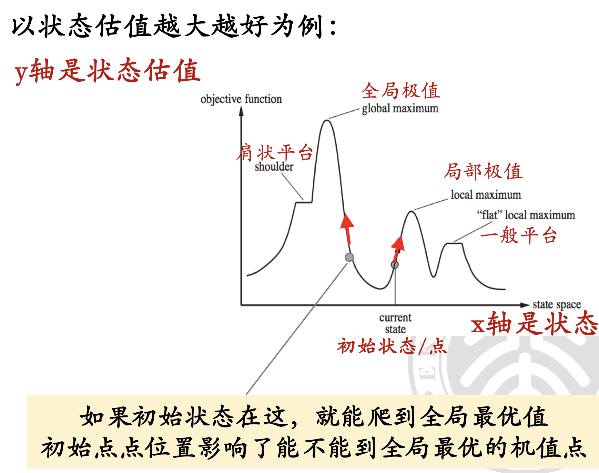
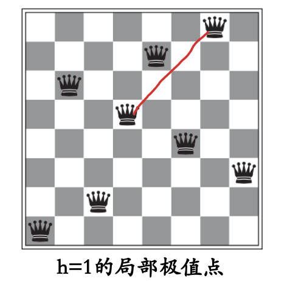
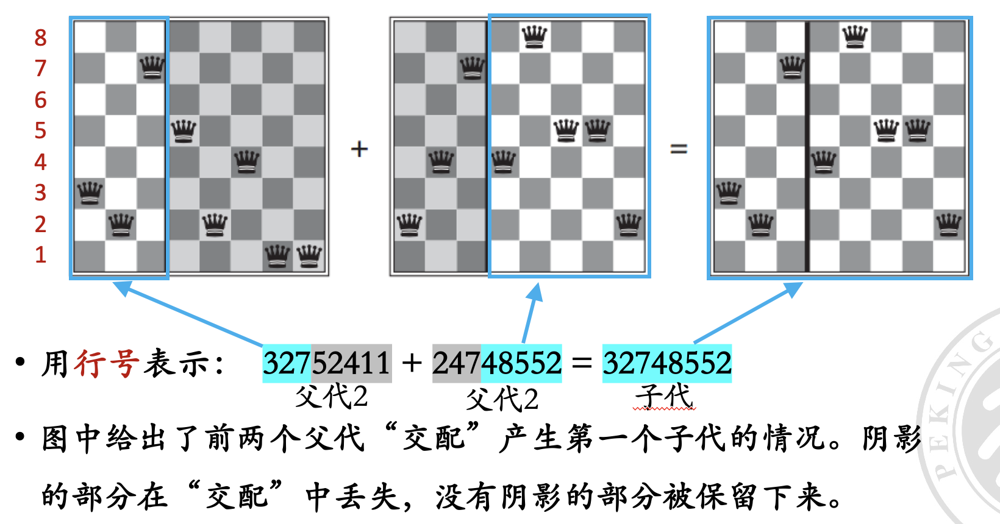
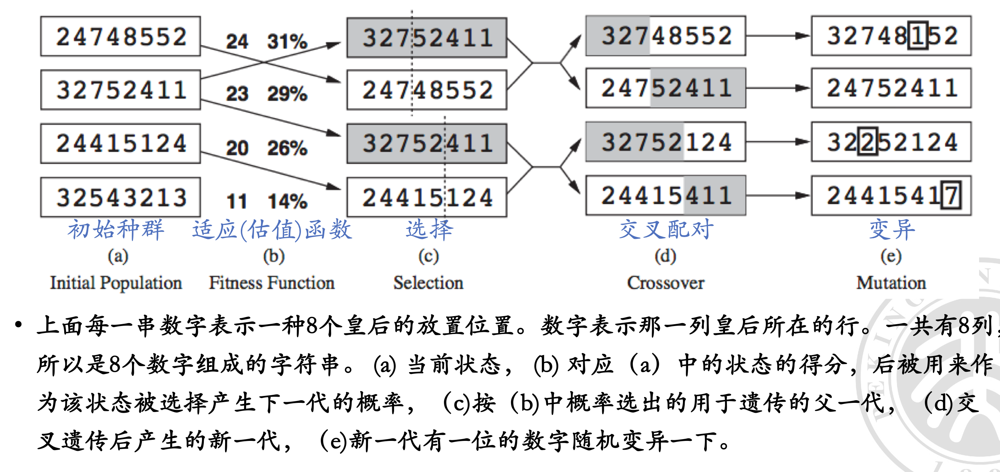

# 局部搜索和优化

<center>
  by <a href="https://github.com/zhuozhiyongde">Arthals</a> / GPT4 / Claude 3 Opus
  <br/>
  blog: <a href="https://arthals.ink">Arthals' ink</a>
</center>

## 局部搜索算法

### 全局搜索回顾

-   **全局搜索**：从初始状态出发，遍历整个动作序列空间寻找目标状态。全局搜索需要记住搜索路径，**受到内存限制，不适合解决超大规模问题**。
-   **无信息搜索**：盲目遍历整个动作序列空间。
-   **A\***：使用问题相关的启发式函数加快搜索。

### 局部优化

为了快速解决 100+ 皇后问题，我们不再寻找全部解，而是 **只找一个可行解**。

为此，我们不再关心得到解的路径（因为全局搜索路径太长，内存不够），只需要得到解。我们将启发式函数被改成状态估值函数，并充分利用它来寻找解。

**局部调整**：先将八个皇后随意摆放到棋盘的八列上，然后调整被攻击的皇后，直到八个皇后互不攻击。

### 模型描述

-   **初始状态 $S_0$**：八个皇后在棋盘上，每列有一个皇后。
-   **动作**：移动任意列上的皇后到同列其他行（$8 \times 7$ 种可能）。
-   **状态转移**：移动后棋盘的样子（ **邻居** 状态，注意不再是父子状态，它们是 **并行** 关系，56 个）。
-   **目标状态 Goal**：皇后不互相攻击。
-   **状态估值函数 $h$**：互相攻击的皇后对的数目，表示当前状态的好坏。$h(S)$ 以当前状态 $S$ 为输入，输出一个评估值。

### 算法定义

1. **初始状态**：在每一列的随机位置放一个皇后。因为如果 8 个皇后不相互攻击，那么 8 个皇后肯定是在不同列的。
2. **动作定义**：每个皇后只能在自己的列上换行，每个皇后有 7 个可能的动作，8 个皇后一共有 56 个可能的动作。
3. **状态估值函数**：$h$ 表示当前状态的好坏。如果两个皇后可以相互攻击，则 $h$ 加 1。

### 优化目标

目标：使估值函数 $h$ 最小化，目标是 $h=0$。

策略：不断地将当前状态移动到邻居状态中估值更低（或者更高）的位置。直到到达目标状态。

### 优化过程

基本思路：从一个初始状态出发，不断地向更好的邻居状态移动

算法终止：当邻居状态中没有比当前状态更好的状态时（也即来到了 **局部极值点** ），算法终止。

**最优性条件**：**局部最优解不一定是全局最优解**，但是局部最优解是全局最优解的一个 **可能解**。如果全局只有一个极值点，那么局部最优解就是全局最优解。

### 解空间的形状



假设状态是一个连续变化的值，X 轴表示状态 $x$，Y 轴表示评估值 $f(x)$。一维情况的评估值变化如上图所示。

-   **局部极值**：某个区域内，某个点的评估值最高（或最低）。多个局部极值点存在时，贪婪策略最终到达的极值点取决于 **初始状态**。
-   **全局最优**：全局最优解是所有局部最优解中评估值最高（或最低）的解。
-   **平台**：邻近状态评估值相同，无法决定移动方向。
-   **肩状平台**：一侧评估值可上升，另一侧下降。

实际情况中，状态的维度会更高（甚至无法可视化）。

### 解空间形状带来的问题

#### 跳出局部极值点而奔向全局最优点的方法

-   使用 **模拟退火** 算法，通过引入概率性跳出局部极值。
-   采用 **遗传算法**，通过选择、交叉和变异操作，探索更大的解空间。

这两个在后文都会有介绍。

#### 进入平台时的解决方法

-   **随机重启**：多次从不同的初始点运行算法，增加找到全局最优解的概率。
-   **扰动方法**：在解空间中引入小的随机扰动，打破平台的均衡状态。

#### 局部优化算法的完备性和最优性

-   **完备性**：如果目标存在，则算法总能找到。
-   **最优性**：算法能找到全局最优解。

## 爬山法（Hill Climbing）

爬山法是一种局部搜索算法，主要用于求解优化问题。以下是几个主要版本及其特点：

### 最陡下降爬山法（Steepest-Ascent Hill-Climbing）

#### 算法

-   每次选择相邻节点中评估值 **最优（这暗示最陡）** 的一个，移动到该节点。
-   算法会在一个 **山峰** （即四周点的评估值都比它低，**局部最优值** ）处停止。
-   **不存储搜索树**，只存储 **当前节点** 和一个 **估值函数**。

#### 伪代码

1. 将初始状态设置为当前状态。
2. 循环：
    - 找出当前状态下估值最大的邻居节点。
    - 如果邻居节点的估值小于当前状态，则返回当前状态作为解。
    - 否则，将当前状态更新为邻居节点。

优点：内存开销小，只需要存储当前状态。

缺点：可能陷入 **局部最优**。



#### 优化：随机平移

随机选择一个估值函数的值相同的邻居节点，尝试跳出局部最优。需要设置一个 **移动次数上限**，避免死循环。

只能跳出 **肩状平台** （一侧），无法跳出整体平台。

### 随机爬山法（Stochastic Hill-Climbing）

#### 算法

-   **从更优的邻居点中随机选择一个** 进行移动，而 **不是选择最优点** （像最陡爬山法一样）。
-   比最陡下降爬山法 **收敛慢**，但在某些空间中 **可能找到更优的解**。
-   选择概率可以根据陡峭程度设定，以加速收敛。

### 第一选择爬山法（First-Choice Hill-Climbing）

#### 过往缺陷

最陡爬山和随机爬山法都要计算所有邻居的估值，也即 **生成估值表**，当邻居很多的时候，需要的计算量很大。

第一选择爬山法通过每次只计算一个状态来避免此问题。

#### 算法

-   **随机选择一个邻居**，如果它比当前状态好，就立即移动到邻居状态。否则，继续随机选择邻居，直到找到一个比当前状态好的邻居。
-   **不需要生成估值表**，每次只需要计算一个状态的估值。

### 随机重启爬山法（Random-Restart Hill-Climbing）

#### 过往缺陷

之前的算法都是 **不完备** 的，因为可能陷入局部最优。

随机重启爬山法通过选择多个随机初始状态（类似暴力算法）来在一定程度上解决这个问题（没有完全解决），多次尝试寻找最优解，达到 **近乎完备**。

#### 算法

-   **找不到解时，从随机位置重新开始**。

-   多次随机产生初始状态，接近完备，因为总会有一个初始状态能找到解。

成功与否 **取决于状态空间的形状**，如果局部极值和平台不多，能快速找到好的解。

如果一次就找到最优解成功率是 $p$，那么期望的重启次数是 $1/p$。

## 模拟退火算法

### 过往问题

#### 爬山法

只向更优邻居点移动，不会向状态估值更差的邻居移动，可能 **陷入局部极值**，因此是不完备的。

#### 纯粹的随机游走算法

-   不使用 $h(n)$ 的搜索算法。
-   等概率地向任何一个邻居移动，是 **完备** 的，但却是 **非常低效的**。

### 伪代码

```c
function SIMULATED_ANNEALING(problem, schedule)
    '''
    returns a solution state
    inputs: problem,
        schedule, # 一个从时间 t 到温度 T 的映射函数

    current ← MAKE-NODE(problem.INITIAL-STATE)
    '''
    for t = 1 to ∞ do # t 是时间步
        T ← schedule(t)  # 时间t到温度T的映射函数
        if T = 0 then return current
        next ← a randomly selected successor of current
        ΔE ← next.VALUE - current.VALUE
        if ΔE > 0 then current ← next
        else current ← next only with probability e^(ΔE/T)
```

#### 关键概念

-   **温度**：表示为 $T$，随着时间 $t$ 的变化而变化。

-   **ΔE**：表示邻居状态值与当前状态值的差。

-   **概率跳跃**：以概率 $e^{\Delta E / T}$​ 决定是否跳跃到新的邻居状态。

    -   $T$ 在指数分母上，随着时间增加跳跃概率越来越小。
    -   $\Delta E$ 在指数分子上，跳跃概率为随着 $\Delta E$ 的增加而增加。

        当 $\Delta E$ 为正时，跳跃概率为 1，直接跳跃到新的邻居状态。这对应邻居估值高于当前状态，跳过去是优化的。

        当 $\Delta E$ 为负时，跳跃概率为 $e^{\Delta E / T}$​，跳跃概率随着温度的降低而降低。这对应跳过去是非优化的。但是正是因为在非优化的情况下还有概率选择跳跃，所以模拟退火算法能够跳出局部最优，增加达到全局最优的可能。

#### 超参数（Hyper-parameters）选择

-   **初始温度（步幅）**：应设定多大？
-   **降温速率**：以何种速率降低温度？
-   **终止温度**：温度降到什么程度可以报告解？

具体问题具体分析：根据具体问题调整超参数。

### 总结

-   初期允许以较大概率向下走，概率与 “坏” 的程度成指数关系。

-   随时间推移，概率变小，温度下降。

若温度足够慢地下降，算法会最终以 **接近 1 的概率找到全局最优解**。

### 对比

爬山法与模拟退火法对比：

-   **爬山法**：简单搜索法，可能陷入局部最优。
-   **模拟退火**：通过概率跳跃机制，有效跳出局部极值，寻找全局最优解。

**内存开销**：这两个算法都只记录当前节点（而不是像之前的搜索树一样记录全部的节点状态），内存不会随着时间增加。

## 局部束搜索（Local Beam Search）

### 算法过程

1. 从 $k$ 个随机生成的初始状态开始。
2. 每一步，所有 $k$ 个状态各自生成后继，共有 $k \times b$ 个后继。
3. 若 $k \times b$ 个后继中有一个是全局最优点，则算法结束。否则，从 $k \times b$ 个后继中找出 $k$ 个最好的后继作为新状态，继续算法。

### 比较

-   随机重启爬山法：各搜索独立进行，**不通讯**。
-   局部束搜索：第 3 步中选择最优的 $k$ 个后继作为新状态，**这些状态间相互通讯**。如果一个状态找到多个好的后继，会告知其他状态一同继续搜索。

### 问题

基础版本的局部束搜索易于聚集到状态空间中的一个小局部区域，缺乏多样性，使得在寻找更优解方面与爬山法相似，容易陷入局部极值点。

### 缓解方案

一种变种是 **随机束搜索（Stochastic Beam Search）**，类似于随机爬山法，能减轻陷入局部极值点的问题。随机束搜索不再选择 $k$ 个最好的后继，而是根 **据一个函数计算出与后继优劣程度相关的值**，并以此为概率选择 $k$ 个后继。

随机束搜索类似于 “自然选择法则”：适者生存概率高，不适者死亡概率高。

## 遗传算法（Genetic Algorithms）

遗传算法是 **随机束算法** 的一个变种。与单个状态产生后继节点不同，遗传算法的后继节点是由 **两个父状态结合** 产生的。这类似于父母生成孩子的过程，因此称为遗传算法。





### 主要特点

-   **后代多样性大**：遗传算法类似于 **高级生物的有性繁殖**，**后代多样性大**，变异概率高，**不易陷入局部最优**。
-   与之对比，局部束搜索和随机束搜索类似于单细胞生物的无性繁殖，后代多样性小，容易陷入局部最优。

遗传算法结合了 **爬山法** 和 **随机探索**，并在并行的搜索线程中交换信息。

-   **交换子串** 是遗传算法的主要优点。
-   数学上，如果父代编码是随机的，交叉并不会带来好处。
-   直觉上，交叉可以将 **具有良好功能的块** 组合在一起，从而产生更好的下一代。

### 总结

-   遗传算法结合了 **爬山法** 和 **随机探索**。
-   **子串交换** 可以将优秀的功能块组合起来，提高后代的质量。

## 连续空间中的局部搜索

### 例子：地图上新建机场

目标： 在地图上新建三个机场，使每个城市与离它最近的机场的距离的平方和最小。

状态空间： 每个机场的坐标 $(x_1, y_1), (x_2, y_2), (x_3, y_3)$。这是一个六维空间。

目标函数：

$$
    f(x_1,y_1,x_2,y_2,x_3,y_3)=\sum_{i=1}^3\sum_{c\in C_i}(x_i-x_c)^2+(y_i-y_c)^2
$$

其中 $C_i$ 表示离机场 i 最近的城市集合。目标是使 $f$ 最小。

### 离散化方法

通过将地图坐标离散化来解决连续问题。

-   每次移动一个机场的 $x$ 或 $y$ 坐标 $±δ$， $δ$ 越小，精度越高。
-   每个机场有 12 个可能的邻居。

#### 局部搜索算法

-   状态： $(x_1, y_1, x_2, y_2, x_3, y_3)$
-   评估函数： $f(x_1, y_1, x_2, y_2, x_3, y_3)$
-   邻居： 一个机场的（$x_i$ 或 $y_i$ $±\delta$）

#### 建模

-   初始状态： $S_0 = (x_1, y_1, x_2, y_2, x_3, y_3)$，随机位置
-   动作： 任何一个 $x_i$ 或 $y_i$ 都可以 $\pm\delta$（12 个合法动作）
-   状态转移： 采取动作后的位置（邻居状态，12 个）
-   目标状态： 使得 $f(x_1, y_1, x_2, y_2, x_3, y_3)$ 最小的 $x, y$ 取值
-   状态估值函数： $h = f(x_1, y_1, x_2, y_2, x_3, y_3)$

#### 注意事项

-   可以使用前面介绍的任何局部搜索算法，例如爬山算法、模拟退火算法等。
-   离散化精度（$δ$）会影响搜索结果的准确性。
-   需要考虑如何处理多个机场同时移动的情况。

#### 优化方法

1. 爬山 / 随机爬山 / 模拟退火

2. 梯度下降 / 上升：

    若函数可微：$x\pm\alpha f'(x)$，其中，$\alpha$ 是学习率 / 步长，$f'(x)$​ 是梯度。此时不需要求具体的离散后的邻居的估值都可以知道方向

    - 如果 $\alpha$​ 太小，需要太多的步骤、更新慢
    - 如果 $\alpha$ 太大，搜索可能会越过极值点

    若估值函数不可微，则使用 **经验梯度** 的值法

和在离散空间一样，在连续空间里，局部搜索算法的最大难题仍是 **局部极值和平台**。为此，采用和离散空间一样的随机重启和模拟退火经常是有效的。

可以类推一维的情况到高维。

## 八皇后问题的 CSP 建模

八皇后问题可以建模成 “约束满足问题”（CSP）

约束满足问题（CSP, Constraint Satisfaction Problem）是指在一组变量和一组约束条件下寻找一个变量赋值的过程，使得所有变量满足给定的约束条件。CSP 可以用来解决各种组合优化问题，如调度问题、地图着色问题等。

八皇后问题的目标是将八个皇后放置在一个 8x8 的国际象棋棋盘上，使得没有两个皇后处于同一行、同一列或同一对角线上。我们可以通过以下步骤将其建模为一个 CSP：

1. **变量定义**：定义 8 个变量，每个变量表示一个皇后的位置。通常用 $Q_i$ 表示第 $i$ 行上的皇后所在的列位置。
2. **变量取值范围**：每个变量 $Q_i$ 的取值范围是 $\{1, 2, 3, 4, 5, 6, 7, 8\}$，表示皇后可以放在第 $i$ 行的任意一列。
3. **约束条件**
    - 不同变量取值不同：即 $Q_i \neq Q_j$ （不同的皇后不能在同一列）。
    - 不在同一对角线：即 $|Q_i - Q_j| \neq |i - j|$（不同的皇后不能在同一对角线上）。

### 算法

1. **初始化**：随机放置 8 个皇后，使其符合所有行和列约束。
2. **冲突检测**：计算当前放置下的冲突数，即有多少对皇后彼此攻击。
3. **冲突最小化**：通过移动某个皇后减少冲突。例如，选择冲突最多的皇后，尝试移动到其他列，看哪个位置的冲突最少。
4. **迭代**：重复冲突检测和最小化，直到没有冲突（即找到解）或达到预定的最大迭代次数。

## 约束满足问题（CSP, Constraint Satisfaction Problem）

约束满足问题将一个系统和它的状态当作一个整体，寻找状态解。

-   一个约束满足问题有三个组成部分，$X$，$D$ 和 $C$：

    -   $X$ 是 **变量**，$\{X_1, X_2,..., X_n\}$。
    -   $D$ 是 **值域**，$\{D_1,..., D_n\}$，每个变量一个值域（取值范围）。
    -   $C$ 是 **约束**，用于描述变量取值之间的关系。

-   每个值域 $D_i$ 包含一组对于变量 $X_i$ 可行的取值 $\{V_{i_1},..., V_{i_m}\}$；每个约束条件 $C_j$ 包含一对数值 $\langle scope, rel\rangle$，$scope$ 是约束条件中涉及的变量，$rel$ 定义了变量的取值范围之间的关系。

### CSP 问题的解

-   在 CSP 问题中，令每个变量一个取值，$\{X_1=v_1, X_2=v_2,...\}$，如果 **不违背任何一个约束条件**，则称为这个 CSP 问题的一个 **可行解**。可能存在多个可行解。
-   如果我们给定一个解的评价方式，则我们还可以寻找一个 **最优解**。**最优解不是一定是可行解**，但是是可以找到最好的解。

在实际约束问题中，我们可能需要寻找：

1. 一个可行解
2. 全部可行解
3. 一个最优解

### 把问题建模成约束满足问题 CSP 的原因

-   可以表示很宽泛的类别的问题。设计通用 CSP 求解器，使用 **自动优化技术** 迅速排除大量的无关搜索空间，比基于状态空间的搜索算法更快。

-   知道为什么某个赋值不是解。发现一个部分赋值不是解时，知道是哪个变量的赋值违背了哪个约束，并可以立即放弃对当下路径后续探索。

许多使用传统方法不能解出的问题，建模成 CSP 问题可以很快地解出。

### CSP 模型变量的类型

变量 $X$：类型可以是 **离散的**，也可以是 **连续的**。

值域 $D$：可以是 **有限的**，也可以是 **无限的**。

> **离散类型变量的取值** 也可以是 **无限的**，例如 **整数**，或者是 **字符串**。

### CSP 约束条件的类型

#### 用 C 描述约束的量来对其分类

-   **一元约束** （unary constraint）：针对单个变量取值的约束。
-   **二元约束** （binary constraint）：涉及到两个变量。
-   **三元约束** （ternary constraint）：例如，变量 $Y$ 的取值要在变量 $X$ 和 $Z$ 之间，表示成三元约束，Between $(X,Y,Z)$。
-   **全局约束** （global constraint）：**含有任意多个变量**，最常见的全局约束是 **All diff**，其含义是所有变量的取值必须互不相同。

#### 用 C 是否是强制性的来分类

-   **绝对约束**：违背这种约束意味着排除了成为解的可能性。

-   **优先约束** （preference constraints）：用来描述哪些是优先选择的，**可用表示来优先**。

    优先约束一般会观察给每个变量的取值增加一个代价（costs），这样，含有优先约束的 CSP 问题就称为约束优化问题（constraint optimization problem），简称 COP。

### 约束传播：CSP 中的推理

在普通的状态空间搜索中，我们能做的事情 **只有搜索**。

而在 CSP（约束满足问题）中，除了搜索，还可以进行 **推理（也称为约束传播）**。

**约束传播**：通过使用约束来 **减少一个变量的可能取值，从而减少其他变量的可能取值**。约束传播可以与搜索相结合，也可以先进行约束传播的预处理，然后再进行搜索。

有时，预处理就可以解决全部问题，不用再进行搜索。

### 点一致

点一致指变量的所有取值都满足一元约束。通过点一致性算法去除不满足一元约束的取值。

> 例：如果 $X$ 的取值范围是 $\{1, 2, 3\}$，且有约束 $X \neq 2$，那么经过点一致处理后，$X$ 的取值范围变为 $\{1, 3\}$。

### 边一致

边一致指变量的所有取值都满足二元约束。

> 例：如果 $X$ 和 $Y$ 的取值范围分别是 $\{1, 2\}$ 和 $\{2, 3\}$，且有约束 $X < Y$，那么经过边一致处理后，$X$ 的取值范围变为 $\{1\}$，$Y$ 的取值范围变为 $\{2, 3\}$​。

我们称一个 **网络是边一致** 的，如果每个变量相对于 **其他任意变量** 都是边一致的。

### 约束传播的应用

在 CSP 中，我们使用约束传播来去除不合理的解，从而缩小值域。根据约束的分类（如一元、二元、三元等），我们可以有相应的约束传播方法。除了点一致和边一致，还有三元约束、四元约束等。

使用约束传播可以去除不合理的解，从而缩小值域，提高解决问题的效率。
