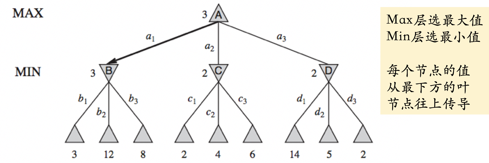
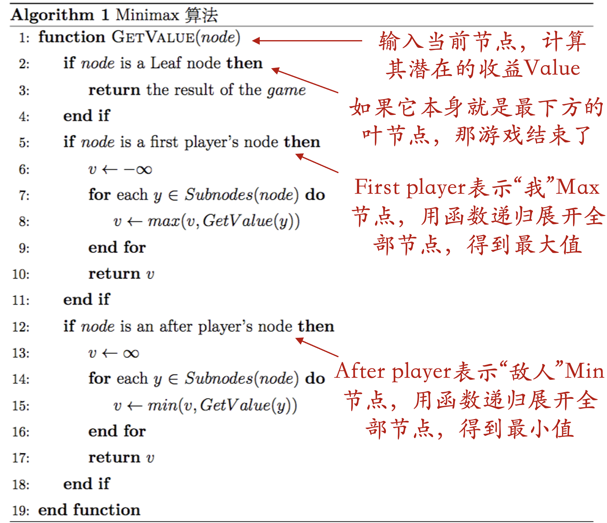
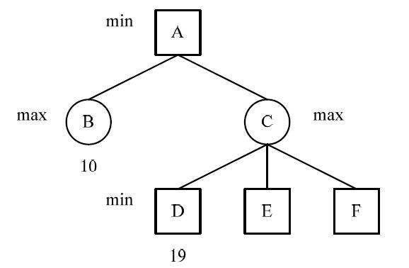
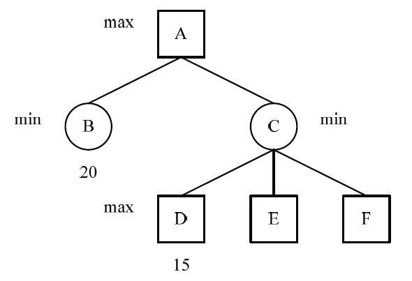
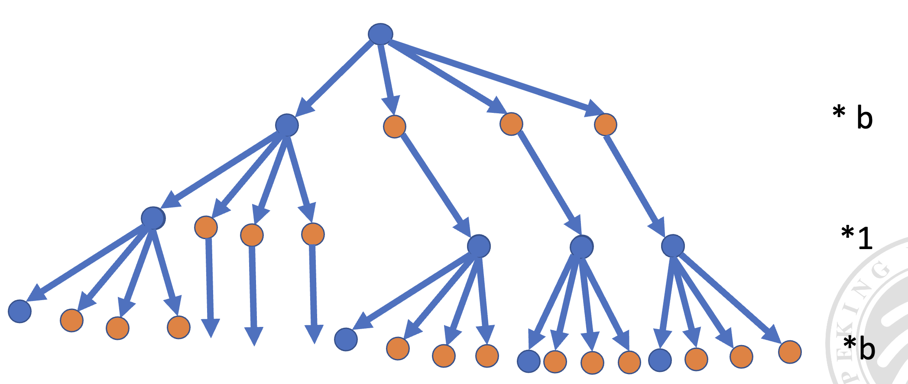
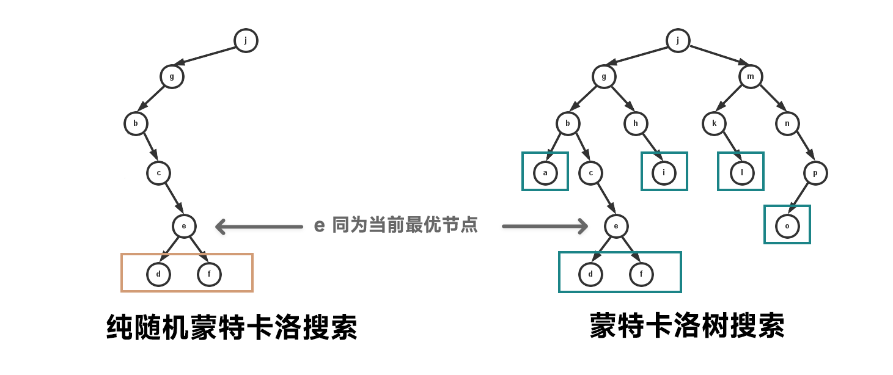
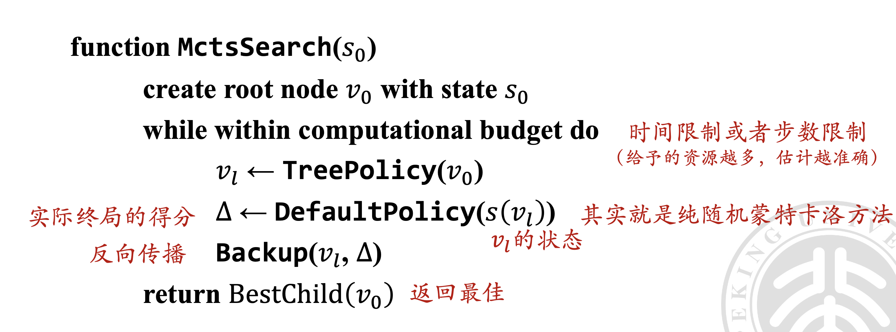
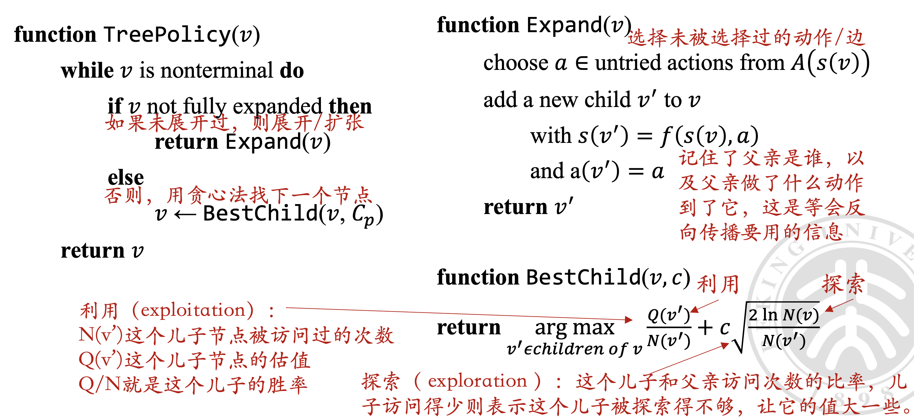
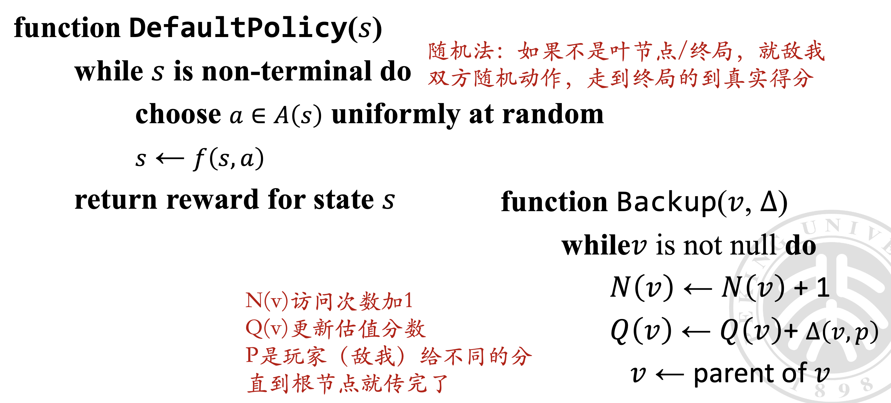

# 对抗搜索

<center>
  by <a href="https://github.com/zhuozhiyongde">Arthals</a> / GPT4 / Claude 3 Opus
  <br/>
  blog: <a href="https://arthals.ink">Arthals' ink</a>
</center>

## 问题模型

### 对抗性

在零和游戏中，总收益为零，**一方的收益必然是另一方的损失**。常见于竞争性环境，如内卷现象。

非零和游戏中，总收益不为零，各方通过最大化自身利益，**有时还需要合作**。损人不一定利己，可以多方共同从第三方获取收益。

### 人数分类

-   单人游戏：仅一个参与者
-   双人游戏：两个参与者
-   多人游戏：三个及以上参与者

### 随机性

-   确定性游戏：动作引发的后果是确定的
-   非确定性游戏：动作引发的后果是不确定的

### 状态可见性

-   完全信息游戏：所有信息对所有玩家都是已知的
-   非完全信息游戏：对玩家存在未知信息

### 同步性

-   同步游戏：所有玩家同时进行决策
-   异步游戏：玩家依次进行决策

### 环境的可变性

-   环境信息不变游戏：游戏环境信息保持不变
-   环境信息变化游戏：游戏环境信息会发生变化

## 双人零和游戏

### 游戏定义

一个双人零和游戏可以定义为一个 **搜索** 问题，包含以下元素：

-   `S0`：初始状态，描述游戏开始时的状态。
-   `PLAYER(s)`：在某个局面下，轮到哪个玩家选择动作。
-   `ACTIONS(s)`：返回在某个状态下的合法动作集合。
-   `RESULT(s,a)`：状态转移模型，一个动作执行后到达哪个状态。
-   `TERMINAL-TEST(s)`：游戏结束返回 `true`，否则返回 `false`。游戏结束时的状态称为终止状态。
-   `UTILITY(s, p)`：效用函数（目标函数或者支付函数），表示游戏结束时玩家 $p$ 的得分。零和游戏中，所有玩家得分的和为零。

### 搜索树复杂性

游戏的难点在于 **搜索树可能非常大**。

-   国际象棋
    -   平均每步有 35 个选择。
    -   每个选手需要走 50 步，两人总共 100 步。
    -   搜索树节点数：$35^{100}$ 或 $10^{154}$ 个节点。
-   围棋
    -   平均每步有 250 个选择。
    -   每个选手需要走 150 步，两人总共 300 步。
    -   搜索树节点数：$250^{300}$ 或 $10^{720}$ 个节点。

过往的搜索算法无法遍历和存储如此大的搜索树，这使得问题变得非常困难。

然而，即使无法计算最优动作，游戏依然需要做出某种决策。为此，我们需要进一步优化搜索过程。

## 极大极小搜索 MINIMAX

MINIMAX 方法遍历所有可能发生的局面，找出最佳方案。其假设 **对手和自己一样聪明**，对手总是 **最小化** 你的收益，而你则 **最大化** 自己的收益。你采取的方案是 **相对稳妥** 的方案。

这就是极大极小（Minimax）搜索的雏形，其基本思路如下：

-   **状态**：局面
-   **动作**：在该局面下，该走棋的玩家的合法动作
-   **状态转移**：一步过后的所有可能局面
-   **极大极小搜索**：在决策树上的游历，假设敌人和自己一样聪明



> 这张图中，各个层的选值都是选择下面的分支的，然后传递到上面的分支

### 伪代码



可以通过合并符号来简化伪代码，得到一个类似于如下的序列：

$$
-1,1,-1,1,-1,1,-1,1,\ldots
$$

```c
function GetValue(node, α, β)
    if node is a Leaf node then
        return the result of the game
    end if
    v ← -∞
    for each y ∈ Subnodes(node) do
        v ← max(v, -GetValue(y, -β, -max(α, v)))
        if v > β then
            return v
        end if
    end for
    return v
end function
```

其中核心一句在 `v ← max(v, -GetValue(y, -β, -max(α, v)))`，这句话会不断地颠倒上下界，从而使得一个一直取上界的 `GetValue` 函数等价于原先的交替取上下界的版本。

极大极小搜索算法采用 **深度优先搜索算法**。假设搜索树的深度是 $m$，每个结点有 $b$ 个合法操作，则极大极小算法的时间复杂度是 $O(b^m)$​。空间复杂度如下：

-   展开所有儿子结点：$O(b^m)$
-   只展开一个儿子：$O(m)$

## 记忆与估值

1956 年，IBM 的 Arthur Samuel 制作了西洋跳棋 AI，能够轻松打败新手玩家。该 AI 基于极大极小搜索，并增加了 **学习能力**，包括：

-   **死记硬背学习**：直接使用之前极大极小搜索的计算结果对每步进行估值。
-   **一般化学习**：通过 **参数化** 的估值函数，不断调整参数以缩小计算 **估值** 和实际评价的差距。

这种学习方法带来了 AI 水平的突破性进展。深蓝和 AlphaGo 都是上述第二种算法的演化版本，利用参数化模型预测真实估值。

> 这里的估值，可以理解为先前神经网络中，你训练得到的推理结果。
>
> 缩小估值与实际评价的差距，就是类似于之前不断反向传播从而减小损失函数，提高神经网络性能。

## Alpha-Beta 剪枝算法

Alpha-Beta 剪枝算法在搜索时返回与极大极小搜索相同的结果，但 **忽略** 了搜索树上那些不会影响最终结果的部分。可以认为，Alpha-Beta 剪枝算法是极大极小搜索算法的简化版本。

剪枝：是指在搜索树中去掉一些分支，以减少计算量。这里的剪枝是 **无损失** 的，不会影响最终结果。

### 伪代码

```c
function ALPHA-BETA-SEARCH(state) returns an action
    v ← MAX-VALUE(state, -∞, +∞)
    return the action in ACTIONS(state) with value v
```

-   这个函数是搜索的入口。它接受当前的状态节点 `state`，并调用 `MAX-VALUE` 函数开始搜索
-   初始条件：最大下界 $\alpha$ 设置为 $-\infin$，最小上界 $\beta$ 设置为 $+\infin$。
-   由于我们要最大化自己的效益函数，所以通过 `MAX-VALUE` 函数来遍历当前节点的子节点（以及更多的后继节点），`MAX-VALUE` 函数返回的是一个价值 $v$，我们根据这个 $v$ 找到对应的动作 `action`。

```c
function MAX-VALUE(state, α, β) returns a utility value
    if TERMINAL-TEST(state) then return UTILITY(state)
    v ← -∞
    for each a in ACTIONS(state) do
        v ← MAX(v, MIN-VALUE(RESULT(state, a), α, β))
        if v ≥ β then return v
        α ← MAX(α, v)
    return v
```

-   初始条件：如果当前状态是终止状态（`TERMINAL-TEST(state)`），直接返回状态的效用值 `UTILITY(state)`。

-   初始化：将 $v$ 初始化为 $-\infin$，因为我们现在是在 Max 层，所以我们的目标是不断的 **最大化下界** 以提高我们的效用函数的输出，这对应了后续的更新 $\alpha$ 的操作。

-   遍历动作：对每个可能的动作 `a`，计算该动作结果状态的价值。这个结果状态通过 `MIN-VALUE` 函数评估。注意，与 `MAX-VALUE` 函数相对，`MIN-VALUE` 函数代表对手，其目标是不断地 **最小化上界** 以削弱我们效益函数的输出。在这个循环遍历的过程中，我们会不断的更新 $v$​，它指示本层可能拿到的最大值。

-   **剪枝条件**：如果本层可能拿到的最大值 $v$ 的值已经累进到大于或等于 $\beta$，则可以停止继续评估剩下的动作，直接返回 $v$。这是因为我们是一个 `MAX-VALUE` 函数节点，我们会在下一层的 `MIN-VALUE` 节点们提供的输出中选择一个，而 **下一层的 `MIN-VALUE` 节点们提供的最小上界 $\beta$ 中最大的一个会被选择为当前层的最大下界 $\alpha$** 。而继续搜寻剩余的 `MIN-VALUE` 节点只有可能提供更小的 $\beta$，这于我们更新 $\alpha$​ 无益。

    

    > 极小值冗余如图所示，这是一颗博弈树的某一部分，节点 B 的值为 10（$\beta=10$），节点 D 的值为 19，这里，C 节点为取最大值 max 节点。
    >
    > 因此，C 的值将大于等于 19（$v \geq 19 \geq \beta$）；
    >
    > 节点 A 为取极小值的 min 节点（这就是 $v \geq \beta$ 推知剪枝的根本原因），
    >
    > 因此 A 的值只能取 B 的值 10，也就是说不再需要求节点 C 的子节点 E 和 F 的值就可以得出节点 A 的值。
    >
    > 这样将节点 D 的后继兄弟节点减去称为 Beta 剪枝。[^1]

-   更新 $\alpha$：如果 $v$ 大于当前的 $\alpha$，则更新 $\alpha$，即 `α ← MAX(α, v)`。

-   最后，返回 $v$​​。

**这里建议参照 [OI Wiki / Alpha-Beta 剪枝](https://oi-wiki.org/search/alpha-beta/) 的具体图例理解。**

```c
function MIN-VALUE(state, α, β) returns a utility value
    if TERMINAL-TEST(state) then return UTILITY(state)
    v ← +∞
    for each a in ACTIONS(state) do
        v ← MIN(v, MAX-VALUE(RESULT(state, a), α, β))
        if v ≤ α then return v
        β ← MIN(β, v)
    return v
```

-   分析类似上面 `MAX-VALUE` 的情形。

-   剪枝条件：

    

    > 极大值冗余如图所示，这也是一颗博弈树的某一部分，节点下的数据为该节点的值，节点 B 的值为 20（$\alpha = 20$），节点 D 的值为 15，这里，C 为取极小值的 min 节点。
    >
    > 因此节点 C 的值将小于等于 15 （$v \leq 15 \leq \alpha$​）；
    >
    > 节点 A 为取最大值 max 的节点（这就是 $v \leq \alpha$ 推知剪枝的根本原因），因此 A 只可能取到 B 的值，也是就说不再需要搜索 C 的其他子节点 E 和 F 的值就可以得出节点 A 的值。
    >
    > 这样将节点 D 的后继兄弟节点减去称为 Alpha 剪枝。[^1]

### 剪枝条件总结 [^1]

-   当一个 Min 节点的 $β$ 值 ≤ 任何一个父节点的 $α$ 值时 ，剪掉该节点的所有子节点
-   当一个 Max 节点的 $α$ 值 ≥ 任何一个父节点的 $β$ 值时 ，剪掉该节点的所有子节点

### 二合一伪代码

```c
function GetValue(node, α, β)
    if node is a Leaf node then
        return the result of the game
    end if
    v ← -∞
    for each y ∈ Subnodes(node) do
        v ← max(v, -GetValue(y, -β, -max(α, v)))
        if v > β then
            return v
        end if
    end for
    return v
end function
```

### 复杂度分析

#### 最好情况

1. 节点展开情况：

    - 第一层：每个节点生出 $b$ 个儿子
    - 第二层：每个节点生出 1 个儿子
    - 第三层：每个节点生出 $b$ 个儿子
    - 依次类推，一层 $b$、一层 1、一层 $b$...

    

2. 层数关系：假设树的最大深度为 $m$，则有 $b$ 的层数为 $m/2$

在最好的情况下，我们只需检查 $O(b^{m/2})$ 个节点即可找到最优解。这比 Minimax 算法的 $O(b^m)$ 复杂度要好得多。具体来说：

-   每个状态平均有 $\sqrt{b}$ 个选择，而不是 $b$ 个选择
-   从另一个角度看，Alpha-Beta 算法可以在相同时间内比 Minimax 算法搜索更深一倍的节点

#### 最差情况

在最差情况下，Alpha-beta 剪枝算法并不能减少任何节点的评估数量。这种情况发生在节点按照最差顺序进行搜索时，即每次都先访问最不优的节点。其时间复杂度与 Minimax 算法相同，为：$O(b^m)$

#### 平均情况

在平均情况下，Alpha-beta 剪枝算法的时间复杂度介于最优情况和最差情况之间。一般情况下，平均时间复杂度近似为 $O(b^{3m/4})$

## 不完美的实时决策

-   传统方法：minimax 或 alpha-beta 算法直接搜索到终局状态（叶子节点），计算准确的胜负。
-   改进方法：用启发式函数 `Cutoff Test` 在非叶子节点 **进行估值，从而提前截断搜索**。从而避免一直要搜索到叶子节点才能使用 `Terminal Test`

### 状态估值函数的特性

-   **终局状态估值函数和真实得分的一致性**：在游戏的终局状态，状态估值函数必须给出与真实得分一致的值。这意味着当游戏结束时，估值函数应该准确反映当前局面的得分情况。
-   **计算效率**：估值函数的计算不能花费太多时间。
-   **强相关性**：非终局条件下，估值函数在非终局状态下要与最终胜负有强相关性。

采用线性加权函数作为状态估值函数的效果并不好，因为他假设每个特征的贡献是独立的，以及是可以线性估值的，但是在真实情况中，这都是不一定的。

因而，我们可以采用先前的机器学习方法来学到一个的非线性的复杂估值函数，从而拟合真实情况。

当我们有了状态估值函数后，我们就可以用 cutoff test 替代 terminal test，提前返回估值函数 `eval` 的值来加快搜索。

```c
// before
if TERMINAL-TEST(state) then return UTILITY(state)
// after
if CUTOFF-TEST(state, depth) then return EVAL(state)
```

-   在搜索深度达到搜索深度限制 $d$ 时，调用 `eval` 函数返回估值。
-   如果不确定深度，可以使用迭代加深方法。等时间限制到了再停止搜索。
-   估值函数还可以用来对子结点排序，好的节点排在前面，可以提升 Alpha-Beta 剪枝的效率。

$$
\text{H-Minimax}(s, d) =\\
\begin{cases}
\text{Eval}(s) & \text{if } \text{Cutoff-Test}(s, d) \\
\max_{a \in \text{Actions}(s)} \text{H-Minimax}(\text{Result}(s, a), d + 1) & \text{if Player}(s) = \text{MAX} \\
\min_{a \in \text{Actions}(s)} \text{H-Minimax}(\text{Result}(s, a), d + 1) & \text{if Player}(s) = \text{MIN}
\end{cases}
$$

## 蒙特卡洛树搜索

蒙特卡洛方法是一种统计模拟方法，通过大量采样来获得概率估计。这种方法依赖于概率论中的大数定律，即大量重复实验的平均结果将接近于某个确定值。其 **不是** 一个严格意义上的算法。

> 大数定律：
>
> $$
> \lim_{n \to \infty} \frac{1}{n} \sum_{i=1}^{n} X_i = E(X)
> $$

### 纯随机蒙特卡洛方法

纯随机蒙特卡洛方法采用上述模拟思想，运用 **随机搜索** 策略。

#### 算法过程

1. **节点选择**：在当前节点下，存在 N 个可能的后继儿子节点。
2. **估值计算**：
    - 对每个儿子节点进行 M 次随机搜索。
    - 每次搜索中，敌我双方均采用随机动作，直至终局。
    - 通过 M 次搜索的结果，计算每个儿子节点的平均胜率。
3. **决策**：选择胜率最高的儿子节点作为下一步的行动。

#### 缺点

-   **内存利用不足**：该方法未充分利用内存资源。
-   **准确性问题**：除非 M（搜索次数）非常大，否则估值可能不够准确。
-   **重复搜索**：该方法可能导致大量重复状态的搜索，影响效率。

### 蒙特卡洛树搜索

蒙特卡洛树搜索（Monte Carlo Tree Search，MCTS）则是一种通过在决策空间中（模拟）随机采样，并根据结果构建搜索树来在给定域中寻找最优决策的方法。它是一种启发式搜索算法，用于决策树搜索问题。

蒙特卡洛树搜索基于 **统计方法**，计算能力越强，性能越好。其优点在于即使在没有领域知识的情况下也能使用。这绕过了人为设定好的状态估值函数这一困难很大的步骤，而是基于大量的随机采样来估计状态的价值。

与上述纯随机的蒙特卡洛算法不同，MCTS 结合了树搜索，能够记住之前的模拟结果，并利用这些信息来指导未来的搜索，从而避免无效的重复搜索并专注于更有前景的分支。

换句话说，他不会在一条分支下无限下探，在对一条分支的搜索中，他会不断地更新这条分支的价值，一旦其他分支的价值更高，它会转向搜索其他分支。而纯随机的蒙特卡洛算法则会一直在一条分支下搜索后继子孙节点，不可能转向其他分支。



#### 算法过程

1. **选择（Selection）**：从根节点开始，使用子节点 **树策略** 递归向下选择节点，直到找到一个非终止且未访问的子节点。
2. **扩张（Expansion）**：根据可选择的动作，添加一个或多个子节点来展开树。
3. **模拟（Simulation）**：从被选择的节点开始，使用默认策略进行动作选择和状态转换，直到达到终止状态。
4. **反向传播（Backup）**：更新与被选择节点及其祖先节点相关的统计信息。

#### 树策略（Tree Policy）与默认策略（Default Policy）

**树策略** 是蒙特卡洛树搜索（MCTS）中用于选择节点的策略，其核心在于平衡探索（Exploration）和利用（Exploitation）：

-   **探索**：旨在检查尚未充分了解的区域，以发现新的可能性。
-   **利用**：侧重于使用已知且预期效果最佳的区域，以优化当前的选择。

这种平衡确保了搜索过程既能发现新的策略，又能有效利用已知信息。

> 树策略不一定是完全只看模拟胜率的贪心！

树策略负责在蒙特卡洛树搜索（MCTS）的 **选择和扩张** 阶段，从现有的搜索树中选择节点并创建新的叶节点。这一过程是基于当前树的状态和可能的未来收益来决定路径的。

**默认策略** 则是在模拟阶段发挥作用，它从一个非终止状态开始，通过不断模拟游戏直至结束，从而得到一个价值评估。这个评估帮助 MCTS 确定哪些路径可能更有价值。**默认策略是对原先状态估值函数的替换。**

### UCT 算法

UCT（Upper Confidence Bound for Trees）算法是一种蒙特卡洛树搜索（MCTS）的变种，它使用 **置信上界** 来平衡探索和利用。UCT 算法的核心思想是 **在选择节点时，优先选择置信上界最高的节点**。







#### UCB 公式

UCB 公式是用于在 MCTS 中选择最佳子节点的，即 `BestChild` 函数中的计算方法。UCB 的目的是在探索和利用之间找到平衡。

其可以表示为：

$$
\text{UCB} = \frac{Q(v')}{N(v')} + c \sqrt{\frac{2 \ln N(v)}{N(v')}}
$$

-   $\frac{Q(v')}{N(v')}$ （图中的 $Q(v')/N(v')$）代表 **利用（exploitation）**，即节点 $v'$ 的平均价值，其中 $Q(v')$ 是节点 $v'$ 的总价值（例如，获胜的次数），$N(v')$ 是节点 $v'$ 被访问的次数。这一项反映了节点 $v'$ 当前的表现，鼓励算法利用已知的好走法。

-   $c \sqrt{\frac{2 \ln N(v)}{N(v')}}$ （图中的 $c \sqrt{\frac{2 \ln N(v)}{N(v')}}$）代表 **探索（exploration）**，其中 $c$ 是探索参数，$N(v)$ 是父节点 $v$ 的访问次数。这一项 **鼓励算法探索那些访问次数较少的节点**。

在 `BestChild` 函数中，算法会遍历所有子节点 $v'$，计算每个节点的 UCB 值，并选择 UCB 值最大的节点作为最佳子节点。这样，算法就能在已知的好走法和潜在的未知走法之间进行权衡，从而有效地进行树的搜索。

[^1]: https://www.cnblogs.com/devilmaycry812839668/p/15782087.html
