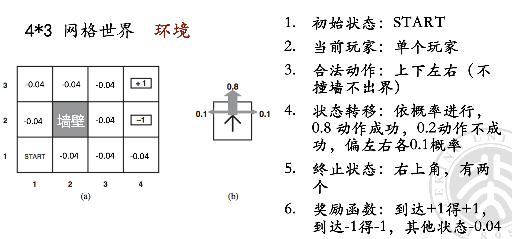
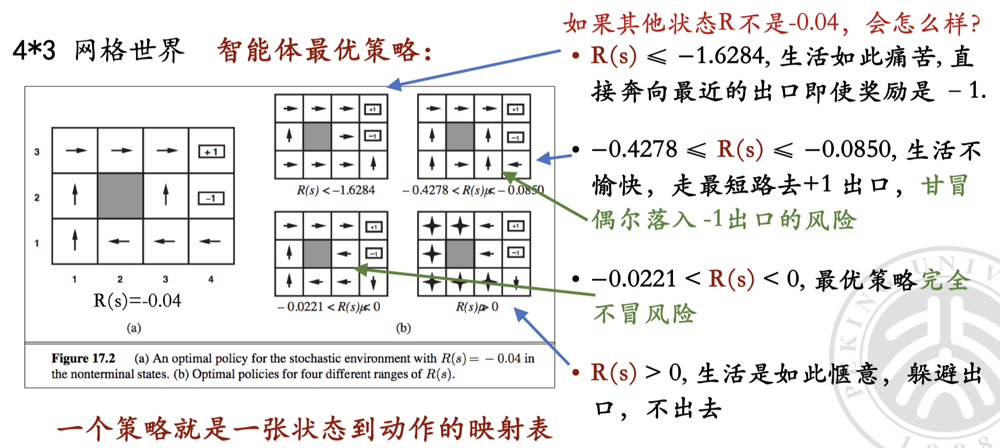
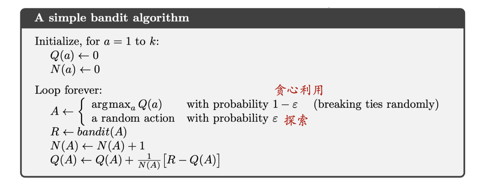
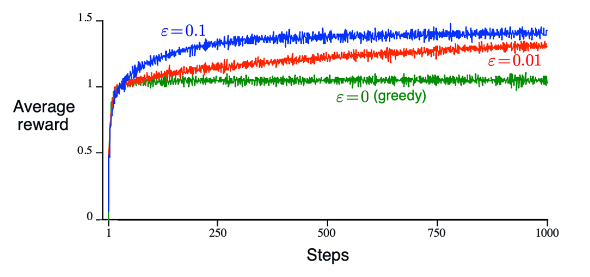
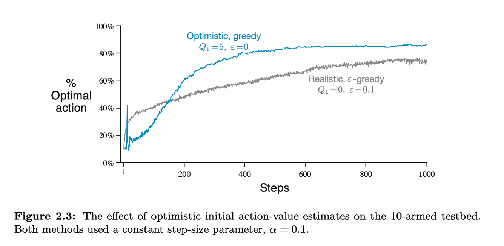
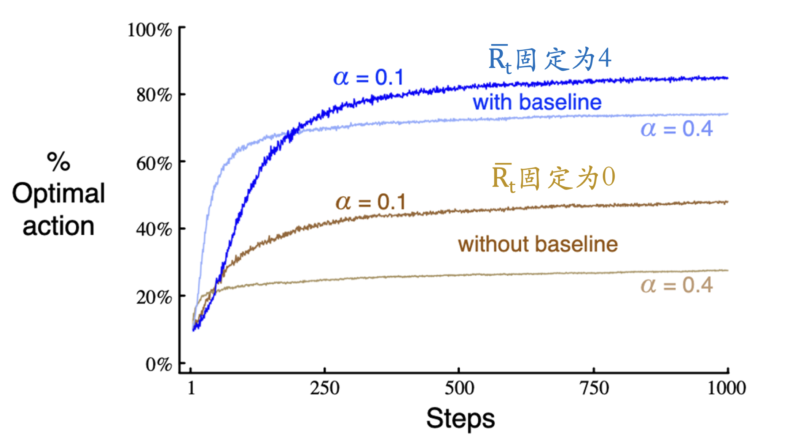

# 强化学习基本思想和问题模型

  by <a href="https://github.com/zhuozhiyongde">Arthals</a> / GPT4 / Claude 3 Opus
   
  blog: <a href="https://arthals.ink">Arthals' ink</a>

## 强化理论

**强化理论（Reinforcement Theory）**：强化理论是一种行为学习理论，认为行为可以通过奖赏和惩罚来改变。

1. **通过奖励和惩罚的方式可以改变智能体的行为方式**
    - 这是强化理论的基本思想。通过提供奖励（正强化）或惩罚（负强化），可以影响智能体的行为，使其趋向于某种特定的行为模式。
    - 正强化：当智能体表现出期望行为时，给予 **奖励**，从而增加该行为的发生频率。
    - 负强化：当智能体表现出不期望行为时，给予 **惩罚**，从而减少该行为的发生频率。
2. **随机奖励可以使智能体上瘾**
    - 随机奖励指的是 **不确定何时会获得奖励的机制**。研究表明，这种不确定性会使智能体更投入于某种行为，因为它们总是期待下一次可能的奖励。
    - 这种机制在现实生活中也很常见，例如赌博和某些电子游戏中，随机奖励机制会让人上瘾。
    - 这里不在课程范围

## 问题建模

### 环境（问题模型）

1. **初始状态** $S_0$ (state)

2. **当前玩家** $C$ (current player (s))

3. **动作** $A$ (action)：智能体在某个状态下的合法动作集合。

4. **状态转移** $P$ (transition)

    $P(S_{t+1} \mid S_t, A_t)$ 用以表示环境，表示在时间 $t$ 时刻，智能体在状态 $S_t$ 下采取动作 $A_t$ 后，转移到下一时刻状态 $S_{t+1}$ 的概率。

    衡量一个环境的 **复杂程度**：某个状态下，智能体采取某个动作后，转移到下一个状态的状态转移模型。可能到达的所有状态构成了 **状态空间** (state space)。所有状态下可行动作，构成 **动作空间** (action space)。

5. **终止状态** $S_T$ (terminate state)

6. **奖励** $R$ (reward)

    $R_t \leftarrow S_t, A_t$，表示智能体在时间 $t$ 时刻，状态为 $S_t$ 并采取动作 $A_t$ 后获得的即时奖励。

    也即某个状态下，智能体采取某动作后得到的分数。

### 智能体（问题的解）

#### 策略 $\pi$

-   $A_t \leftarrow \pi(S_t)$ 用以表示智能体的策略，也即在每一个状态 $S_t$ 下选择动作 $A_t$ 的规则或函数。
-   策略 $\pi$ 是状态 $S$ 到动作 $A$ 的映射关系，给出了智能体在状态 $S$ 下如何选择动作 $A$ 的决策方法。
-   注意：策略 $\pi$ 是 **全局性** 的，任何状态下都要能够给出动作选择。

#### 目标（问题的解）

-   寻找 **最优策略** $\pi$，使得从初始状态 $S_0$ 到终止状态 $S_T$ 的累计收益 $G$ (gain) 最大
-   $G = \sum_{i=1}^T R_i$，表示智能体从初始状态到终止状态过程中所获得的总奖励

## 井字棋问题建模

与先前学习的假设对弈双方都是最聪明（双方都采用最优策略）的 MINIMAX 算法不同，强化学习仅仅假设：

1. 敌人采用的是 **确定性策略** （给定 $S$ 下有确定的 $A$，而不是随机的 $A$），但是不一定是最优策略。
2. 我们可以和敌人进行 **多次对弈**，从而学习到一个好的对敌策略。

显然，这样的假设更为真实，因为我们能够利用真实情况中，敌人决策的失误来对应的调整我们的策略。

### 问题建模

1. **初始状态 $s_0$**：空棋盘

2. **当前玩家**：轮到下子的一方（也可以把对手建模在环境里，每次状态转移返回的状态是 **对手已经落子后的状态**，这样游戏就是单人游戏，否则就是双人游戏）

3. **动作 $A$**：落子到当前为空的位置

4. **状态转移 $P$**：落子之后的棋盘状态（转移到下一个状态）

5. **终止状态 $s_T$**：棋盘满或一方获胜，表示游戏结束的状态。

6. **奖励 $R$**：终止状态，胜者 +1，负者 -1，战平双方均为 0；还没到终止状态的状态（下棋过程中），其奖励为 0

### 解和目标

#### 策略 $\pi$

使用 **状态估值表**，每个状态一个入口（表项），记录从该状态出发到终局的胜率。根据状态估值表选择动作。

-   **学习策略 $\pi_1$**：大概率选择估值最高的下一个状态，小概率随机选一个动作（探索）

-   **目标策略 $\pi^*$**：每次选择通往估值最高的下一个状态（贪心）的动作，也即表示在每个状态下选择最优动作的规则。

#### 目标（问题的解）

**最优策略 $\pi^*$**：使得智能体从初始状态 $S_0$ 下到最终的效率 / 胜率最大

### 训练过程

#### 第一步：建立状态估值表（值函数表）

对于井字棋问题，其 **状态空间比较小** （一个粗略的估计是不超过 $3^9$，每个空可以有 X / O / 空三种状态，但是显然其中还有大量不合法的操作），我们可以用表格存下各个状态的估值。每个状态一个估值，估值表示这个状态到最终的胜率。

我们可以令整个表就是值函数，并在接下来的过程中逐步更新它。

**估值表函数初值**：（根据游戏规则）

-   三个 X 连成一线的状态，价值为 1，因为我们已经贏了。
-   三个 O 连成一线的状态，价值为 0，因为我们已经输了。
-   其他状态的值都为 0.5，表示有 50% 的概率能贏。

#### 第二步：和对手玩很多次

目的：让值函数（估值表）更准确

1. **利用**：大概率贪心选价值最大的地方下
2. **探索**：偶尔随机地选择以便探索之前没有探索过的地方

**利用和探索要平衡**。

**值函数表** 决定了我们的策略，改进值函数表就改进了策略。

#### 第三步：边下边修改状态的值

$$
V(S_t) \leftarrow V(S_t) + \alpha [V(S_{t+1}) - V(S_t)]
$$

其中 **$α$** 是一个小的正的分数，称为步长参数，或者学习率。

-   **初值 $S_0$​**：只有终局的价值是正确的，中间局面的价值都是估计值 0.5（而这是错的）
-   **过程中**：状态价值从后面向前传导
-   **分析**：假设我们一直在一条路径上反复走，每走到终点一次，**终局价值至少向上传一步**，走多了终将把这个终局的输赢带到最上面的初始节点，于是我们在初始节点就会知道最后的输赢
-   通过学习 $V(s)$ 可以得到策略最优策略 $\pi^*$

#### 小结

1. 与上节课 minimax 相比，不再假设对手使用最优策略

2. 将对手建模在环境里：每次采取动作后面临的状态（环境返回的更新后的状态）都是对手执行完它的动作后的新状态，从而建模成单智能体问题。

    也可以建模成多智能体博弈问题，有一个对手决策模型，轮到对手落子时让对手模型决策

3. 用值函数表存储状态估值 / 值函数表 $V(S)$

4. 通过不断对弈更新值函数表

5. 根据值函数表，可以得到贪心选最优动作 $\pi^*$

## 问题模型的泛化和分析

### 环境（问题模型）

1. **初始状态** $S_0$ (state)
2. **当前玩家** $C$ (current player (s))
3. **动作** $A$ (action)
4. **状态转移** $P$ (transition)
5. **终止状态** $S_T$ (terminate state)
6. **奖励** $R$ (reward)

### 智能体

1. **策略** $\pi$
2. **目标（问题的解）** 最大化期望累积收益 $G$

### 环境：状态转移模型 $P$ 和奖励 $R$

#### 状态转移 $P$​

不一定是确定性的，可以按 **概率** 状态转移

$P$：状态转移函数 $\langle S, A, S' \rangle \rightarrow \mathbb{R}^+ $，$P(s, a, s') = \Pr[s' \mid s, a]$

这里 $s$ 和 $a$ 是当前状态和动作，$s'$ 是下一个状态。**返回的是一个概率**。$\langle \rangle$ 尖括号代表一个元组。

对于任意 $s, a$，有 $\sum_{s'} P(s, a, s') = 1$ 。也即，给定 $S$ 所有可行动作 $A$ 下的状态概率之和为 1

#### 奖励 $R$​

也不一定是确定性的，可以是一个 **概率** 奖励

$R$：奖励函数 $\langle S, A, \mathbb{R}^+ \rangle \rightarrow \mathbb{R}^+ $，$R(s, a, r) = \Pr[r \mid s, a]$

这里 $s$ 和 $a$ 是当前状态和动作，$r$ 是奖励。**返回的也是一个概率**。

对于任意 $s, a$，$\sum_r R(s, a, r) = 1$ 。也即，给定 $S$ 和 $A$​ 时所有可能奖励的概率之和为 1

#### 奖励函数对智能体最优策略的影响

可以看到，选择不同力度的奖励函数，会导致智能体选择完全不同的策略。

### 智能体：策略 $\pi$ 和累积收益 $G$

#### 策略 $\pi$

给出的动作选择可以是确定的，也可以是一个 **概率** 分布

-   $\pi$：策略函数 $\langle S, A \rangle \rightarrow \mathbb{R}^+ $，描述状态 $S$ 下采取动作 $a$ 的概率。
-   $\pi(s, a) = \Pr[a \mid s]$，$s$ 是当前状态，$a$ 是当前状态下的可选动作。
-   对于任意 $s$，$\sum_a \pi(s, a) = 1$。

#### 折扣因子 $\gamma$

$0 \leq \gamma \leq 1$，描述未来收益的重要程度，可以使得 $G$ 按照其指数衰减。

-   若 $\gamma$ 为 1，则近的收益和远的收益一样重要。
-   若 $\gamma$ 为 0，则只看下一步的收益（最贪心）。

#### 累积收益 $G$​

-   $G = R_1 + \gamma R_2 + \gamma^2 R_3 + \cdots = \sum_{i=1}^T \gamma^{i-1} R_i$
-   $T$ 可以是有限的也 **可以是无限的**。
-   描述对于某个 $s_1, a_1, s_2, a_2, s_3, a_3, \cdots$​​ 状态动作序列的累积收益。

#### 策略的评估和最优策略

策略 $\pi$ 的好坏用 **状态价值 $V_\pi$** 来评估：

-   **状态价值 $V_\pi(s)$** 表示从状态 $s$ 出发执行策略 $\pi$ 能获得的 **累计收益**。
-   结束状态（如果有）的价值，总是零。

$$
v_\pi(s) \doteq \mathbb{E}_\pi [G_t \mid S_t = s] = \mathbb{E}_\pi \left[ \sum_{k=0}^{\infty} \gamma^k R_{t+k+1} \mid S_t = s \right], \text{ for all } s \in \mathcal{S}
$$

其中，$\mathcal{S}$ 是状态空间。

显然从同一个状态 $S$ 出发，$V_\pi$ 越大，$\pi$ 越好。使得 $V$ 最大的 $\pi$ 就是 **最优策略**，记作 $\pi^*$。执行 $\pi^*$ 得到的价值，就是最优价值，记作 $V^*$​。

#### 状态价值 $V_\pi$ 和动作价值 $Q_\pi$

**状态价值 $V_\pi(s)$** ：定义同前。

**动作价值 $Q_\pi(s, a)$** ：表示从 $s$ 出发并做动作 $a$，之后执行策略 $\pi$ 能获得的累计收益。有些时候计算动作价值更方便。

$$
Q_\pi(s, a) \doteq \mathbb{E}_\pi [G_t \mid S_t = s, A_t = a] = \mathbb{E}_\pi \left[ \sum_{k=0}^{\infty} \gamma^k R_{t+k+1} \mid S_t = s, A_t = a \right]
$$

#### 状态价值 $V_\pi$ 和动作价值 $Q_\pi$​ 的关系

$$
v_\pi(s)=\sum_{a\in\mathcal{A}(s)}\pi(a|s)Q_\pi(s,a)
$$

$s$ 的状态价值：等价于 $s$ 下所有可行的动作 $a$ 的价值的加权和，按照策略选择动作的概率加权。

$$
Q_\pi(s,a)=\sum_{s\in\mathcal{S}}\sum_{r\in\mathcal{R}}p(s^{\prime},r|s,a)[r+\gamma v_\pi(s^{\prime})]
$$

$a$ 的动作价值：等价于 $s$ 下，对所有经动作 $a$ 可以到达的状态 $s'$、获得的奖励 $r$ 对应的 **即时奖励加上折扣后的未来状态价值** $r + \gamma v_\pi(s^{\prime})$ 的加权和，按照所有可能的 $s^{\prime}$ 和 $r$​ 的状态转移概率、奖励概率加权。

### 强化学习的任务

目标：得到最优 $V^*$ 或 $Q^*$ ，从而能得到最优策略 $\pi^*$

#### 计算最优值

使用各种方法探索出 $V^*$ 或 $Q^*$

#### 存储最优值

-   状态多时，查找表保存所有状态的价值不现实（状态太多了，存不下）
-   用 **带参数的函数** 来保存 $V_\pi(s)$ 和 $Q_\pi(s, a)$（ **参数数目小于状态数** ）
    -   学习过程中我们会调整参数，使之更符合观察到的实际收益。
    -   学习效果取决于带参数的近似函数的好坏。

### 智能体寻找最优策略的路径

智能体使用策略 $\pi_0$（开始可能是随机的）与环境交互，产生 **经验** （Experience），然后根据经验，更新迭代，改进策略 $\pi$，以期获得更大的 $G$，如此往复。

## 寻找最优策略的几种思路

### 多臂老虎机问题

假设有一个玩家面对一排老虎机，每个老虎机有不同的概率发出奖励。玩家的目标是通过多次拉动这些拉杆，最大化累计的奖励。在每一步决策中，玩家需要面对 “探索（Exploration）” 和 “利用（Exploitation）” 之间的权衡：

-   **探索（Exploration）**：尝试不同的拉杆，以发现哪些拉杆的奖励更高。
-   **利用（Exploitation）**：选择已经知道收益较高的拉杆，以最大化即时奖励。

### 动作价值计算

-   **价值估计**：动作 $a$ 的价值 $Q^*(a)$ 是选择动作 $a$ 时的期望奖励：

    $$
    Q^*(a) \approx \mathbb{E}[R_t | A_t = a]
    $$

-   **经验平均**：通过对每个动作的奖励进行平均来估计其价值：
    $$
    Q_t(a) = \frac{\sum_{i=1}^{t-1} R_i \cdot \mathbb{1}_{A_i=a}}{\sum_{i=1}^{t-1} \mathbb{1}_{A_i=a}}
    $$

其中，$\mathbb{1}$ 是指示函数，当且仅当 $A_i = a$​ 时为 1，否则为 0。这个式子说的是，对于所有选择动作 $a$ 的奖励求和，除以选择动作 $a$ 的次数。

根据大数定理，随着尝试次数的增加，$Q_t(a) \rightarrow Q^*(a)$。

#### 增量计算动作价值

**增量更新公式**：为了避免存储大量历史数据，使用增量法更新动作价值：
$$
Q_{n+1} = Q_n + \frac{1}{n} [R_n - Q_n]
$$

推导：

$$
\begin{aligned}
Q_{n+1}&=\quad\frac1n\sum_{i=1}^nR_i\\
&=\quad\frac1n\left(R_n+\sum_{i=1}^{n-1}R_i\right)\\
&=\quad\frac1n\left(R_n+(n-1)\frac1{n-1}\sum_{i=1}^{n-1}R_i\right)\\
&=\quad\frac1n\Big(R_n+(n-1)Q_n\Big)\\
&=\quad\frac1n\Big(R_n+nQ_n-Q_n\Big)\\
&=\quad Q_n+\frac1n\Big[R_n-Q_n\Big]
\end{aligned}
$$

这个式子将多个历史数据 **压缩为均值和尝试次数**，来显著减少了存储的数量。

#### 动作价值的一般形式

$$
\text{NewEstimate} \leftarrow \text{OldEstimate} + \text{StepSize} \times (\text{Target} - \text{OldEstimate})
$$

其中：

-   **NewEstimate**：新的估计值
-   **OldEstimate**：旧的估计值
-   **StepSize (n)**：步长，通常是一个学习率
-   **Target**：新的收益
-   **Error**：误差，即 $\text{Target} - \text{OldEstimate}$

#### 算法

这是一个典型的 $\epsilon$ 贪心算法，用于多臂老虎机问题。

1. **初始化**

    对每个动作 $$a$$：

    $$
        Q(a) \leftarrow 0 \\
        N(a) \leftarrow 0
    $$

    - $Q(a)$：动作 $a$ 的价值估计
    - $N(a)$：动作 $a$ 被选择的次数

2. **循环**

    该算法不断循环执行以下步骤：

    - **选择动作** $A$：

        $$
        A \leftarrow
        \begin{cases}
        \arg\max_a Q(a) & \text{with probability } 1 - \epsilon \\
        \text{a random action} & \text{with probability } \epsilon
        \end{cases}
        $$

        - 以 $1 - \epsilon$ 的概率选择当前估计价值最高的动作（贪心选择）
        - 以 $\epsilon$ 的概率随机选择一个动作（探索）

    - **执行动作并获得奖励** $R$：

        $$
        R \leftarrow bandit(A)
        $$

        执行选择的动作 $A$ 并获得奖励 $R$

    - **更新选择次数**：

        $$
        N(A) \leftarrow N(A) + 1
        $$

        更新动作 $A$ 被选择的次数

    - **更新价值估计**：

        $$
        Q(A) \leftarrow Q(A) + \frac{1}{N(A)} [R - Q(A)]
        $$

        使用步长 $\frac{1}{N(A)}$ 更新动作 $A$ 的价值估计

#### 学习率 $\alpha$​ 的讨论

先前的算法等价于在下面这个公式中迭代时使用 $1/n$​ 作为学习率：

$$
Q_{n+1} = Q_n + \alpha [R_n - Q_n]
$$

此时，学习率是非固定的，且随时间增加而衰减。由于其基于求平均推导，所以每次更新时，$Q_n$ 中的新旧值（即，最新一次的尝试所获得的奖励 $R_n$ 与暗含在 $Q_n$ 中的先前诸次尝试所获得的奖励）被等同（都是以 $1/n$ 的权重）看待。

但倘若我们想要更 **偏向新值** 信息，那么我们可以调整为固定学习率，从而保证最新值的权重最大：

$$
Q_{n+1} = \alpha R_n + (1 - \alpha) Q_n
$$

逐步递归展开：

$$
Q_{n+1} = (1 - \alpha)^n Q_1 + \sum_{i=1}^{n} \alpha (1 - \alpha)^{n-i} R_i
$$

### 贪心算法

#### 简单贪心

核心思想：总是选择当前估值最高的动作。

$$
A_t \doteq \arg\max_a Q_t(a)
$$

#### $\epsilon$ 贪心

核心思想：大部分时间选择贪心动作，**偶尔随机选择**。

改进点：通过引入 **随机性** 来鼓励探索，避免陷入局部最优。

观察可以发现，探索越多（$\epsilon$​ 越大），收益越大，这是因为探索能让算法发现那些可能收益更高的老虎机，而不是过早地陷入局部最优解。

然而，如果 $\epsilon$ 继续增大，那么：

-   **收益可能进一步提高**：如果当前的探索比例仍不足以找到全局最优解，增加探索比例可能会带来更高的收益。
-   **收益可能降低**：过多的探索也可能导致收益降低，因为探索次数过多会影响到已经找到的高收益老虎机的利用。

#### 乐观初值贪心

初值依赖：贪心和 $\epsilon$ 贪心策略依赖初值设定，通常设为 0。

设置初值对训练有如下影响：

-   **负面：参数设定依赖**：初值需要由人工给出，且设定不当可能影响算法性能。
-   **正面：提供先验知识**：合理的初值能提供先验经验，帮助算法确定奖励的期望量级。
-   **学习效率**：初值越准确，算法需要的调整次数越少，学习效率越高。

**探索鼓励**：设定较高初值（如 $Q_1(a)=+5$），意味着初始时所有动作的估值都被 **高估**，由于贪心策略会选择当前估值最高的动作，算法会尝试不同的动作以验证其实际价值。**可以鼓励探索（但是是临时性的）**，避免算法过早收敛到次优解。

对比分析：

-   高初值（$Q_1(a)=+5$）：期望高，勇于尝试新路径。
-   低初值（$Q_1(a)=0$​​）：探索保守。

进一步展开讲，则是这样的：

1. **高初值设定的情况**
    - 初始时，所有路径的估值都为 $+5$。
    - 策略选择任意一条路径，如路径 A，发现实际奖励为 $+2$，更新 $Q$ 值：$Q_2(A) = +2$。
    - 由于其他路径的估值仍为 $+5$，策略下一次会选择另一条路径，如路径 B，发现实际奖励为 $+3$，更新 $Q$ 值：$Q_2(B) = +3$。
    - 策略会继续选择其他未探索的路径直到所有路径的 $Q$ 值被更新到实际奖励。
2. **低初值设定的情况**
    - 初始时，所有路径的估值都为 $0$。
    - 策略选择任意一条路径，如路径 A，发现实际奖励为 $+2$，更新 $Q$ 值：$Q_2(A) = +2$。
    - 由于其他路径的估值仍为 $0$，而路径 A 的估值为 $+2$，策略会倾向于继续选择路径 A。
    - 策略可能过早地认为路径 A 是最优解，而不去探索其他路径。

这张图展示了两种不同的 $\epsilon$- 贪心策略在一个多臂老虎机问题（multi-armed bandit problem）中的表现。

1. 灰色曲线 （真实初值，$\epsilon$ 贪心）

    - 参数：$Q_1=0, \epsilon=0.1$
    - 解释：初始估计值设为 0，$\epsilon$ 值为 0.1 表示有 10% 的时间选择随机动作，90% 的时间选择当前估计的最佳动作。
    - 结果：由于初始估计值较低，算法一开始探索较多，随着时间推移逐渐收敛到一个较好的策略，但表现相对较平稳。

2. 蓝色曲线 （乐观初值，简单贪心）
    - 参数：$Q_1=5, \epsilon=0$
    - 解释：初始估计值设为 5（一个较高的值），$\epsilon$ 值为 0 表示总是选择当前估计的最佳动作（贪心策略）。
    - 结果：由于初始估计值较高，算法一开始对动作的估计值较乐观，迅速选择那些看似更优的动作。随着时间推移，算法逐渐调整这些估计值，最终也能收敛到一个较好的策略，但开始时的学习速度较快。

收敛结果：

1. 灰色曲线（$\epsilon$ 贪心）由于一直在探索，收敛更慢，最终收敛到了一个局部最优解。
2. 蓝色曲线（乐观初值），加速了初期的学习过程，但是找到了一个较好的路径后失去了探索能力，依据此路径，快速收敛，最终收敛到了一个相较灰色曲线的更优解。

**适用性**：

-   固定问题：问题环境和奖励机制在整个学习过程中不发生变化，也即 $P(s'|s, a)$ 和 $R(s, a)$ 固定，**乐观初值有效**

    利用 **高初值** 鼓励探索，**迅速收敛到最优解**。

-   非固定问题：问题环境或奖励机制会随时间变化，也即 $P(s'|s, a, t)$ 和 $R(s, a, t)$ 随时间 $t$ 变化，乐观初值探索 **不适用**，$\epsilon$ 贪心更适用。

    通过 **随机选择** 保持探索，适应环境变化。

### Upper Confidence Bound (UCB)

核心思想：

-   因为不确定性总是存在，所以需要探索。
-   贪心算法只能选择当前看似最好的动作，但其他动作可能更好。
-   **UCB 方法将 “当前估值” 和 “新鲜程度” 加权和。**

$$
A_t \doteq \arg\max_a \left[ Q_t(a) + c \sqrt{\frac{\ln t}{N_t(a) + \epsilon}} \right]
$$

其中：

-   $Q_t(a)$ 是动作 $a$ 在时间 $t$ 的估值
-   $N_t(a)$ 是动作 $a$ 在时间 $t$ 前被选择的次数
-   $c$ 是控制探索程度的常数

如果 $N_t(a)=0$，中括号内的值会很大，此时，对应的动作 $a$ 被认为是一个取值最大的动作，即最有可能被选择（也即 UCB 算法会强制选择对应的动作 $a$），这确保了每个动作至少被尝试一次，这样可以避免贪心策略带来的局限性，从而实现更全面的探索。

### Gradient Bandit Algorithms 梯度下降

核心思想：

-   $\epsilon$ 贪心大概率选最好的动作，其他动作 **等同对待**，其实也可以给每个动作一个对应的选择概率
-   通过给每个动作 $a$ 一个 **数值优先度** $H_t(a) \in \mathbb{R}$，来影响选择概率。
-   **优先度越大，动作被选中的概率越大。**

据此，我们给出如下设计：

-   采用 Softmax 函数归一化，使所有可行动作的概率和为 1：

    $$
    \text{Pr}\{A_t = a\} \doteq \frac{e^{H_t(a)}}{\sum_{b=1}^k e^{H_t(b)}} \doteq \pi_t(a)
    $$

-   初始时，所有动作的倾向性相同（$H_1(a)=0$）

-   在每一步，按概率选择了动作 $A_t$ 后得到及时奖励 $R_t$，**根据奖励 $R_t$ 的大小，修改所有动作的优先度：**

    $$
    H_{t+1}(A_t) = H_t(A_t) + \alpha (R_t - \bar{R_t})(1 - \pi_t(A_t)) \\
    H_{t+1}(a) = H_t(a) - \alpha (R_t - \bar{R_t})\pi_t(a), \quad \text{for all } a \neq A_t
    $$
    
    当 $R_t > \bar{R_t}$​ 时，**我们认为此动作的奖励优于奖励均值（参照值），所以提高他的优先级，降低其他动作的优先级**
    
    否则，降低此动作的优先级，提高其他动作的优先级。

$\bar{R_t}$ 除了设定为奖励均值外，也可以人为固定，如果能够 **合理的划分出好的动作和坏的动作**，那就是成功的：

### 算法比较

1. $\epsilon$ 贪心算法有一小部分时间随机选：**随机的探索** （是持久性的，因为在全过程一直在以 $\epsilon$ 的概率探索非最优的动作）

2. UCB 偏向尝试次数小的动作：**根据统计的探索** （是否探索依赖于已经探索过的次数）

3. 梯度下降法不是估计动作的价值，而是动作的优先顺序选动作。其实也有探索，因为动作采用 Softmax， **有概率** （不过如果选取规则就是直接选择最大概率的贪心，那就没有探索了）
4. 简单的设置 **乐观初值** 可以使得贪心算法也具有相当的 **探索性** （是临时性的，只有在早期有效）
