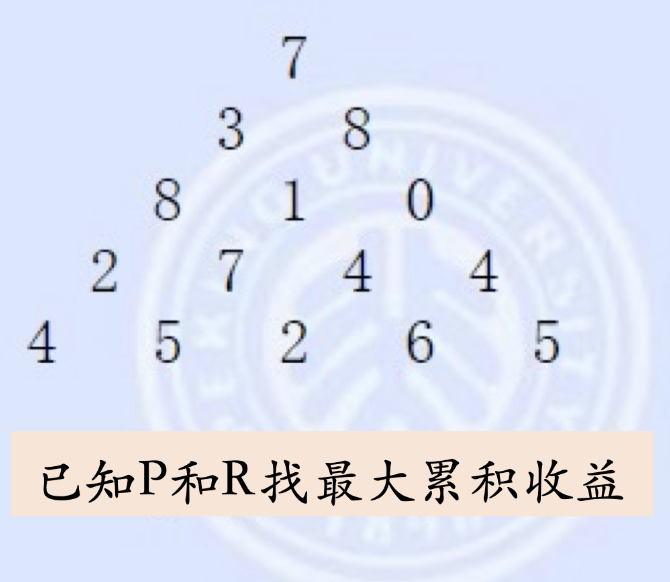
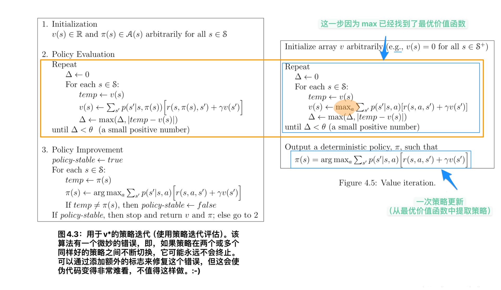
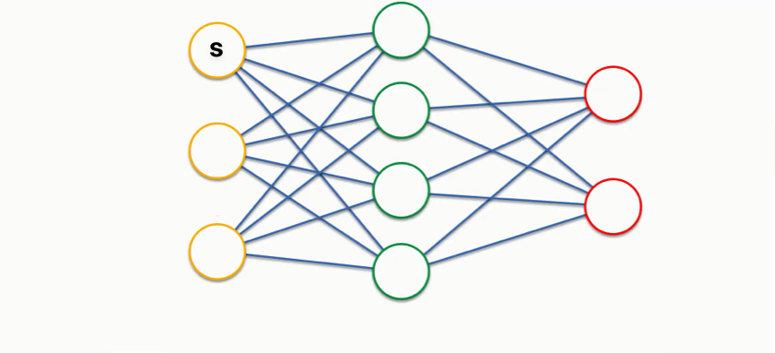
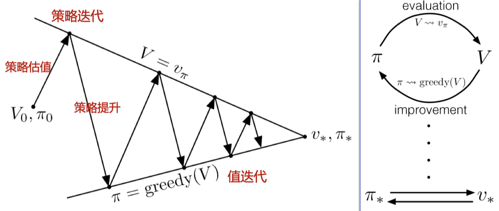
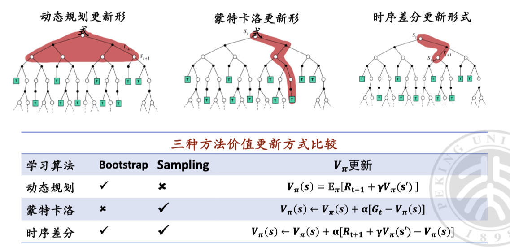
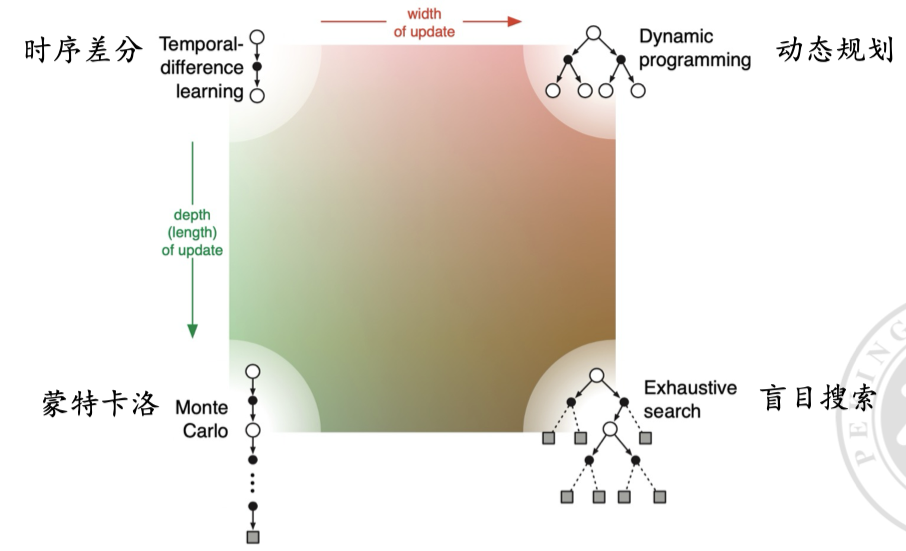

# 马尔可夫决策过程和动态规划

  by <a href="https://github.com/zhuozhiyongde">Arthals</a>
   
  blog: <a href="https://arthals.ink">Arthals' ink</a>

## 马尔科夫决策过程（Markov Decision Process, MDP）

-   **状态集合**： $S$
-   **动作集合**： $A$
-   **状态转移函数**：$P: \langle S, A, S' \rangle \rightarrow \mathbb{R}^+$
    -   $P(s'|s, a)$ 表示在当前状态 $s$ 和动作 $a$ 下，转移到状态 $s'$ 的 **概率**
-   **奖励函数**：$R: \langle S, A, \mathbb{R}^+ \rangle \rightarrow \mathbb{R}^+$
    -   $R(s, a, r)$ 表示在当前状态 $s$ 和动作 $a$ 下，获得奖励 $r$ 的 **概率**

**马尔可夫性质**：在当前状态 $S_t$ 下，**状态转移模型 $P$ 和奖励函数 $R$ 仅与 $S_t$ 有关**，和之前的状态及动作无关，也即：

$$
P(S_{t+1} \mid S_t, A_t, S_{t-1}, A_{t-1}, \ldots, S_0, A_0) = P(S_{t+1} \mid S_t, A_t)
$$

这条性质可以有力地简化问题。

有限 MDP：状态集合 $S$ 和动作集合 $A$​ 为有限集。

### 回顾定义

首先，回顾一下上节课讲过的三个公式。

#### 累积收益值 $G_t$

表示从时间步 $t$ 开始的累积收益值。

$$
G_t = R_{t+1} + \gamma R_{t+2} + \gamma^2 R_{t+3} + \cdots = \sum_{k=0}^{\infty} \gamma^k R_{t+k+1}
$$

其中，$\gamma$ 是折扣因子，$0 \leq \gamma \leq 1$。$R_t$ 是在时间步 $t$​ 获得的即时奖励。若它不为 1，那么此函数会更关注 **近期** 的信息，忽略无限远的信息，保证了这个累积收益是 **有界** 的，不会是正无穷。从而使得策略是可比的。

> 注意在这个表达式中，越靠右的项，时序关系上越晚、越远（越靠近未来）

#### 状态价值函数 $V_\pi(s)$

表示在策略 $\pi$ 下，处于状态 $s$ 时的期望累积收益值。

$$
V_\pi(s) = \mathbb{E}_\pi[G_t \mid S_t = s] = \mathbb{E}_\pi[R_{t+1} + \gamma R_{t+2} + \cdots \mid S_t = s]
$$

#### 动作价值函数 $Q_\pi(s, a)$

表示在策略 $\pi$ 下，处于状态 $s$ 并采取动作 $a$ 时的期望累积收益值。

$$
Q_\pi(s, a) = \mathbb{E}_\pi[G_t \mid S_t = s, A_t = a] = \mathbb{E}_\pi[R_{t+1} + \gamma R_{t+2} + \cdots \mid S_t = s, A_t = a]
$$

### Bellman 期望方程

可以看到，在上述的三个函数中，计算某一状态、某一动作的价值时，没有显式地出现诸如 $t-1$ 的项，但是这并不代表马尔科夫性质得到了满足，**因为在计算期望时，并没有显式地提及状态转移的概率。**

为此，我们引入 Bellman 期望方程，它是一个递归方程，可以用来计算状态价值函数和动作价值函数。

#### 状态价值函数 $V_\pi(s)$

表示在策略 $\pi$ 下，处于状态 $s$ 时的期望累积收益。

$$
V_\pi(s) = \sum_a \pi(a|s) \sum_{s', r} p(s', r | s, a) [r + \gamma V_\pi(s')]
$$

-   $\pi(a|s)$：在状态 $s$ 下选择动作 $a$ 的概率。
-   $p(s', r | s, a)$：在状态 $s$ 下采取动作 $a$ 后转移到状态 $s'$ 并获得奖励 $r$ 的概率。
-   $\gamma$：折扣因子，权衡当前和未来的收益。

#### 动作价值函数 $Q_\pi(s, a)$

表示在策略 $\pi$ 下，处于状态 $s$ 并采取动作 $a$ 时的期望累积收益。

$$
Q_\pi(s, a) = \sum_{s', r} p(s', r | s, a) [r + \gamma V_\pi(s')]
$$

同样的，$p(s', r | s, a)$ 表示在状态 $s$ 下采取动作 $a$ 后转移到状态 $s'$ 并获得奖励 $r$ 的概率。

#### 状态价值函数与动作价值函数的关系

状态价值函数可以通过动作价值函数表示：

$$
V_\pi(s) = \sum_a \pi(a | s) Q_\pi(s, a)
$$

即在状态 $s$ 下的期望累积收益等于所有可能动作的加权期望累积收益，权重为在状态 $s$​ 下采取各动作的概率。

这些式子指出一个特点：所有的转移概率 $p(s', r | s, a)$ 和策略 $\pi(a|s)$ 都仅依赖于当前的状态 $s$ 和动作 $a$，而与更之前的状态和动作无关。**这就是马尔可夫性质，即未来状态和奖励只依赖于当前的状态和动作**。

### 状态价值和最优策略

最优状态价值 $V^*(s)$：在所有可能的策略 $\pi$ 中最大的累积收益。可以简称为 **状态价值**

$$
V^*(s) = \max_{\pi} V_\pi(s)
$$

最优策略 $\pi^*$：从状态 $s$​​ 出发执行该策略可以获得状态价值的策略。

**状态价值只有一个，但是最优策略可以有多个纯策略或者最优纯策略的任意组合。**

可以通过反证证明，任意一个最优策略，其对于整个状态空间中任意一个状态都是最优的。

### 动作价值和最优策略

最优动作价值 $Q^*(s, a)$：在所有可能的策略 $\pi$ 中最大的累积收益。可以简称为 **动作价值**

$$
Q^*(s, a) = \max_{\pi} Q_\pi(s, a)
$$

最优策略 $\pi^*$：从状态 $s$ 出发，采取动作 $a$ 之后执行该策略可以获得动作价值的策略。

**动作价值也只有一个，但是最优策略可以有多个纯策略或者最优纯策略的任意组合。**

可以证明，任意一个最优策略，其对于整个状态空间中任意一个状态和动作的组合都是最优的，也即 **全局最优解一定也是局部最优解**，这正是马尔科夫性质的体现，这显著简化了计算复杂度，我们不需要考虑全局的状态，而只需要考虑多次局部状态即可。

### Bellman 最优方程

最优价值函数 $V^*(s)$ 和最优动作价值函数 $Q^*(s, a)$ 满足如下关系：

$$
V^*(s) = \max_{\pi} V_{\pi}(s)
$$

$$
Q^*(s, a) = \max_{\pi} Q_{\pi}(s, a)
$$

由此可得：

$$
V^*(s) = \max_{a} \sum_{s', r} p(s', r | s, a) [r + \gamma V^*(s')] = \max_a Q^*(s, a)
$$

$$
Q^*(s, a) = \sum_{s', r} p(s', r | s, a) [r + \gamma \max_{a'} Q^*(s', a')]
$$

这两个式子暗含了动作价值 / 状态价值的唯一性，这是迭代 / 递归关系的基础。

## 用动态规划方法求解最优策略

这对应状态转移函数和奖励函数 $P,R$ 已知的情况，也就是是说 **环境已知**。

### 动态规划理论

1. **多阶段决策过程**
    - 物理系统的 **状态（state）** 用一组状态变量描述。
    - **决策（decisions）** 引起状态变量的 **转换（transformations）**。
    - 各个阶段的决策与状态转换，在阶段间是独立的，但是整个过程的目标是 **最大化最终状态参数** 的相关函数。
2. **无后效性**
    - 考虑一个中间状态，决策时不关心之前的状态转换过程，只从当前状态出发。
    - 这种特性称为 **无后效性**。
3. **最优原则**
    - 最优策略的性质：无论初始状态和最初的几个决策是什么，剩余决策一定构成一个与之前决策产生的状态相关的最优策略。
    - 形式化描述：策略 $\pi(a|s)$ 达到状态 $s$ 下的最优值 $v_{\pi}(s) = v^*(s)$，当且仅当：对于从状态 $s$ 出发可达到的任意状态 $s'$，策略 $\pi$ 能达到新状态 $s'$ 的最优值 $v_{\pi}(s') = v^*(s')$​。

> 
>
> 考虑在这个三角形中找到一个从顶部到底部某一节点的路径，使得经过的节点和最大。
>
> 1. 如果不限定各层之间的关联，那么是无后效性的
> 2. 如果限定下一层只能在上一层直接相连（最近）的左右子节点中选，那么是有后效性的，譬如第二次选了 8，那么第三层就只能选择 1 或者 0，这相比第二层选了 3 第三次选 8 是更劣的。

#### 单源最短路径问题 Bellman-Ford 算法

1. **问题定义**
    - 给定一个带权有向图 $G=(V, E)$，其中每条边的权是一个实数。
    - 计算从源点（起点）到其他所有顶点的最短路径长度，称为单源最短路径问题。
2. **算法步骤**
    - 初始化：源点距离设为 0，其他顶点距离设为 $\infty$。
    - 进行 $n-1$ 次松弛操作，每次遍历所有边 $(u, v) \in E$，如果有更小的更新距离 $Distance(v)$。这一步基于最长路径不会超过 $n-1$ 条边的结论，其可反证。
    - 检查是否存在负权环，如果存在则返回负权环信息。

### 策略估值 (Policy Evaluation)

策略估值：对于任意策略 $\pi$，计算在此策略下的状态值函数 $V_\pi$。

#### 策略估值的 Bellman 方程

**准确稳定** 的状态值函数：

$$
v_\pi(s) = \sum_{a} \pi(a|s) \sum_{s',r} p(s', r | s, a) [r + \gamma v_\pi(s')]
$$

但是这个式子是迭代嵌套 $v_\pi$ 这个状态价值函数的，可以发现对于它可能会因为整体到终态的路径很长，嵌套很深，导致计算困难。

#### 迭代更新规则

$$
v_{k+1}(s) = \sum_{a} \pi(a|s) \sum_{s',r} p(s', r | s, a) [r + \gamma v_k(s')]
$$

其中：

-   $v_{k}(s')$ 是第 $k$ 次迭代时，状态 $s'$ 的值。一个迭代阶段中，所有的状态都有一个估值（但它们不一定准确），每次更新所有状态的估值
-   $v_{k+1}(s)$ 是第 $k+1$ 次迭代时，状态 $s$​​ 的值
-   状态 $s'$ 是状态 $s$ 的可能后继状态之一

这个式子是 **不准确** 的，因为我们无法保证 $v_{k}(s') = v_\pi(s')$，只是在通过不断迭代 $k$ 去更新估计值，而接近真实值。

#### 迭代策略估值 (Iterative Policy Evaluation)

-   **完全回溯（Full Backup）**

    根据被评估策略 $\pi$ 所有可能的一步转移，用 $v_k(s)$ 依次计算 $v_{k+1}(s), \forall s \in S$。

-   **迭代停止条件**

    测试 $\max_{s \in S} |v_{k+1}(s) - v_k(s)|$​，当这个量足够小时停止（这意味着收敛了），也即所有估值不再变化，达到了 $v_\pi$ 这个更新规则的不动点

-   **迭代内循环计算**
    -   同步迭代（Synchronous Iteration）
    -   异步迭代（Asynchronous Iteration）

##### 同步迭代（Synchronous Iteration）

计算过程：

-   已有 $v_k(s_1), v_k(s_2), \cdots, v_k(s_n)$
-   用上述值依次计算 $v_{k+1}(s_1), v_{k+1}(s_2), \cdots, v_{k+1}(s_n)$
-   需要双数组分别存储旧值和新值。

##### 异步迭代（Asynchronous Iteration）

计算过程：

-   用 $v_k(s_1), v_k(s_2), \cdots, v_k(s_n)$ 计算 $v_{k+1}(s_1)$
-   用 $v_{k+1}(s_1), v_k(s_2), \cdots, v_k(s_n)$ 计算 $v_{k+1}(s_2)$
-   用 $v_{k+1}(s_1), v_{k+1}(s_2), \cdots, v_k(s_n)$ 计算 $v_{k+1}(s_3)$

只需 **单数组** 原位更新，可以更快地收敛。

##### 伪代码

$$
\begin{aligned}
&\text{Input }\pi,\text{the policy to be evaluated}\\
&\text{Initialize an array }V(s)=0,\text{for all }s\in\mathcal{S}\\
&\text{Repeat}\\
&\quad\Delta\leftarrow0\\
&\quad\text{For each }s\in\mathcal{S}{:}\\
&\quad\quad v\leftarrow V(s)\\
&\quad\quad V(s)\leftarrow\sum_{a}\pi(a|s)\sum_{s^{\prime},r}p(s^{\prime},r|s,a)\big[r+\gamma V(s^{\prime})\big]\\
&\quad\quad\Delta\leftarrow\max(\Delta,|v-V(s)|)\\&\text{until }\Delta<\theta\text{ (a small positive number)}\\&\text{Output }V\approx v_{\pi}\end{aligned}
$$

1. **输入策略 $\pi$**：输入一个策略 $\pi$，这个策略定义了在每个状态 $s$ 下选择动作 $a$ 的概率。

2. **初始化**：初始化一个值函数数组 $V(s)$，对所有状态 $s$ 设初值为 0。

3. **迭代计算**

    - 设置一个变量 $\Delta$ 用于记录值函数的最大变化量，初始值为 0。
    - 对于每一个状态 $s$，执行以下步骤：
        - 保存当前状态 $s$ 的值函数 $V(s)$ 到变量 $v$。
        - 使用策略 $\pi$ 和状态转移概率 $p(s', r|s, a)$ 更新状态 $s$ 的值函数 $V(s)$。公式为：
          $V(s) \leftarrow \sum_{a} \pi(a|s) \sum_{s', r} p(s', r|s, a) [r + \gamma V(s')]$
        - 更新 $\Delta$，记录当前值函数 $V(s)$ 与之前值函数 $v$ 的最大差值，$\Delta \leftarrow \max(\Delta, |v - V(s)|)$。这句话保证了 $\Delta$ 是所有状态中的误差最大值。

4. **终止条件**：当 $\Delta$ 小于某个很小的正数 $\theta$ 时，迭代停止，表示值函数已经收敛。

5. **输出**：输出收敛后的值函数 $V$，该值函数近似于策略 $\pi$ 的值函数 $v_\pi$。

#### $v_\pi$​ 的存在性和唯一性保障条件

满足下述条件之一：

1. $\gamma < 1$ ，这保证了远处传递过来的值（未来收益）随着距离的增加，权重逐渐衰减为 0。试想如果 $\gamma=1$，那就意味着未来的收益和当前的收益一样重要，累积的收益可能无穷大，从而无法保证值函数 $v_\pi$ 的收敛性。

2. 依据策略 $\pi$，所有状态最终能保证终止。

    这意味着不会有无穷长的路径存在，无论初始状态是什么，对弈都会在有限步内结束，这保证了未来的奖励是有限的。

    **如果策略 $\pi$​ 是有限步的，那么此条件立刻得到满足**。一个例子是 Bellman-Ford 算法，由于一条最长无环路径不会超过 $n-1$​ 条边，所以迭代一定是有次数上限的，也即迭代是有限步的。

#### 迭代策略估值

**收敛性条件**：在上述存在性和唯一性保障条件下，迭代策略估值是收敛的。

-   **值函数序列收敛**：随着迭代次数 $k$ 增加，值函数序列 $\{V_k\}$ 会收敛，即 $V_k \to v_\pi$。
-   **稳定的值函数**：即使迭代了很多次，也能得到一个稳定的关于策略 $\pi$ 的值函数 $v_\pi$​。

### 策略提升（Policy Improvement）

**策略提升**：在原策略基础上，根据原策略计算得到的值函数，贪心地选择动作使得新策略的估值优于原策略，或者一样好。

先前讲的策略估值从未改变过策略本身，它只是在更新策略的状态价值表。而 **策略提升会更新策略。**

#### 计算动作价值

可以根据状态价值计算动作价值：

$$
q_{\pi}(s, a) = \sum_{s', r} p(s', r | s, a) [r + \gamma v_{\pi}(s')]
$$

#### 产生新策略

贪心选择动作产生新策略：

$$
\pi'(s) = \arg\max_{a} q_{\pi}(s, a)
$$

即：

$$
\pi'(s) = \arg\max_{a} \sum_{s', r} p(s', r | s, a) [r + \gamma v_{\pi}(s')]
$$

#### 策略提升总结

-   在某个状态 $s$ 下，找到一个比 $\pi$ 原有的动作价值函数 $q_\pi$ 更好的 $q_{\pi'}$，在所有遇到状态 $s$ 时，用它对应的策略替代原来的 $\pi$，得到新的 $\pi'$
-   因为其他状态的动作都保持不变，对于所有状态 $s$，$V_{\pi'}(s) = \sum_a \pi'(a | s) Q_{\pi'}(s, a)$ 一定比 $V_{\pi}(s)$​ 要好，策略得到提升

一个很容易想到的策略提升是，在所有 $s$ 下，贪心选择 $q$ 最好的动作，完成一次更有效的策略提升

-   如果有多个 $q$ 序列最好的，可以在这些 $q$ 里随机选
-   策略提升后，状态价值对新策略估计的就不准确了，**需要重新估计 $v_{\pi'}$**

### 策略迭代

**策略迭代**：交替进行迭代策略估值和策略提升，在有限步之后找到最优策略与最优值函数。

$$
\pi_0 \xrightarrow{E} v_{\pi_0} \xrightarrow{I} \pi_1 \xrightarrow{E} v_{\pi_1} \xrightarrow{I} \pi_2 \xrightarrow{E} \cdots \xrightarrow{I} \pi^* \xrightarrow{E} v^*
$$

其中，$\xrightarrow{E}$ 代表策略估值，$\xrightarrow{I}$​ 代表策略提升。

以上交替进行会得到策略序列 $\{\pi\}$，由于之前已经证明策略提升中新策略一定优于旧策略，或者一样好，故策略序列单调更优。

#### 伪代码

1. 初始化

    $$
    V(s) \in \mathbb{R} \text{ and } \pi(s) \in \mathcal{A}(s) \text{ arbitrarily for all } s \in \mathcal{S}
    $$

2. 策略估值

    $$
    \begin{aligned}
    &\text{Repeat}\\
    &\quad \Delta \leftarrow 0\\
    &\quad \text{For each } s \in \mathcal{S}:\\
    &\quad\quad v \leftarrow V(s)\\
    &\quad\quad V(s) \leftarrow \sum_{s', r} p(s', r | s, \pi(s)) [r + \gamma V(s')]\\
    &\quad\quad \Delta \leftarrow \max(\Delta, |v - V(s)|)\\
    &\text{until } \Delta < \theta \text{ (a small positive number)}
    \end{aligned}
    $$

3. 策略提升

    $$
    \begin{aligned}
    &\text{policy-stable} \leftarrow \text{True}\\
    &\text{For each } s \in \mathcal{S}:\\
    &\quad \text{old-action} \leftarrow \pi(s)\\
    &\quad \pi(s) \leftarrow \arg\max_a \sum_{s', r} p(s', r | s, a) [r + \gamma V(s')]\\
    &\quad \text{If } \text{old-action} \ne \pi(s), \text{ then policy-stable} \leftarrow \text{False}\\
    &\text{If policy-stable, then stop and return } V \approx v_* \text{ and } \pi \approx \pi_*; \text{ else go to 2}
    \end{aligned}
    $$

#### 策略提升结束条件

假设新策略 $\pi'$ 和旧策略 $\pi$ 一样好，则有 $v_{\pi} = v_{\pi'}$，此时，对所有 $s$ 都有：

$$
\begin{aligned}
v_{\pi'}(s) &= \max_a \sum_{s', r} p(s', r | s, a) [r + \gamma v_{\pi}(s')] \\
&= \max_a \sum_{s', r} p(s', r | s, a) [r + \gamma v_{\pi'}(s')]
\end{aligned}
$$

与 Bellman 最优方程相同，因此 $v_{\pi'}$ 一定是当前最优状态值函数 $v^*$，则 $\pi'$ 和 $\pi$ 一定都是最优策略。

### 值迭代（Value Iteration）

#### 策略迭代的问题

-   策略估值耗费时间
-   随着策略估值、提升的多次迭代，在后面的迭代中，对于某些状态，依据策略选择的动作已经是最优的了，此时策略估值不再改变（最优意味着即使再经过策略提升后，其动作也不会改变，只会进一步更新估值），对策略提升都没有帮助
-   所以可以提前截断估值

自然地，我们想到一种极端的修正方式

-   只做一次估值，**不需要估值收敛就开始策略提升**
-   这就是 **值迭代方法**

$$
v_{k+1}(s) = \max_a \sum_{s', r} p(s', r | s, a) \left[ r + \gamma v_k(s') \right]
$$

在值迭代中，每次更新直接计算在状态 $s$ 下采取所有可能的动作 $a$ 的 **期望** 回报，并取其最大值作为新的状态值。这个过程 **同时完成了值函数更新和策略提升**。与之相对的，在策略迭代中，评估和提升是两个独立的步骤。

-   **策略迭代**：每次策略提升前需要完全评估当前策略，可能需要多次迭代（策略评估目的是计算策略估值表，计算过程是循环的，**终止条件是估值稳定 / 收敛** ），计算开销较大
-   **值迭代**：每次迭代直接更新值函数，通常收敛速度更快。值迭代通常计算效率更高，因为它 **减少了评估步骤的迭代次数**

#### 值迭代算法伪代码

$$
\begin{aligned}
&\text{Algorithm parameter: a small threshold } \theta > 0 \text{ determining accuracy of estimation} \\
&\text{Initialize } V(s), \text{ for all } s \in S^+, \text{ arbitrarily except that } V(\text{terminal}) = 0 \\
&\text{Loop:} \\
&\quad \Delta \leftarrow 0 \\
&\quad \text{Loop for each } s \in S: \\
&\quad\quad v \leftarrow V(s) \\
&\quad\quad V(s) \leftarrow \max_a \sum_{s', r} p(s', r | s, a) \left[ r + \gamma V(s') \right] \\
&\quad\quad \Delta \leftarrow \max(\Delta, |v - V(s)|) \\
&\text{until } \Delta < \theta \\
&\text{Output a deterministic policy, } \pi \approx \pi_*, \text{ such that } \\
&\quad \pi(s) = \arg\max_a \sum_{s', r} p(s', r | s, a) \left[ r + \gamma V(s') \right]
\end{aligned}
$$

下面给出一个基于全连接层图示的、更为直观的理解：

考虑我们现有的一个状态 $s$，他的后继状态为绿色圆圈，绿色圆圈的后继状态为红色圆圈，蓝色是动作：

对于策略迭代中的策略提升，我们：

1. 根据所有红色圆圈的估值，依据动作概率加权
2. 更新所有的绿色圆圈的估值
3. 根据更新后的绿色圆圈估值，依据动作概率加权
4. 更新 $s$ 的估值

那么，在两次策略评估的迭代之间，一旦任意一个绿色圆圈发生了改变，其势必影响到所有可以转移到他的、上游的黄色圆圈们，造成更新。这会导致策略评估的迭代次数很多。

但是对于值迭代：

1. 根据所有红色圆圈，选择最大的估值，直接更新绿色圆圈估值
2. 根据更新后的绿色圆圈估值，选择最大的估值，直接更新 $s$ 的估值

可以看到，由于选择了最大的估值，所以只要最大的估值对应的状态的估值没有发生改变，那么上游的黄色圆圈就不会变动估值，也就不会更新算法中指征收敛状态的 $\Delta$​，于是收敛会加快。

#### 值迭代算法的收敛性分析

引理：压缩映射定理，一个压缩映射最多有一个不动点（压缩映射定理是闭区间套定理的直接推广）。

证明：

$$
\Delta = \max_s | V_{i+1}(s) - V_i(s) | = ||V_{i+1} - V_i|| \quad \text{一轮值迭代中估值变化最大值，}\\
\text{where }||V||=\max_S|V(s)|
$$

$$
V_{i+1}(s) = \max_a \left( R + \gamma V_i(s') \right)
$$

$$
V_{i+2}(s) \leq \max_a (R + \gamma V_i(s') + \gamma \Delta)
$$

$$
V_{i+2}(s) - V_{i+1}(s) \leq \max_a (R + \gamma V_i(s') + \gamma \Delta) - \max_a (R + \gamma V_i(s')) = \gamma \Delta
$$

所以，

$$
||BV_{i+1} - BV_i|| \leq \gamma ||V_{i+1} - V_i||\\
\text{where }BV_{i+1}(s) = \max_a \left( R(s, a) + \gamma V_i(s') \right)
$$

所以值迭代算法（贝尔曼更新）是 **压缩映射**，从而其最多有一个不动点，也就是说，值迭代算法收敛。

### 广义策略迭代（Generalized Policy Iteration）

## 用采样方法逼近最优策略

这对应状态转移函数和奖励函数 $P,R$ 未知的情况，也就是说 **环境** 未知。

### Bootstrap

**Bootstrap（自举）** 是一种统计方法，用于估计样本的分布。它通过反复从原始数据集中 **有放回地抽样**，生成多个子样本，然后 **计算这些子样本的统计量来估计总体的统计性质**。

在强化学习中，bootstrap 是指 **计算一个状态的估值是依据它的后继状态的估值**。

### 蒙特卡洛学习

蒙特卡洛学习方法用于强化学习中，它不需要环境的转移概率（$P$）和奖励函数（$R$​）的知识。

**蒙特卡洛学习方法假设环境未知，不使用 bootstrap**。

蒙特卡洛方法通过多次模拟整个过程（ **直到终止状态** ），然后利用实际获得的总回报来更新状态值。公式表示为：

$$
V(s) = \frac{1}{N} \sum_{i=1}^{N} G_i
$$

其中，$G_i$ 是第 $i$ 次模拟的总回报，$N$​​​ 是模拟次数。

> 没有复杂的状态转移关系、计算估值这种精确但是慢的很的玩意，就是硬尝试，至于准确性？交给大数定理。

### 时序差分学习

时序差分学习结合了动态规划和蒙特卡洛方法的优点，它依赖于后续状态的估值来更新当前状态的估值，但不需要知道环境的转移概率（$P$）和奖励函数（$R$）。

**时序差分学习方法假设环境未知，但是使用 bootstrap**。

它通过每一步的估值误差来更新状态值，公式表示为：

$$
V(s) \leftarrow V(s) + \alpha [R + \gamma V(s') - V(s)]
$$

其中，$\alpha$ 是学习率，$\gamma$ 是折扣因子，$R$ 是当前奖励，$V(s')$​ 是后继状态的估值。

## 总结

下表重要，要记住。

## Credit

[dadadaplz / 策略迭代与值迭代的区别](https://blog.csdn.net/panglinzhuo/article/details/77752574)
