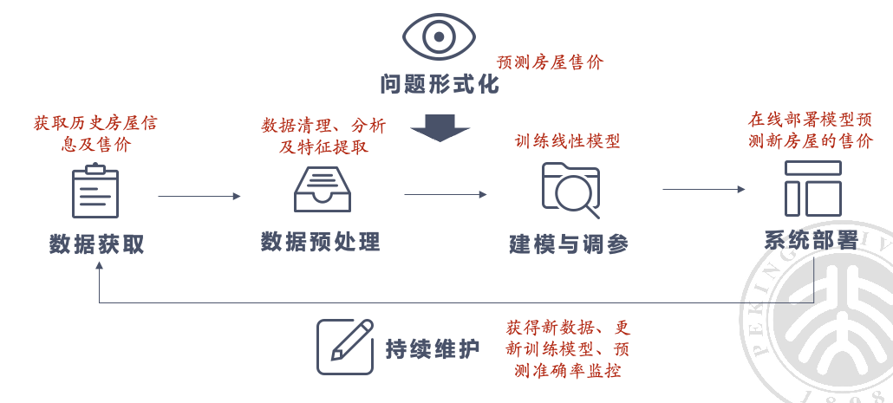
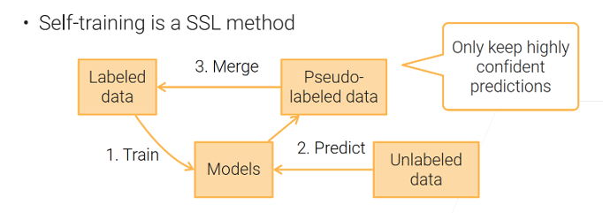
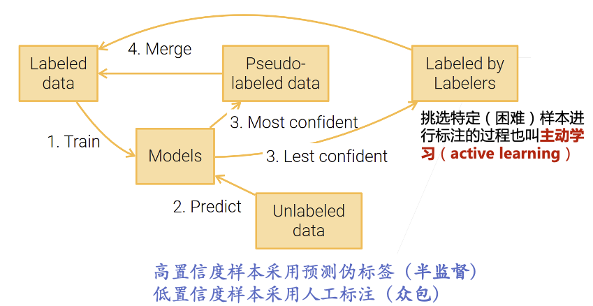

# 人工智能系统实践

  by <a href="https://github.com/zhuozhiyongde">Arthals</a>
   
  blog: <a href="https://arthals.ink">Arthals' ink</a>

## AI 系统实践流水线

-   **问题形式化**：找出最重要且可行的问题

-   **数据**：确保数据质量和隐私安全

    挑战：高质量的数据是永远稀缺的；隐私安全

-   **模型训练**：选择合适模型，优化训练

    挑战：现在的模型越来越复杂，对数据的需求越来越大，训练代价大

-   **模型部署**

    挑战：复杂模型的实时推理能力差（要考虑硬件资源受限的情况下怎么办）

-   **持续维护**：应对数据分布变化，定期更新模型

    数据分布产生变化：指数据的统计特性（如均值、方差等）随时间发生变化，导致模型在新数据上的表现变差。

    ~~比如说你写了刷课机要过验证码，本来能过，结果验证码换了个版本增强了，过不去了，这时候就要维护，如更换更强的 CNN 模型，或者直接使用专业的商用 API（持续维护）~~

## 数据获取

-   获取并准备高质量的数据集。
-   清洗和预处理数据。

### 获取、整合外部数据

常见方法：

1. 有官方的 API，直接请求

    ~~（有的时候官方 API 没有显式告诉你，但是你可以自己找，比如刷课机）~~

2. 没有官方的 API，使用爬虫来爬取公开网页，从而获得数据

    - 不要抓取 **敏感** 信息
    - 不要抓取有 **版权** 的信息（除非有开源协议）
    - 遵循网页的条例说明
    - 商用要咨询法律建议

### 生成数据

当没有现成的数据 / 现有数据不足，但是有数据生成方法的时候，我们可以使用生成的数据来作为训练集。

生成数据是指通过一定的方法或技术，创造出新的数据。这些方法包括但不限于：

-   **生成对抗网络（GAN）**：通过两个网络（生成器和判别器）相互竞争生成新的数据。

-   **数据增强**：对现有数据进行各种变换，以增加数据量和多样性。

    如麻将大作业中的换花色，图片分类中加滤镜等

-   **模拟器**：使用计算机仿真生成特定场景或环境下的数据。

## 数据标注

1. **有数据吗？**

    - **是**： 如果有数据，继续下一步。
    - **否**： 如果没有数据，需要先获取数据（见前文）。

2. **添加标签了吗？是否改进了数据表示？**

    - **数据预处理（Data preprocessing）**：如果想要改进数据的表示，需要进行数据预处理。

3. **初始标签数量足够吗？**

    - **是**： 如果初始标签数量足够，可以使用半监督学习。

        **半监督学习（Semi-supervised learning）**： 使用少量已标注数据和大量未标注数据来训练模型。

    - **否**： 如果初始标签数量不足，继续下一步。

4. **预算足够吗？**

    - **是**： 如果有足够预算，可以使用众包。

        **众包（Crowdsourcing）**： 通过外包给大众来获取大量真实标签。

        网约车、外卖也可以理解为众包！

    - **否**： 如果预算不足，使用弱监督。
    
        **弱监督（Weak supervision）**： 使用弱标签（不精确或部分标注）来训练模型。

## 半监督学习 Semi-supervised learning

1. 利用已经标记的部分数据训练一个还不错的模型
2. 用这个模型预测得到的结果，选择 **置信度高** 样本的预测值作为 **伪标签**，把这些样本加入训练集，重新训练

半监督和监督学习的区别：半监督输入 **同时包括标注和未标注数据**

不能使用未标注的训练样本作为测试样本。

### 自训练 Self Training

> SSL 不是 SSL 证书，是半监督学习 Semi-supervised learning

步骤（同前文）

1. 训练模型
2. 预测结果
3. 高置信度预测样本加入训练集
4. 重新训练

#### 问题

1. **高计算成本**

    由于需要反复迭代进行重新训练，计算成本较高。

    虽然减少了标注数据的成本，但增加了计算成本，需要在两者之间进行权衡。

2. **误差累积**

    **高置信度的预测样本也可能是错误的**，从而产生误差累积。

    高置信度阈值可以使得预测错误的概率较小，但会 **减少伪标签样本的数量**。

    所以，选择合适的置信度阈值非常重要，需要平衡误差和伪标签样本数量

### 主动学习

主动学习改进了自训练，对于置信度低的样本，用人来标注。

**人在回路（Human in the loop）**：在主动学习中，人类专家会参与进来，为模型选择的样本进行标注。

**不确定性采样（Uncertainty Sampling）**：选择模型预测最不确定的示例进行标注。

例如，模型对某个样本的预测接近随机（每个类别的预测概率接近 $ \frac{1}{n} $，其中 $n$ 是类别数），这种样本被认为是最不确定的。

**委员会查询（Query-by-committee）**：训练多个模型并选择这些模型意见不一致的样本进行标注。

这样可以找到模型最难以确定的样本，进而提高模型的性能。

## 弱监督

弱监督学习是指 **使用不完全、噪音较多或不精确的标签** 进行训练。

半监督学习不属于弱监督学习，半监督的标签数据是准确的。

## 自监督 Self-supervised Learning

**自监督学习**：通过数据自身构造预测标签的监督学习方法

利用数据自身来生成标签，而不需要人工标注（ **所以自监督属于无监督学习** ）。通过数据内部的结构或特征，模型可以学习有用的表示。

-   文本自监督任务：预测下一个词（GPT），完形填空（BERT）

    文本大模型都是基于自监督学习任务

    语言模型：给定一句话的一部分，模型需要预测接下来的单词。例如，给出 “我今天吃了”，模型预测 “苹果”。通过这种预测，模型学会了语言的语法和语义。

-   图像自监督任务：视频预测下一帧，拼图，对比学习

    图像填充：给定一张部分遮挡的图片，模型需要预测被遮挡的部分。通过这种方式，模型学会了图片的结构和内容。

自监督学习主要用于训练 **特征提取器**。

针对特定任务，通常仍需相关标注数据

### 对比学习

对比学习：是一种自监督学习方法（ **所以也属于无监督学习** ），主要用于训练神经网络以学习有意义的表示（representation）

1. **正样本对**：从 **同一个图像** 通过 **不同的增强方式** （如修改颜色、裁剪等）得到两个不同的版本，这两个版本作为正样本对。

    例如，图像 A 经过颜色调整后得到 A1，经过裁剪后得到 A2，那么 A1 和 A2 就是一个正样本对。

2. **负样本对**：从两个 **不同的图像** 分别进行增强，得到的两个样本作为负样本对。

    例如，图像 A 增强后得到 A1，图像 B 增强后得到 B1，那么 A1 和 B1 就是一个负样本对。

3. **损失函数（Loss）**：用来衡量一对图像之间表示向量（representation vector）的相似度。

    正样本对的表示向量应该尽可能相似，而负样本对的表示向量应该尽可能不同。

    常用的损失函数是对比损失（Contrastive Loss）或 InfoNCE 损失。

### 各种学习方式总结 [^1]

-   **监督学习**：使用完整和准确的全标注数据。

-   **半监督学习** 使用一部分标注数据和一部分无标签数据。

    可以理解为，监督学习标注了 100%，无监督学习标注了 0%，半监督学习标注了 $(0\%,100\%)$

-   **弱监督学习**: 使用不完全、不精确或不完全正确标注的数据。弱强调的是标注不够强（准确），模型通过学习这些低质量的标签来完成一个更困难的任务，从而可以克服标注难度高或噪声大的问题，提高模型泛化能力。

-   **无监督学习**：使用不带标签的数据训练模型。有无强调的是是否有标注。

-   **自监督学习**：使用数据本身生成的任务进行训练，无需人工标注。

    自监督学习是无监督学习的一种。

## 数据预处理

-   **数据清理 Data Cleaning**：消除错误数据
-   **数据转化 Data Transformation**：将数据从一种形式转换为另一种形式，以便更好地进行分析和建模
-   **特征工程 Feature Engineering**：从原始数据中提取有用的特征，以提高模型的性能

### 数据清理（Data Cleaning）

-   处理缺失值：可以选择删除含有缺失值的行或列，或者用均值、中位数等进行填补。
-   处理重复数据：删除重复的行，以确保数据的唯一性。
-   处理异常值：识别并处理数据中的异常值，可以选择删除或替换。

### 数据转化（Data Transformation）

-   标准化（Normalization）：将数据缩放到一个特定范围，如 $[0, 1]$。
-   归一化（Standardization）：将数据转换为均值为 0，方差为 1 的标准正态分布。
-   编码（Encoding）：将分类变量转换为数值形式，如独热编码 (One-Hot Encoding)。

### 特征工程（Feature Engineering）

-   特征选择：选择对模型最有用的特征，去除无关或冗余的特征。
-   特征提取：从原始数据中提取新的特征，如通过组合现有特征或使用降维技术如 PCA。
-   特征构造：创建新的特征，如通过数学变换或业务知识。

[^1]:[钰宸y / 全监督，自监督，半监督，弱监督，无监督的关系和区别](https://blog.csdn.net/qq_40721108/article/details/129798441)
